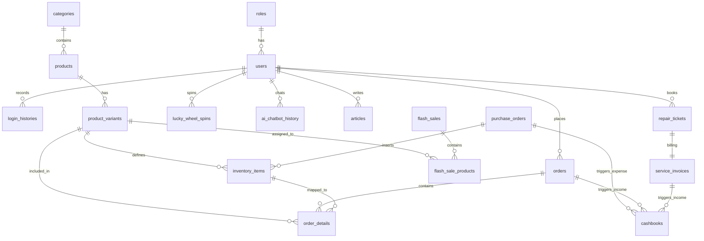
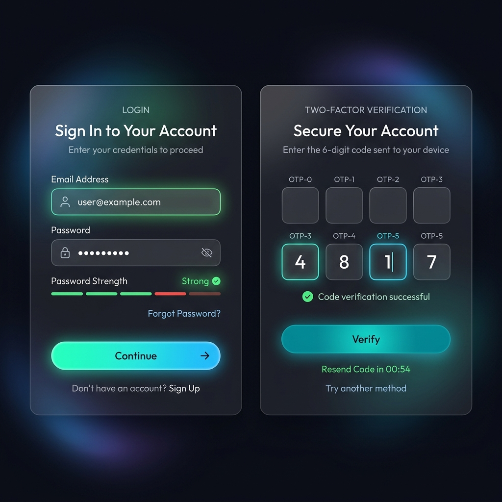
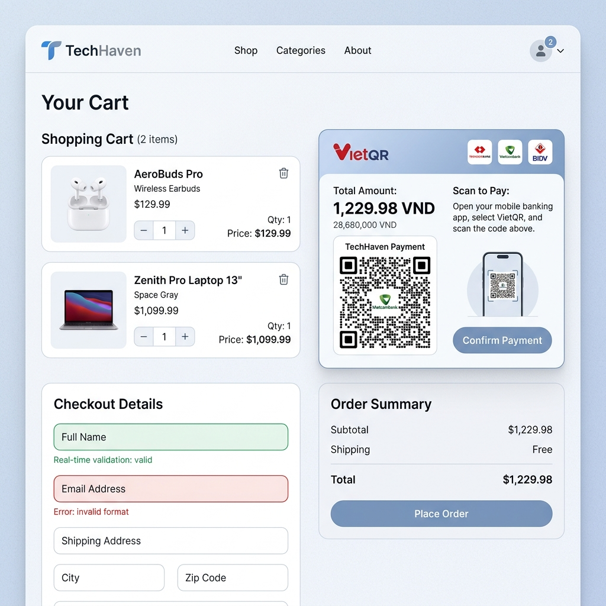
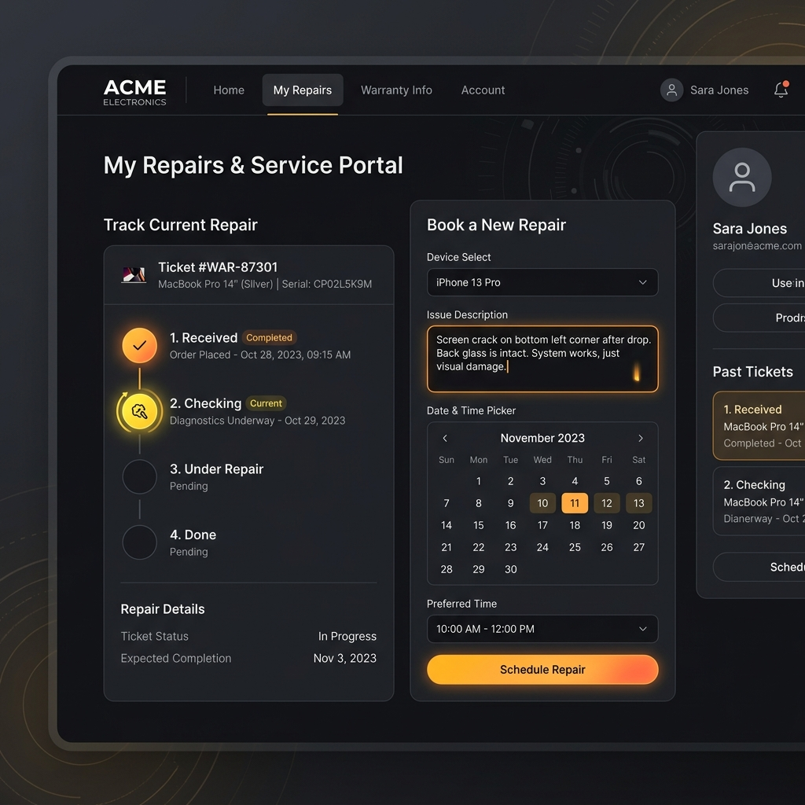
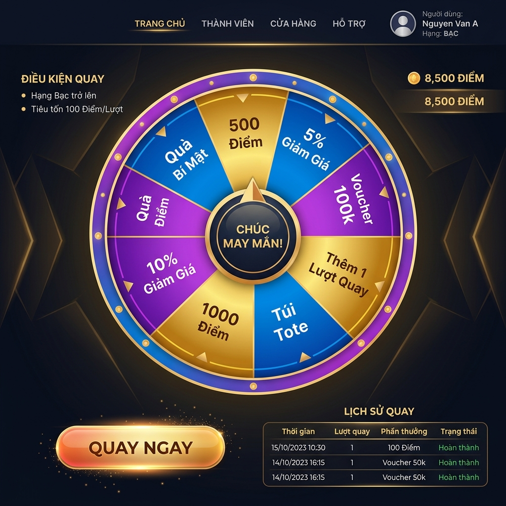
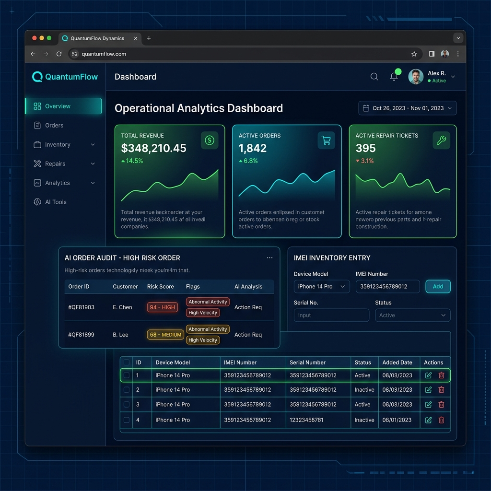

# BÁO CÁO CHI TIẾT ĐỒ ÁN MÔN HỌC: WEBSITE THƯƠNG MẠI ĐIỆN TỬ
## HỆ THỐNG MINI-ERP TÍCH HỢP BÁN LẺ, DỊCH VỤ HẬU MÃI & TRỢ LÝ AI
**MÔN HỌC: TRIỂN KHAI HỆ THỐNG PHẦN MỀM & CHUYÊN ĐỀ LẬP TRÌNH BE-2**

---

## MỤC LỤC
1. [CHƯƠNG 1: KẾ HOẠCH LÀM VIỆC NHÓM](#chuong-1-ke-hoach-lam-viec-nhom)
   - 1.1. Bảng phân chia công việc tổng quan
   - 1.2. Bảng phân chia chức năng và file mã nguồn chi tiết theo thành viên
2. [CHƯƠNG 2: LÝ DO CHỌN ĐỀ TÀI VÀ MÔ TẢ NGHIỆP VỤ](#chuong-2-ly-do-chon-de-tai-va-mo-ta-nghiep-vu)
   - 2.1. Lý do chọn đề tài (Kinh tế tuần hoàn, Right to Repair, Mini-ERP)
   - 2.2. Danh mục mô tả chi tiết nghiệp vụ 9 phân hệ (51 chức năng)
3. [CHƯƠNG 3: CƠ SỞ DỮ LIỆU VẬT LÝ & MÔ HÌNH ERD](#chuong-3-co-so-du-lieu-vat-ly--mo-hinh-erd)
   - 3.1. Đặc tả chi tiết 61 bảng cơ sở dữ liệu trong phpMyAdmin
   - 3.2. Sơ đồ quan hệ thực thể (ERD) bằng Mermaid
4. [CHƯƠNG 4: THIẾT KẾ GIAO DIỆN & ĐẶC TẢ CHI TIẾT UI/UX (SRS FORMAT)](#chuong-4-thiet-ke-giao-dien--dac-ta-chi-tiet-uiux-srs-format)
   - 4.1. Giao diện Đăng nhập / Đăng ký & Xác thực 2 lớp (2FA)
   - 4.2. Giao diện Giỏ hàng & Thanh toán QR Động (PayOS)
   - 4.3. Giao diện Cổng thông tin khách hàng, Tra cứu bảo hành & Đặt lịch sửa chữa
   - 4.4. Giao diện Vòng quay may mắn & Đổi điểm thưởng (Loyalty)
   - 4.5. Giao diện Trợ lý ảo AI Chatbot tư vấn RAG
   - 4.6. Giao diện Bộ lọc nâng cao & So sánh sản phẩm
   - 4.7. Giao diện Admin: Quét duyệt đơn hàng bằng AI & Nhập kho IMEI
5. [CHƯƠNG 5: DANH MỤC MÃ LỖI & THÔNG BÁO HỆ THỐNG (MESSAGE LIST)](#chuong-5-danh-muc-ma-loi--thong-bao-he-thong-message-list)
6. [CHƯƠNG 6: TÀI LIỆU THAM KHẢO](#chuong-6-tai-lieu-tham-khao)
7. [PHỤ LỤC: ĐẶC TẢ CHI TIẾT 51 CHỨC NĂNG (SRS APPENDIX)](#phu-luc-dac-ta-chi-tiet-chuc-nang-srs-appendix)
   - 7.1. [ĐĂNG NHẬP / ĐĂNG KÝ ĐA KÊNH](#7-1-dang-nhap-dang-ky-da-kenh)
   - 7.2. [XÁC THỰC 2 LỚP BẢO MẬT (TWO-FACTOR AUTHENTICATION - 2FA)](#7-2-xac-thuc-2-lop-bao-mat-two-factor-authentication-2fa)
   - 7.3. [KHÔI PHỤC MẬT KHẨU](#7-3-khoi-phuc-mat-khau)
   - 7.4. [LỊCH SỬ ĐĂNG NHẬP BẢO MẬT (LOGIN HISTORY)](#7-4-lich-su-dang-nhap-bao-mat-login-history)
   - 7.5. [PHÂN QUYỀN NHÂN VIÊN (RBAC)](#7-5-phan-quyen-nhan-vien-rbac)
   - 7.6. [QUẢN LÝ NHÂN VIÊN & KPI](#7-6-quan-ly-nhan-vien-kpi)
   - 7.7. [ACTIVITY LOGS (NHẬT KÝ HOẠT ĐỘNG HỆ THỐNG)](#7-7-activity-logs-nhat-ky-hoat-dong-he-thong)
   - 7.8. [CRUD DANH MỤC ĐA CẤP](#7-8-crud-danh-muc-da-cap)
   - 7.9. [CRUD SẢN PHẨM & BIẾN THỂ](#7-9-crud-san-pham-bien-the)
   - 7.10. [IMPORT / EXPORT EXCEL](#7-10-import-export-excel)
   - 7.11. [GIỎ HÀNG AJAX](#7-11-gio-hang-ajax)
   - 7.12. [BỘ LỌC SẢN PHẨM NÂNG CAO (FACETED FILTER)](#7-12-bo-loc-san-pham-nang-cao-faceted-filter)
   - 7.13. [SO SÁNH SẢN PHẨM](#7-13-so-sanh-san-pham)
   - 7.14. [GỢI Ý BÁN CHÉO & COMBO GIÁ ĐỘNG (FBT SUGGESTION)](#7-14-goi-y-ban-cheo-combo-gia-dong-fbt-suggestion)
   - 7.15. [THANH TOÁN QR ĐỘNG (PAYOS)](#7-15-thanh-toan-qr-dong-payos)
   - 7.16. [TỰ ĐỘNG TÍNH PHÍ VẬN CHUYỂN](#7-16-tu-dong-tinh-phi-van-chuyen)
   - 7.17. [ĐÁNH GIÁ & BÌNH LUẬN ĐỆ QUY](#7-17-danh-gia-binh-luan-de-quy)
   - 7.18. [DANH SÁCH YÊU THÍCH (WISHLIST)](#7-18-danh-sach-yeu-thich-wishlist)
   - 7.19. [SẢN PHẨM ĐÃ XEM GẦN ĐÂY](#7-19-san-pham-da-xem-gan-day)
   - 7.20. [TRA CỨU BẢO HÀNH ĐIỆN TỬ](#7-20-tra-cuu-bao-hanh-dien-tu)
   - 7.21. [ĐẶT LỊCH SỬA CHỮA TRỰC TUYẾN (CUSTOMER PORTAL)](#7-21-dat-lich-sua-chua-truc-tuyen-customer-portal)
   - 7.22. [AI CHẨN ĐOÁN LỖI (GEMINI VISION)](#7-22-ai-chan-doan-loi-gemini-vision)
   - 7.23. [QUẢN LÝ PHIẾU SỬ CHỮA (REPAIR TICKETS)](#7-23-quan-ly-phieu-su-chua-repair-tickets)
   - 7.24. [LIVE TRACKING STEPPER](#7-24-live-tracking-stepper)
   - 7.25. [XUẤT HÓA ĐƠN DỊCH VỤ SỬ CHỮA](#7-25-xuat-hoa-don-dich-vu-su-chua)
   - 7.26. [GIAO DIỆN THU NGÂN POS](#7-26-giao-dien-thu-ngan-pos)
   - 7.27. [SPLIT PAYMENT (THANH TOÁN CHIA PHẦN)](#7-27-split-payment-thanh-toan-chia-phan)
   - 7.28. [IN HÓA ĐƠN NHIỆT (THERMAL PRINTER FORMAT 80MM)](#7-28-in-hoa-don-nhiet-thermal-printer-format-80mm)
   - 7.29. [QUẢN LÝ NHÀ CUNG CẤP](#7-29-quan-ly-nha-cung-cap)
   - 7.30. [PHIẾU NHẬP KHO & QUẢN LÝ IMEI](#7-30-phieu-nhap-kho-quan-ly-imei)
   - 7.31. [ĐỒNG BỘ TỒN KHO ĐA KÊNH](#7-31-dong-bo-ton-kho-da-kenh)
   - 7.32. [CẢNH BÁO TỒN KHO AN TOÀN (SAFE STOCK ALERT)](#7-32-canh-bao-ton-kho-an-toan-safe-stock-alert)
   - 7.33. [ĐIỀU CHUYỂN KHO NỘI BỘ](#7-33-dieu-chuyen-kho-noi-bo)
   - 7.34. [KIỂM KÊ & CÂN BẰNG KHO (INVENTORY AUDIT)](#7-34-kiem-ke-can-bang-kho-inventory-audit)
   - 7.35. [LỊCH SỬ BIẾN ĐỘNG KHO (INVENTORY LOGS)](#7-35-lich-su-bien-dong-kho-inventory-logs)
   - 7.36. [HẠNG VIP & TÍCH ĐIỂM LOYALTY](#7-36-hang-vip-tich-diem-loyalty)
   - 7.37. [ĐỔI THƯỞNG VOUCHER](#7-37-doi-thuong-voucher)
   - 7.38. [VÒNG QUAY MAY MẮN (LUCKY WHEEL)](#7-38-vong-quay-may-man-lucky-wheel)
   - 7.39. [QUẢN LÝ CHIẾN DỊCH THÔNG BÁO (NOTIFICATION CAMPAIGNS)](#7-39-quan-ly-chien-dich-thong-bao-notification-campaigns)
   - 7.40. [AI KIỂM DUYỆT BÀI VIẾT UGC (USER GENERATED CONTENT)](#7-40-ai-kiem-duyet-bai-viet-ugc-user-generated-content)
   - 7.41. [AI DUYỆT ĐƠN HÀNG TỰ ĐỘNG (FRAUD DETECTION)](#7-41-ai-duyet-don-hang-tu-dong-fraud-detection)
   - 7.42. [SỔ QUỸ THU CHI (CASHBOOK)](#7-42-so-quy-thu-chi-cashbook)
   - 7.43. [VIDEO REVIEW & ĐĂNG TẢI ĐA PHƯƠNG TIỆN](#7-43-video-review-dang-tai-da-phuong-tien)
   - 7.44. [CHẾ ĐỘ ĐA NGÔN NGỮ (LOCALIZATION)](#7-44-che-do-da-ngon-ngu-localization)
   - 7.45. [CHÍNH SÁCH ĐỔI TRẢ & HOÀN TIỀN (RETURNS & REFUNDS)](#7-45-chinh-sach-doi-tra-hoan-tien-returns-refunds)
   - 7.46. [AI CHATBOT HỖ TRỢ KHÁCH HÀNG (GEMINI RAG & BOOKING)](#7-46-ai-chatbot-ho-tro-khach-hang-gemini-rag-booking)
   - 7.47. [FLASH SALE GIỜ VÀNG & CHỐNG BÁN VƯỢT KHO (ANTI-OVERSELLING)](#7-47-flash-sale-gio-vang-chong-ban-vuot-kho-anti-overselling)
   - 7.48. [QUẢN LÝ KHÁCH HÀNG (CRM) & HỆ THỐNG XỬ PHẠT (BANNING SYSTEM)](#7-48-quan-ly-khach-hang-crm-he-thong-xu-phat-banning-system)
   - 7.49. [QUẢN LÝ BÀI VIẾT & BLOG CÔNG NGHỆ (CRUD ARTICLES)](#7-49-quan-ly-bai-viet-blog-cong-nghe-crud-articles)
   - 7.50. [TÙY BIẾN GIAO DIỆN HEADER/FOOTER (THEME CUSTOMIZER)](#7-50-tuy-bien-giao-dien-header-footer-theme-customizer)
   - 7.51. [SMART SETUP WIZARD & CLI ORCHESTRATOR (START.BAT)](#7-51-smart-setup-wizard-cli-orchestrator-start-bat)
---

## CHƯƠNG 1: KẾ HOẠCH LÀM VIỆC NHÓM

### 1.1. Bảng phân chia công việc tổng quan
Bảng dưới đây thể hiện sự phân bổ công việc tổng quát giữa 5 thành viên của nhóm dự án, đảm bảo tiến độ hoàn thành đồng đều:

| STT | Thành viên | Vai trò / Phân hệ đảm nhiệm | Ngày giao | Ngày hoàn thành | Tiến độ |
|---|---|---|---|---|---|
| 1 | **Nguyễn Anh Quý** (Trưởng nhóm) | Phân hệ trải nghiệm khách hàng, AI Chatbot (Gemini RAG), Gợi ý bán chéo/Combo, Tích điểm/Vòng quay may mắn, Flash Sale, Hệ thống thông báo, Quản lý khách hàng, So sánh SP, CMS trang chủ. | 03/04/2026 | 28/05/2026 | 100% |
| 2 | **Huỳnh Văn Vĩnh Em** | Phân hệ quản lý Giỏ hàng, Mã giảm giá, Tính phí vận chuyển, Thanh toán trực tuyến (PayOS), POS quầy, Quét mã QR, Trả góp, Tra cứu đơn hàng. | 03/04/2026 | 28/05/2026 | 100% |
| 3 | **Nguyễn Thanh Hiền** | Phân hệ chi tiết sản phẩm, Đánh giá bình luận đệ quy, Wishlist, Trang cá nhân (Profile), Dashboard thống kê, Sổ quỹ thu chi, Chính sách bảo hành/đổi trả, Upload/Bình luận video. | 03/04/2026 | 28/05/2026 | 100% |
| 4 | **Văn Nguyễn Xuân Hòa** | Phân hệ bảo mật tài khoản (Đăng nhập/Đăng ký, 2FA OTP, Google Login SSO, Khôi phục mật khẩu, Lịch sử đăng nhập, Phân quyền nhân viên RBAC, CRUD Nhân viên & KPI). | 03/04/2026 | 28/05/2026 | 100% |
| 5 | **Đặng Đăng Nguyên** | Phân hệ quản lý kho hàng (CRUD Danh mục đa cấp, CRUD Sản phẩm & Biến thể, CRUD Nhà cung cấp, Phiếu nhập kho PO, Định danh số IMEI/Serial, Đồng bộ tồn kho, Cảnh báo tồn kho, Điều chuyển nội bộ, Kiểm kê kho). | 03/04/2026 | 28/05/2026 | 100% |

---

### 1.2. Bảng phân chia chức năng và file mã nguồn chi tiết theo thành viên
Để phục vụ công tác chấm điểm khắt khe của giảng viên, bảng dưới đây ánh xạ trực tiếp từng nhánh Git và các file mã nguồn cụ thể tương ứng với từng thành viên:

#### I. Nguyễn Anh Quý (Phân hệ Trải nghiệm khách hàng, AI Chatbot & Marketing)
* **Nhánh Git:** `AnhQuy/Chatbot`, `AnhQuy/TichHopAI`, `AnhQuy/FLASHSALE`, `AnhQuy/LocNangCao`, `AnhQuy/Goiybancheo`, `AnhQuy/TichDiem`, `AnhQuy/ThongBao`, `AnhQuy/Crud-baiviet`, `AnhQuy/Crud-khachhang`, `AnhQuy/SoSanhSanPham`, `AnhQuy/TrangChu`, `AnhQuy/ToiUu`, `AnhQuy/FixLoi`, `AnhQuy/TaoKetNoi`.
* **Chi tiết mã nguồn & chức năng:**
  * *AI Chatbot (Gemini RAG & Booking):* `app/Http/Controllers/ChatbotController.php`, `app/Models/AiChatbotHistory.php`, `resources/views/partials/chatbot.blade.php`. Tích hợp RAG tư vấn tồn kho thực tế, tự phát dynamic coupon, trích xuất JSON đặt lịch sửa chữa.
  * *Flash Sale giờ vàng:* `app/Models/FlashSale.php`, `app/Models/FlashSaleProduct.php`, `app/Services/FlashSaleService.php`, `app/Http/Controllers/Admin/FlashSaleProductController.php`, `resources/views/admin/flash_sales/...`, `resources/views/frontend/products/flash_sales.blade.php`.
  * *So sánh & Lọc nâng cao:* `app/Http/Controllers/ProductFilterController.php`, `app/Services/ProductFilterService.php`, `public/assets/frontend/js/product-filter.js`, `public/assets/frontend/js/compare.js`.
  * *Gợi ý bán chéo & Combo:* `app/Services/CrossSellService.php`, `resources/views/frontend/products/_combo_bundle.blade.php`.
  * *Loyalty & Rewards:* `app/Services/PointsService.php`, `app/Services/RewardsService.php`, `app/Http/Controllers/RewardsController.php`, `app/Http/Controllers/Admin/RewardsController.php`, `resources/views/frontend/rewards/...`. Vòng quay Canvas trúng thưởng ngẫu nhiên theo trọng số (VIP rank restriction).
  * *Hệ thống thông báo:* `app/Services/NotificationService.php`, `app/Models/Notification.php`.
  * *Kiểm duyệt UGC & SEO AI:* `app/Services/ArticleAIService.php`, `app/Http/Controllers/ArticleFrontendController.php`, `app/Http/Controllers/Admin/ArticleController.php`, `app/Models/Article.php`.

#### II. Huỳnh Văn Vĩnh Em (Phân hệ Giỏ hàng, Thanh toán & Vận chuyển)
* **Nhánh Git:** `Vinhem/QuanLyGioHang`, `Vinhem/ThanhToan`, `Vinhem/QuetMaQR`, `Vinhem/Tinhphivanchuyen`, `Vinhem/MaGiamGia`, `Vinhem/CN_tracudonhang`, `Vinhem/CN_inradonhang`, `Vinhem/QuanLyTraGop`.
* **Chi tiết mã nguồn & chức năng:**
  * *Giỏ hàng & Đặt hàng:* `app/Http/Controllers/CartController.php`, `app/Services/CartService.php`, `resources/views/frontend/cart/index.blade.php`, `app/Http/Controllers/CheckoutController.php`, `resources/views/frontend/cart/pay.blade.php` (Checkout form validation).
  * *Thanh toán QR Động (PayOS):* `app/Http/Controllers/PaymentController.php`, `app/Services/PayOSService.php`, `app/Http/Controllers/WebhookController.php`, `config/payos.php`. Sinh mã VietQR động, xử lý Webhook cập nhật đơn tự động.
  * *Phí ship & Coupon:* `app/Services/ShippingService.php`, `app/Models/Coupon.php`, `app/Services/CouponService.php`.
  * *Theo dõi đơn:* `app/Http/Controllers/OrderController.php`, `resources/views/frontend/orders/track.blade.php`.
  * *In hóa đơn:* `resources/views/admin/orders/invoice.blade.php` (Bản in PDF/A4 cho đơn trực tuyến và đơn hàng tại quầy).
  * *Trả góp (Khách hàng):* `app/Http/Controllers/InstallmentController.php`, `resources/views/frontend/installments/register.blade.php`. Tiếp nhận hồ sơ đăng ký trả góp qua thẻ tín dụng và công ty tài chính từ chi tiết sản phẩm.

#### III. Nguyễn Thanh Hiền (Phân hệ Chi tiết sản phẩm & Dashboard quản trị)
* **Nhánh Git:** `Hien/chitietsanpham`, `Hien/danhgia`, `Hien/danhsachyeuthich`, `Hien/Profile`, `Hien/Dashboard`, `Hien/SoQuy`, `Hien/chinhsachbh&doitra`, `Hien/Video`, `Hien/dangonngu`, `Hien/phieusuachua&dichvu`, `Hien/quanlytragop`.
* **Chi tiết mã nguồn & chức năng:**
  * *Chi tiết SP & Wishlist:* `resources/views/frontend/products/show.blade.php`, `app/Models/Wishlist.php`, `app/Http/Controllers/WishlistController.php`.
  * *Đánh giá đệ quy AJAX:* `app/Models/Review.php`, `app/Http/Controllers/ReviewController.php`, `resources/views/frontend/products/_reviews.blade.php`.
  * *Trang cá nhân & Hậu mãi:* `app/Http/Controllers/ProfileController.php`, `resources/views/frontend/profile.blade.php`.
  * *Dashboard & Sổ quỹ:* `app/Http/Controllers/Admin/DashboardController.php`, `app/Http/Controllers/Admin/FinanceController.php`, `app/Models/FinanceLog.php`, `resources/views/admin/dashboard.blade.php`.
  * *Phiếu sửa chữa & Dịch vụ:* `app/Http/Controllers/Admin/RepairTicketInvoiceController.php`, `app/Http/Controllers/Admin/ServiceInvoiceController.php`, `app/Models/RepairTicket.php`, `app/Models/ServiceInvoice.php`. Quản lý tiến trình tiếp nhận máy hỏng, điều phối kỹ thuật viên, xuất hóa đơn VAT dịch vụ.
  * *Quản lý trả góp (Admin):* `app/Http/Controllers/Admin/InstallmentController.php`, `app/Models/Installment.php`, `app/Models/InstallmentPayment.php`. Phê duyệt hồ sơ vay trả góp, tự động sinh lịch đóng tiền hàng tháng và xác nhận thu tiền từng kỳ hạn (`payMonth`).

#### IV. Văn Nguyễn Xuân Hòa (Phân hệ Xác thực, Phân quyền & Bảo mật)
* **Nhánh Git:** `xuanhoa/2FA`, `xuanhoa/Login`, `xuanhoa/Phanquyen`, `xuanhoa/Reset_Password`, `xuanhoa/QL_Login`, `xuanhoa/CRUD_NhanVien`, `xuanhoa/KPI`.
* **Chi tiết mã nguồn & chức năng:**
  * *Đăng nhập & 2FA:* `app/Http/Controllers/Auth/AuthController.php`, `app/Services/OTPService.php`, `resources/views/auth/login_register.blade.php`, `resources/views/auth/two-factor.blade.php`.
  * *Google SSO & Phân quyền:* `app/Services/GoogleOAuthService.php`, `app/Models/Role.php`, `app/Models/Permission.php`, `app/Http/Middleware/CheckPermission.php`.
  * *Lịch sử đăng nhập:* `app/Models/LoginLog.php`, `app/Http/Controllers/Admin/LoginLogController.php`.
  * *Nhân viên & KPI:* `app/Http/Controllers/Admin/EmployeeController.php`, `app/Models/Employee.php`, `app/Models/Kpi.php`.

#### V. Đặng Đăng Nguyên (Phân hệ Quản lý kho hàng & Nghiệp vụ hàng hóa)
* **Nhánh Git:** `DangNguyen/Crud_san_pham`, `DangNguyen/Crud_danh_muc`, `DangNguyen/Crud_nha_cung_cap`, `DangNguyen/Canh_bao_ton_kho_va_Dieu_chuyen`, `DangNguyen/Phieu_nhap_kho_va_QL_dinh_danh_IMEI`, `DangNguyen/Kiem_ke_va_Canh_bang_kho`, `DangNguyen/Lich_su_bien_dong_kho`, `DangNguyen/product-import-export`, `DangNguyen/inventory-sync`.
* **Chi tiết mã nguồn & chức năng:**
  * *CRUD SP & Biến thể:* `app/Http/Controllers/Admin/ProductController.php`, `app/Models/Product.php`, `app/Models/ProductVariant.php`.
  * *Nhà cung cấp & Nhập kho PO:* `app/Models/GoodsReceipt.php`, `app/Models/ProductImei.php`, `app/Http/Controllers/Admin/GoodsReceiptController.php`. Định danh IMEI chi tiết cho từng máy.
  * *Cân bằng & Biến động kho:* `app/Models/InventoryAudit.php`, `app/Models/InventoryAuditDetail.php`, `app/Models/InventoryLog.php`, `app/Http/Controllers/Admin/InventoryAuditController.php`.

---

## CHƯƠNG 2: LÝ DO CHỌN ĐỀ TÀI VÀ MÔ TẢ NGHIỆP VỤ

### 2.1. Lý do chọn đề tài
Hệ thống **Thương Mại Điện Tử tích hợp Mini-ERP** được thiết kế nhằm đáp ứng tính thời sự và tính cấp thiết trong kinh doanh điện máy hiện đại:
1. **Xu hướng kinh tế tuần hoàn và "Quyền được sửa chữa" (Right to Repair):** Thay vì chỉ tập trung vào việc bán mới, hệ thống kết hợp phân hệ Hậu mãi (Bảo hành điện tử qua IMEI/Serial, Đặt lịch sửa chữa trực tuyến, AI chẩn đoán lỗi thiết bị) giúp kéo dài vòng đời thiết bị, giảm thiểu rác thải điện tử (E-waste).
2. **Hệ thống Mini-ERP tích hợp chống phân mảnh dữ liệu:** Giải quyết vấn đề của các doanh nghiệp vừa và nhỏ khi phải sử dụng nhiều phần mềm riêng biệt. Hệ thống đồng bộ thời gian thực từ Bán hàng trực tuyến (E-commerce), Bán hàng tại quầy (POS), Quản lý kho chi tiết (IMEI/Serial, Kiểm kê, Cân bằng), Quản trị dòng tiền (Sổ quỹ Thu/Chi) đến CRM và chăm sóc khách hàng tự động bằng AI.
3. **Môi trường phát triển & Kỹ thuật tối ưu:** Phát triển trên nền tảng Laravel (MVC) & MySQL, ứng dụng kỹ thuật Database Transactions & Pessimistic Locking (`lockForUpdate`) nhằm triệt tiêu lỗi Race Condition khi xử lý giỏ hàng/thanh toán và đổi quà. Tích hợp AI (Google Gemini API) để tự động hóa kiểm duyệt nội dung UGC, phân tích độ rủi ro đơn hàng và tư vấn khách hàng qua Chatbot RAG.

---

### 2.2. Danh mục mô tả chi tiết nghiệp vụ 9 phân hệ (51 chức năng)
Dưới đây là mô tả chi tiết tất cả các chức năng hiện có trong mã nguồn của hệ thống:

#### I. Phân hệ Quản trị người dùng & Bảo mật (User & Security)
1. **Đăng nhập / Đăng ký đa kênh:** Xác thực tài khoản truyền thống hoặc SSO Google OAuth 2.0. Client side tích hợp đo độ mạnh mật khẩu (Password Strength Meter) và custom Toast thông báo.
2. **Xác thực 2 lớp (2FA OTP):** Gửi mã OTP 6 chữ số ngẫu nhiên qua Email khi người dùng đăng nhập trên thiết bị mới hoặc kích hoạt tính năng trong trang cá nhân.
3. **Khôi phục mật khẩu:** Hệ thống gửi token đổi mật khẩu bảo mật thời hạn 10 phút qua Email.
4. **Lịch sử đăng nhập:** Ghi nhận IP (làm mờ 3 số cuối ở giao diện), thiết bị, hệ điều hành và cảnh báo màu đỏ nếu phát hiện IP từ tỉnh thành lạ.
5. **Phân quyền nhân viên (RBAC):** Định nghĩa vai trò (Admin, Nhân viên bán hàng, Thủ kho, Kỹ thuật viên) và gán quyền chi tiết trên từng route.
6. **Quản lý Nhân viên & KPI:** CRUD nhân sự, thiết lập chỉ tiêu KPI (doanh số, số lượng sửa chữa) và tự động tính toán tiến độ hoàn thành.
7. **Activity Logs (Nhật ký hoạt động):** Log chi tiết mọi hành vi chỉnh sửa cơ sở dữ liệu của admin (Ai làm, Vào lúc nào, Dữ liệu cũ, Dữ liệu mới).

#### II. Phân hệ Quản lý danh mục & Sản phẩm (Catalog & Products)
8. **CRUD Danh mục đa cấp:** Quản lý cây danh mục sản phẩm (Tivi, Tủ lạnh, Máy giặt) và định nghĩa các thuộc tính lọc động tương ứng.
9. **CRUD Sản phẩm & Biến thể:** Quản lý thông số kỹ thuật chi tiết của thiết bị điện máy, lưu trữ nhiều biến thể (Color, RAM, ROM) cùng album ảnh/video sản phẩm.
10. **Import/Export Excel:** Cho phép thủ kho nhập nhanh hàng nghìn sản phẩm hoặc xuất danh sách sản phẩm ra tệp Excel phục vụ đối soát.

#### III. Phân hệ Trải nghiệm mua sắm khách hàng (Shopping Experience)
11. **Giỏ hàng AJAX:** Thao tác thêm, sửa số lượng, xóa sản phẩm không cần reload trang. Đồng bộ tồn kho real-time và chặn số lượng mua vượt tồn kho hoặc vượt giới hạn 10 sản phẩm/lần để chống đầu cơ.
12. **Bộ lọc sản phẩm nâng cao (Faceted Filter):** Lọc động bằng AJAX theo hãng, khoảng giá (slider) và thuộc tính kỹ thuật cụ thể (VD: dung tích tủ lạnh).
13. **So sánh sản phẩm:** Thêm tối đa 4 sản phẩm cùng loại vào bảng so sánh chi tiết thông số kỹ thuật, có nút "Highlight differences" hiển thị điểm khác biệt.
14. **Gợi ý bán chéo & Combo giá động (FBT Suggestion):** Hệ thống tự động gợi ý các phụ kiện mua kèm (Frequently Bought Together) dựa trên AI, tự động tính giá ưu đãi combo và validate server-side chống sửa đổi giá.
15. **Thanh toán QR Động (PayOS):** Tích hợp cổng PayOS sinh mã VietQR chứa đúng số tiền và nội dung chuyển khoản, tự động cập nhật trạng thái đơn qua Webhook khi nhận tiền thành công.
16. **Tự động tính phí vận chuyển:** Gọi API tính phí dựa trên tọa độ khoảng cách và áp dụng phụ phí hàng cồng kềnh (150.000đ) đối với thiết bị lớn (tủ lạnh, máy giặt) ngoài 15km.
17. **Đánh giá & Bình luận đệ quy:** Cho phép khách hàng đã mua sản phẩm viết đánh giá kèm ảnh chụp, hỗ trợ reply đệ quy nhiều cấp bằng AJAX (Admin kiểm duyệt nội dung trước khi hiển thị).
18. **Danh sách yêu thích (Wishlist):** Lưu sản phẩm quan tâm, đồng bộ trạng thái trái tim trên giao diện và tự động merge từ LocalStorage vào Database khi khách hàng đăng nhập.
19. **Sản phẩm đã xem:** Lưu tối đa 10 sản phẩm xem gần nhất vào LocalStorage (Guest) hoặc DB (Customer).

#### IV. Phân hệ Dịch vụ bảo hành & Sửa chữa (Warranty & Repair Service)
20. **Tra cứu bảo hành điện tử:** Khách hàng tra cứu nhanh trạng thái bảo hành điện tử bằng số điện thoại hoặc mã Serial/IMEI thiết bị.
21. **Đặt lịch sửa chữa trực tuyến (Customer Portal):** Khách đặt lịch qua form (họ tên, SĐT, IMEI, mô tả lỗi, lịch hẹn). Hệ thống tự động gán kỹ thuật viên mặc định.
22. **AI chẩn đoán lỗi (Gemini Vision):** Khách hàng upload ảnh chụp lỗi thiết bị, AI phân tích đưa ra chẩn đoán nguyên nhân, cảnh báo an toàn, gợi ý kỹ thuật viên phù hợp và khoảng giá ước tính.
23. **Quản lý phiếu sửa chữa (Repair Tickets):** Cho phép Admin/Kỹ thuật viên cập nhật tiến trình qua 4 bước trạng thái: `Received` (Tiếp nhận) $\rightarrow$ `Checking` (Kiểm tra & Báo giá) $\rightarrow$ `Under_Repair` / `Waiting_Parts` (Đang sửa / Chờ linh kiện) $\rightarrow$ `Done` (Hoàn thành).
24. **Live Tracking Stepper:** Khách hàng theo dõi tiến độ sửa chữa thời gian thực thông qua thanh stepper trực quan trong Profile.
25. **Xuất hóa đơn dịch vụ sửa chữa:** Tạo hóa đơn dịch vụ từ phiếu sửa chữa đã hoàn thành (`Done`), hỗ trợ áp thuế VAT (tính tổng real-time) và in hóa đơn PDF.

#### V. Phân hệ Bán hàng tại quầy (POS)
26. **Giao diện thu ngân POS:** Màn hình tối giản, tải nhanh sản phẩm và cho phép tìm kiếm nhanh qua quét mã vạch đầu đọc barcode.
27. **Split Payment (Thanh toán chia phần):** Hỗ trợ khách hàng trả trước một phần bằng tiền mặt và phần còn lại quét mã chuyển khoản QR.
28. **In hóa đơn nhiệt:** Sinh file PDF định dạng 80mm tương thích các máy in hóa đơn tại quầy.

#### VI. Phân hệ Quản lý kho bãi & Chuỗi cung ứng (Inventory & Logistics)
29. **Quản lý Nhà cung cấp:** CRUD thông tin nhà cung cấp phục vụ việc lập kế hoạch nhập hàng.
30. **Phiếu nhập kho & Quản lý IMEI:** Thủ kho tạo phiếu nhập hàng (PO), hệ thống bắt buộc nhập mã IMEI/Serial định danh duy nhất cho từng máy để theo dõi vết bảo hành sau này.
31. **Đồng bộ tồn kho đa kênh:** Tự động trừ tồn kho khi đơn hàng trực tuyến được duyệt, đơn POS bán ra hoặc cộng lại kho khi khách hoàn trả hàng.
32. **Cảnh báo tồn kho an toàn (Safe Stock):** Tự động quét và gửi mail cảnh báo cho quản lý khi số lượng tồn kho của một sản phẩm giảm xuống dưới mức an toàn định sẵn.
33. **Điều chuyển kho nội bộ:** Tạo và duyệt phiếu điều chuyển sản phẩm/thiết bị giữa các chi nhánh hoặc từ kho tổng về cửa hàng bán lẻ.
34. **Kiểm kê & Cân bằng kho (Inventory Audit):** Tạo phiếu kiểm kho thực tế, nhập số lượng thực tế, hệ thống tự tính chênh lệch và cập nhật số liệu tồn kho ảo khớp với thực tế.
35. **Lịch sử biến động kho (Inventory Logs):** Tự động ghi lại nhật ký mọi giao dịch làm thay đổi số lượng tồn kho (nhập, xuất, kiểm kê, hoàn hàng) kèm lý do.

#### VII. Phân hệ Quản trị quan hệ khách hàng (CRM) & Marketing
36. **Hạng VIP & Tích điểm Loyalty:** Đơn hàng hoàn thành tích lũy điểm theo tỷ lệ 10.000đ = 1 điểm. Phân hạng thành viên: Đồng, Bạc, Vàng, Kim Cương để áp dụng ưu đãi riêng.
37. **Đổi thưởng Voucher:** Khách hàng dùng điểm tích lũy đổi lấy mã giảm giá (Voucher) có thời hạn sử dụng 30 ngày.
38. **Vòng quay may mắn (Lucky Wheel):** Hiệu ứng quay trúng thưởng Canvas. Áp dụng giới hạn rank thành viên (`min_rank` constraint) cho từng vòng quay. Hệ thống sử dụng Pessimistic Locking (`lockForUpdate`) ở Backend để trừ số lượng quà tặng trong kho một cách an toàn.
39. **Quản lý chiến dịch thông báo:** Admin tạo chiến dịch gửi thông báo đẩy (biểu tượng chuông trên web) hàng loạt cho khách hàng, hỗ trợ chạy background queue để không nghẽn server.
40. **AI kiểm duyệt bài viết UGC:** Khách hàng đăng bài viết chia sẻ kinh nghiệm sử dụng thiết bị (UGC), AI tự động quét loại bỏ từ ngữ vi phạm, phân tích SEO metadata và duyệt cộng điểm thưởng nếu bài viết chất lượng.
41. **AI duyệt đơn hàng tự động (Fraud Detection):** AI phân tích thông tin đơn hàng, chấm điểm rủi ro (Risk Score) dựa trên lịch sử mua hàng, địa chỉ và SĐT. Tự động duyệt các đơn an toàn sang trạng thái `Processing` và hủy các đơn rác giả mạo.

#### VIII. Phân hệ Sổ quỹ, Đa phương tiện & Quản trị nâng cao (Finance, Media & Localization)
42. **Sổ quỹ thu chi (Cashbook):** Tự động ghi nhận dòng tiền Thu (khi đơn hàng POS/Online được thanh toán, khi thu tiền trả góp kỳ hạn) và Chi (khi nhập kho PO, chi trả phí dịch vụ) thời gian thực.
43. **Video Review & Đăng tải đa phương tiện:** CRUD video giới thiệu sản phẩm của Admin, bình luận đệ quy trên video của khách hàng để tăng tỷ lệ tương tác.
44. **Chế độ Đa ngôn ngữ (Localization):** Hỗ trợ chuyển đổi nhanh giao diện sang các ngôn ngữ khác nhau (Tiếng Việt, Tiếng Anh, Tiếng Nhật) và lưu trữ bản dịch động trong Database.
45. **Chính sách Đổi trả & Hoàn tiền (Returns & Refunds):** Khách hàng gửi yêu cầu đổi trả online kèm theo ảnh chụp lỗi sản phẩm thực tế, Admin phê duyệt hoàn tiền và tự động thực hiện hoàn kho vật lý.

#### IX. Phân hệ AI Chatbot, Khuyến mãi Flash Sale & Quản trị hạ tầng (AI Assistant, Promotions & Infrastructure)
46. **AI Chatbot hỗ trợ khách hàng (Gemini RAG & Booking):** Trợ lý ảo AI hỗ trợ 24/7 tích hợp cơ chế RAG (Retrieval-Augmented Generation) truy xuất tồn kho thực tế theo biến thể (màu, dung lượng), tự động phát hành mã giảm giá Dynamic Coupon khi khách tương tác sâu (từ tin nhắn thứ 5), và đặt lịch sửa chữa tự động bằng cách parse cấu trúc JSON ẩn `[[CREATE_REPAIR_TICKET: {...}]]` từ phản hồi AI để tạo phiếu sửa chữa nháp vào DB.
47. **Flash Sale giờ vàng & Chống bán vượt kho (Anti-Overselling):** Quản lý chiến dịch Flash Sale giảm giá sâu theo khung giờ, hiển thị đồng hồ đếm ngược Countdown Timer và thanh tiến trình số lượng đã bán/còn lại. Áp dụng Pessimistic Locking (`lockForUpdate`) trên Eloquent query để triệt tiêu lỗi Overselling khi hàng ngàn khách cùng click mua một sản phẩm giới hạn trong cùng một giây.
48. **Quản lý Khách hàng (CRM) & Hệ thống xử phạt (Banning System):** Cổng quản trị khách hàng tập trung dạng SPA, tích hợp hệ thống xử phạt thành viên vi phạm tiêu chuẩn cộng đồng. Admin chọn mức cấm qua SweetAlert2 (1 ngày, 3 ngày, Vĩnh viễn). Cascade Delete tự động xóa phản hồi con khi gỡ bình luận gốc vi phạm.
49. **Quản lý Bài viết & Blog công nghệ (CRUD Articles):** Người dùng và Admin viết bài chia sẻ kinh nghiệm sử dụng thiết bị (UGC Techblog). Giao diện soạn thảo 2 cột (Editor + Live Preview) render thời gian thực, tích hợp Rich Text Editor và tự động đề xuất SEO metadata qua AI.
50. **Tùy biến giao diện Header/Footer (Theme Customizer):** Phân hệ Theme Customizer cho phép Admin tùy biến sâu Header/Topbar và Footer/Social links thông qua bảng cấu hình React. Sử dụng kỹ thuật Same-Origin DOM Sync Iframe để can thiệp trực tiếp CSS `:root` và cấu trúc DOM của trang chủ thật nhúng trong Iframe, mang lại hiệu ứng Live Preview 100% chính xác.
51. **Smart Setup Wizard & CLI Orchestrator (`start.bat`):** Bộ công cụ tự động hóa cấu hình, cài đặt và khởi chạy dự án bằng một click. Hỗ trợ chọn CSDL SQLite/MySQL, tự tạo `.env`, phát sinh `APP_KEY`, liên kết `storage:link`. Option Fast Rebuild tự động dọn cache, chạy migration, build Vite và khởi động server demo.

---

## CHƯƠNG 3: CƠ SỞ DỮ LIỆU VẬT LÝ & MÔ HÌNH ERD

### 3.1. Đặc tả chi tiết 61 bảng cơ sở dữ liệu trong phpMyAdmin
Dưới đây là cấu trúc chi tiết của toàn bộ 61 bảng dữ liệu đang vận hành thực tế trong cơ sở dữ liệu phpMyAdmin của hệ thống:

#### 1. Bảng `activity_logs` (Nhật ký hoạt động hệ thống)
* Khóa chính: `log_id`
* Các cột:
  * `log_id` (INT(10) UNSIGNED, Khóa chính) - Khóa chính, mã log hệ thống.
  * `user_id` (INT(10) UNSIGNED, Khóa ngoại) - Mã liên kết tài khoản người dùng (users.user_id).
  * `action` (VARCHAR(100)) - Hành động thực hiện (create, update, delete).
  * `ip_address` (VARCHAR(45)) - Địa chỉ IP của thiết bị thực hiện thao tác.
  * `created_at` (TIMESTAMP) - Thời gian tạo bản ghi.

#### 2. Bảng `ai_chatbot_history` (Lịch sử hội thoại Chatbot AI)
* Khóa chính: `chat_id`
* Các cột:
  * `chat_id` (INT(10) UNSIGNED, Khóa chính) - Khóa chính, mã cuộc trò chuyện.
  * `user_id` (INT(10) UNSIGNED, Khóa ngoại) - Mã liên kết tài khoản người dùng (users.user_id).
  * `user_prompt` (TEXT) - Câu hỏi/yêu cầu nhập vào từ khách hàng.
  * `ai_response` (TEXT) - Câu trả lời sinh ra từ trợ lý AI Gemini.
  * `session_token` (VARCHAR(255)) - Token định danh phiên làm việc của người dùng.
  * `created_at` (TIMESTAMP) - Thời gian tạo bản ghi.

#### 3. Bảng `ai_order_logs` (Nhật ký đánh giá rủi ro đơn hàng của AI)
* Khóa chính: `log_id`
* Các cột:
  * `log_id` (BIGINT(20) UNSIGNED, Khóa chính) - Khóa chính, mã log hệ thống.
  * `order_id` (INT(10) UNSIGNED, Khóa ngoại) - Mã liên kết đơn hàng (orders.order_id).
  * `ai_status` (VARCHAR(50)) - Trạng thái đánh giá từ AI (Approved, Flagged, Cancelled).
  * `risk_score` (INT(11)) - Điểm rủi ro AI đánh giá (0-100).
  * `analysis` (TEXT) - Chi tiết phân tích rủi ro của AI.
  * `trigger_type` (VARCHAR(50)) - Hình thức kích hoạt AI (auto, manual).
  * `created_at` (TIMESTAMP) - Thời gian tạo bản ghi.

#### 4. Bảng `articles` (Bài viết, tin tức chia sẻ kinh nghiệm)
* Khóa chính: `article_id`
* Các cột:
  * `article_id` (BIGINT(20) UNSIGNED, Khóa chính) - Khóa chính, mã bài viết.
  * `title` (VARCHAR(191)) - Tiêu đề thông báo.
  * `slug` (VARCHAR(191), Duy nhất) - Đường dẫn tĩnh thân thiện SEO.
  * `summary` (TEXT) - Tóm tắt bài viết.
  * `content` (LONGTEXT) - Nội dung bình luận/đánh giá sản phẩm.
  * `thumbnail` (VARCHAR(191)) - Hình ảnh thu nhỏ sản phẩm.
  * `format_type` (ENUM('STANDARD','LOOKBOOK','STORYTELLING')) - Định dạng bài viết (standard, lookbook, storytelling).
  * `related_ticket_id` (INT(10) UNSIGNED, Khóa ngoại) - Mã phiếu sửa chữa liên quan (nếu có).
  * `author_id` (INT(10) UNSIGNED, Khóa ngoại) - Mã người viết (users.user_id).
  * `author_type` (ENUM('ADMIN','CUSTOMER')) - Loại tác giả (admin hoặc customer).
  * `status` (ENUM('PENDING','APPROVED','REJECTED')) - Trạng thái hoạt động.
  * `reward_points_awarded` (INT(11)) - Số điểm thưởng được cộng cho tác giả bài viết.
  * `embedded_product_ids` (LONGTEXT) - Danh sách mã sản phẩm được nhúng vào bài viết (JSON).
  * `published_at` (TIMESTAMP) - Thời điểm xuất bản bài viết.
  * `created_at` (TIMESTAMP) - Thời gian tạo bản ghi.
  * `updated_at` (TIMESTAMP) - Thời gian cập nhật bản ghi.
  * `deleted_at` (TIMESTAMP) - Thời gian xóa mềm (nếu có).
  * `tags` (LONGTEXT) - Danh sách từ khóa gắn thẻ (JSON/Text).
  * `seo_title` (VARCHAR(191)) - Tiêu đề SEO.
  * `seo_description` (TEXT) - Mô tả SEO.
  * `seo_keywords` (LONGTEXT) - Từ khóa SEO.
  * `seo_score` (INT(11)) - Điểm số chuẩn SEO tối ưu.
  * `ai_quality_score` (INT(11)) - Điểm đánh giá chất lượng từ AI.
  * `ai_moderation_verdict` (VARCHAR(50)) - Quyết định kiểm duyệt tự động từ AI.
  * `ai_analysis` (LONGTEXT) - Chi tiết phân tích rủi ro đơn hàng của AI.
  * `ai_checked` (TINYINT(1)) - Đánh dấu đã được AI quét kiểm duyệt (1/0).

#### 5. Bảng `attribute_translations` (Bản dịch thuộc tính đa ngôn ngữ)
* Khóa chính: `id`
* Các cột:
  * `id` (BIGINT(20) UNSIGNED, Khóa chính) - Khóa chính tăng tự động.
  * `attribute_id` (INT(10) UNSIGNED, Khóa ngoại) - Khóa chính, mã thuộc tính sản phẩm.
  * `locale` (VARCHAR(10), Khóa ngoại) - Mã ngôn ngữ quốc tế (vi, en, jp).
  * `name` (VARCHAR(191)) - Tên gọi/Tiêu đề.
  * `description` (TEXT) - Mô tả chi tiết.
  * `created_at` (TIMESTAMP) - Thời gian tạo bản ghi.
  * `updated_at` (TIMESTAMP) - Thời gian cập nhật bản ghi.

#### 6. Bảng `attributes` (Đặc tính thuộc tính dùng chung)
* Khóa chính: `attribute_id`
* Các cột:
  * `attribute_id` (INT(10) UNSIGNED, Khóa chính) - Khóa chính, mã thuộc tính sản phẩm.
  * `name` (VARCHAR(100)) - Tên gọi/Tiêu đề.
  * `description` (TEXT) - Mô tả chi tiết.
  * `slug` (VARCHAR(100), Duy nhất) - Đường dẫn tĩnh thân thiện SEO.
  * `is_active` (TINYINT(1)) - Trạng thái hoạt động.

#### 7. Bảng `cashbooks` (Sổ quỹ dòng tiền Thu/Chi tài chính)
* Khóa chính: `cashbook_id`
* Các cột:
  * `cashbook_id` (INT(10) UNSIGNED, Khóa chính) - Khóa chính, mã giao dịch sổ quỹ.
  * `type` (ENUM('INCOME','EXPENSE')) - Phân loại địa chỉ (Nhà hoặc Văn phòng).
  * `amount` (BIGINT(20) UNSIGNED) - Số tiền giao dịch thực tế (VNĐ).
  * `reference_id` (INT(10) UNSIGNED) - Mã ID của đối tượng tham chiếu liên quan.
  * `reference_type` (VARCHAR(191)) - Loại đối tượng tham chiếu liên quan (order, purchase_order, service_invoice...).
  * `description` (TEXT) - Mô tả chi tiết.
  * `created_at` (TIMESTAMP) - Thời gian tạo bản ghi.

#### 8. Bảng `categories` (Danh mục sản phẩm đa cấp)
* Khóa chính: `category_id`
* Các cột:
  * `category_id` (INT(10) UNSIGNED, Khóa chính) - Mã liên kết danh mục (categories.category_id).
  * `parent_id` (INT(10) UNSIGNED, Khóa ngoại) - Mã liên kết bình luận cha để hỗ trợ bình luận đệ quy.
  * `name` (VARCHAR(50)) - Tên gọi/Tiêu đề.
  * `slug` (VARCHAR(100), Duy nhất) - Đường dẫn tĩnh thân thiện SEO.
  * `filter_config` (LONGTEXT) - Cấu hình bộ lọc sản phẩm của danh mục.
  * `filter_config_v2` (LONGTEXT) - Cấu hình bộ lọc sản phẩm nâng cấp v2.
  * `description` (TEXT) - Mô tả chi tiết.
  * `seo_description` (TEXT) - Mô tả SEO.
  * `sort_order` (INT(11)) - Thứ tự sắp xếp hiển thị.
  * `is_active` (TINYINT(1)) - Trạng thái hoạt động.

#### 9. Bảng `category_translations` (Bản dịch danh mục đa ngôn ngữ)
* Khóa chính: `id`
* Các cột:
  * `id` (BIGINT(20) UNSIGNED, Khóa chính) - Khóa chính tăng tự động.
  * `category_id` (INT(10) UNSIGNED, Khóa ngoại) - Mã liên kết danh mục (categories.category_id).
  * `locale` (VARCHAR(10), Khóa ngoại) - Mã ngôn ngữ quốc tế (vi, en, jp).
  * `name` (VARCHAR(191)) - Tên gọi/Tiêu đề.
  * `description` (TEXT) - Mô tả chi tiết.
  * `seo_description` (TEXT) - Mô tả SEO.
  * `created_at` (TIMESTAMP) - Thời gian tạo bản ghi.
  * `updated_at` (TIMESTAMP) - Thời gian cập nhật bản ghi.

#### 10. Bảng `coupons_flash_sales` (Mã giảm giá liên kết chiến dịch khuyến mãi)
* Khóa chính: `promo_id`
* Các cột:
  * `promo_id` (INT(10) UNSIGNED, Khóa chính) - Khóa chính, mã chương trình khuyến mãi.
  * `promo_type` (ENUM('COUPON','FLASHSALE')) - Phân loại chương trình khuyến mãi (Coupon, FlashSale).
  * `code` (VARCHAR(50)) - Mã giảm giá/Khuyến mãi.
  * `discount_type` (VARCHAR(20)) - Kiểu giảm giá (Percent - % hoặc Fixed_Amount - số tiền cố định).
  * `discount_val` (BIGINT(20) UNSIGNED) - Mức giá trị giảm giá tương ứng.
  * `start_time` (DATETIME) - Thời gian bắt đầu áp dụng.
  * `end_time` (DATETIME) - Thời gian kết thúc áp dụng.

#### 11. Bảng `filter_rules` (Quy tắc bộ lọc sản phẩm nâng cao)
* Khóa chính: `id`
* Các cột:
  * `id` (BIGINT(20) UNSIGNED, Khóa chính) - Khóa chính tăng tự động.
  * `group_key` (VARCHAR(50), Khóa ngoại) - Khóa nhóm cấu hình bộ lọc.
  * `rule_key` (VARCHAR(100)) - Khóa quy tắc tích điểm Loyalty.
  * `display_name` (VARCHAR(255)) - Tên hiển thị trên giao diện của bộ lọc.
  * `type` (VARCHAR(20)) - Phân loại địa chỉ (Nhà hoặc Văn phòng).
  * `conditions` (LONGTEXT) - Điều kiện áp dụng quy tắc lọc (JSON).
  * `is_active` (TINYINT(1)) - Trạng thái hoạt động.
  * `sort_order` (INT(11)) - Thứ tự sắp xếp hiển thị.
  * `created_at` (TIMESTAMP) - Thời gian tạo bản ghi.
  * `updated_at` (TIMESTAMP) - Thời gian cập nhật bản ghi.

#### 12. Bảng `flash_sale_products` (Danh sách sản phẩm tham gia Flash Sale)
* Khóa chính: `flash_sale_product_id`
* Các cột:
  * `flash_sale_product_id` (INT(10) UNSIGNED, Khóa chính) - Khóa chính, mã sản phẩm Flash Sale.
  * `flash_sale_id` (INT(10) UNSIGNED, Khóa ngoại) - Khóa chính, mã chiến dịch Flash Sale.
  * `product_id` (INT(10) UNSIGNED, Khóa ngoại) - Mã liên kết sản phẩm (products.product_id).
  * `sale_price` (BIGINT(20) UNSIGNED) - Giá bán ưu đãi trong chiến dịch Flash Sale.
  * `stock_limit` (INT(10) UNSIGNED) - Giới hạn số lượng mở bán Flash Sale.
  * `sold_quantity` (INT(10) UNSIGNED) - Số lượng sản phẩm Flash Sale đã bán ra.
  * `sort_order` (INT(10) UNSIGNED) - Thứ tự sắp xếp hiển thị.
  * `is_active` (TINYINT(1)) - Trạng thái hoạt động.
  * `created_at` (TIMESTAMP) - Thời gian tạo bản ghi.
  * `updated_at` (TIMESTAMP) - Thời gian cập nhật bản ghi.

#### 13. Bảng `flash_sales` (Chương trình Flash Sale giờ vàng)
* Khóa chính: `flash_sale_id`
* Các cột:
  * `flash_sale_id` (INT(10) UNSIGNED, Khóa chính) - Khóa chính, mã chiến dịch Flash Sale.
  * `name` (VARCHAR(150)) - Tên gọi/Tiêu đề.
  * `start_at` (TIMESTAMP) - Thời gian bắt đầu chiến dịch.
  * `end_at` (TIMESTAMP) - Thời gian kết thúc chiến dịch.
  * `is_active` (TINYINT(1), Khóa ngoại) - Trạng thái hoạt động.
  * `description` (TEXT) - Mô tả chi tiết.
  * `created_at` (TIMESTAMP) - Thời gian tạo bản ghi.
  * `updated_at` (TIMESTAMP) - Thời gian cập nhật bản ghi.

#### 14. Bảng `home_section_products` (Sản phẩm thuộc phân vùng hiển thị trang chủ)
* Khóa chính: `id`
* Các cột:
  * `id` (BIGINT(20) UNSIGNED, Khóa chính) - Khóa chính tăng tự động.
  * `home_section_id` (BIGINT(20) UNSIGNED, Khóa ngoại) - Trường dữ liệu home_section_id.
  * `product_id` (INT(10) UNSIGNED, Khóa ngoại) - Mã liên kết sản phẩm (products.product_id).
  * `order` (INT(11)) - Thứ tự hiển thị của phân vùng trên trang chủ.
  * `created_at` (TIMESTAMP) - Thời gian tạo bản ghi.
  * `updated_at` (TIMESTAMP) - Thời gian cập nhật bản ghi.

#### 15. Bảng `home_sections` (Cấu hình phân vùng hiển thị trang chủ động)
* Khóa chính: `id`
* Các cột:
  * `id` (BIGINT(20) UNSIGNED, Khóa chính) - Khóa chính tăng tự động.
  * `title` (VARCHAR(191)) - Tiêu đề thông báo.
  * `type` (ENUM('LATEST','MANUAL','CATEGORY')) - Phân loại địa chỉ (Nhà hoặc Văn phòng).
  * `category_id` (BIGINT(20) UNSIGNED) - Mã liên kết danh mục (categories.category_id).
  * `limit` (INT(11)) - Giới hạn số lượng sản phẩm hiển thị ở phân vùng.
  * `sidebar_banner` (VARCHAR(191)) - Ảnh banner bên cạnh phân vùng.
  * `sidebar_link` (VARCHAR(191)) - Đường dẫn liên kết của banner.
  * `order` (INT(11)) - Thứ tự hiển thị của phân vùng trên trang chủ.
  * `status` (TINYINT(1)) - Trạng thái hoạt động.
  * `created_at` (TIMESTAMP) - Thời gian tạo bản ghi.
  * `updated_at` (TIMESTAMP) - Thời gian cập nhật bản ghi.

#### 16. Bảng `installment_payments` (Lịch sử đóng tiền thanh toán định kỳ trả góp)
* Khóa chính: `id`
* Các cột:
  * `id` (INT(10) UNSIGNED, Khóa chính) - Khóa chính tăng tự động.
  * `installment_id` (INT(10) UNSIGNED, Khóa ngoại) - Trường dữ liệu installment_id.
  * `term_number` (TINYINT(3) UNSIGNED) - Kỳ thanh toán trả góp thứ mấy.
  * `amount` (BIGINT(20) UNSIGNED) - Số tiền giao dịch thực tế (VNĐ).
  * `due_date` (DATE) - Hạn chót phải thanh toán kỳ này.
  * `payment_date` (DATE) - Ngày thanh toán thực tế.
  * `status` (ENUM('UNPAID','PAID','OVERDUE')) - Trạng thái hoạt động.
  * `transaction_code` (VARCHAR(100)) - Mã giao dịch đối soát thanh toán kỳ hạn.
  * `created_at` (TIMESTAMP) - Thời gian tạo bản ghi.
  * `updated_at` (TIMESTAMP) - Thời gian cập nhật bản ghi.

#### 17. Bảng `installments` (Hợp đồng đăng ký trả góp)
* Khóa chính: `id`
* Các cột:
  * `id` (INT(10) UNSIGNED, Khóa chính) - Khóa chính tăng tự động.
  * `order_id` (INT(10) UNSIGNED, Khóa ngoại) - Mã liên kết đơn hàng (orders.order_id).
  * `installment_code` (VARCHAR(50), Duy nhất) - Mã hợp đồng trả góp độc nhất.
  * `method` (ENUM('FINANCIAL_COMPANY','CREDIT_CARD','KREDIVO')) - Phương thức trả góp (financial_company, credit_card, kredivo).
  * `partner` (VARCHAR(100)) - Tên đối tác trả góp tài chính.
  * `card_type` (VARCHAR(50)) - Loại thẻ tín dụng áp dụng (nếu dùng credit_card).
  * `period` (INT(10) UNSIGNED) - Kỳ hạn đăng ký trả góp (số tháng: 3, 6, 9, 12).
  * `product_price` (BIGINT(20) UNSIGNED) - Giá gốc của sản phẩm khi đăng ký trả góp.
  * `prepay_amount` (BIGINT(20) UNSIGNED) - Số tiền khách hàng trả trước.
  * `loan_amount` (BIGINT(20) UNSIGNED) - Khoản tiền vay trả góp còn lại.
  * `monthly_payment` (BIGINT(20) UNSIGNED) - Số tiền phải thanh toán hàng tháng.
  * `interest_rate` (DECIMAL(5,4)) - Lãi suất trả góp hàng tháng.
  * `service_fee` (BIGINT(20) UNSIGNED) - Phí dịch vụ cơ bản ban đầu.
  * `total_payment` (BIGINT(20) UNSIGNED) - Tổng số tiền phải chi trả sau kỳ hạn.
  * `difference_amount` (BIGINT(20) UNSIGNED) - Chênh lệch tổng tiền trả góp so với giá mua thẳng.
  * `customer_name` (VARCHAR(255)) - Họ tên khách hàng đăng ký trả góp.
  * `customer_phone` (VARCHAR(50)) - Số điện thoại nhận hàng.
  * `customer_id_card` (VARCHAR(50)) - Số CCCD/ID Card của khách hàng.
  * `trade_in` (TINYINT(1)) - Đánh dấu có áp dụng Thu cũ đổi mới hay không (1/0).
  * `status` (ENUM('PENDING_APPROVAL','APPROVED','REJECTED','PAYING','COMPLETED','CANCELLED')) - Trạng thái hoạt động.
  * `rejection_reason` (VARCHAR(255)) - Lý do từ chối hồ sơ trả góp.
  * `ai_risk_score` (TINYINT(3) UNSIGNED) - Điểm đánh giá rủi ro đơn hàng của AI.
  * `ai_risk_level` (VARCHAR(20)) - Mức độ rủi ro hồ sơ do AI phân loại.
  * `ai_analysis` (LONGTEXT) - Chi tiết phân tích rủi ro đơn hàng của AI.
  * `created_at` (TIMESTAMP) - Thời gian tạo bản ghi.
  * `updated_at` (TIMESTAMP) - Thời gian cập nhật bản ghi.

#### 18. Bảng `inventory_audit_details` (Chi tiết đối soát kiểm kê hàng hóa thực tế)
* Khóa chính: `detail_id`
* Các cột:
  * `detail_id` (INT(10) UNSIGNED, Khóa chính) - Khóa chính, mã chi tiết kiểm kê kho.
  * `audit_id` (INT(10) UNSIGNED, Khóa ngoại) - Mã liên kết phiếu kiểm kê (inventory_audits.audit_id).
  * `variant_id` (INT(10) UNSIGNED, Khóa ngoại) - Mã liên kết biến thể sản phẩm (product_variants.variant_id).
  * `imei_serial` (VARCHAR(50)) - Mã định danh IMEI/Serial duy nhất của thiết bị.
  * `system_qty` (INT(11)) - Số lượng tồn kho lý thuyết trên hệ thống.
  * `actual_qty` (INT(11)) - Số lượng tồn kho thực tế kiểm đếm được.
  * `discrepancy_qty` (INT(11)) - Chênh lệch tồn kho thực tế so với hệ thống.
  * `notes` (VARCHAR(255)) - Ghi chú thêm.
  * `created_at` (TIMESTAMP) - Thời gian tạo bản ghi.
  * `updated_at` (TIMESTAMP) - Thời gian cập nhật bản ghi.

#### 19. Bảng `inventory_audits` (Phiếu đối soát kiểm kê kho bãi)
* Khóa chính: `audit_id`
* Các cột:
  * `audit_id` (INT(10) UNSIGNED, Khóa chính) - Mã liên kết phiếu kiểm kê (inventory_audits.audit_id).
  * `audit_code` (VARCHAR(50), Duy nhất) - Mã phiếu kiểm kê kho độc nhất.
  * `warehouse_loc` (VARCHAR(100)) - Vị trí kệ/Vị trí chi nhánh chứa hàng.
  * `status` (ENUM('DRAFT','COMPLETED')) - Trạng thái hoạt động.
  * `notes` (VARCHAR(255)) - Ghi chú thêm.
  * `created_by` (INT(10) UNSIGNED, Khóa ngoại) - Mã nhân viên lập phiếu (users.user_id).
  * `completed_at` (TIMESTAMP) - Thời gian hoàn tất và cân bằng kho thực tế.
  * `created_at` (TIMESTAMP) - Thời gian tạo bản ghi.
  * `updated_at` (TIMESTAMP) - Thời gian cập nhật bản ghi.

#### 20. Bảng `inventory_items` (Định danh số IMEI/Serial duy nhất của vật phẩm trong kho)
* Khóa chính: `item_id`
* Các cột:
  * `item_id` (INT(10) UNSIGNED, Khóa chính) - Khóa chính, mã định danh vật phẩm IMEI trong kho.
  * `variant_id` (INT(10) UNSIGNED, Khóa ngoại) - Mã liên kết biến thể sản phẩm (product_variants.variant_id).
  * `po_id` (INT(10) UNSIGNED, Khóa ngoại) - Khóa chính, mã đơn hàng nhập kho PO.
  * `imei_serial` (VARCHAR(30), Duy nhất) - Mã định danh IMEI/Serial duy nhất của thiết bị.
  * `warehouse_loc` (VARCHAR(50)) - Vị trí kệ/Vị trí chi nhánh chứa hàng.
  * `status` (ENUM('IN_STOCK','SOLD','DEFECTIVE')) - Trạng thái hoạt động.

#### 21. Bảng `inventory_movements` (Nhật ký lịch sử biến động số lượng tồn kho)
* Khóa chính: `movement_id`
* Các cột:
  * `movement_id` (INT(10) UNSIGNED, Khóa chính) - Khóa chính, mã nhật ký biến động kho.
  * `product_id` (INT(10) UNSIGNED, Khóa ngoại) - Mã liên kết sản phẩm (products.product_id).
  * `variant_id` (INT(10) UNSIGNED, Khóa ngoại) - Mã liên kết biến thể sản phẩm (product_variants.variant_id).
  * `order_id` (INT(10) UNSIGNED, Khóa ngoại) - Mã liên kết đơn hàng (orders.order_id).
  * `reference_type` (VARCHAR(50)) - Loại đối tượng tham chiếu liên quan (order, purchase_order, service_invoice...).
  * `reference_id` (INT(10) UNSIGNED) - Mã ID của đối tượng tham chiếu liên quan.
  * `type` (ENUM('SALE','RESTOCK','ADJUSTMENT','IMPORT','RETURN')) - Phân loại địa chỉ (Nhà hoặc Văn phòng).
  * `quantity_change` (INT(11)) - Số lượng tồn kho thay đổi (âm hoặc dương).
  * `before_stock` (INT(11)) - Số lượng tồn kho trước khi biến động.
  * `after_stock` (INT(11)) - Số lượng tồn kho sau khi biến động.
  * `note` (VARCHAR(255)) - Ghi chú lý do biến động kho.
  * `created_by` (INT(10) UNSIGNED, Khóa ngoại) - Mã nhân viên lập phiếu (users.user_id).
  * `created_at` (TIMESTAMP) - Thời gian tạo bản ghi.
  * `updated_at` (TIMESTAMP) - Thời gian cập nhật bản ghi.

#### 22. Bảng `login_histories` (Nhật ký lịch sử đăng nhập tài khoản người dùng)
* Khóa chính: `id`
* Các cột:
  * `id` (BIGINT(20) UNSIGNED, Khóa chính) - Khóa chính tăng tự động.
  * `user_id` (INT(10) UNSIGNED, Khóa ngoại) - Mã liên kết tài khoản người dùng (users.user_id).
  * `ip_address` (VARCHAR(45)) - Địa chỉ IP của thiết bị thực hiện thao tác.
  * `user_agent` (TEXT) - Chuỗi thông tin trình duyệt và hệ điều hành sử dụng.
  * `login_at` (TIMESTAMP) - Thời điểm đăng nhập.

#### 23. Bảng `lucky_wheel_spins` (Lịch sử lượt quay vòng quay may mắn)
* Khóa chính: `spin_id`
* Các cột:
  * `spin_id` (BIGINT(20) UNSIGNED, Khóa chính) - Khóa chính, mã lượt quay thưởng.
  * `user_id` (INT(10) UNSIGNED, Khóa ngoại) - Mã liên kết tài khoản người dùng (users.user_id).
  * `reward_id` (INT(10) UNSIGNED, Khóa ngoại) - Khóa chính, mã phần quà.
  * `spin_code` (VARCHAR(50), Duy nhất) - Mã lượt quay độc nhất dùng để đối soát.
  * `status` (ENUM('PENDING','WON','LOST','CANCELLED')) - Trạng thái hoạt động.
  * `points_spent` (BIGINT(20) UNSIGNED) - Số điểm tích lũy đã tiêu tốn cho lượt quay này.
  * `result_snapshot` (LONGTEXT) - Bản lưu nhanh kết quả trúng thưởng (JSON).
  * `spun_at` (TIMESTAMP) - Thời điểm thực hiện quay.
  * `expires_at` (TIMESTAMP) - Thời hạn hết hiệu lực của phần quà trúng.
  * `created_at` (TIMESTAMP) - Thời gian tạo bản ghi.
  * `updated_at` (TIMESTAMP) - Thời gian cập nhật bản ghi.

#### 24. Bảng `migrations` (Ghi nhận lịch sử chạy migrations hệ thống)
* Khóa chính: `id`
* Các cột:
  * `id` (INT(10) UNSIGNED, Khóa chính) - Khóa chính tăng tự động.
  * `migration` (VARCHAR(191)) - Trường dữ liệu migration.
  * `batch` (INT(11)) - Trường dữ liệu batch.

#### 25. Bảng `notifications` (Thông báo hệ thống đến người dùng)
* Khóa chính: `notification_id`
* Các cột:
  * `notification_id` (BIGINT(20) UNSIGNED, Khóa chính) - Khóa chính, mã thông báo.
  * `user_id` (INT(10) UNSIGNED, Khóa ngoại) - Mã liên kết tài khoản người dùng (users.user_id).
  * `type` (VARCHAR(100)) - Phân loại địa chỉ (Nhà hoặc Văn phòng).
  * `title` (VARCHAR(191)) - Tiêu đề thông báo.
  * `content` (TEXT) - Nội dung bình luận/đánh giá sản phẩm.
  * `data` (LONGTEXT) - Dữ liệu đính kèm thông báo (JSON).
  * `action_url` (VARCHAR(255)) - Đường dẫn liên kết khi nhấp vào thông báo.
  * `read_at` (TIMESTAMP) - Thời điểm người dùng đã đọc thông báo.
  * `created_at` (TIMESTAMP) - Thời gian tạo bản ghi.
  * `updated_at` (TIMESTAMP) - Thời gian cập nhật bản ghi.

#### 26. Bảng `order_details` (Chi tiết danh sách sản phẩm thuộc đơn hàng)
* Khóa chính: `detail_id`
* Các cột:
  * `detail_id` (INT(10) UNSIGNED, Khóa chính) - Khóa chính, mã chi tiết kiểm kê kho.
  * `order_id` (INT(10) UNSIGNED, Khóa ngoại) - Mã liên kết đơn hàng (orders.order_id).
  * `item_id` (INT(10) UNSIGNED, Khóa ngoại) - Khóa chính, mã định danh vật phẩm IMEI trong kho.
  * `product_name` (VARCHAR(255)) - Tên sản phẩm tại thời điểm mua hàng.
  * `quantity` (INT(10) UNSIGNED) - Số lượng mua hàng.
  * `unit_price` (BIGINT(20) UNSIGNED) - Đơn giá của sản phẩm.
  * `price` (BIGINT(20) UNSIGNED) - Thành tiền (số lượng * đơn giá).

#### 27. Bảng `orders` (Đơn hàng bán lẻ (Online và POS tại quầy))
* Khóa chính: `order_id`
* Các cột:
  * `order_id` (INT(10) UNSIGNED, Khóa chính) - Mã liên kết đơn hàng (orders.order_id).
  * `order_code` (VARCHAR(50), Khóa ngoại) - Mã đơn hàng độc nhất.
  * `user_id` (INT(10) UNSIGNED, Khóa ngoại) - Mã liên kết tài khoản người dùng (users.user_id).
  * `customer_name` (VARCHAR(150)) - Họ tên khách hàng đăng ký trả góp.
  * `customer_phone` (VARCHAR(30)) - Số điện thoại nhận hàng.
  * `shipping_address` (TEXT) - Địa chỉ nhận hàng.
  * `note` (TEXT) - Ghi chú lý do biến động kho.
  * `staff_id` (INT(10) UNSIGNED, Khóa ngoại) - Mã nhân viên tạo/duyệt đơn (users.user_id).
  * `order_type` (ENUM('ONLINE','POS')) - Hình thức mua hàng (Online hoặc POS trực tiếp tại quầy).
  * `total_amount` (BIGINT(20) UNSIGNED) - Tổng cộng số tiền thanh toán cuối cùng (đã bao gồm thuế, giảm giá).
  * `shipping_fee` (BIGINT(20) UNSIGNED) - Phí vận chuyển giao hàng.
  * `discount_amount` (BIGINT(20) UNSIGNED) - Số tiền giảm giá (nếu là voucher giảm giá).
  * `final_amount` (BIGINT(20) UNSIGNED) - Tổng số tiền cuối cùng khách hàng cần thanh toán.
  * `wallet_points_earned` (BIGINT(20) UNSIGNED) - Số điểm ví Loyalty tích lũy được từ đơn hàng.
  * `rank_points_earned` (BIGINT(20) UNSIGNED) - Số điểm hạng tích lũy được từ đơn hàng.
  * `wallet_points_used` (BIGINT(20) UNSIGNED) - Số điểm ví Loyalty đã dùng để thanh toán trừ vào đơn hàng.
  * `points_status` (ENUM('PENDING','PROCESSED','REFUNDED','CANCELLED')) - Trạng thái xử lý cộng/trừ điểm (pending, processed...).
  * `points_processed_at` (TIMESTAMP) - Thời gian điểm số được xử lý chính thức.
  * `payment_method` (ENUM('COD','VNPAY','MOMO','CASH_POS','INSTALLMENT')) - Phương thức thanh toán (COD, VNPAY, MoMo, Cash_POS, Installment).
  * `payment_status` (ENUM('PENDING','PAID','FAILED','REFUNDED')) - Trạng thái thanh toán (pending, paid, failed, refunded).
  * `shipping_partner` (VARCHAR(50)) - Đơn vị vận chuyển giao hàng.
  * `tracking_code` (VARCHAR(50)) - Mã vận đơn giao hàng.
  * `status` (VARCHAR(50)) - Trạng thái hoạt động.
  * `created_at` (TIMESTAMP) - Thời gian tạo bản ghi.
  * `updated_at` (TIMESTAMP) - Thời gian cập nhật bản ghi.
  * `ai_status` (VARCHAR(50)) - Trạng thái đánh giá từ AI (Approved, Flagged, Cancelled).
  * `ai_risk_score` (INT(11)) - Điểm đánh giá rủi ro đơn hàng của AI.
  * `ai_analysis` (TEXT) - Chi tiết phân tích rủi ro đơn hàng của AI.

#### 28. Bảng `page_translations` (Bản dịch trang tĩnh đa ngôn ngữ)
* Khóa chính: `id`
* Các cột:
  * `id` (BIGINT(20) UNSIGNED, Khóa chính) - Khóa chính tăng tự động.
  * `page_id` (INT(10) UNSIGNED, Khóa ngoại) - Khóa chính, mã trang tĩnh.
  * `locale` (VARCHAR(10), Khóa ngoại) - Mã ngôn ngữ quốc tế (vi, en, jp).
  * `title` (VARCHAR(191)) - Tiêu đề thông báo.
  * `excerpt` (TEXT) - Đoạn trích ngắn giới thiệu trang tĩnh.
  * `content` (LONGTEXT) - Nội dung bình luận/đánh giá sản phẩm.
  * `meta_title` (VARCHAR(191)) - Tiêu đề SEO của trang.
  * `meta_description` (TEXT) - Mô tả SEO của trang.
  * `created_at` (TIMESTAMP) - Thời gian tạo bản ghi.
  * `updated_at` (TIMESTAMP) - Thời gian cập nhật bản ghi.

#### 29. Bảng `pages` (Quản lý nội dung các trang tĩnh)
* Khóa chính: `page_id`
* Các cột:
  * `page_id` (INT(10) UNSIGNED, Khóa chính) - Khóa chính, mã trang tĩnh.
  * `title` (VARCHAR(255)) - Tiêu đề thông báo.
  * `excerpt` (TEXT) - Đoạn trích ngắn giới thiệu trang tĩnh.
  * `content` (LONGTEXT) - Nội dung bình luận/đánh giá sản phẩm.
  * `meta_title` (VARCHAR(255)) - Tiêu đề SEO của trang.
  * `meta_description` (TEXT) - Mô tả SEO của trang.
  * `slug` (VARCHAR(150), Duy nhất) - Đường dẫn tĩnh thân thiện SEO.
  * `is_active` (TINYINT(1)) - Trạng thái hoạt động.

#### 30. Bảng `password_reset_tokens` (Mã token khôi phục mật khẩu tài khoản)
* Khóa chính: `email`
* Các cột:
  * `email` (VARCHAR(191), Khóa chính) - Địa chỉ email yêu cầu khôi phục mật khẩu.
  * `token` (VARCHAR(191)) - Token session xác thực thiết bị.
  * `created_at` (TIMESTAMP) - Thời gian tạo bản ghi.

#### 31. Bảng `personal_access_tokens` (Token xác thực API Sanctum)
* Khóa chính: `id`
* Các cột:
  * `id` (BIGINT(20) UNSIGNED, Khóa chính) - Khóa chính tăng tự động.
  * `tokenable_type` (VARCHAR(191), Khóa ngoại) - Loại model liên kết token xác thực.
  * `tokenable_id` (BIGINT(20) UNSIGNED) - ID của bản ghi model tương ứng.
  * `name` (TEXT) - Tên gọi/Tiêu đề.
  * `token` (VARCHAR(64), Duy nhất) - Token session xác thực thiết bị.
  * `abilities` (TEXT) - Trường dữ liệu abilities.
  * `last_used_at` (TIMESTAMP) - Thời điểm cuối cùng sử dụng token.
  * `expires_at` (TIMESTAMP, Khóa ngoại) - Thời hạn hết hiệu lực của phần quà trúng.
  * `created_at` (TIMESTAMP) - Thời gian tạo bản ghi.
  * `updated_at` (TIMESTAMP) - Thời gian cập nhật bản ghi.

#### 32. Bảng `point_transactions` (Lịch sử biến động điểm ví và điểm hạng Loyalty)
* Khóa chính: `point_transaction_id`
* Các cột:
  * `point_transaction_id` (BIGINT(20) UNSIGNED, Khóa chính) - Khóa chính, mã giao dịch điểm thưởng.
  * `user_id` (INT(10) UNSIGNED, Khóa ngoại) - Mã liên kết tài khoản người dùng (users.user_id).
  * `point_type` (ENUM('WALLET','RANK')) - Loại điểm giao dịch (wallet hoặc rank).
  * `action` (ENUM('EARN','USE','REFUND','EXPIRE','ADJUST')) - Hành động thực hiện (create, update, delete).
  * `points` (BIGINT(20)) - Số lượng điểm thay đổi (số âm khi dùng, số dương khi tích lũy).
  * `reference_type` (VARCHAR(100), Khóa ngoại) - Loại đối tượng tham chiếu liên quan (order, purchase_order, service_invoice...).
  * `reference_id` (BIGINT(20) UNSIGNED) - Mã ID của đối tượng tham chiếu liên quan.
  * `description` (VARCHAR(255)) - Mô tả chi tiết.
  * `metadata` (LONGTEXT) - Dữ liệu bổ sung chi tiết giao dịch (JSON).
  * `created_at` (TIMESTAMP, Khóa ngoại) - Thời gian tạo bản ghi.
  * `updated_at` (TIMESTAMP) - Thời gian cập nhật bản ghi.

#### 33. Bảng `product_combos` (Cấu hình combo sản phẩm mua kèm giá động)
* Khóa chính: `id`
* Các cột:
  * `id` (BIGINT(20) UNSIGNED, Khóa chính) - Khóa chính tăng tự động.
  * `product_id` (BIGINT(20) UNSIGNED, Khóa ngoại) - Mã liên kết sản phẩm (products.product_id).
  * `combo_product_id` (BIGINT(20) UNSIGNED) - Mã sản phẩm đi kèm tạo thành bộ combo.
  * `discount_type` (VARCHAR(191)) - Kiểu giảm giá (Percent - % hoặc Fixed_Amount - số tiền cố định).
  * `discount_value` (DECIMAL(15,2)) - Giá trị giảm giá đặc biệt khi mua combo.
  * `sort_order` (INT(11)) - Thứ tự sắp xếp hiển thị.
  * `created_at` (TIMESTAMP) - Thời gian tạo bản ghi.
  * `updated_at` (TIMESTAMP) - Thời gian cập nhật bản ghi.

#### 34. Bảng `product_cross_sells` (Cấu hình sản phẩm bán kèm/gợi ý mua thêm)
* Khóa chính: `id`
* Các cột:
  * `id` (BIGINT(20) UNSIGNED, Khóa chính) - Khóa chính tăng tự động.
  * `product_id` (BIGINT(20) UNSIGNED, Khóa ngoại) - Mã liên kết sản phẩm (products.product_id).
  * `cross_sell_id` (BIGINT(20) UNSIGNED) - Mã sản phẩm gợi ý bán kèm.
  * `sort_order` (INT(11)) - Thứ tự sắp xếp hiển thị.
  * `created_at` (TIMESTAMP) - Thời gian tạo bản ghi.
  * `updated_at` (TIMESTAMP) - Thời gian cập nhật bản ghi.

#### 35. Bảng `product_specifications` (Thông số kỹ thuật mặc định của sản phẩm)
* Khóa chính: `spec_id`
* Các cột:
  * `spec_id` (INT(10) UNSIGNED, Khóa chính) - Khóa chính, mã đặc tả kỹ thuật.
  * `product_id` (INT(10) UNSIGNED, Khóa ngoại) - Mã liên kết sản phẩm (products.product_id).
  * `cpu_chip` (VARCHAR(255)) - Thông tin bộ vi xử lý (CPU Chip).
  * `ram_capacity` (VARCHAR(255)) - Dung lượng RAM tối đa.
  * `battery` (VARCHAR(50)) - Dung lượng pin thiết bị.
  * `screen_size` (VARCHAR(100)) - Kích thước màn hình.

#### 36. Bảng `product_translations` (Bản dịch thông tin sản phẩm đa ngôn ngữ)
* Khóa chính: `id`
* Các cột:
  * `id` (BIGINT(20) UNSIGNED, Khóa chính) - Khóa chính tăng tự động.
  * `product_id` (INT(10) UNSIGNED, Khóa ngoại) - Mã liên kết sản phẩm (products.product_id).
  * `locale` (VARCHAR(10), Khóa ngoại) - Mã ngôn ngữ quốc tế (vi, en, jp).
  * `name` (VARCHAR(191)) - Tên gọi/Tiêu đề.
  * `description` (TEXT) - Mô tả chi tiết.
  * `seo_description` (TEXT) - Mô tả SEO.
  * `created_at` (TIMESTAMP) - Thời gian tạo bản ghi.
  * `updated_at` (TIMESTAMP) - Thời gian cập nhật bản ghi.

#### 37. Bảng `product_variants` (Các biến thể màu sắc/cấu hình của sản phẩm)
* Khóa chính: `variant_id`
* Các cột:
  * `variant_id` (INT(10) UNSIGNED, Khóa chính) - Mã liên kết biến thể sản phẩm (product_variants.variant_id).
  * `product_id` (INT(10) UNSIGNED, Khóa ngoại) - Mã liên kết sản phẩm (products.product_id).
  * `color` (VARCHAR(30)) - Màu sắc biến thể.
  * `ram` (VARCHAR(20)) - Dung lượng RAM biến thể.
  * `cpu_chip` (VARCHAR(100)) - Thông tin bộ vi xử lý (CPU Chip).
  * `gpu_chip` (VARCHAR(100)) - Thông tin bộ xử lý đồ họa biến thể.
  * `rom_capacity` (VARCHAR(20)) - Dung lượng ROM lưu trữ của biến thể.
  * `extra_price` (BIGINT(20) UNSIGNED) - Số tiền chênh lệch cộng thêm vào giá gốc sản phẩm.
  * `safe_stock` (INT(11)) - Ngưỡng tồn kho an toàn để cảnh báo.
  * `stock` (INT(11)) - Số lượng phần quà còn lại trong kho.
  * `image_url` (VARCHAR(500)) - Đường dẫn ảnh đại diện của riêng biến thể.

#### 38. Bảng `products` (Sản phẩm gốc trong hệ thống)
* Khóa chính: `product_id`
* Các cột:
  * `product_id` (INT(10) UNSIGNED, Khóa chính) - Mã liên kết sản phẩm (products.product_id).
  * `category_id` (INT(10) UNSIGNED, Khóa ngoại) - Mã liên kết danh mục (categories.category_id).
  * `name` (VARCHAR(150)) - Tên gọi/Tiêu đề.
  * `brand` (VARCHAR(191), Khóa ngoại) - Thương hiệu sản phẩm.
  * `slug` (VARCHAR(191), Duy nhất) - Đường dẫn tĩnh thân thiện SEO.
  * `thumbnail` (VARCHAR(255)) - Hình ảnh thu nhỏ sản phẩm.
  * `seo_description` (VARCHAR(255)) - Mô tả SEO.
  * `base_price` (BIGINT(20) UNSIGNED) - Giá bán cơ bản của sản phẩm.
  * `safe_stock` (INT(11)) - Ngưỡng tồn kho an toàn để cảnh báo.
  * `old_price` (BIGINT(20) UNSIGNED) - Giá cũ (sử dụng khi hiển thị giá gạch đi).
  * `image` (VARCHAR(191)) - Ảnh sản phẩm.
  * `description` (TEXT) - Mô tả chi tiết.
  * `specifications` (LONGTEXT) - Chuỗi đặc tả kỹ thuật nhanh của sản phẩm.
  * `discount_percent` (INT(11)) - Phần trăm giảm giá hiển thị.
  * `rating` (DECIMAL(3,2)) - Số sao đánh giá (1-5).
  * `review_count` (INT(11)) - Tổng số lượt đánh giá nhận xét sản phẩm.
  * `view_count` (INT(11)) - Tổng số lượt xem trang sản phẩm.
  * `sold_count` (INT(11)) - Tổng số lượng sản phẩm này đã bán ra thành công.
  * `stock` (INT(11)) - Số lượng phần quà còn lại trong kho.
  * `status` (TINYINT(1)) - Trạng thái hoạt động.
  * `hot_flag` (TINYINT(1)) - Đánh dấu sản phẩm nổi bật (1/0).
  * `deleted_at` (TIMESTAMP) - Thời gian xóa mềm (nếu có).
  * `base_price_generated` (INT(10) UNSIGNED, Khóa ngoại) - Trường ảo tự động sinh cho giá cơ bản.
  * `ram_gb_generated` (INT(10) UNSIGNED, Khóa ngoại) - Trường ảo tự động sinh cho bộ nhớ RAM (GB).

#### 39. Bảng `purchase_orders` (Phiếu nhập kho hàng hóa từ nhà cung cấp)
* Khóa chính: `po_id`
* Các cột:
  * `po_id` (INT(10) UNSIGNED, Khóa chính) - Khóa chính, mã đơn hàng nhập kho PO.
  * `supplier_id` (INT(10) UNSIGNED, Khóa ngoại) - Mã nhà cung cấp liên kết (suppliers.supplier_id).
  * `total_cost` (BIGINT(20) UNSIGNED) - Tổng chi phí nhập kho của đợt hàng.
  * `created_at` (TIMESTAMP) - Thời gian tạo bản ghi.

#### 40. Bảng `repair_tickets` (Phiếu đặt lịch dịch vụ sửa chữa thiết bị)
* Khóa chính: `ticket_id`
* Các cột:
  * `ticket_id` (INT(10) UNSIGNED, Khóa chính) - Khóa chính, mã phiếu đặt sửa chữa.
  * `customer_name` (VARCHAR(191)) - Họ tên khách hàng đăng ký trả góp.
  * `customer_phone` (VARCHAR(191)) - Số điện thoại nhận hàng.
  * `customer_address` (VARCHAR(191)) - Trường dữ liệu customer_address.
  * `customer_email` (VARCHAR(191)) - Trường dữ liệu customer_email.
  * `customer_source` (VARCHAR(191)) - Nguồn thông tin tiếp nhận khách hàng.
  * `service_name` (VARCHAR(191)) - Tên loại hình dịch vụ sửa chữa chính.
  * `service_fee` (DECIMAL(15,2)) - Phí dịch vụ cơ bản ban đầu.
  * `invoice_no` (VARCHAR(191), Duy nhất) - Mã số hóa đơn đối soát thanh toán.
  * `invoiced_at` (TIMESTAMP) - Thời điểm hóa đơn được xuất.
  * `user_id` (INT(10) UNSIGNED, Khóa ngoại) - Mã liên kết tài khoản người dùng (users.user_id).
  * `technician_id` (INT(10) UNSIGNED, Khóa ngoại) - Mã kỹ thuật viên phụ trách sửa chữa (users.user_id).
  * `imei_serial` (VARCHAR(100)) - Mã định danh IMEI/Serial duy nhất của thiết bị.
  * `issue_desc` (TEXT) - Chi tiết lỗi thiết bị do khách hàng khai báo.
  * `device_image` (VARCHAR(255)) - Đường dẫn ảnh chụp lỗi thiết bị do khách gửi.
  * `ai_diagnosed` (TINYINT(1)) - Đánh dấu đã được chẩn đoán bởi AI (1/0).
  * `ai_fault_type` (VARCHAR(50)) - Loại hư hỏng do AI chẩn đoán.
  * `ai_probable_causes` (TEXT) - Các nguyên nhân tiềm ẩn gây lỗi do AI chỉ ra.
  * `ai_risk_warnings` (TEXT) - Các cảnh báo an toàn từ AI.
  * `ai_replacement_parts` (TEXT) - Danh sách linh kiện cần thay thế do AI gợi ý.
  * `ai_estimated_cost_min` (BIGINT(20) UNSIGNED) - Ước lượng chi phí sửa chữa tối thiểu từ AI.
  * `ai_estimated_cost_max` (BIGINT(20) UNSIGNED) - Ước lượng chi phí sửa chữa tối đa từ AI.
  * `ai_complexity_level` (VARCHAR(50)) - Mức độ phức tạp của ca sửa chữa do AI nhận định.
  * `ai_recommended_skills` (TEXT) - Các kỹ năng khuyên dùng cho kỹ thuật viên từ AI.
  * `ai_dispatch_reason` (TEXT) - Lý do AI phân bổ kỹ thuật viên tương ứng.
  * `ai_diagnosed_at` (DATETIME) - Thời điểm AI hoàn tất phân tích lỗi.
  * `schedule_date` (DATETIME) - Lịch hẹn mang máy đến cửa hàng sửa chữa.
  * `estimated_cost` (BIGINT(20) UNSIGNED) - Dự toán chi phí sửa chữa được báo giá.
  * `status` (VARCHAR(50)) - Trạng thái hoạt động.
  * `created_at` (TIMESTAMP) - Thời gian tạo bản ghi.
  * `updated_at` (TIMESTAMP) - Thời gian cập nhật bản ghi.

#### 41. Bảng `reviews` (Đánh giá bình luận chất lượng sản phẩm đệ quy)
* Khóa chính: `id`
* Các cột:
  * `id` (BIGINT(20) UNSIGNED, Khóa chính) - Khóa chính tăng tự động.
  * `product_id` (VARCHAR(191)) - Mã liên kết sản phẩm (products.product_id).
  * `rating` (INT(11)) - Số sao đánh giá (1-5).
  * `content` (TEXT) - Nội dung bình luận/đánh giá sản phẩm.
  * `is_approved` (TINYINT(1)) - Trạng thái phê duyệt hiển thị (1/0).
  * `report_count` (INT(11)) - Số lần bị báo cáo vi phạm nội dung.
  * `media` (LONGTEXT) - Danh sách hình ảnh/video đi kèm đánh giá (JSON).
  * `created_at` (TIMESTAMP) - Thời gian tạo bản ghi.
  * `updated_at` (TIMESTAMP) - Thời gian cập nhật bản ghi.
  * `user_id` (INT(10) UNSIGNED) - Mã liên kết tài khoản người dùng (users.user_id).
  * `author_name` (VARCHAR(191)) - Họ tên người viết đánh giá.
  * `parent_id` (BIGINT(20) UNSIGNED) - Mã liên kết bình luận cha để hỗ trợ bình luận đệ quy.

#### 42. Bảng `reward_catalog` (Danh mục voucher/quà tặng đổi thưởng tích điểm)
* Khóa chính: `reward_id`
* Các cột:
  * `reward_id` (INT(10) UNSIGNED, Khóa chính) - Khóa chính, mã phần quà.
  * `code` (VARCHAR(50), Duy nhất) - Mã giảm giá/Khuyến mãi.
  * `name` (VARCHAR(150)) - Tên gọi/Tiêu đề.
  * `image_path` (VARCHAR(255)) - Đường dẫn ảnh phần quà.
  * `thumbnail_path` (VARCHAR(255)) - Đường dẫn ảnh thu nhỏ.
  * `reward_type` (ENUM('VOUCHER','SHIPPING','PRODUCT','WHEEL_PRIZE'), Khóa ngoại) - Loại phần quà (voucher, shipping, product, wheel_prize).
  * `reward_category` (ENUM('FREE_SHIP','DISCOUNT','GIFT','WHEEL')) - Danh mục phần quà (free_ship, discount, gift, wheel).
  * `points_cost` (BIGINT(20) UNSIGNED) - Số điểm tích lũy Loyalty cần để đổi quà.
  * `discount_amount` (BIGINT(20) UNSIGNED) - Số tiền giảm giá (nếu là voucher giảm giá).
  * `shipping_discount_amount` (BIGINT(20) UNSIGNED) - Số tiền giảm phí vận chuyển (nếu là voucher ship).
  * `stock` (INT(10) UNSIGNED) - Số lượng phần quà còn lại trong kho.
  * `max_per_user` (BIGINT(20) UNSIGNED) - Giới hạn số lần đổi quà tối đa trên một khách hàng.
  * `min_rank_points` (BIGINT(20) UNSIGNED) - Điểm tích lũy hạng tối thiểu cần có.
  * `requires_rank_check` (TINYINT(1)) - Yêu cầu kiểm tra thứ hạng thành viên trước khi đổi (1/0).
  * `is_active` (TINYINT(1), Khóa ngoại) - Trạng thái hoạt động.
  * `starts_at` (DATETIME) - Thời gian bắt đầu hiệu lực phần quà.
  * `ends_at` (DATETIME) - Thời gian kết thúc hiệu lực phần quà.
  * `description` (TEXT) - Mô tả chi tiết.
  * `metadata` (LONGTEXT) - Dữ liệu bổ sung chi tiết giao dịch (JSON).
  * `created_at` (TIMESTAMP) - Thời gian tạo bản ghi.
  * `updated_at` (TIMESTAMP) - Thời gian cập nhật bản ghi.

#### 43. Bảng `reward_points` (Nhật ký cộng/trừ tích điểm Loyalty của đơn hàng)
* Khóa chính: `point_id`
* Các cột:
  * `point_id` (INT(10) UNSIGNED, Khóa chính) - Trường dữ liệu point_id.
  * `user_id` (INT(10) UNSIGNED, Khóa ngoại) - Mã liên kết tài khoản người dùng (users.user_id).
  * `order_id` (INT(10) UNSIGNED, Khóa ngoại) - Mã liên kết đơn hàng (orders.order_id).
  * `points` (INT(11)) - Số lượng điểm thay đổi (số âm khi dùng, số dương khi tích lũy).
  * `type` (ENUM('EARNED','SPENT')) - Phân loại địa chỉ (Nhà hoặc Văn phòng).
  * `reason` (VARCHAR(255)) - Trường dữ liệu reason.
  * `created_at` (TIMESTAMP) - Thời gian tạo bản ghi.
  * `updated_at` (TIMESTAMP) - Thời gian cập nhật bản ghi.

#### 44. Bảng `reward_redemptions` (Lịch sử đổi điểm lấy voucher quà tặng)
* Khóa chính: `redemption_id`
* Các cột:
  * `redemption_id` (BIGINT(20) UNSIGNED, Khóa chính) - Khóa chính, mã lượt đổi quà.
  * `user_id` (INT(10) UNSIGNED, Khóa ngoại) - Mã liên kết tài khoản người dùng (users.user_id).
  * `reward_id` (INT(10) UNSIGNED, Khóa ngoại) - Khóa chính, mã phần quà.
  * `redemption_code` (VARCHAR(50), Duy nhất) - Mã voucher/quà tặng phát hành độc nhất sau khi đổi.
  * `status` (ENUM('PENDING','APPROVED','ISSUED','CANCELLED')) - Trạng thái hoạt động.
  * `points_spent` (BIGINT(20) UNSIGNED) - Số điểm tích lũy đã tiêu tốn cho lượt quay này.
  * `discount_amount` (BIGINT(20) UNSIGNED) - Số tiền giảm giá (nếu là voucher giảm giá).
  * `shipping_discount_amount` (BIGINT(20) UNSIGNED) - Số tiền giảm phí vận chuyển (nếu là voucher ship).
  * `reward_snapshot` (LONGTEXT) - Bản lưu nhanh thông tin quà tặng tại thời điểm đổi.
  * `issued_at` (TIMESTAMP) - Thời điểm phát hành mã quà.
  * `expires_at` (TIMESTAMP) - Thời hạn hết hiệu lực của phần quà trúng.
  * `created_at` (TIMESTAMP) - Thời gian tạo bản ghi.
  * `updated_at` (TIMESTAMP) - Thời gian cập nhật bản ghi.

#### 45. Bảng `reward_rule_logs` (Nhật ký lịch sử áp dụng quy tắc tích điểm)
* Khóa chính: `log_id`
* Các cột:
  * `log_id` (BIGINT(20) UNSIGNED, Khóa chính) - Khóa chính, mã log hệ thống.
  * `rule_id` (INT(10) UNSIGNED, Khóa ngoại) - Trường dữ liệu rule_id.
  * `user_id` (INT(10) UNSIGNED, Khóa ngoại) - Mã liên kết tài khoản người dùng (users.user_id).
  * `action` (VARCHAR(50), Khóa ngoại) - Hành động thực hiện (create, update, delete).
  * `payload` (LONGTEXT) - Trường dữ liệu payload.
  * `created_at` (TIMESTAMP) - Thời gian tạo bản ghi.
  * `updated_at` (TIMESTAMP) - Thời gian cập nhật bản ghi.

#### 46. Bảng `reward_rules` (Quy tắc/Tỷ lệ tích lũy điểm Loyalty mặc định)
* Khóa chính: `rule_id`
* Các cột:
  * `rule_id` (INT(10) UNSIGNED, Khóa chính) - Trường dữ liệu rule_id.
  * `rule_key` (VARCHAR(100), Duy nhất) - Khóa quy tắc tích điểm Loyalty.
  * `rule_name` (VARCHAR(150)) - Tên quy tắc tích điểm.
  * `rule_value` (TEXT) - Giá trị thiết lập của quy tắc.
  * `value_type` (ENUM('INTEGER','DECIMAL','BOOLEAN','JSON','STRING')) - Kiểu dữ liệu của thiết lập (integer, decimal...).
  * `is_active` (TINYINT(1)) - Trạng thái hoạt động.
  * `description` (TEXT) - Mô tả chi tiết.
  * `created_at` (TIMESTAMP) - Thời gian tạo bản ghi.
  * `updated_at` (TIMESTAMP) - Thời gian cập nhật bản ghi.

#### 47. Bảng `roles` (Vai trò phân quyền hệ thống (RBAC))
* Khóa chính: `role_id`
* Các cột:
  * `role_id` (INT(10) UNSIGNED, Khóa chính) - Trường dữ liệu role_id.
  * `name` (VARCHAR(30)) - Tên gọi/Tiêu đề.
  * `description` (VARCHAR(150)) - Mô tả chi tiết.
  * `permissions` (LONGTEXT) - Danh sách mã quyền hạn được phân bổ cho vai trò (JSON/Text).

#### 48. Bảng `service_invoices` (Hóa đơn dịch vụ sửa chữa thiết bị điện máy)
* Khóa chính: `id`
* Các cột:
  * `id` (BIGINT(20) UNSIGNED, Khóa chính) - Khóa chính tăng tự động.
  * `invoice_no` (VARCHAR(191), Duy nhất) - Mã số hóa đơn đối soát thanh toán.
  * `customer_name` (VARCHAR(191)) - Họ tên khách hàng đăng ký trả góp.
  * `customer_phone` (VARCHAR(191)) - Số điện thoại nhận hàng.
  * `customer_email` (VARCHAR(191)) - Trường dữ liệu customer_email.
  * `imei_serial` (VARCHAR(191)) - Mã định danh IMEI/Serial duy nhất của thiết bị.
  * `service_name` (VARCHAR(191)) - Tên loại hình dịch vụ sửa chữa chính.
  * `description` (TEXT) - Mô tả chi tiết.
  * `subtotal` (DECIMAL(15,2)) - Tổng số tiền trước thuế.
  * `tax_amount` (DECIMAL(15,2)) - Tiền thuế VAT.
  * `discount_amount` (DECIMAL(15,2)) - Số tiền giảm giá (nếu là voucher giảm giá).
  * `total_amount` (DECIMAL(15,2)) - Tổng cộng số tiền thanh toán cuối cùng (đã bao gồm thuế, giảm giá).
  * `status` (ENUM('DRAFT','ISSUED','PAID','CANCELLED')) - Trạng thái hoạt động.
  * `issued_date` (DATE) - Ngày xuất hóa đơn chính thức.
  * `created_by` (INT(10) UNSIGNED, Khóa ngoại) - Mã nhân viên lập phiếu (users.user_id).
  * `created_at` (TIMESTAMP) - Thời gian tạo bản ghi.
  * `updated_at` (TIMESTAMP) - Thời gian cập nhật bản ghi.

#### 49. Bảng `sessions` (Quản lý phiên đăng nhập hệ thống Laravel)
* Khóa chính: `id`
* Các cột:
  * `id` (VARCHAR(191), Khóa chính) - Khóa chính tăng tự động.
  * `user_id` (BIGINT(20) UNSIGNED, Khóa ngoại) - Mã liên kết tài khoản người dùng (users.user_id).
  * `ip_address` (VARCHAR(45)) - Địa chỉ IP của thiết bị thực hiện thao tác.
  * `user_agent` (TEXT) - Chuỗi thông tin trình duyệt và hệ điều hành sử dụng.
  * `payload` (LONGTEXT) - Trường dữ liệu payload.
  * `last_activity` (INT(11), Khóa ngoại) - Trường dữ liệu last_activity.

#### 50. Bảng `settings` (Cấu hình tham số hệ thống toàn cục)
* Khóa chính: `setting_key`
* Các cột:
  * `setting_key` (VARCHAR(50), Khóa chính) - Khóa cấu hình hệ thống.
  * `setting_value` (TEXT) - Giá trị cấu hình hệ thống.

#### 51. Bảng `suppliers` (Nhà cung cấp hàng hóa/linh kiện)
* Khóa chính: `supplier_id`
* Các cột:
  * `supplier_id` (INT(10) UNSIGNED, Khóa chính) - Mã nhà cung cấp liên kết (suppliers.supplier_id).
  * `name` (VARCHAR(100)) - Tên gọi/Tiêu đề.
  * `phone` (VARCHAR(20)) - Trường dữ liệu phone.
  * `email` (VARCHAR(100)) - Địa chỉ email yêu cầu khôi phục mật khẩu.
  * `address` (VARCHAR(255)) - Trường dữ liệu address.

#### 52. Bảng `user_addresses` (Sổ địa chỉ giao nhận hàng của người dùng)
* Khóa chính: `id`
* Các cột:
  * `id` (BIGINT(20) UNSIGNED, Khóa chính) - Khóa chính tăng tự động.
  * `user_id` (INT(10) UNSIGNED, Khóa ngoại) - Mã liên kết tài khoản người dùng (users.user_id).
  * `city` (VARCHAR(191)) - Tỉnh/Thành phố nhận hàng.
  * `district` (VARCHAR(191)) - Trường dữ liệu district.
  * `ward` (VARCHAR(191)) - Phường/Xã nhận hàng.
  * `street` (VARCHAR(191)) - Số nhà, tên đường nhận hàng.
  * `name` (VARCHAR(191)) - Tên gọi/Tiêu đề.
  * `type` (ENUM('Nhà','Văn phòng')) - Phân loại địa chỉ (Nhà hoặc Văn phòng).
  * `is_default` (TINYINT(1)) - Trường dữ liệu is_default.
  * `created_at` (TIMESTAMP) - Thời gian tạo bản ghi.
  * `updated_at` (TIMESTAMP) - Thời gian cập nhật bản ghi.

#### 53. Bảng `user_points` (Bảng lưu tổng điểm ví và thăng hạng thành viên)
* Khóa chính: `user_points_id`
* Các cột:
  * `user_points_id` (INT(10) UNSIGNED, Khóa chính) - Khóa chính, mã điểm của khách hàng.
  * `user_id` (INT(10) UNSIGNED, Duy nhất) - Mã liên kết tài khoản người dùng (users.user_id).
  * `wallet_points` (BIGINT(20) UNSIGNED) - Điểm số Loyalty hiện có trong ví dùng để mua sắm.
  * `rank_points` (BIGINT(20) UNSIGNED) - Điểm số tích lũy thăng hạng thành viên.
  * `wallet_total_earned` (BIGINT(20) UNSIGNED) - Tổng số điểm ví đã tích lũy từ trước đến nay.
  * `wallet_total_used` (BIGINT(20) UNSIGNED) - Tổng số điểm ví đã tiêu dùng.
  * `rank_total_earned` (BIGINT(20) UNSIGNED) - Tổng số điểm hạng đã tích lũy.
  * `current_rank` (VARCHAR(50)) - Hạng thành viên hiện tại (Dong, Bac, Vang, KimCuong).
  * `last_rank_updated_at` (TIMESTAMP) - Thời điểm cập nhật hạng gần nhất.
  * `created_at` (TIMESTAMP) - Thời gian tạo bản ghi.
  * `updated_at` (TIMESTAMP) - Thời gian cập nhật bản ghi.

#### 54. Bảng `user_sessions` (Quản lý thiết bị phiên đăng nhập của người dùng)
* Khóa chính: `session_id`
* Các cột:
  * `session_id` (INT(10) UNSIGNED, Khóa chính) - Trường dữ liệu session_id.
  * `user_id` (INT(10) UNSIGNED, Khóa ngoại) - Mã liên kết tài khoản người dùng (users.user_id).
  * `token` (VARCHAR(255)) - Token session xác thực thiết bị.
  * `device_info` (VARCHAR(200)) - Thông tin thiết bị đăng nhập.
  * `ip_address` (VARCHAR(45)) - Địa chỉ IP của thiết bị thực hiện thao tác.
  * `last_active` (TIMESTAMP) - Trường dữ liệu last_active.

#### 55. Bảng `users` (Tài khoản người dùng (Khách hàng, Nhân viên, Admin))
* Khóa chính: `user_id`
* Các cột:
  * `user_id` (INT(10) UNSIGNED, Khóa chính) - Mã liên kết tài khoản người dùng (users.user_id).
  * `role_id` (INT(10) UNSIGNED, Khóa ngoại) - Trường dữ liệu role_id.
  * `full_name` (VARCHAR(50)) - Họ tên đầy đủ người dùng.
  * `avatar` (VARCHAR(191)) - Trường dữ liệu avatar.
  * `email` (VARCHAR(100), Duy nhất) - Địa chỉ email yêu cầu khôi phục mật khẩu.
  * `google_id` (VARCHAR(191)) - Trường dữ liệu google_id.
  * `provider` (VARCHAR(191)) - Trường dữ liệu provider.
  * `password_hash` (VARCHAR(255)) - Mật khẩu đã mã hóa bảo mật.
  * `remember_token` (VARCHAR(100)) - Trường dữ liệu remember_token.
  * `password_changed_at` (TIMESTAMP) - Thời điểm đổi mật khẩu gần nhất.
  * `is_2fa_enabled` (TINYINT(1)) - Đánh dấu có kích hoạt bảo mật 2 lớp hay không (1/0).
  * `two_factor_secret` (VARCHAR(32)) - Khóa bí mật dùng cho ứng dụng xác thực 2 lớp.
  * `two_factor_code` (VARCHAR(6)) - Mã xác thực 2 lớp hiện tại.
  * `two_factor_expires_at` (TIMESTAMP) - Hạn dùng của mã xác thực 2 lớp.
  * `member_tier` (ENUM('DONG','BAC','VANG','KIMCUONG')) - Trường dữ liệu member_tier.
  * `status` (ENUM('ACTIVE','BANNED')) - Trạng thái hoạt động.
  * `version` (INT(10) UNSIGNED) - Trường dữ liệu version.
  * `comment_banned_until` (TIMESTAMP) - Khách hàng bị khóa bình luận đến thời điểm nào.
  * `chatbot_banned_until` (TIMESTAMP) - Khách hàng bị khóa chatbot đến thời điểm nào (chống spam).
  * `created_at` (TIMESTAMP) - Thời gian tạo bản ghi.
  * `gender` (VARCHAR(20)) - Trường dữ liệu gender.
  * `dob` (DATE) - Ngày tháng năm sinh.
  * `address` (VARCHAR(255)) - Trường dữ liệu address.
  * `phone_number` (VARCHAR(20)) - Số điện thoại đăng ký.
  * `deleted_at` (TIMESTAMP) - Thời gian xóa mềm (nếu có).

#### 56. Bảng `video_comments` (Bình luận trao đổi đệ quy trên video review)
* Khóa chính: `id`
* Các cột:
  * `id` (BIGINT(20) UNSIGNED, Khóa chính) - Khóa chính tăng tự động.
  * `video_id` (BIGINT(20) UNSIGNED, Khóa ngoại) - Trường dữ liệu video_id.
  * `parent_id` (BIGINT(20) UNSIGNED, Khóa ngoại) - Mã liên kết bình luận cha để hỗ trợ bình luận đệ quy.
  * `user_id` (INT(10) UNSIGNED, Khóa ngoại) - Mã liên kết tài khoản người dùng (users.user_id).
  * `content` (TEXT) - Nội dung bình luận/đánh giá sản phẩm.
  * `is_approved` (TINYINT(1)) - Trạng thái phê duyệt hiển thị (1/0).
  * `report_count` (INT(11)) - Số lần bị báo cáo vi phạm nội dung.
  * `created_at` (TIMESTAMP) - Thời gian tạo bản ghi.
  * `updated_at` (TIMESTAMP) - Thời gian cập nhật bản ghi.

#### 57. Bảng `videos` (Đăng tải video giới thiệu sản phẩm)
* Khóa chính: `id`
* Các cột:
  * `id` (BIGINT(20) UNSIGNED, Khóa chính) - Khóa chính tăng tự động.
  * `user_id` (BIGINT(20) UNSIGNED, Khóa ngoại) - Mã liên kết tài khoản người dùng (users.user_id).
  * `uploaded_by_admin` (TINYINT(1), Khóa ngoại) - Đánh dấu video do quản trị viên đăng tải (1/0).
  * `title` (VARCHAR(191)) - Tiêu đề thông báo.
  * `description` (TEXT) - Mô tả chi tiết.
  * `video_path` (VARCHAR(191)) - Trường dữ liệu video_path.
  * `youtube_url` (VARCHAR(191)) - Đường dẫn liên kết video Youtube (nếu có).
  * `category` (VARCHAR(100)) - Trường dữ liệu category.
  * `category_id` (INT(10) UNSIGNED, Khóa ngoại) - Mã liên kết danh mục (categories.category_id).
  * `product_id` (INT(10) UNSIGNED, Khóa ngoại) - Mã liên kết sản phẩm (products.product_id).
  * `duration` (VARCHAR(50)) - Thời lượng video.
  * `views` (INT(10) UNSIGNED) - Tổng số lượt xem video.
  * `likes` (INT(10) UNSIGNED) - Tổng số lượt thích video.
  * `thumbnail_path` (VARCHAR(191)) - Đường dẫn ảnh thu nhỏ.
  * `file_size` (BIGINT(20) UNSIGNED) - Kích thước tệp video tải lên.
  * `mime_type` (VARCHAR(100)) - Định dạng tệp video.
  * `status` (ENUM('PENDING','PUBLISHED','HIDDEN','DELETED')) - Trạng thái hoạt động.
  * `admin_note` (TEXT) - Trường dữ liệu admin_note.
  * `published_at` (TIMESTAMP) - Thời điểm xuất bản bài viết.
  * `created_at` (TIMESTAMP) - Thời gian tạo bản ghi.
  * `updated_at` (TIMESTAMP) - Thời gian cập nhật bản ghi.
  * `deleted_at` (TIMESTAMP) - Thời gian xóa mềm (nếu có).

#### 58. Bảng `warehouse_transfer_items` (Vật phẩm chi tiết trong phiếu điều chuyển kho)
* Khóa chính: `id`
* Các cột:
  * `id` (INT(10) UNSIGNED, Khóa chính) - Khóa chính tăng tự động.
  * `transfer_id` (INT(10) UNSIGNED, Khóa ngoại) - Trường dữ liệu transfer_id.
  * `item_id` (INT(10) UNSIGNED, Khóa ngoại) - Khóa chính, mã định danh vật phẩm IMEI trong kho.

#### 59. Bảng `warehouse_transfers` (Phiếu yêu cầu điều chuyển kho nội bộ)
* Khóa chính: `transfer_id`
* Các cột:
  * `transfer_id` (INT(10) UNSIGNED, Khóa chính) - Trường dữ liệu transfer_id.
  * `transfer_code` (VARCHAR(50), Duy nhất) - Mã phiếu điều chuyển kho độc nhất.
  * `from_warehouse` (VARCHAR(100)) - Tên/Địa điểm kho chuyển đi.
  * `to_warehouse` (VARCHAR(100)) - Tên/Địa điểm kho nhận hàng.
  * `status` (ENUM('PENDING','COMPLETED','CANCELLED')) - Trạng thái hoạt động.
  * `notes` (VARCHAR(255)) - Ghi chú thêm.
  * `created_by` (INT(10) UNSIGNED, Khóa ngoại) - Mã nhân viên lập phiếu (users.user_id).
  * `created_at` (TIMESTAMP) - Thời gian tạo bản ghi.
  * `updated_at` (TIMESTAMP) - Thời gian cập nhật bản ghi.

#### 60. Bảng `warranties` (Thông tin bảo hành điện tử thiết bị)
* Khóa chính: `warranty_id`
* Các cột:
  * `warranty_id` (INT(10) UNSIGNED, Khóa chính) - Trường dữ liệu warranty_id.
  * `item_id` (INT(10) UNSIGNED, Khóa ngoại) - Mã liên kết định danh thiết bị trong kho (inventory_items.item_id).
  * `start_date` (DATE) - Ngày bắt đầu có hiệu lực bảo hành.
  * `end_date` (DATE, Khóa ngoại) - Ngày hết hạn bảo hành của thiết bị.
  * `warranty_status` (ENUM('ACTIVE','EXPIRED','PAUSED','REJECTED')) - Trạng thái bảo hành (active, expired, paused, rejected).
  * `warranty_type` (ENUM('MANUFACTURER','EXTENDED','REPLACEMENT')) - Phân loại gói bảo hành (manufacturer - nhà sản xuất, extended - mở rộng, replacement - đổi mới).
  * `note` (VARCHAR(500)) - Ghi chú lý do biến động kho.
  * `created_at` (TIMESTAMP) - Thời gian tạo bản ghi.
  * `updated_at` (TIMESTAMP) - Thời gian cập nhật bản ghi.

#### 61. Bảng `wishlists_recently_viewed` (Danh sách sản phẩm yêu thích và đã xem)
* Khóa chính: `id`
* Các cột:
  * `id` (INT(10) UNSIGNED, Khóa chính) - Khóa chính tăng tự động.
  * `user_id` (INT(10) UNSIGNED, Khóa ngoại) - Mã liên kết tài khoản người dùng (users.user_id).
  * `product_id` (INT(10) UNSIGNED, Khóa ngoại) - Mã liên kết sản phẩm (products.product_id).
  * `type` (ENUM('WISHLIST','VIEWED','COMPARE')) - Phân loại địa chỉ (Nhà hoặc Văn phòng).
  * `created_at` (TIMESTAMP) - Thời gian tạo bản ghi.

---

### 3.2. Sơ đồ quan hệ thực thể (ERD) bằng Mermaid
Sơ đồ dưới đây biểu diễn chi tiết các mối liên kết thực thể (khóa ngoại) của các bảng cơ sở dữ liệu trong hệ thống:

---

## CHƯƠNG 4: THIẾT KẾ GIAO DIỆN & ĐẶC TẢ CHI TIẾT UI/UX (SRS FORMAT)

> [!NOTE]
> Để xem chi tiết đặc tả nâng cao bao gồm **Tác nhân (Actors), Sơ đồ Use-case, Sơ đồ Hoạt động (Activity Diagram), Kịch bản kiểm thử chi tiết (Workflows Happy/Exception Case)** và **Quy tắc nghiệp vụ ngầm (Business Rules)** của 6 phân hệ phức tạp nhất trong hệ thống (AI Trả Góp, AI Sửa Chữa, VietQR Compact, Flash Sale, RAG Chatbot, 2FA OTP), xin vui lòng tham khảo tài liệu: [Phụ lục Đặc tả Chi tiết Chức năng (BaoCao_DacTa_ChiTiet_ChucNang.md)](file:///d:/repogist/ThuongMaiDienTu/BaoCao_DacTa_ChiTiet_ChucNang.md).

Mục dưới đây trình bày chi tiết các phần tử hiển thị trực quan trên giao diện màn hình cùng các ràng buộc nghiệp vụ (Validation) và mã Message Code tương ứng để đảm bảo tính đồng bộ tuyệt đối giữa mã nguồn và báo cáo:

### 4.1. Giao diện Đăng nhập / Đăng ký & Xác thực 2 lớp (2FA)

Giao diện dual-panel grid chia đôi màn hình: bên trái là ảnh chào mừng, bên phải chứa form thao tác. Màn hình tự động co giãn (Responsive) trên thiết bị di động bằng cách ẩn panel trái và dãn rộng form nhập.

| STT | Thành phần UI | Mô tả chi tiết | Quy tắc ràng buộc (Validation Rule) | Thông báo lỗi & Message Code |
|---|---|---|---|---|
| 1 | Email Input | Nhập địa chỉ email tài khoản. | - Định dạng Email hợp lệ. - Bắt buộc (Required). | - *Email không đúng định dạng* (`ERR_FORMAT_EMAIL`) |
| 2 | Password Input | Nhập mật khẩu tài khoản. | - Bắt buộc (Required). - Tối thiểu 8 ký tự. - JS Regex kiểm tra độ mạnh hiển thị Strength Meter. | - *Mật khẩu phải từ 8 ký tự trở lên* (`ERR_PASSWORD_LENGTH`) |
| 3 | Terms Checkbox | Đồng ý điều khoản sử dụng. | - Bắt buộc chọn khi Đăng ký. | - *Bạn phải đồng ý với Điều khoản sử dụng* (`ERR_REQUIRED_TERMS`) |
| 4 | OTP Input | Ô nhập mã OTP 6 số (màn hình 2FA). | - Chỉ nhận ký tự số. - Đúng 6 chữ số. - Thời gian sống 10 phút. | - *Mã xác thực không đúng* (`ERR_OTP_INCORRECT`)  - *Mã OTP đã hết hạn* (`ERR_OTP_EXPIRED`) |
| 5 | Submit Button | Nút Đăng nhập/Đăng ký. | - Vô hiệu hóa khi click để chống click đúp (Double Submit). | N/A |

---

### 4.2. Giao diện Giỏ hàng & Thanh toán QR Code (VietQR Compact API)

Giỏ hàng hiển thị các sản phẩm được tick chọn để mua. Thanh toán tích hợp sinh mã QR Code thông qua VietQR Compact API ở phía Client.

| STT | Thành phần UI | Mô tả chi tiết | Quy tắc ràng buộc (Validation Rule) | Thông báo lỗi & Message Code |
|---|---|---|---|---|
| 1 | Quantity Input | Điều chỉnh số lượng từng sản phẩm. | - Chỉ số nguyên dương $\ge$ 1. - Tối đa tồn kho thực tế hoặc 10. | - *Số lượng không hợp lệ* (`ERR_INVALID_QUANTITY`)  - *Vượt quá tồn kho* (`ERR_EXCEED_STOCK`) |
| 2 | Full Name Input | Họ tên người nhận hàng. | - Chỉ chứa chữ cái và dấu cách. - Tối thiểu 15 ký tự. | - *Nhập họ và tên bằng chữ*  - *Họ và tên phải từ 15 ký tự trở lên* |
| 3 | Phone Input | SĐT nhận hàng. | - Chỉ chứa số. - Bắt đầu bằng 0, dài đúng 10 số. | - *Bạn chỉ nhập số*  - *SĐT không đúng định dạng* (`ERR_FORMAT_PHONE`) |
| 4 | Address Input | Địa chỉ giao hàng. | - Bắt buộc. - Tối đa 40 ký tự (character counter đếm ngược). | - *Địa chỉ giao hàng tối đa 40 ký tự* |
| 5 | Payment QR | Hình ảnh mã QR VietQR động. | - Sinh tự động theo VietQR Compact API. - Đối soát thủ công hoặc thông qua luồng giả lập (simulation) phía Frontend. | - *Mạng chậm, vui lòng tải lại* (`ERR_NETWORK_TIMEOUT`) |

---

### 4.3. Giao diện Cổng thông tin khách hàng, Tra cứu bảo hành & Đặt lịch sửa chữa

Khách hàng tự đặt lịch hẹn sửa chữa trực tuyến và tra cứu tình trạng máy.

| STT | Thành phần UI | Mô tả chi tiết | Quy tắc ràng buộc (Validation Rule) | Thông báo lỗi & Message Code |
|---|---|---|---|---|
| 1 | IMEI / Serial Input | Nhập mã định danh của máy. | - Bắt buộc. - Chỉ chữ in hoa và số. - Dài tối đa 20 ký tự. | - *Không tìm thấy thông tin bảo hành* (`ERR_WARRANTY_NOT_FOUND`) |
| 2 | Schedule Date | Ngày hẹn mang thiết bị tới. | - Bắt buộc. - Phải từ ngày hôm nay trở đi (`after_or_equal:today`). | - *Ngày hẹn không hợp lệ* (`ERR_INVALID_DATE`) |
| 3 | Issue Description | Mô tả chi tiết lỗi của thiết bị. | - Bắt buộc. - Tối thiểu 30 ký tự, tối đa 500 ký tự. | - *Mô tả quá ngắn, tối thiểu 30 ký tự* (`ERR_REVIEW_LENGTH`) |
| 4 | Status Stepper | Thanh tiến độ sửa chữa động. | - Đồng bộ theo trạng thái: Received $\rightarrow$ Checking $\rightarrow$ Under_Repair $\rightarrow$ Done. | N/A |
| 5 | Invoiced Button | Nút xem hóa đơn dịch vụ (ở trạng thái Done). | - Chỉ xuất hiện khi hóa đơn ở trạng thái đã phát hành. | N/A |

---

### 4.4. Giao diện Vòng quay may mắn & Đổi điểm thưởng (Loyalty)

Khách hàng đổi điểm tích lũy lấy voucher hoặc quay số trúng thưởng.

| STT | Thành phần UI | Mô tả chi tiết | Quy tắc ràng buộc (Validation Rule) | Thông báo lỗi & Message Code |
|---|---|---|---|---|
| 1 | Wheel selector | Chọn loại vòng quay (Standard, Silver, Gold, Diamond). | - Kế thừa rank của user. - Rank user $\ge$ min_rank của vòng quay. | - *Hạng của bạn chưa đủ điều kiện quay vòng này* |
| 2 | Spin Button | Nhấn kích hoạt vòng quay. | - Trừ điểm tích lũy tương ứng. - Sử dụng Pessimistic Locking (`lockForUpdate`) trừ kho quà. | - *Quà trong kho đã hết*  - *Không đủ điểm thực hiện* |
| 3 | Canvas wheel | Đồ họa vòng quay tròn. | - Vẽ động bằng HTML5 Canvas dựa trên cấu hình backend. | N/A |

---

### 4.5. Giao diện Trợ lý ảo AI Chatbot tư vấn RAG

Cửa sổ chat nổi góc màn hình hỗ trợ người dùng bằng AI Gemini.

| STT | Thành phần UI | Mô tả chi tiết | Quy tắc ràng buộc (Validation Rule) | Thông báo lỗi & Message Code |
|---|---|---|---|---|
| 1 | Chat Input Text | Ô nhập câu hỏi tư vấn. | - Tối đa 255 ký tự. - Lọc bỏ thẻ script chống XSS. - Vô hiệu hóa khi đang chờ AI trả lời. | - *Nội dung nhập quá dài* |
| 2 | Send Message Icon | Gửi tin nhắn đi. | - Chỉ sáng khi ô chat có chữ. - Đếm số tin nhắn bằng Session chống spam coupon. | N/A |
| 3 | Message Box Panel | Khung chứa nội dung chat. | - Render bằng Javascript. - Sử dụng thư viện DOMPurify làm sạch mã HTML từ AI. | - *Xin lỗi, tôi chưa hiểu ý bạn* (`MSG_CHAT_FALLBACK`) |

---

### 4.6. Giao diện Bộ lọc nâng cao & So sánh sản phẩm
Bộ lọc AJAX tìm kiếm và so sánh trực quan các thông số.

| STT | Thành phần UI | Mô tả chi tiết | Quy tắc ràng buộc (Validation Rule) | Thông báo lỗi & Message Code |
|---|---|---|---|---|
| 1 | Brand Checkboxes | Chọn các thương hiệu cần lọc. | - Sinh động theo dữ liệu danh mục. | N/A |
| 2 | Compare Toggle | Icon so sánh trên thẻ sản phẩm. | - Tối đa 4 sản phẩm được so sánh cùng lúc. - Array slice Backend khống chế kích thước ID. | - *Chỉ so sánh tối đa 4 sản phẩm* (`MSG_COMPARE_LIMIT_REACHED`) |
| 3 | Highlight Diff | Nút tô màu các thuộc tính khác biệt. | - Chạy bằng JS client side ẩn các hàng trùng thông số. | N/A |

---

### 4.7. Giao diện Admin: Quét duyệt đơn hàng bằng AI & Nhập kho IMEI

Màn hình quản trị chạy duyệt đơn và tạo phiếu nhập linh kiện/sản phẩm.

| STT | Thành phần UI | Mô tả chi tiết | Quy tắc ràng buộc (Validation Rule) | Thông báo lỗi & Message Code |
|---|---|---|---|---|
| 1 | AI Run Button | Kích hoạt AI quét đánh giá đơn hàng. | - Chạy AJAX gọi ProcessOrderWithAI queue. - Trả về logs real-time. | N/A |
| 2 | IMEI Inputs Grid | Nhập danh sách IMEI của đợt hàng. | - Bắt buộc. - IMEI không được trùng lặp trong đợt nhập kho. - Phải đúng định dạng chữ in hoa và số. | - *Mã IMEI này đã tồn tại trong kho* |
| 3 | VAT Rate Input | Nhập thuế VAT trên hóa đơn dịch vụ. | - Chỉ nhận số nguyên từ 0 đến 100. - Tính tổng hóa đơn real-time. | - *Thuế suất VAT từ 0% đến 100%* |

---

## CHƯƠNG 5: DANH MỤC MÃ LỖI & THÔNG BÁO HỆ THỐNG (MESSAGE LIST)

Nhằm đáp ứng yêu cầu chấm điểm nghiêm ngặt của giảng viên, bảng dưới đây định nghĩa chính xác mã lỗi (Code) được trả về từ Controller (hoặc Request Validation của Laravel) và giao diện Frontend tương ứng:

| Mã Message Code | Nội dung hiển thị tiếng Việt | Phân loại | Cách hiển thị trên UI |
|---|---|---|---|
| `ERR_FORMAT_EMAIL` | Email không đúng định dạng. Vui lòng kiểm tra lại. | Error | Red Text dưới ô Input |
| `ERR_PASSWORD_LENGTH` | Mật khẩu phải từ 8 ký tự trở lên. | Error | Red Text dưới ô Input |
| `ERR_REQUIRED_TERMS` | Bạn phải đồng ý với Điều khoản sử dụng và Chính sách bảo mật để đăng ký. | Error | Toast Notification |
| `ERR_OTP_INCORRECT` | Mã xác thực OTP không chính xác. Vui lòng nhập lại. | Error | Red Text dưới ô Input |
| `ERR_OTP_EXPIRED` | Mã OTP đã hết hạn. Vui lòng yêu cầu gửi lại mã mới. | Error | Red Text dưới ô Input |
| `ERR_OTP_ATTEMPTS_EXCEEDED`| Bạn đã nhập sai mã OTP quá 5 lần. Phiên làm việc đã bị hủy. | Critical Error | SweetAlert Popup |
| `ERR_INVALID_QUANTITY` | Số lượng không hợp lệ. Vui lòng nhập số từ 1 trở lên. | Error | Tooltip dưới ô Input |
| `ERR_EXCEED_STOCK` | Số lượng yêu cầu vượt quá tồn kho hiện tại của hệ thống. | Error | Toast Notification |
| `ERR_PRODUCT_NOT_FOUND` | Sản phẩm này không tồn tại hoặc đã ngừng kinh doanh. | Error | Redirect sang trang Lỗi 404 |
| `ERR_NETWORK_TIMEOUT` | Mạng chậm hoặc máy chủ không phản hồi. Vui lòng thử lại. | Error | Toast Notification |
| `ERR_PRICE_INVALID` | Giá khuyến mãi không được lớn hơn hoặc bằng giá gốc. | Error | JSON 422 / Red Text |
| `ERR_PROMO_EXPIRED` | Mã giảm giá đã hết hạn sử dụng. | Error | Tooltip tại ô nhập mã |
| `ERR_FORMAT_PHONE` | Số điện thoại không đúng định dạng (yêu cầu 10 chữ số). | Error | Red Text dưới ô Input |
| `ERR_REQUIRED_DISTRICT` | Vui lòng chọn đầy đủ Tỉnh/Thành phố và Quận/Huyện. | Error | Red Text dưới ô Combo box |
| `ERR_ORDER_NOT_FOUND` | Không tìm thấy đơn hàng. Vui lòng kiểm tra lại Mã đơn và SĐT. | Error | Toast Notification |
| `ERR_REVIEW_LENGTH` | Bình luận quá ngắn. Vui lòng nhập tối thiểu 20 ký tự. | Error | Tooltip tại Textarea |
| `ERR_INSTALLMENT_MIN_AMOUNT`| Trả góp chỉ áp dụng cho hóa đơn từ 3.000.000đ trở lên. | Error | SweetAlert Popup |
| `ERR_WARRANTY_EXPIRED` | Thiết bị của bạn đã hết thời hạn bảo hành điện tử. | Warning | Badge màu đỏ trong chi tiết |
| `ERR_INVALID_RETURN_REASON` | Vui lòng chọn lý do đổi trả và cung cấp tối thiểu 2 ảnh chụp lỗi. | Error | Tooltip tại Form |
| `MSG_ADD_CART_SUCCESS` | Đã thêm sản phẩm vào giỏ hàng thành công! | Success | Toast Notification |
| `MSG_CONFIRM_DELETE` | Bạn có chắc chắn muốn xóa sản phẩm/mã giảm giá này không? | Confirmation | Modal Popup (Yes/No) |
| `MSG_ORDER_SUCCESS` | Đặt hàng thành công! Cảm ơn bạn đã mua sắm tại HAE1. | Success | Redirect sang trang Cảm ơn |
| `MSG_REVIEW_SUBMITTED` | Cảm ơn bạn đã gửi đánh giá! Đánh giá đang chờ Admin phê duyệt. | Success | Toast Notification |
| `MSG_REFUND_IN_PROGRESS` | Yêu cầu đổi trả đã được tiếp nhận và đang xử lý hoàn tiền. | Info | Email / Live Tracking |
| `MSG_COUPON_SUCCESS` | Áp dụng mã giảm giá thành công! | Success | Toast Notification |
| `MSG_CHAT_FALLBACK` | Xin lỗi, tôi chưa hiểu ý bạn. Vui lòng chọn các chủ đề gợi ý dưới đây. | AI Response | Tin nhắn tự động của Bot |
| `MSG_LANG_UPDATE_SUCCESS` | Ngôn ngữ giao diện đã được chuyển đổi thành công. | Success | Toast Notification |
| `ERR_UNUSUAL_IP_LOGIN` | Hệ thống phát hiện đăng nhập lạ từ địa chỉ IP bất thường. | Warning | Dòng chữ cảnh báo màu đỏ |
| `MSG_FILTER_EMPTY` | Không tìm thấy sản phẩm nào phù hợp với bộ lọc đã chọn. | Info | Text thông báo giữa màn hình |
| `MSG_GOOGLE_LOGIN_SUCCESS` | Đăng nhập tài khoản Google thành công! | Success | Toast Notification |
| `ERR_GOOGLE_LOGIN_FAILED` | Đăng nhập bằng Google thất bại. Vui lòng kiểm tra lại quyền. | Error | SweetAlert Popup |
| `MSG_OTP_SENT` | Mã xác thực OTP đã được gửi thành công đến Email của bạn. | Success | Toast Notification |
| `MSG_COMPARE_ADD_SUCCESS` | Đã thêm sản phẩm vào danh sách so sánh thành công. | Success | Toast Notification |
| `MSG_COMPARE_LIMIT_REACHED`| Bạn chỉ được phép so sánh tối đa 4 sản phẩm cùng loại. | Warning | Toast Notification |
| `MSG_SUBSCRIBE_SUCCESS` | Đăng ký nhận bản tin thành công! Mã ưu đãi đã gửi tới Email. | Success | Toast Notification |
| `ERR_SUBSCRIBE_DUPLICATE` | Email này đã được đăng ký nhận bản tin trên hệ thống. | Error | Red Text dưới ô Input |
| `MSG_WISHLIST_ADD_SUCCESS` | Đã thêm sản phẩm vào danh sách yêu thích. | Success | Toast Notification |
| `MSG_WISHLIST_REMOVE_SUCCESS`| Đã xóa sản phẩm khỏi danh sách yêu thích. | Success | Toast Notification |
| `ERR_WISHLIST_LOGIN_REQUIRED`| Vui lòng đăng nhập để sử dụng tính năng Sản phẩm yêu thích. | Warning | SweetAlert Popup |

---

## CHƯƠNG 6: TÀI LIỆU THAM KHẢO

1. **Laravel Framework Documentation (v10.x/11.x):** Hướng dẫn xử lý Request Validation, Database Transactions, Pessimistic Locking và Sanctum API Token. Link: https://laravel.com/docs
2. **MySQL Reference Manual:** Kỹ thuật tối ưu hóa chỉ mục (Indexes) trên các bảng `product_imeis` và `orders` phục vụ việc truy vấn Fuzzy Search và đếm tồn kho thời gian thực.
3. **VietQR API Reference:** Tài liệu sinh mã thanh toán VietQR nhanh (Compact API) giúp sinh mã QR Code tự động điền STK, ngân hàng và nội dung giao dịch. Link: https://vietqr.net
4. **Google Gemini API Developer Guide:** Kỹ thuật Prompt Engineering, cung cấp ngữ cảnh RAG cho Chatbot và cấu hình Dynamic Json Schema Output cho phân hệ chẩn đoán lỗi sửa chữa. Link: https://ai.google.dev/docs
5. **DOMPurify Library:** Giải pháp chống tấn công XSS ở phía client side đối với các tin nhắn động nhận về từ API Chatbot.
