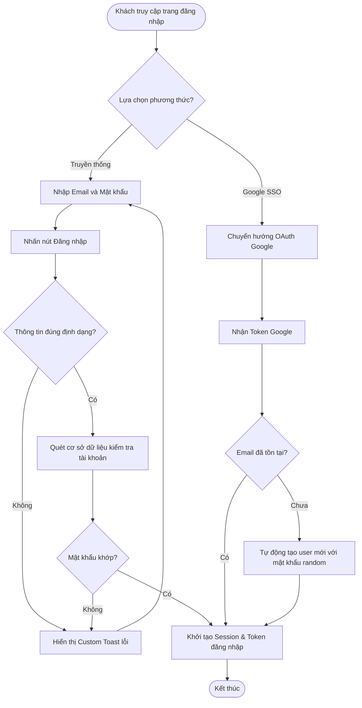
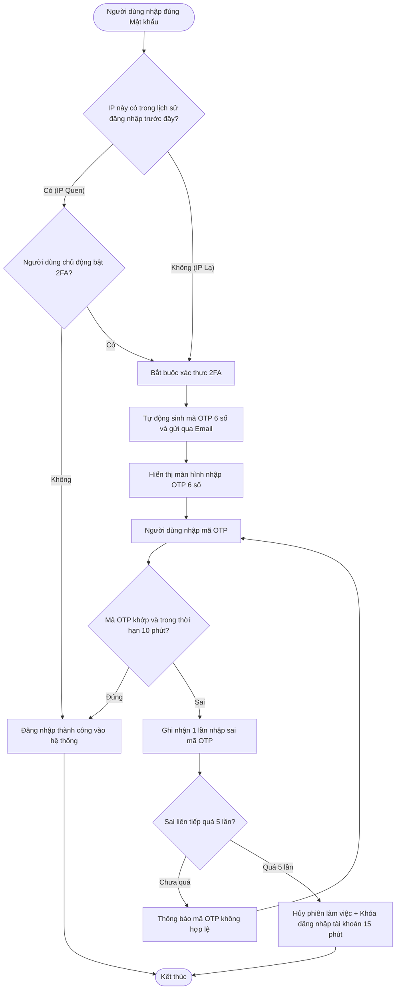
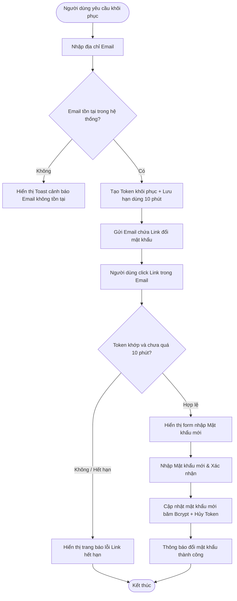
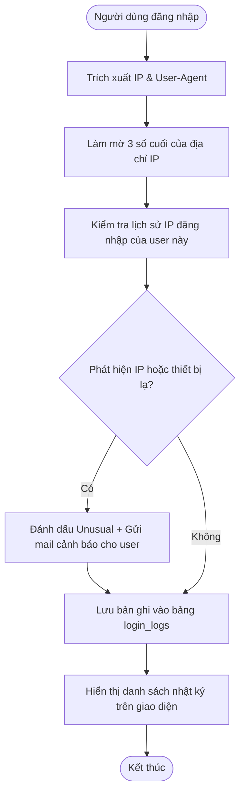
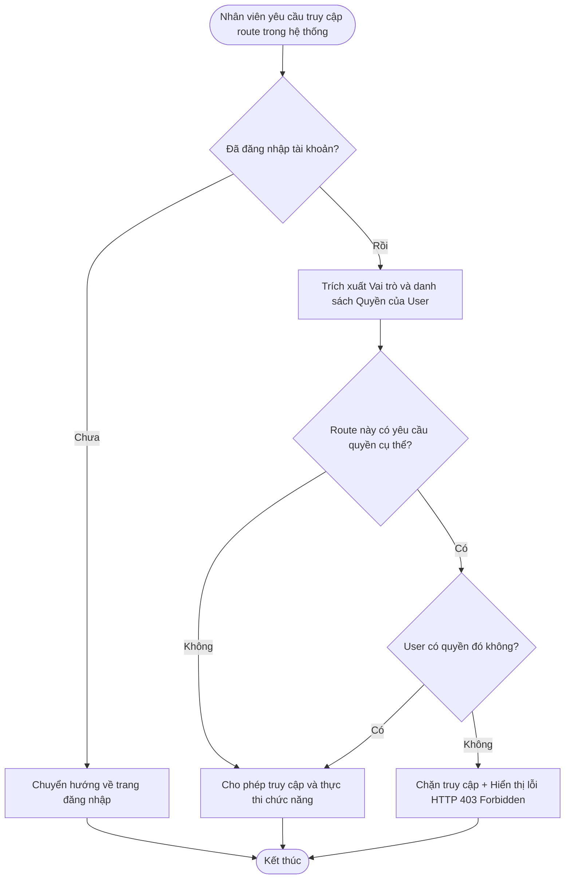
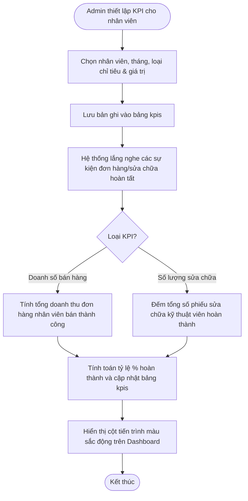
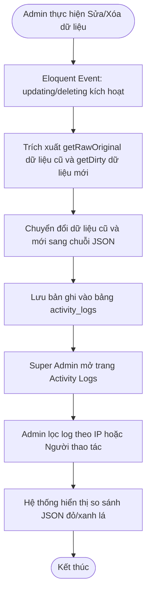
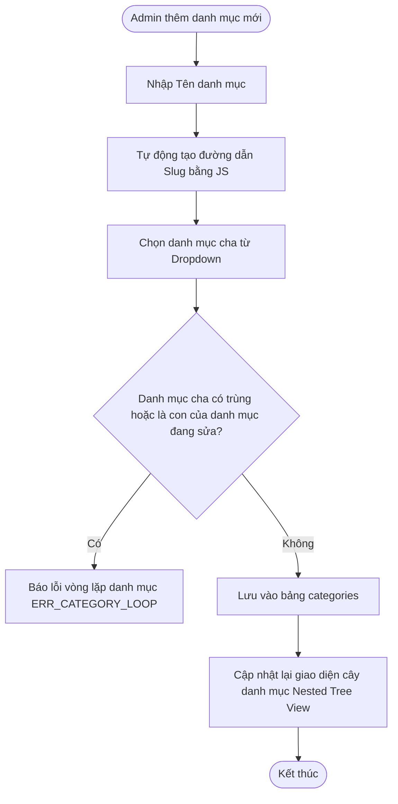
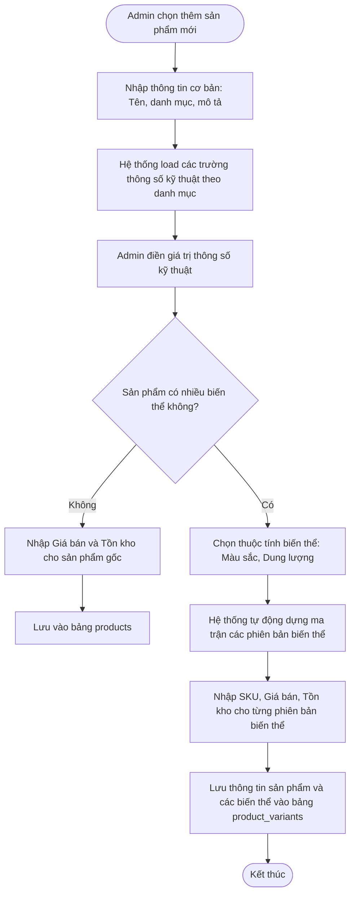
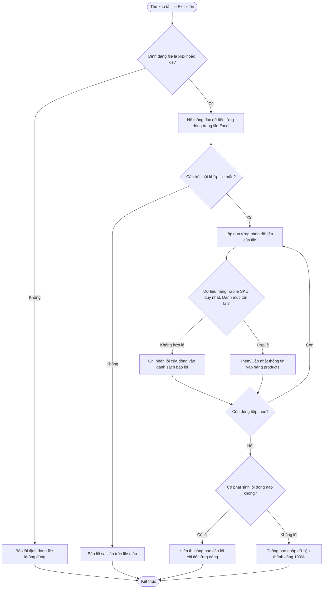

# PHỤ LỤC: ĐẶC TẢ CHI TIẾT CHỨC NĂNG (SRS APPENDIX)
## HỆ THỐNG THƯƠNG MẠI ĐIỆN TỬ TÍCH HỢP MINI-ERP HAE1

Tài liệu này cung cấp mô tả đặc tả chi tiết (Software Requirement Specification - SRS) cho toàn bộ các chức năng của hệ thống. Mỗi chức năng được trình bày chi tiết theo đúng cấu trúc tiêu chuẩn học thuật: Tổng quan (Overview), Bố cục giao diện (UI Layout), Tác nhân (Actors), Sơ đồ Use-case, Sơ đồ hoạt động (Activity Diagram), Kịch bản hoạt động (Workflows), Quy tắc nghiệp vụ ngầm (Business Rules) và Đặc tả màn hình (Screen Descriptions).

---

## 7.1. ĐĂNG NHẬP / ĐĂNG KÝ ĐA KÊNH

### 7.1.1. Tổng quan (Overview)
Chức năng cho phép người dùng xác thực và đăng nhập vào hệ thống HAE1. Hệ thống hỗ trợ hai hình thức đăng nhập song song: Đăng nhập truyền thống bằng email và mật khẩu được mã hóa bảo mật, hoặc đăng nhập nhanh thông qua liên kết ủy quyền một chạm với tài khoản Google (SSO OAuth 2.0). Client-side tích hợp công cụ đo độ mạnh mật khẩu và custom toast thông báo trạng thái theo thời gian thực.

### 7.1.2. Bố cục giao diện (UI Layout)
*   **Trang Login/Register:** Thiết kế giao diện kép đối xứng (Dual Panel) chuyển đổi mượt mà bằng hiệu ứng Sliding Card.
    *   **Bên trái (Đăng nhập):** Gồm ô nhập Email, ô nhập Mật khẩu (có icon mắt đóng/mở ẩn hiện mật khẩu), liên kết "Quên mật khẩu" và nút bấm "Đăng nhập".
    *   **Bên phải (Đăng ký):** Gồm ô nhập Họ tên, Email, Số điện thoại, Mật khẩu, ô Xác nhận mật khẩu. Dưới ô Mật khẩu có một thanh đo độ mạnh (Password Strength Meter) chuyển màu động (Đỏ: Yếu, Vàng: Trung bình, Xanh lá: Mạnh).
    *   **Nút SSO Google:** Nổi bật ở chân form với logo Google tiêu chuẩn.

### 7.1.3. Các tác nhân tương tác (Actors) & Giới hạn quyền hạn
*   **Guest (Khách vãng lai):** Điền form đăng ký hoặc click đăng nhập qua tài khoản Google.
*   **Google OAuth API:** Thực hiện xác minh tài khoản Google của người dùng.
*   **System:** Kiểm tra thông tin đăng nhập trong bảng `users`, xác thực và tạo session truy cập.

### 7.1.4. Sơ đồ Use-case (Mermaid)
```mermaid
usecaseDiagram
    actor Guest as "Khách vãng lai"
    actor Google as "Google OAuth API"
    
    Guest --> (Đăng ký tài khoản thủ công)
    Guest --> (Đăng nhập bằng Email/Password)
    Guest --> (Đăng nhập qua Google SSO)
    (Đăng nhập qua Google SSO) --> Google
```

### 7.1.5. Sơ đồ hoạt động (Activity Diagram - Mermaid)


### 7.1.6. Bảng kịch bản hoạt động (Workflows)

#### Kịch bản 1: Đăng nhập truyền thống thành công (Happy Case)
| Bước | Tác nhân (Actor) | Hành động của Tác nhân | Phản hồi của Hệ thống (System Response) |
| :--- | :--- | :--- | :--- |
| 1 | Guest | Nhập email `admin@hae1.com`, nhập mật khẩu và bấm "Đăng nhập". | Gửi request xác thực về Backend. |
| 2 | System | Thực hiện băm mật khẩu, đối chiếu bảng `users` thấy trùng khớp và trạng thái hoạt động. | Tạo session, ghi nhận log lịch sử đăng nhập thành công và chuyển hướng người dùng đến trang cá nhân/dashboard. |

#### Kịch bản 2: Đăng ký thất bại do mật khẩu không đủ độ mạnh (Exception Case)
| Bước | Tác nhân (Actor) | Hành động của Tác nhân | Phản hồi của Hệ thống (System Response) |
| :--- | :--- | :--- | :--- |
| 1 | Guest | Điền form đăng ký, nhập mật khẩu đơn giản là `123456`. | Thanh đo độ mạnh hiển thị màu đỏ cảnh báo "Rất yếu", nút Đăng ký ở trạng thái bị vô hiệu hóa (Disabled). |
| 2 | Guest | Cố tình bypass client-side để submit form lên server. | Backend nhận request, chạy Laravel Validator. Trả về mã lỗi `422 Validation Error` kèm Toast: **"Mật khẩu bắt buộc phải chứa ít nhất 8 ký tự, bao gồm chữ hoa, chữ thường và chữ số"**. |

### 7.1.7. Quy tắc nghiệp vụ ngầm (Business Rules)
1. **Bảo mật mật khẩu:** Mọi mật khẩu lưu trữ trong bảng `users` bắt buộc phải được băm bằng thuật toán `Bcrypt` hoặc `Argon2id` (không lưu văn bản thuần).
2. **Khóa tạm thời khi đăng nhập sai:** Nếu nhập sai mật khẩu liên tiếp 5 lần trên cùng một IP, hệ thống sẽ tạm khóa quyền đăng nhập của IP/Email đó trong 15 phút.

### 7.1.8. Đặc tả màn hình giao diện (Screen Descriptions)

#### Màn hình Đăng nhập / Đăng ký (User Side)
| No | Field name | Control type | Constraint / Validation Rule (Quy tắc ràng buộc) | Required | Default value |
| :--- | :--- | :--- | :--- | :--- | :--- |
| 1 | Địa chỉ Email | Textbox | Đúng định dạng email, không để trống, tối đa 100 ký tự. | Yes | Trống |
| 2 | Mật khẩu | Textbox | Ẩn ký tự. Tối thiểu 8 ký tự khi đăng ký. | Yes | Trống |
| 3 | Họ tên | Textbox | Chỉ chứa chữ và khoảng trắng. Tối đa 100 ký tự. | Yes (đăng ký) | Trống |
| 4 | Số điện thoại | Textbox | Đúng 10 chữ số đầu số Việt Nam. | Yes (đăng ký) | Trống |
| 5 | Nút Google Login | Button | Kích hoạt chuyển hướng tới Google OAuth 2.0. | Yes | N/A |

---

## 7.2. XÁC THỰC 2 LỚP BẢO MẬT (TWO-FACTOR AUTHENTICATION - 2FA)

### 7.2.1. Tổng quan (Overview)
Xác thực 2 lớp (2FA) là giải pháp bảo mật nâng cao nhằm bảo vệ tài khoản người dùng (đặc biệt là tài khoản Admin và Nhân viên) trước nguy cơ bị đánh cắp mật khẩu. Khi đăng nhập từ một địa chỉ IP lạ chưa từng được ghi nhận trong lịch sử, hoặc tài khoản đã chủ động bật 2FA, hệ thống sẽ yêu cầu thêm một mã xác thực OTP dùng một lần gồm 6 chữ số được gửi trực tiếp qua Email đã đăng ký.

### 7.2.2. Bố cục giao diện (UI Layout)
*   **Trang nhập mã OTP (User Side):**
    *   Thiết kế tối giản, tập trung vào ô nhập liệu.
    *   **Khung nhập OTP:** Gồm 6 ô vuông nhập số riêng biệt được căn giữa màn hình. Khi nhập xong một số, con trỏ tự động nhảy sang ô vuông tiếp theo (Auto-tab).
    *   **Thông báo lỗi:** Dưới các ô nhập số hiển thị dòng chữ thông báo lỗi màu đỏ nếu mã OTP nhập vào không đúng hoặc đã hết hạn.
    *   **Bộ đếm thời gian và gửi lại mã:** Một dòng chữ nhỏ hiển thị đếm ngược 10 phút. Nút "Gửi lại mã OTP" sẽ bị làm mờ (Disabled) và chỉ sáng lên khi bộ đếm ngược về 0.

### 7.2.3. Các tác nhân tương tác (Actors) & Giới hạn quyền hạn
*   **User (Customer / Staff / Admin):** Nhập mật khẩu đúng, sau đó bắt buộc phải nhập chính xác mã OTP được gửi qua Email mới được cấp quyền đăng nhập vào hệ thống.
*   **System (Bảo mật tự động):** Đối chiếu địa chỉ IP đăng nhập, sinh mã OTP 6 số ngẫu nhiên gửi đi và kiểm tra tính hợp lệ của mã.

### 7.2.4. Sơ đồ Use-case (Mermaid)
```mermaid
usecaseDiagram
    actor User as "Người dùng (User)"
    actor System as "Hệ thống tự động"

    User --> (Đăng nhập mật khẩu)
    User --> (Nhập mã OTP 2FA)
    User --> (Yêu cầu gửi lại mã OTP)
    
    System --> (Kiểm tra lịch sử IP đăng nhập)
    System --> (Gửi mã OTP qua Email)
    System --> (Khóa tài khoản nếu nhập sai nhiều lần)
```

### 7.2.5. Sơ đồ hoạt động (Activity Diagram - Mermaid)


### 7.6.6. Bảng kịch bản hoạt động (Workflows)

#### Kịch bản 1: Xác thực 2FA thành công khi đăng nhập từ IP lạ (Happy Case)
| Bước | Tác nhân (Actor) | Hành động của Tác nhân | Phản hồi của Hệ thống (System Response) |
| :--- | :--- | :--- | :--- |
| 1 | User | Đăng nhập tài khoản Admin bằng đúng mật khẩu trên trình duyệt lạ từ địa điểm khác. | Phát hiện IP lạ, chặn truy cập và chuyển hướng sang màn hình nhập OTP. Gửi mã OTP 6 số qua Email. |
| 2 | User | Kiểm tra hòm thư Email lấy mã OTP (Ví dụ: `738192`). | Nhập mã OTP vào 6 ô trống trên màn hình trước 10 phút. |
| 3 | System | Kiểm tra mã OTP khớp và còn hiệu lực. | Cho phép đăng nhập thành công, chuyển hướng vào Dashboard Admin, lưu IP này vào danh sách IP quen thuộc. |

#### Kịch bản 2: Khóa phiên đăng nhập do nhập sai OTP quá 5 lần (Exception Case)
| Bước | Tác nhân (Actor) | Hành động của Tác nhân | Phản hồi của Hệ thống (System Response) |
| :--- | :--- | :--- | :--- |
| 1 | Attacker | Cố tình đoán mã OTP trên giao diện xác thực và nhập sai liên tiếp đến lần thứ 5. | Mỗi lần nhập sai hệ thống ghi nhận số lần thử sai vào Cache của Session. |
| 2 | System | Nhận diện lần nhập sai thứ 5 liên tiếp của Session này. | - Trả về SweetAlert thông báo lỗi nguy hiểm: **"Bạn đã nhập sai OTP quá 5 lần. Tài khoản bị khóa 15 phút"**. <br>- Hủy bỏ toàn bộ session hiện tại, khóa quyền xác thực của IP/Tài khoản trong 15 phút. |

### 7.2.7. Quy tắc nghiệp vụ ngầm (Business Rules)
1. **Thời gian sống của OTP:** Mã OTP được tạo ra chỉ có thời gian sử dụng tối đa là 10 phút (`OTP_LIFETIME = 600`). Quá 10 phút mã tự động bị vô hiệu hóa.
2. **Rate Limiting chặn brute-force:** Cơ chế giới hạn tối đa 5 lần nhập sai liên tiếp cho cả mật khẩu và mã OTP để ngăn chặn hacker dò mã.
3. **Làm mờ địa chỉ IP lưu trữ:** Địa chỉ IP ghi nhận tại bảng nhật ký sẽ được làm mờ 3 chữ số cuối (VD: `192.168.1.xxx`) trước khi hiển thị cho nhân viên để tuân thủ quy định GDPR về bảo mật dữ liệu.

### 7.2.8. Đặc tả màn hình giao diện (Screen Descriptions)

#### Màn hình Nhập mã OTP 2FA (User Side)
| No | Field name | Control type | Constraint / Validation Rule (Quy tắc ràng buộc) | Required | Default value |
| :--- | :--- | :--- | :--- | :--- | :--- |
| 1 | Ô nhập số OTP | 6-Digit Inputs Grid | Chỉ nhận ký tự số. Tự động nhảy sang ô tiếp theo sau khi gõ. | Yes | Trống |
| 2 | Đồng hồ đếm ngược | Timer Label | Định dạng hiển thị MM:SS. Chạy lùi từ 10:00 về 0. | Yes | 10:00 |
| 3 | Nút gửi lại mã | Link / Button | Chỉ cho phép click sau khi đồng hồ đếm ngược kết thúc. | Yes | Disabled |

---

## 7.3. KHÔI PHỤC MẬT KHẨU

### 7.3.1. Tổng quan (Overview)
Chức năng cho phép người dùng tự lấy lại mật khẩu đăng nhập khi bị quên thông qua hòm thư điện tử (Email) đã đăng ký. Hệ thống sẽ phát một token bảo mật có chữ ký số mã hóa và gửi đường dẫn thay đổi mật khẩu duy nhất kèm hạn dùng 10 phút tới email của người dùng nhằm đảm bảo tính chính chủ và an toàn.

### 7.3.2. Bố cục giao diện (UI Layout)
*   **Trang Yêu cầu khôi phục:** Gồm ô nhập địa chỉ Email và nút bấm "Gửi yêu cầu".
*   **Trang Đặt lại mật khẩu (Reset Password Page):** Chỉ mở được khi người dùng click vào link nhận được trong email. Gồm ô nhập Mật khẩu mới, ô Xác nhận mật khẩu mới, thanh hiển thị độ mạnh mật khẩu và nút bấm "Cập nhật mật khẩu".

### 7.3.3. Các tác nhân tương tác (Actors) & Giới hạn quyền hạn
*   **Guest / User:** Nhập email khôi phục, truy cập email để nhận link, nhập mật khẩu mới để đặt lại.
*   **System (Mail Service):** Xác thực email có trong hệ thống, sinh token mã hóa tạm thời, gửi email và cập nhật mật khẩu mới khi token khớp.

### 7.3.4. Sơ đồ Use-case (Mermaid)
```mermaid
usecaseDiagram
    actor Guest as "Người dùng quên mật khẩu"
    actor System as "Hệ thống tự động"
    
    Guest --> (Yêu cầu gửi mail khôi phục)
    Guest --> (Truy cập link trong email để reset)
    
    System --> (Tạo và lưu trữ Token khôi phục)
    System --> (Gửi email chứa link reset)
```

### 7.3.5. Sơ đồ hoạt động (Activity Diagram - Mermaid)


### 7.3.6. Bảng kịch bản hoạt động (Workflows)

#### Kịch bản 1: Khôi phục mật khẩu thành công (Happy Case)
| Bước | Tác nhân (Actor) | Hành động của Tác nhân | Phản hồi của Hệ thống (System Response) |
| :--- | :--- | :--- | :--- |
| 1 | Guest | Nhập email `user@gmail.com` tại trang Quên mật khẩu, bấm "Gửi yêu cầu". | Hệ thống kiểm tra trùng khớp, sinh token lưu trong bảng `password_resets`, gửi mail chứa link khôi phục. |
| 2 | Guest | Mở hộp thư đến email, click vào đường dẫn `hae1.com/password/reset/{token}`. | Chuyển hướng đến trang Đặt lại mật khẩu (Reset Form). |
| 3 | Guest | Nhập mật khẩu mới là `Hae1Customer@2026`, xác nhận và nhấn "Cập nhật mật khẩu". | Backend kiểm tra tính hợp lệ của mật khẩu, cập nhật DB, vô hiệu hóa token và hiển thị Toast thành công. |

#### Kịch bản 2: Token khôi phục bị hết hạn sử dụng (Exception Case)
| Bước | Tác nhân (Actor) | Hành động của Tác nhân | Phản hồi của Hệ thống (System Response) |
| :--- | :--- | :--- | :--- |
| 1 | Guest | Nhấp gửi yêu cầu khôi phục mật khẩu nhưng 1 tiếng sau mới mở mail để click vào link. | Chuyển hướng người dùng về trang web. |
| 2 | System | Kiểm tra timestamp của token thấy đã quá thời gian hiệu lực 10 phút. | Từ chối hiển thị form đặt mật khẩu, chuyển hướng về trang yêu cầu cũ kèm thông báo: **"Đường dẫn khôi phục mật khẩu đã hết hạn. Vui lòng gửi lại yêu cầu mới"**. |

### 7.3.7. Quy tắc nghiệp vụ ngầm (Business Rules)
1. **Hạn sử dụng Token:** Token khôi phục mật khẩu bắt buộc phải hết hiệu lực sau đúng 10 phút (`PASSWORD_RESET_EXPIRE = 600`) kể từ thời điểm phát hành.
2. **Khóa sử dụng lại:** Sau khi mật khẩu được cập nhật thành công, token đó phải bị xóa ngay lập tức khỏi bảng `password_resets` để ngăn chặn việc sử dụng lại token cũ.

### 7.3.8. Đặc tả màn hình giao diện (Screen Descriptions)

#### Màn hình Đặt lại mật khẩu (User Side)
| No | Field name | Control type | Constraint / Validation Rule (Quy tắc ràng buộc) | Required | Default value |
| :--- | :--- | :--- | :--- | :--- | :--- |
| 1 | Mật khẩu mới | Textbox | Ẩn ký tự. Tối thiểu 8 ký tự, phải có chữ hoa, thường, số. | Yes | Trống |
| 2 | Xác nhận mật khẩu mới | Textbox | Ẩn ký tự. Phải trùng khớp hoàn toàn với Mật khẩu mới. | Yes | Trống |
| 3 | Nút cập nhật mật khẩu | Button | Bấm để gửi dữ liệu cập nhật. | Yes | N/A |

---

## 7.4. LỊCH SỬ ĐĂNG NHẬP BẢO MẬT (LOGIN HISTORY)

### 7.4.1. Tổng quan (Overview)
Chức năng tự động ghi lại toàn bộ hoạt động truy cập tài khoản của người dùng. Hệ thống sẽ ghi nhận địa chỉ IP, User-Agent trình duyệt, hệ điều hành và thời gian thực hiện đăng nhập. Giao diện tích hợp cảnh báo bằng cờ đỏ nếu phát hiện tài khoản đăng nhập từ một địa chỉ IP lạ so với lịch sử đăng nhập thông thường, giúp bảo mật và phòng ngừa hacker.

### 7.4.2. Bố cục giao diện (UI Layout)
*   **Trang Nhật ký đăng nhập (Admin & Customer Side):**
    *   Thiết kế dạng bảng dữ liệu lưới (Data Table).
    *   Các cột thông tin gồm: Địa chỉ IP (làm mờ octet cuối), Loại thiết bị, Trình duyệt sử dụng, Thời gian đăng nhập, và Trạng thái.
    *   Dòng đăng nhập từ IP lạ sẽ hiển thị một nhãn đỏ nhấp nháy (`Cảnh báo IP lạ`) để người dùng dễ nhận biết.

### 7.4.3. Các tác nhân tương tác (Actors) & Giới hạn quyền hạn
*   **User / Admin:** Truy cập trang lịch sử đăng nhập để xem danh sách các phiên truy cập của bản thân hoặc toàn hệ thống.
*   **System (Logger):** Tự động bắt địa chỉ IP, thiết bị khi người dùng đăng nhập thành công và lưu vào bảng `login_logs`.

### 7.4.4. Sơ đồ Use-case (Mermaid)
```mermaid
usecaseDiagram
    actor User as "Người dùng / Admin"
    actor System as "Hệ thống Logger"

    User --> (Xem lịch sử đăng nhập)
    System --> (Tự động ghi nhận thông tin đăng nhập)
```

### 7.4.5. Sơ đồ hoạt động (Activity Diagram - Mermaid)


### 7.4.6. Bảng kịch bản hoạt động (Workflows)

#### Kịch bản 1: Ghi nhận và hiển thị lịch sử đăng nhập bình thường (Happy Case)
| Bước | Tác nhân (Actor) | Hành động của Tác nhân | Phản hồi của Hệ thống (System Response) |
| :--- | :--- | :--- | :--- |
| 1 | User | Đăng nhập tài khoản thành công từ máy tính cá nhân ở nhà. | Trích xuất IP `27.72.93.12` và thiết bị `Chrome/Windows 10`. |
| 2 | System | Mã hóa làm mờ thành `27.72.93.xxx`, lưu vào bảng `login_logs` ở trạng thái bình thường. | Cho phép truy cập vào trang web. |
| 3 | User | Truy cập mục "Lịch sử đăng nhập" trong Profile cá nhân. | Hiển thị bảng nhật ký đăng nhập, dòng đầu tiên khớp thông tin thiết bị và IP của User với màu nền xanh lá an toàn. |

#### Kịch bản 2: Ghi nhận đăng nhập bất thường và cảnh báo người dùng (Exception Case)
| Bước | Tác nhân (Actor) | Hành động của Tác nhân | Phản hồi của Hệ thống (System Response) |
| :--- | :--- | :--- | :--- |
| 1 | Attacker | Đăng nhập thành công vào tài khoản Admin bằng mật khẩu lấy cắp từ một địa chỉ IP lạ. | Trích xuất thông tin IP lạ chưa từng đăng nhập trước đây. |
| 2 | System | Ghi nhận cờ `is_unusual = 1` trong log đăng nhập, làm mờ IP lưu trữ. | - Hiển thị nhãn đỏ `Cảnh báo IP lạ` trên trang nhật ký. <br>- Tự động gửi Email cảnh báo đăng nhập bất thường yêu cầu Admin đổi mật khẩu hoặc xác thực 2FA. |

### 7.4.7. Quy tắc nghiệp vụ ngầm (Business Rules)
1. **Bảo mật thông tin IP:** Địa chỉ IP hiển thị trên giao diện của nhân viên và người dùng bắt buộc phải làm mờ octet cuối cùng (Ví dụ: `192.168.1.xxx`) để tuân thủ luật bảo mật thông tin cá nhân.
2. **Quy tắc dọn dẹp:** Hệ thống tự động chạy lệnh dọn dẹp hàng tháng để xóa bỏ các bản ghi lịch sử đăng nhập cũ quá 90 ngày nhằm giải phóng dung lượng DB.

### 7.4.8. Đặc tả màn hình giao diện (Screen Descriptions)

#### Màn hình Nhật ký đăng nhập (User/Admin Side)
| No | Field name | Control type | Constraint / Validation Rule (Quy tắc ràng buộc) | Required | Default value |
| :--- | :--- | :--- | :--- | :--- | :--- |
| 1 | Địa chỉ IP | Label | Hiển thị dạng IPv4 làm mờ 3 số cuối (Ví dụ: `113.161.42.xxx`). | Yes | N/A |
| 2 | Thiết bị sử dụng | Label | Hiển thị tên thiết bị và Hệ điều hành (Ví dụ: `Windows PC`, `iPhone`). | Yes | N/A |
| 3 | Trình duyệt | Label | Hiển thị tên trình duyệt (Ví dụ: `Chrome 124.0`, `Safari`). | Yes | N/A |
| 4 | Cờ cảnh báo IP lạ | Badge | Hiển thị nhãn đỏ `IP Lạ` nếu cờ cảnh báo bất thường được kích hoạt. | Yes | N/A |

---

## 7.5. PHÂN QUYỀN NHÂN VIÊN (RBAC)

### 7.5.1. Tổng quan (Overview)
Chức năng Quản lý phân quyền dựa trên vai trò (Role-Based Access Control - RBAC) giúp quản trị viên tối cao (Super Admin) phân định rõ ràng quyền hạn của từng nhân viên trong hệ thống Mini-ERP. Hệ thống định nghĩa các vai trò cụ thể như Admin, Nhân viên bán hàng (Staff), Thủ kho (Warehouse Manager), Kỹ thuật viên (Technician) và gán quyền thao tác chi tiết trên từng URL route của hệ thống.

### 7.5.2. Bố cục giao diện (UI Layout)
*   **Trang Quản lý Vai trò (Roles Manager - Admin Side):**
    *   Bảng danh sách các vai trò trong hệ thống kèm cột chức năng "Phân quyền".
*   **Màn hình Phân quyền (Permissions Grid):**
    *   Bố cục dạng bảng lưới ma trận (Checkbox Grid). 
    *   Các cột biểu thị các hành động (Xem, Thêm, Sửa, Xóa).
    *   Các dòng biểu thị các module chức năng (Sản phẩm, Đơn hàng, Kho bãi, Sổ quỹ, Sửa chữa).
    *   Super Admin có thể click tích chọn/bỏ chọn từng ô để cấp/hủy quyền tương ứng cho vai trò đó.

### 7.5.3. Các tác nhân tương tác (Actors) & Giới hạn quyền hạn
*   **Super Admin:** Có toàn quyền chỉnh sửa vai trò, bật/tắt các quyền hạn cụ thể của nhân viên.
*   **Nhân viên (Staff/Warehouse/Technician):** Chịu sự quản lý của RBAC Middleware. Chỉ được truy cập vào các menu và tính năng đã được cấp quyền, nếu truy cập trái phép sẽ bị chặn.

### 7.5.4. Sơ đồ Use-case (Mermaid)
```mermaid
usecaseDiagram
    actor Admin as "Super Admin"
    actor Staff as "Nhân viên (Staff)"

    Admin --> (Tạo/Sửa vai trò mới)
    Admin --> (Gán danh sách Quyền cho Vai trò)
    Admin --> (Gán vai trò cho Tài khoản nhân viên)
    
    Staff --> (Truy cập tính năng hệ thống)
```

### 7.5.5. Sơ đồ hoạt động (Activity Diagram - Mermaid)


### 7.5.6. Bảng kịch bản hoạt động (Workflows)

#### Kịch bản 1: Super Admin thực hiện phân quyền cho Thủ kho (Happy Case)
| Bước | Tác nhân (Actor) | Hành động của Tác nhân | Phản hồi của Hệ thống (System Response) |
| :--- | :--- | :--- | :--- |
| 1 | Super Admin | Vào trang quản lý Phân quyền, chọn vai trò "Thủ kho" (Warehouse Manager). | Hiển thị bảng ma trận quyền của Thủ kho. |
| 2 | Super Admin | Tích chọn quyền "Xem kho", "Nhập kho PO", bỏ tích quyền "Xem sổ quỹ tài chính" và nhấn "Lưu". | Cập nhật các bản ghi trong bảng trung gian `role_has_permissions`, lưu cấu hình vào DB và xóa cache phân quyền cũ. |
| 3 | System | Thủ kho đăng nhập, Middleware tự động load danh sách quyền mới được gán từ cache/DB. | Menu "Sổ quỹ" tự động ẩn đi trên giao diện sidebar của Thủ kho. |

#### Kịch bản 2: Nhân viên cố tình truy cập trái phép vào tính năng bị cấm (Exception Case)
| Bước | Tác nhân (Actor) | Hành động của Tác nhân | Phản hồi của Hệ thống (System Response) |
| :--- | :--- | :--- | :--- |
| 1 | Staff (Bán hàng) | Cố tình gõ trực tiếp URL `hae1.com/admin/finance/cashbook` (Trang sổ quỹ) trên thanh địa chỉ trình duyệt. | Gửi request truy cập trang sổ quỹ lên Backend. |
| 2 | System | Route đi qua `CheckPermission` Middleware, đối soát vai trò Bán hàng không có quyền `view_cashbook`. | Chặn xử lý của Controller, ném ra ngoại lệ và hiển thị giao diện báo lỗi **"403 Forbidden - Bạn không có quyền truy cập chức năng này"**. |

### 7.5.7. Quy tắc nghiệp vụ ngầm (Business Rules)
1. **Khóa vai trò Super Admin:** Vai trò "Super Admin" là vai trò mặc định tối cao của hệ thống, không được phép chỉnh sửa quyền hoặc xóa vai trò này để tránh lỗi hệ thống mất quyền kiểm soát.
2. **Cơ chế Cache phân quyền:** Để tránh truy vấn cơ sở dữ liệu liên tục mỗi khi chuyển trang, danh sách quyền của người dùng được lưu trữ trong `Redis Cache`/`Laravel Cache` và sẽ tự động được xóa đi/cập nhật lại khi có bất kỳ thay đổi nào từ trang quản lý phân quyền.

### 7.5.8. Đặc tả màn hình giao diện (Screen Descriptions)

#### Màn hình Ma trận Phân quyền (Super Admin Side)
| No | Field name | Control type | Constraint / Validation Rule (Quy tắc ràng buộc) | Required | Default value |
| :--- | :--- | :--- | :--- | :--- | :--- |
| 1 | Tên vai trò | Textbox | Chỉ chứa chữ và số. Không trùng lặp. Tối đa 50 ký tự. | Yes | Trống |
| 2 | Checkbox Quyền hạn | Checkbox | Danh sách các checkbox tương ứng với các quyền cụ thể. | No | Chưa chọn |
| 3 | Nút cập nhật quyền | Button | Lưu thay đổi phân quyền vào DB. | Yes | N/A |

---

## 7.6. QUẢN LÝ NHÂN VIÊN & KPI

### 7.6.1. Tổng quan (Overview)
Chức năng hỗ trợ doanh nghiệp quản lý thông tin nhân sự và thiết lập, theo dõi chỉ tiêu hiệu suất công việc (KPI) cho từng nhân viên trong hệ thống Mini-ERP. Quản lý có thể tạo tài khoản nhân sự mới, phân vai trò hoạt động và gán chỉ tiêu KPI theo tháng (ví dụ: chỉ tiêu doanh số cho nhân viên bán hàng, số ca sửa chữa cho kỹ thuật viên) và hệ thống tự động tính phần trăm tiến độ hoàn thành dựa trên kết quả bán hàng/sửa chữa thực tế.

### 7.6.2. Bố cục giao diện (UI Layout)
*   **Trang danh sách Nhân viên (Admin Side):**
    *   Bảng thông tin cơ bản: Mã nhân viên, Họ tên, Email, Vai trò, KPI tháng hiện tại.
*   **Màn hình Thiết lập KPI (Modal/Page):**
    *   Form nhập chỉ tiêu: Chọn nhân viên, chọn tháng/năm, chọn loại KPI (Doanh số bán hàng hoặc Số lượng sửa chữa), nhập số tiền/số ca chỉ tiêu cần đạt.
*   **Thanh tiến trình hiệu suất (Progress Bar):**
    *   Hiển thị dạng cột thanh tiến trình phần trăm (%) tự động tô màu động (Đỏ: <50%, Vàng: 50% - 99%, Xanh lá: Đạt 100% chỉ tiêu) giúp trực quan hóa hiệu suất của từng nhân viên.

### 7.6.3. Các tác nhân tương tác (Actors) & Giới hạn quyền hạn
*   **Admin / Quản lý:** CRUD tài khoản nhân viên, thiết lập chỉ tiêu KPI định kỳ.
*   **Nhân viên (Staff / Technician):** Xem bảng theo dõi tiến độ hoàn thành chỉ tiêu KPI của bản thân tại trang Profile cá nhân.

### 7.6.4. Sơ đồ Use-case (Mermaid)
```mermaid
usecaseDiagram
    actor Admin as "Quản trị viên / Quản lý"
    actor Staff as "Nhân viên (Staff)"

    Admin --> (Thêm tài khoản nhân viên mới)
    Admin --> (Thiết lập chỉ tiêu KPI tháng)
    Admin --> (Xem thống kê hiệu suất KPI)
    
    Staff --> (Xem tiến độ KPI cá nhân)
```

### 7.6.5. Sơ đồ hoạt động (Activity Diagram - Mermaid)


### 7.6.6. Bảng kịch bản hoạt động (Workflows)

#### Kịch bản 1: Nhân viên hoàn thành vượt KPI chỉ tiêu tháng (Happy Case)
| Bước | Tác nhân (Actor) | Hành động của Tác nhân | Phản hồi của Hệ thống (System Response) |
| :--- | :--- | :--- | :--- |
| 1 | Admin | Thiết lập chỉ tiêu KPI cho nhân viên bán hàng A: Tháng 6/2026, loại "Doanh số", chỉ tiêu là 100 triệu VNĐ. | Lưu bản ghi vào bảng `kpis` với giá trị ban đầu `achieved_value = 0` (0%). |
| 2 | System | Lắng nghe sự kiện thanh toán các đơn hàng mà nhân viên A tạo trên POS hoặc đơn Online được gán. | Tự động cộng dồn doanh số vào trường `achieved_value`. |
| 3 | Staff A | Đạt tổng doanh thu bán hàng 120 triệu trong tháng. | Hệ thống cập nhật tiến độ đạt 120%, thanh tiến trình chuyển sang màu xanh lá rực rỡ kèm thông báo đạt xuất sắc chỉ tiêu. |

#### Kịch bản 2: Thiết lập trùng chỉ tiêu KPI trong cùng một tháng (Exception Case)
| Bước | Tác nhân (Actor) | Hành động của Tác nhân | Phản hồi của Hệ thống (System Response) |
| :--- | :--- | :--- | :--- |
| 1 | Admin | Chọn nhân viên A, thiết lập KPI cho tháng 6/2026 lần thứ hai (khi đã có một bản ghi KPI tháng 6/2026 của người này). | Nhấn "Lưu thiết lập KPI". |
| 2 | System | Backend chạy validation kiểm tra tính duy nhất của cặp khóa `(employee_id, kpi_month, kpi_year, kpi_type)`. | Từ chối lưu, ném lỗi validation: **"Chỉ tiêu KPI loại này của nhân viên đã được thiết lập trong tháng đã chọn"** (`ERR_DUPLICATE_KPI`). |

### 7.6.7. Quy tắc nghiệp vụ ngầm (Business Rules)
1. **Ràng buộc duy nhất:** Mỗi nhân viên chỉ có tối đa 01 chỉ tiêu cho mỗi loại KPI trong cùng một tháng nhất định.
2. **Quy tắc tính toán tự động:** Giá trị thực hiện (`achieved_value`) của KPI doanh số chỉ được tính cộng dồn từ các đơn hàng có trạng thái thanh toán thành công (`Paid`) và không phát sinh hoàn tiền/trả hàng.

### 7.6.8. Đặc tả màn hình giao diện (Screen Descriptions)

#### Màn hình Thiết lập chỉ tiêu KPI (Admin Side)
| No | Field name | Control type | Constraint / Validation Rule (Quy tắc ràng buộc) | Required | Default value |
| :--- | :--- | :--- | :--- | :--- | :--- |
| 1 | Chọn nhân viên | Dropdown | Danh sách nhân viên active trong hệ thống. | Yes | Chọn nhân viên |
| 2 | Loại KPI | Dropdown | Gồm: `Doanh số bán hàng`, `Số lượng ca sửa chữa`. | Yes | Doanh số... |
| 3 | Chỉ tiêu cần đạt | Textbox | Chỉ nhập số nguyên dương lớn hơn 0. | Yes | Trống |
| 4 | Tháng thiết lập | Datepicker | Định dạng MM/YYYY. | Yes | Tháng hiện tại |

---

## 7.7. ACTIVITY LOGS (NHẬT KÝ HOẠT ĐỘNG HỆ THỐNG)

### 7.7.1. Tổng quan (Overview)
Activity Logs là chức năng ghi nhật ký kiểm toán (Audit Trail) tối quan trọng dành cho ban quản trị. Hệ thống tự động ghi nhận lại toàn bộ thao tác làm thay đổi cơ sở dữ liệu (tạo mới, cập nhật, xóa mềm/xóa vĩnh viễn) của các tài khoản quản trị viên và nhân viên. Nhật ký ghi chi tiết: ai thực hiện, thời gian, tên bảng dữ liệu, và đặc biệt là sự thay đổi chi tiết giữa giá trị dữ liệu cũ và dữ liệu mới.

### 7.7.2. Bố cục giao diện (UI Layout)
*   **Trang danh sách Nhật ký hoạt động (Admin Side):**
    *   Bảng dữ liệu lưới rộng rãi hiển thị: Mã log, Quản trị viên, Hành động (Create/Update/Delete), Tên bảng dữ liệu, Địa chỉ IP, Thời gian thao tác.
    *   Cột hành động có nút "Xem chi tiết". Khi click vào, hiển thị một Modal chứa hai khung mã nguồn (JSON Code Viewer) so sánh:
        *   **Khung bên trái (Dữ liệu cũ - Old Value):** Chứa các trường dữ liệu trước khi thay đổi (chữ màu đỏ).
        *   **Khung bên phải (Dữ liệu mới - New Value):** Chứa dữ liệu sau khi cập nhật thành công (chữ màu xanh lá).

### 7.7.3. Các tác nhân tương tác (Actors) & Giới hạn quyền hạn
*   **Super Admin:** Xem toàn bộ nhật ký hoạt động hệ thống, lọc tìm kiếm theo nhân sự hoặc theo thực thể bảng để điều tra vết sự cố dữ liệu.
*   **System (Logger Engine):** Tự động can thiệp vào các Model Eloquent (`booted` events) để ghi nhận hoạt động mỗi khi có truy vấn thay đổi dữ liệu (insert/update/delete).

### 7.7.4. Sơ đồ Use-case (Mermaid)
```mermaid
usecaseDiagram
    actor Admin as "Super Admin"
    actor System as "Hệ thống Logger Engine"

    Admin --> (Tra cứu lịch sử hoạt động Admin)
    Admin --> (Lọc log theo bảng và Nhân viên)
    Admin --> (Xem chi tiết so sánh dữ liệu cũ - mới)
    
    System --> (Tự động bắt sự kiện thay đổi Model)
```

### 7.7.5. Sơ đồ hoạt động (Activity Diagram - Mermaid)


### 7.7.6. Bảng kịch bản hoạt động (Workflows)

#### Kịch bản 1: Ghi nhận lịch sử khi cập nhật giá sản phẩm (Happy Case)
| Bước | Tác nhân (Actor) | Hành động của Tác nhân | Phản hồi của Hệ thống (System Response) |
| :--- | :--- | :--- | :--- |
| 1 | Admin | Truy cập quản trị sản phẩm, sửa giá sản phẩm iPhone 15 từ 30M thành 28M và bấm "Cập nhật". | Eloquent Model nhận sự kiện `updating` trên bảng `products`. |
| 2 | System | Ghi nhận sự thay đổi, chuyển đổi sang JSON: dữ liệu cũ `{price: 30000000}`, dữ liệu mới `{price: 28000000}`. | Lưu bản ghi mới vào bảng `activity_logs` kèm `user_id` của Admin. |
| 3 | Super Admin | Vào trang nhật ký hoạt động, thấy bản ghi cập nhật sản phẩm, bấm "Xem chi tiết". | Hiển thị modal so sánh sự thay đổi giá tiền rõ ràng. |

#### Kịch bản 2: Không lưu nhật ký đối với các thao tác truy vấn xem dữ liệu (Happy Case)
| Bước | Tác nhân (Actor) | Hành động của Tác nhân | Phản hồi của Hệ thống (System Response) |
| :--- | :--- | :--- | :--- |
| 1 | Admin | Thực hiện mở trang Danh sách đơn hàng, xem chi tiết 10 đơn hàng để đối soát. | Hệ thống tải dữ liệu (truy vấn SELECT). |
| 2 | System | Eloquent nhận biết thao tác truy vấn không làm biến động hay thay đổi dữ liệu của DB. | Bỏ qua, tuyệt đối không ghi nhận log vào bảng `activity_logs` để tránh đầy rác cơ sở dữ liệu. |

### 7.7.7. Quy tắc nghiệp vụ ngầm (Business Rules)
1. **Chặn xóa sửa log:** Bản ghi trong bảng `activity_logs` là bất biến (Read-only). Hệ thống không cung cấp bất kỳ API hay giao diện nào cho phép cập nhật hoặc xóa bỏ log hoạt động, ngoại trừ quyền xóa vật lý trực tiếp của Quản trị viên cơ sở dữ liệu (Database Administrator) trong phpMyAdmin.
2. **Quy tắc định dạng JSON:** Các trường thay đổi bắt buộc phải được lưu trữ dưới định dạng kiểu dữ liệu `JSON` hoặc `LONGTEXT` để đảm bảo tính linh hoạt khi cấu trúc các bảng khác nhau.

### 7.7.8. Đặc tả màn hình giao diện (Screen Descriptions)

#### Màn hình Nhật ký Hoạt động (Admin Side)
| No | Field name | Control type | Constraint / Validation Rule (Quy tắc ràng buộc) | Required | Default value |
| :--- | :--- | :--- | :--- | :--- | :--- |
| 1 | Tên bảng dữ liệu | Label | Hiển thị tên bảng vật lý (Ví dụ: `products`, `orders`). | Yes | N/A |
| 2 | Hành động | Badge | Hiển thị: `CREATE` (Xanh lá), `UPDATE` (Cam), `DELETE` (Đỏ). | Yes | N/A |
| 3 | Khung xem JSON cũ | JSON Viewer | Định dạng JSON, bôi đỏ các trường đã thay đổi. | Yes | Trống |
| 4 | Khung xem JSON mới | JSON Viewer | Định dạng JSON, bôi xanh lá các trường mới cập nhật. | Yes | Trống |

---

## 7.8. CRUD DANH MỤC ĐA CẤP

### 7.8.1. Tổng quan (Overview)
Chức năng cho phép quản trị viên xây dựng và quản trị cây danh mục sản phẩm của hệ thống theo cấu trúc đa cấp (Parent-Child). Ví dụ: Danh mục cha là *Điện máy* chứa danh mục con là *Tủ lạnh*, bên trong *Tủ lạnh* có danh mục cháu là *Tủ lạnh Side-by-Side*. Tính năng hỗ trợ cấu hình động các thông số thuộc tính lọc cho từng danh mục để phục vụ bộ lọc tìm kiếm nâng cao ở trang mua sắm.

### 7.8.2. Bố cục giao diện (UI Layout)
*   **Trang quản lý Danh mục (Admin Side):**
    *   **Cây danh mục (Nested Tree View):** Hiển thị danh mục theo sơ đồ phân nhánh dạng thư mục thụt đầu dòng, hỗ trợ kéo thả kéo thả (Drag and Drop) để thay đổi nhanh cấp bậc cha-con.
    *   **Form thêm/sửa danh mục:** 
        *   Ô nhập Tên danh mục, ô nhập Slug (được tự động sinh từ tên bằng JS), dropdown chọn danh mục cha (Parent Category).
        *   Khu vực thiết lập thuộc tính lọc: Cho phép nhấn nút "+" để add thêm các thuộc tính kỹ thuật cần lọc tương ứng (Ví dụ: Danh mục tủ lạnh có lọc theo dung tích, danh mục máy giặt có lọc theo khối lượng giặt).

### 7.8.3. Các tác nhân tương tác (Actors) & Giới hạn quyền hạn
*   **Admin / Quản lý:** Có quyền thực hiện thêm mới, sửa thông tin, sắp xếp thứ tự hoặc xóa bỏ danh mục khi không còn kinh doanh.
*   **System:** Tự động sinh slug thân thiện, hiển thị cấu trúc cây danh mục cho khách hàng lựa chọn ngoài giao diện bán hàng.

### 7.8.4. Sơ đồ Use-case (Mermaid)
```mermaid
usecaseDiagram
    actor Admin as "Quản trị viên (Admin)"

    Admin --> (Xem cây danh mục đa cấp)
    Admin --> (Thêm danh mục sản phẩm mới)
    Admin --> (Thay đổi cấp bậc danh mục bằng kéo thả)
    Admin --> (Xóa danh mục không sử dụng)
```

### 7.8.5. Sơ đồ hoạt động (Activity Diagram - Mermaid)


### 7.8.6. Bảng kịch bản hoạt động (Workflows)

#### Kịch bản 1: Tạo danh mục con và cấu hình bộ lọc (Happy Case)
| Bước | Tác nhân (Actor) | Hành động của Tác nhân | Phản hồi của Hệ thống (System Response) |
| :--- | :--- | :--- | :--- |
| 1 | Admin | Click "Thêm danh mục mới", nhập tên là "Tủ lạnh Inverter". | Giao diện tự động điền ô Slug là `tu-lanh-inverter`. |
| 2 | Admin | Chọn danh mục cha từ dropdown là "Tủ lạnh", cấu hình thêm bộ lọc "Dung tích tủ" và "Hãng sản xuất", bấm "Lưu". | Backend kiểm tra tính hợp lệ, lưu bản ghi mới với `parent_id` trỏ tới ID của danh mục "Tủ lạnh". |
| 3 | System | Ghi nhận cấu hình bộ lọc dạng JSON vào trường `filter_config`. | Hiển thị danh mục mới trên cây danh mục với cấp thụt dòng chính xác. |

#### Kịch bản 2: Lỗi chọn danh mục cha bị vòng lặp đệ quy (Exception Case)
| Bước | Tác nhân (Actor) | Hành động của Tác nhân | Phản hồi của Hệ thống (System Response) |
| :--- | :--- | :--- | :--- |
| 1 | Admin | Thực hiện sửa danh mục cha "Tủ lạnh", cố tình chọn danh mục cha của nó từ dropdown là danh mục con "Tủ lạnh Side-by-Side". | Bấm nút "Lưu thay đổi". |
| 2 | System | Backend chạy validation đệ quy kiểm tra cấu trúc phả hệ của danh mục. | Phát hiện lỗi vòng lặp (vô lý khi cha lại làm con của con mình), từ chối cập nhật và trả về thông báo lỗi: **"Không thể thiết lập danh mục cha là danh mục con của chính nó"** (`ERR_CATEGORY_LOOP`). |

### 7.8.7. Quy tắc nghiệp vụ ngầm (Business Rules)
1. **Ngăn chặn lỗi đệ quy vô hạn:** Hệ thống bắt buộc phải kiểm tra đệ quy khi cập nhật `parent_id` để ngăn chặn hiện tượng vòng lặp kín trong mối quan hệ cha-con (Ví dụ: A là con B, B là con C, C lại là con A).
2. **Quy tắc xóa danh mục:** Khi xóa một danh mục cha, hệ thống bắt buộc yêu cầu người dùng lựa chọn: xóa toàn bộ các danh mục con bên trong hoặc chuyển toàn bộ danh mục con về làm con của một danh mục khác.

### 7.8.8. Đặc tả màn hình giao diện (Screen Descriptions)

#### Màn hình Thêm / Sửa Danh mục (Admin Side)
| No | Field name | Control type | Constraint / Validation Rule (Quy tắc ràng buộc) | Required | Default value |
| :--- | :--- | :--- | :--- | :--- | :--- |
| 1 | Tên danh mục | Textbox | Không trùng lặp. Tối đa 50 ký tự. | Yes | Trống |
| 2 | Đường dẫn tĩnh (Slug) | Textbox | Tự động sinh từ tên, định dạng không dấu, ngăn cách bằng dấu gạch ngang (VD: `tu-lanh-lg`). | Yes | Trống |
| 3 | Danh mục cha | Dropdown | Liệt kê toàn bộ danh mục hiện có để chọn làm cha. | No | Không có (Danh mục gốc) |
| 4 | Cấu hình thuộc tính lọc | Checkbox List | Chọn các thuộc tính dùng để lọc sản phẩm trong danh mục này. | No | Chưa chọn |

---

## 7.9. CRUD SẢN PHẨM & BIẾN THỂ

### 7.9.1. Tổng quan (Overview)
Chức năng cho phép quản trị viên quản lý toàn bộ danh sách sản phẩm và các biến thể kinh doanh của sản phẩm đó. Do đặc thù đồ điện máy giá trị cao, một sản phẩm có thể có nhiều biến thể khác nhau về màu sắc, dung lượng hoặc thông số kỹ thuật (Ví dụ: điện thoại iPhone 15 bản 128GB màu Đen có giá bán và tồn kho khác biệt so với bản 256GB màu Gold). Tính năng hỗ trợ cập nhật thông số kỹ thuật chi tiết và tải lên album ảnh/video mô tả.

### 7.9.2. Bố cục giao diện (UI Layout)
*   **Trang danh sách Sản phẩm (Admin Side):** Bảng hiển thị thông tin sản phẩm: Ảnh, Tên sản phẩm, Mã SKU gốc, Danh mục, Trạng thái hoạt động, và nút Quản lý biến thể.
*   **Màn hình Thêm mới/Chỉnh sửa Sản phẩm:**
    *   **Tab Thông tin chung:** Tên sản phẩm, mô tả chi tiết (Rich Text Editor), album ảnh kéo thả.
    *   **Tab Thông số kỹ thuật:** Các ô nhập thông số động tương ứng với cấu hình của danh mục sản phẩm đó.
    *   **Tab Biến thể (Variants Manager):** Khu vực tạo biến thể. Khi click chọn các thuộc tính (Màu sắc, Dung lượng), hệ thống tự động sinh ra bảng ma trận biến thể. Mỗi biến thể có ô nhập SKU riêng biệt, Giá bán, Giá khuyến mãi và Tồn kho an toàn.

### 7.9.3. Các tác nhân tương tác (Actors) & Giới hạn quyền hạn
*   **Admin / Quản lý:** Có quyền CRUD sản phẩm và các biến thể sản phẩm, thay đổi trạng thái bán hàng.
*   **System:** Đồng bộ hiển thị các sản phẩm active và các biến thể tương ứng ra giao diện bán hàng cho khách hàng chọn mua.

### 7.9.4. Sơ đồ Use-case (Mermaid)
```mermaid
usecaseDiagram
    actor Admin as "Quản trị viên (Admin)"

    Admin --> (Xem danh sách sản phẩm)
    Admin --> (Thêm sản phẩm và thuộc tính kỹ thuật)
    Admin --> (Tạo ma trận biến thể sản phẩm)
    Admin --> (Tải lên album ảnh sản phẩm)
```

### 7.9.5. Sơ đồ hoạt động (Activity Diagram - Mermaid)


### 7.9.6. Bảng kịch bản hoạt động (Workflows)

#### Kịch bản 1: Thêm mới sản phẩm tivi có nhiều biến thể (Happy Case)
| Bước | Tác nhân (Actor) | Hành động của Tác nhân | Phản hồi của Hệ thống (System Response) |
| :--- | :--- | :--- | :--- |
| 1 | Admin | Click "Thêm sản phẩm", nhập tên "Tivi Sony OLED", chọn danh mục "Tivi", điền thông số kỹ thuật. | Load giao diện biến thể, hiển thị thuộc tính biến thể phù hợp. |
| 2 | Admin | Chọn thuộc tính "Kích thước màn hình", tích chọn "55 inch" và "65 inch", bấm "Tạo biến thể". | Tự động sinh ra 2 dòng biến thể: `Tivi Sony OLED - 55 inch` và `Tivi Sony OLED - 65 inch` với ô nhập giá riêng biệt. |
| 3 | Admin | Nhập giá bán lần lượt là 25 triệu và 35 triệu, nhập mã SKU cho từng chiếc, nhấn "Lưu". | Lưu thông tin sản phẩm vào bảng `products`, lưu 2 bản ghi biến thể vào bảng `product_variants`. |

#### Kịch bản 2: Lỗi trùng lặp mã SKU biến thể (Exception Case)
| Bước | Tác nhân (Actor) | Hành động của Tác nhân | Phản hồi của Hệ thống (System Response) |
| :--- | :--- | :--- | :--- |
| 1 | Admin | Khi tạo 2 biến thể tivi Sony, cố tình điền trùng mã SKU ở cả hai dòng là `TV-SONY-OLED`. | Bấm nút "Lưu sản phẩm". |
| 2 | System | Backend chạy validation kiểm tra tính duy nhất của trường `sku` trong bảng `product_variants`. | Từ chối lưu, ném lỗi validation: **"Mã SKU biến thể này đã tồn tại trong hệ thống. Vui lòng nhập mã SKU khác"** (`ERR_DUPLICATE_SKU`). |

### 7.9.7. Quy tắc nghiệp vụ ngầm (Business Rules)
1. **Mã SKU duy nhất:** Tất cả mã SKU (Stock Keeping Unit) của sản phẩm gốc và sản phẩm biến thể bắt buộc phải là duy nhất trên toàn hệ thống để phục vụ quản lý xuất nhập kho.
2. **Quy tắc giá biến thể:** Giá bán của sản phẩm biến thể không được phép nhỏ hơn giá khuyến mãi của biến thể đó.

### 7.9.8. Đặc tả màn hình giao diện (Screen Descriptions)

#### Màn hình Ma trận Biến thể sản phẩm (Admin Side)
| No | Field name | Control type | Constraint / Validation Rule (Quy tắc ràng buộc) | Required | Default value |
| :--- | :--- | :--- | :--- | :--- | :--- |
| 1 | Mã SKU biến thể | Textbox | Phải là duy nhất. Không chứa khoảng trắng và ký tự đặc biệt. | Yes | Trống |
| 2 | Giá bán biến thể | Textbox | Chỉ chứa số nguyên dương. | Yes | 0 |
| 3 | Giá khuyến mãi | Textbox | Chỉ chứa số nguyên dương. Nhỏ hơn hoặc bằng Giá bán. | No | 0 |
| 4 | Tồn kho biến thể | Textbox | Chỉ chứa số nguyên dương lớn hơn hoặc bằng 0. | Yes | 0 |

---

## 7.10. IMPORT / EXPORT EXCEL

### 7.10.1. Tổng quan (Overview)
Chức năng Import/Export Excel giúp thủ kho và nhà quản lý xử lý nhanh chóng khối lượng dữ liệu hàng hóa khổng lồ của kho điện máy Mini-ERP HAE1. Thủ kho có thể tải xuống file Excel chứa toàn bộ danh sách sản phẩm hiện tại để đối soát, hoặc sử dụng tệp Excel mẫu điền sẵn thông tin hàng nghìn sản phẩm mới để tải lên hệ thống (Import) nhằm tiết kiệm thời gian nhập liệu thủ công.

### 7.10.2. Bố cục giao diện (UI Layout)
*   **Trang quản lý sản phẩm (Admin Side):**
    *   **Nút Export:** Một nút bấm màu xanh lá biểu tượng Excel nằm ở góc trên bên phải bảng sản phẩm để tải file về lập tức.
    *   **Khung Import dữ liệu:** Một hộp kéo thả file (Drag and Drop Zone) viền nét đứt màu xám. Khi thủ kho kéo thả file Excel vào, hiển thị tên file và dung lượng kèm nút "Tải lên và xử lý".
    *   **Nút tải file mẫu:** Một liên kết "Tải file Excel mẫu tại đây" ngay dưới hộp kéo thả để thủ kho tải file đúng cấu trúc cột quy định.

### 7.10.3. Các tác nhân tương tác (Actors) & Giới hạn quyền hạn
*   **Admin / Thủ kho:** Có quyền tải lên file Excel sản phẩm để nhập kho hàng loạt, hoặc xuất dữ liệu danh sách sản phẩm hiện tại.
*   **System (Excel Parser):** Đọc nội dung file Excel tải lên, kiểm tra tính hợp lệ của từng dòng dữ liệu và tiến hành ghi/cập nhật cơ sở dữ liệu.

### 7.10.4. Sơ đồ Use-case (Mermaid)
```mermaid
usecaseDiagram
    actor Admin as "Quản trị viên / Thủ kho"
    actor System as "Hệ thống Excel Parser"

    Admin --> (Tải file Excel danh sách sản phẩm - Export)
    Admin --> (Tải file Excel sản phẩm lên hệ thống - Import)
    Admin --> (Tải file Excel cấu trúc mẫu)
    
    Import --> System : "<<include>>"
```

### 7.10.5. Sơ đồ hoạt động (Activity Diagram - Mermaid)


### 7.10.6. Bảng kịch bản hoạt động (Workflows)

#### Kịch bản 1: Nhập hàng loạt sản phẩm thành công từ Excel (Happy Case)
| Bước | Tác nhân (Actor) | Hành động của Tác nhân | Phản hồi của Hệ thống (System Response) |
| :--- | :--- | :--- | :--- |
| 1 | Thủ kho | Tải file Excel mẫu, điền thông tin của 50 sản phẩm mới và kéo thả vào khung Import trên website, nhấn "Xử lý". | Gửi file Excel lên server, Excel Parser chạy ngầm phân tích. |
| 2 | System | Quét toàn bộ 50 dòng thấy cấu trúc cột và dữ liệu hợp lệ (không trùng SKU, đúng ID danh mục). | Lưu 50 sản phẩm vào DB và hiển thị Toast: **"Nhập thành công 50/50 sản phẩm từ file Excel"**. |

#### Kịch bản 2: File Excel tải lên bị lỗi dữ liệu ở một số dòng (Exception Case)
| Bước | Tác nhân (Actor) | Hành động của Tác nhân | Phản hồi của Hệ thống (System Response) |
| :--- | :--- | :--- | :--- |
| 1 | Thủ kho | Tải lên file Excel sản phẩm có dòng số 5 bị trùng mã SKU và dòng số 12 bị trống Tên sản phẩm. | Nhấn nút "Tải lên và xử lý". |
| 2 | System | Quét file Excel, phát hiện lỗi dữ liệu ở dòng 5 và dòng 12. Thực hiện rollback toàn bộ transaction để tránh phân mảnh dữ liệu. | Hiển thị bảng báo cáo chi tiết: **"Dòng 5: SKU đã tồn tại"**, **"Dòng 12: Tên sản phẩm không được để trống"** và yêu cầu thủ kho chỉnh sửa lại file. |

### 7.10.7. Quy tắc nghiệp vụ ngầm (Business Rules)
1. **Rollback toàn bộ khi có lỗi (All-or-Nothing):** Khi thực hiện Import Excel, nếu phát hiện bất kỳ một lỗi dữ liệu nào dù là nhỏ nhất ở bất kỳ dòng nào, hệ thống bắt buộc phải rollback toàn bộ dữ liệu của file đó để đảm bảo tính toàn vẹn dữ liệu.
2. **Giới hạn kích thước file:** Giới hạn file Excel tải lên tối đa 10MB và tối đa 1000 dòng dữ liệu trên mỗi lượt import để tránh tràn bộ nhớ PHP (Memory Limit).

### 7.10.8. Đặc tả màn hình giao diện (Screen Descriptions)

#### Màn hình Nhập sản phẩm từ Excel (Admin Side)
| No | Field name | Control type | Constraint / Validation Rule (Quy tắc ràng buộc) | Required | Default value |
| :--- | :--- | :--- | :--- | :--- | :--- |
| 1 | Khung chọn File | Drag & Drop Zone | Định dạng file bắt buộc: `.xlsx`, `.xls`. Dung lượng < 10MB. | Yes | N/A |
| 2 | Nút tải file mẫu | Link | Đường dẫn tải file Excel cấu trúc chuẩn về máy. | Yes | N/A |
| 3 | Nút xử lý tệp | Button | Click để gửi file lên hệ thống xử lý. | Yes | N/A |

---

## 7.11. GIỎ HÀNG AJAX

### 7.11.1. Tổng quan (Overview)
Chức năng Giỏ hàng AJAX cung cấp trải nghiệm mua sắm mượt mà không bị ngắt quãng. Khách hàng có thể thực hiện thêm sản phẩm vào giỏ, điều chỉnh số lượng hoặc xóa sản phẩm khỏi giỏ trực tiếp từ trang danh sách hoặc trang chi tiết sản phẩm. Mọi thao tác này đều được xử lý bất đồng bộ thông qua các request AJAX, tự động cập nhật lại tổng số tiền và số lượng trên biểu tượng giỏ hàng ở Header mà không cần tải lại toàn bộ trang web.

### 7.11.2. Bố cục giao diện (UI Layout)
*   **Mini Cart (Biểu tượng Header):** Một icon giỏ hàng ở thanh menu trên cùng. Khi di chuột qua (Hover), tự động thả xuống một khung nhỏ hiển thị nhanh 3 sản phẩm vừa thêm và nút "Đi đến giỏ hàng".
*   **Trang Giỏ hàng chính (Cart Page):** 
    *   Bảng danh sách sản phẩm trong giỏ: Ảnh sản phẩm, Tên sản phẩm, Giá bán, Cụm tăng giảm số lượng (nút "-" và "+" bao quanh ô nhập số lượng), Thành tiền, và biểu tượng thùng rác để xóa.
    *   Khu vực bên phải: Tóm tắt đơn hàng (Tạm tính, Giảm giá, Tổng tiền thanh toán) và nút "Tiến hành thanh toán" màu đỏ cam nổi bật.

### 7.11.3. Các tác nhân tương tác (Actors) & Giới hạn quyền hạn
*   **Guest / Customer:** Thực hiện thêm, sửa, xóa sản phẩm trong giỏ hàng của mình.
*   **System:** Nhận request AJAX, tính toán số lượng, kiểm tra tồn kho khả dụng và phản hồi dữ liệu giỏ hàng mới dạng JSON.

### 7.11.4. Sơ đồ Use-case (Mermaid)
```mermaid
usecaseDiagram
    actor Customer as "Khách hàng / Guest"
    actor System as "Hệ thống tự động"

    Customer --> (Thêm sản phẩm vào giỏ hàng)
    Customer --> (Điều chỉnh số lượng trong giỏ)
    Customer --> (Xóa sản phẩm khỏi giỏ hàng)
    
    System --> (Kiểm tra giới hạn tồn kho thực tế)
```

### 7.11.5. Sơ đồ hoạt động (Activity Diagram - Mermaid)
```mermaid
flowchart TD
    Start([Khách click thêm/sửa giỏ hàng]) --> CheckStock{Số lượng yêu cầu <= số lượng tồn kho khả dụng?}
    CheckStock -- Không --> ShowStockError[Hiển thị lỗi vượt quá tồn kho khả dụng] --> End([Kết thúc])
    CheckStock -- Có --> CheckMaxLimit{Số lượng trong giỏ của SP này <= 10?}
    CheckMaxLimit -- Không --> ShowLimitError[Hiển thị lỗi số lượng tối đa 10 sản phẩm/đơn] --> End
    CheckMaxLimit -- Có --> UpdateCart[Cập nhật giỏ hàng trong Session hoặc Database]
    UpdateCart --> Recalculate[Tính toán lại Tổng tiền và Tạm tính]
    Recalculate --> ReturnJSON[Trả về dữ liệu JSON chứa giỏ hàng mới]
    ReturnJSON --> UpdateDOM[JS cập nhật giao diện giỏ hàng và header không reload trang] --> End
```

### 7.11.6. Bảng kịch bản hoạt động (Workflows)

#### Kịch bản 1: Thêm sản phẩm vào giỏ hàng thành công (Happy Case)
| Bước | Tác nhân (Actor) | Hành động của Tác nhân | Phản hồi của Hệ thống (System Response) |
| :--- | :--- | :--- | :--- |
| 1 | Customer | Tại trang danh sách, click "Thêm vào giỏ" dưới sản phẩm máy sấy tóc. | Gửi request AJAX chứa `product_id` và `quantity = 1` lên server. |
| 2 | System | Kiểm tra tồn kho khả dụng còn 15 chiếc, hợp lệ. Cập nhật giỏ hàng. | Trả về JSON thành công, biểu tượng giỏ hàng trên Header tự động tăng số lượng từ 0 lên 1 và hiển thị custom toast chúc mừng. |

#### Kịch bản 2: Thay đổi số lượng vượt quá giới hạn cho phép (Exception Case)
| Bước | Tác nhân (Actor) | Hành động của Tác nhân | Phản hồi của Hệ thống (System Response) |
| :--- | :--- | :--- | :--- |
| 1 | Customer | Tại trang giỏ hàng, click liên tục nút "+" ở sản phẩm tivi để tăng số lượng lên 11 chiếc. | Gửi AJAX request cập nhật số lượng lên server. |
| 2 | System | Nhận yêu cầu, kiểm tra điều kiện giới hạn mua tối đa của sản phẩm. | Phát hiện số lượng 11 > 10 (vượt giới hạn chống đầu cơ), chặn giao dịch và trả về thông báo lỗi: **"Mỗi đơn hàng chỉ được phép mua tối đa 10 sản phẩm cùng loại"** (`ERR_CART_LIMIT`). |

### 7.11.7. Quy tắc nghiệp vụ ngầm (Business Rules)
1. **Giới hạn số lượng mua:** Để chống bot và đầu cơ gom hàng, hệ thống giới hạn mỗi khách hàng chỉ được mua tối đa 10 sản phẩm cùng loại trên một đơn hàng.
2. **Đồng bộ giỏ hàng:** Khi khách hàng đăng nhập, hệ thống tự động gộp (merge) các sản phẩm hiện có trong giỏ hàng tạm (Session/LocalStorage) vào giỏ hàng lưu trữ trong Database của tài khoản đó.

### 7.11.8. Đặc tả màn hình giao diện (Screen Descriptions)

#### Giao diện Trang giỏ hàng (Customer Side)
| No | Field name | Control type | Constraint / Validation Rule (Quy tắc ràng buộc) | Required | Default value |
| :--- | :--- | :--- | :--- | :--- | :--- |
| 1 | Bộ đếm số lượng | Input/Buttons | Chỉ nhận số nguyên dương từ 1 đến 10. | Yes | 1 |
| 2 | Nút xóa sản phẩm | Icon Button | Click để kích hoạt AJAX xóa dòng sản phẩm khỏi giỏ hàng. | Yes | N/A |
| 3 | Tạm tính tổng | Label | Tự động tính toán bằng JS và format tiền tệ VNĐ (Ví dụ: `15.000.000đ`). | Yes | N/A |

---

## 7.12. BỘ LỌC SẢN PHẨM NÂNG CAO (FACETED FILTER)

### 7.12.1. Tổng quan (Overview)
Bộ lọc sản phẩm nâng cao giúp khách hàng dễ dàng thu hẹp phạm vi tìm kiếm thiết bị điện máy phù hợp giữa hàng nghìn mẫu mã khác nhau. Chức năng cho phép người dùng lọc sản phẩm đồng thời theo nhiều tiêu chí bao gồm thương hiệu, khoảng giá thông qua thanh kéo chọn hai đầu trực quan, và các thuộc tính kỹ thuật chuyên ngành tương ứng với từng danh mục sản phẩm (như lọc máy lạnh theo công nghệ Inverter, lọc tủ lạnh theo dung tích, lọc tivi theo độ phân giải).

### 7.12.2. Bố cục giao diện (UI Layout)
*   **Thanh bộ lọc bên sườn (Sticky Sidebar):** Nằm cố định ở phía bên trái trang danh sách sản phẩm.
    *   **Bộ lọc Khoảng giá:** Gồm thanh kéo chọn hai đầu (Dual Range Slider) và hai ô nhập giá trị nhỏ nhất/lớn nhất tự động cập nhật số tiền Việt Nam Đồng.
    *   **Bộ lọc Thương hiệu & Thuộc tính:** Thiết kế dạng danh sách hộp kiểm (Checkbox List) có thể đóng mở thu gọn được bằng hiệu ứng Accordion mượt mà.
    *   **Nút thao tác:** Nút "Lọc sản phẩm" màu xanh dương nổi bật và liên kết "Thiết lập lại" ở dưới cùng để xóa nhanh mọi tiêu chí đã chọn.

### 7.12.3. Các tác nhân tương tác (Actors) & Giới hạn quyền hạn
*   **Customer / Guest:** Thực hiện tương tác chọn các tiêu chí lọc trên giao diện và xem danh sách sản phẩm được cập nhật động bằng AJAX.
*   **System:** Tiếp nhận yêu cầu lọc từ AJAX request, thực thi câu lệnh SQL động và trả về các sản phẩm khớp tiêu chí.

### 7.12.4. Sơ đồ Use-case (Mermaid)
```mermaid
usecaseDiagram
    actor Customer as "Khách hàng"
    actor System as "Hệ thống tự động"

    Customer --> (Lọc sản phẩm theo giá)
    Customer --> (Lọc sản phẩm theo thương hiệu)
    Customer --> (Lọc theo thông số kỹ thuật điện máy)
    Customer --> (Sắp xếp thứ tự hiển thị)
    
    System --> (Tải động dữ liệu bằng AJAX)
```

### 7.12.5. Sơ đồ hoạt động (Activity Diagram - Mermaid)
```mermaid
flowchart TD
    Start([Khách chọn các tiêu chí trên bộ lọc]) --> CaptureParams[Client thu thập giá trị các check-box và khoảng giá]
    CaptureParams --> SendAJAX[Gửi AJAX Request đến ProductController]
    SendAJAX --> SanitizeFilter[Lọc và làm sạch tham số đầu vào chống SQL Injection]
    SanitizeFilter --> QueryDB[Xây dựng câu lệnh Query động: SELECT WHERE IN...]
    QueryDB --> FetchProducts[Truy xuất danh sách sản phẩm]
    FetchProducts --> CheckCount{Có sản phẩm nào khớp không?}
    CheckCount -- Có --> RenderHTML[Tạo mã HTML lưới sản phẩm] --> ReturnResponse[Gửi AJAX trả về hiển thị mượt mà] --> End([Kết thúc])
    CheckCount -- Không --> ShowEmpty[Hiển thị thông báo Không tìm thấy sản phẩm phù hợp] --> ReturnResponse
```

### 7.12.6. Bảng kịch bản hoạt động (Workflows)

#### Kịch bản 1: Lọc tìm kiếm sản phẩm điện máy theo thông số (Happy Case)
| Bước | Tác nhân (Actor) | Hành động của Tác nhân | Phản hồi của Hệ thống (System Response) |
| :--- | :--- | :--- | :--- |
| 1 | Customer | Trên trang sản phẩm máy lạnh, chọn thương hiệu "Panasonic", tích chọn thuộc tính "Inverter" và kéo thanh giá từ 10M - 15M. | Hệ thống tự động thu thập các tham số lọc gửi về Backend bằng AJAX mà không cần tải lại toàn bộ trang. |
| 2 | System | Xử lý truy vấn SQL động kết hợp các điều kiện thương hiệu, thuộc tính lọc và khoảng giá. | Trả về danh sách sản phẩm khớp điều kiện và hiển thị mượt mà trên lưới sản phẩm. |

#### Kịch bản 2: Không có sản phẩm nào khớp với bộ lọc (Exception Case)
| Bước | Tác nhân (Actor) | Hành động của Tác nhân | Phản hồi của Hệ thống (System Response) |
| :--- | :--- | :--- | :--- |
| 1 | Customer | Chọn khoảng giá từ 1 triệu đến 2 triệu và tích chọn thương hiệu tủ lạnh "Hitachi". | Gửi AJAX request lọc sản phẩm về hệ thống. |
| 2 | System | Thực hiện truy vấn DB nhưng không tìm thấy sản phẩm tủ lạnh Hitachi nào có giá dưới 2 triệu. | Trả về trang kết quả trống kèm thông báo thân thiện: **"Không tìm thấy sản phẩm nào khớp với bộ lọc của bạn"** và hiển thị nút gợi ý "Xóa bộ lọc". |

### 7.12.7. Quy tắc nghiệp vụ ngầm (Business Rules)
1. **Làm sạch tham số truyền vào:** Toàn bộ dữ liệu gửi lên từ bộ lọc nâng cao bắt buộc phải đi qua lớp validation của Laravel để ngăn chặn các cuộc tấn công SQL Injection thông qua URL Parameter.
2. **Khoảng giá tối thiểu/tối đa động:** Giá trị nhỏ nhất và lớn nhất hiển thị trên thanh trượt Dual Slider được hệ thống truy vấn tự động bằng hàm `MIN(price)` và `MAX(price)` từ cơ sở dữ liệu để đảm bảo khớp thực tế.

### 7.12.8. Đặc tả màn hình giao diện (Screen Descriptions)

#### Màn hình Thanh bộ lọc nâng cao (Customer Side)
| No | Field name | Control type | Constraint / Validation Rule (Quy tắc ràng buộc) | Required | Default value |
| :--- | :--- | :--- | :--- | :--- | :--- |
| 1 | Checkbox Thương hiệu | Checkbox | Danh sách các hãng (Panasonic, Samsung, LG,...). | No | Chưa chọn |
| 2 | Thanh kéo khoảng giá | Dual Range Slider | Định dạng số nguyên dương. Tự động cập nhật khoảng giá trị. | Yes | MIN - MAX thực tế |
| 3 | Ô nhập giá Min / Max | Textbox | Chỉ nhập số nguyên dương. | Yes | MIN - MAX thực tế |
| 4 | Checkbox thuộc tính | Checkbox | Danh sách thông số kỹ thuật điện máy (Inverter, Công suất,...). | No | Chưa chọn |
| 5 | Sắp xếp sản phẩm | Dropdown | Các giá trị: `Mới nhất`, `Giá tăng dần`, `Giá giảm dần`. | Yes | Mới nhất |
| 6 | Nút reset bộ lọc | Link | Nhấp vào để xóa toàn bộ lựa chọn lọc. | Yes | N/A |

---

## 7.13. SO SÁNH SẢN PHẨM

### 7.13.1. Tổng quan (Overview)
Chức năng cho phép khách hàng đưa tối đa 4 sản phẩm cùng loại vào bảng so sánh chi tiết. Hệ thống sẽ kết xuất bảng đối chiếu trực quan song song các thuộc tính thông số kỹ thuật, giá bán và đánh giá của các sản phẩm đã chọn. Giao diện tích hợp bộ lọc "Chỉ hiển thị điểm khác biệt" (Highlight Differences) để khách hàng dễ dàng đưa ra quyết định mua hàng tối ưu.

### 7.13.2. Bố cục giao diện (UI Layout)
*   **Trang bảng so sánh (Customer Side):**
    *   Thiết kế dạng bảng lưới cột (Grid Table). Mỗi sản phẩm được so sánh chiếm 1 cột dọc (tối đa 4 cột). Cột đầu tiên hiển thị danh sách các thuộc tính thông số kỹ thuật.
    *   **Header bảng:** Chứa ảnh nhỏ sản phẩm, tên sản phẩm, giá bán, nút "Thêm vào giỏ" và nút "Xóa khỏi bảng so sánh" (biểu tượng chữ X đỏ).
    *   **Bộ lọc Highlight:** Một nút chuyển đổi (Toggle Switch) "Chỉ hiển thị điểm khác biệt" ở góc trên cùng của bảng. Khi bật lên, hệ thống sẽ ẩn các hàng thông số giống nhau và tô màu vàng nhẹ cho các thông số khác nhau.

### 7.13.3. Các tác nhân tương tác (Actors) & Giới hạn quyền hạn
*   **Customer / Guest:** Chọn sản phẩm muốn so sánh từ trang chi tiết hoặc danh mục, xem bảng so sánh và thay đổi sản phẩm trong bảng.
*   **System:** Kiểm tra điều kiện cùng loại sản phẩm, tải dữ liệu thông số kỹ thuật từ database và render bảng đối chiếu thuộc tính.

### 7.13.4. Sơ đồ Use-case (Mermaid)
```mermaid
usecaseDiagram
    actor Customer as "Khách hàng / Guest"

    Customer --> (Thêm sản phẩm vào so sánh)
    Customer --> (Xem bảng so sánh thuộc tính)
    Customer --> (Xóa sản phẩm khỏi so sánh)
    Customer --> (Bật highlight điểm khác biệt)
```

### 7.13.5. Sơ đồ hoạt động (Activity Diagram - Mermaid)
```mermaid
flowchart TD
    Start([Khách click Thêm vào so sánh]) --> CheckCount{Bảng so sánh hiện tại đã có >= 4 sản phẩm?}
    CheckCount -- Có --> ShowError[Báo lỗi ERR_COMPARE_LIMIT - Tối đa 4 sản phẩm] --> End([Kết thúc])
    CheckCount -- Chưa đủ --> CheckCategory{Sản phẩm mới thêm có cùng danh mục với sản phẩm cũ?}
    CheckCategory -- Không cùng --> ShowCategoryError[Báo lỗi ERR_COMPARE_CATEGORY_MISMATCH] --> End
    CheckCategory -- Cùng danh mục --> SaveSession[Thêm sản phẩm vào Session So sánh]
    SaveSession --> RenderComparePage[Hiển thị bảng so sánh lưới thuộc tính]
    RenderComparePage --> UserToggle{Bật nút Highlight khác biệt?}
    UserToggle -- Có --> HighlightRows[Ẩn thông số trùng, tô màu thông số khác biệt] --> End
    UserToggle -- Không --> ShowAll[Hiển thị đầy đủ thông số] --> End
```

### 7.13.6. Bảng kịch bản hoạt động (Workflows)

#### Kịch bản 1: Thêm và xem so sánh hai tủ lạnh (Happy Case)
| Bước | Tác nhân (Actor) | Hành động của Tác nhân | Phản hồi của Hệ thống (System Response) |
| :--- | :--- | :--- | :--- |
| 1 | Customer | Tại trang sản phẩm Tủ lạnh Samsung, click "So sánh". Điều hướng sang tủ lạnh Panasonic, click "So sánh". | Hệ thống lưu thông tin 2 sản phẩm này vào bộ nhớ đệm Session So sánh. |
| 2 | Customer | Bấm biểu tượng "So sánh sản phẩm (2)" nổi ở góc màn hình. | Chuyển hướng người dùng đến trang `compare.blade.php`, render bảng so sánh 2 cột chứa đầy đủ thông số kỹ thuật tương ứng. |
| 3 | Customer | Gạt nút bật "Chỉ hiển thị điểm khác biệt". | JavaScript quét các hàng thuộc tính, tô màu vàng nổi bật dòng Dung tích và Công suất do hai máy khác nhau. |

#### Kịch bản 2: Lỗi cố tình so sánh quá giới hạn hoặc sai danh mục (Exception Case)
| Bước | Tác nhân (Actor) | Hành động của Tác nhân | Phản hồi của Hệ thống (System Response) |
| :--- | :--- | :--- | :--- |
| 1 | Customer | Đang so sánh 4 chiếc tủ lạnh, cố tình bấm "So sánh" thêm chiếc tủ lạnh thứ 5 từ danh mục. | Hệ thống chặn thao tác không gửi lên server, hiển thị SweetAlert: **"Bạn chỉ có thể so sánh tối đa 4 sản phẩm cùng lúc"** (`ERR_COMPARE_LIMIT`). |
| 2 | Customer | Đang mở so sánh tủ lạnh, sang trang chi tiết điện thoại bấm nút "So sánh". | Hệ thống kiểm tra danh mục không đồng nhất, từ chối thêm và hiển thị cảnh báo: **"Không thể so sánh sản phẩm thuộc hai nhóm danh mục khác nhau"** (`ERR_COMPARE_CATEGORY_MISMATCH`). |

### 7.13.7. Quy tắc nghiệp vụ ngầm (Business Rules)
1. **Giới hạn số lượng:** Bảng so sánh chỉ cho phép chứa tối đa 4 sản phẩm đồng thời để đảm bảo giao diện hiển thị vừa vặn trên các màn hình thiết bị.
2. **Đồng nhất danh mục:** Chỉ cho phép so sánh các sản phẩm nằm trong cùng một danh mục gốc (Ví dụ: Tivi so sánh với Tivi, không cho phép so sánh Tivi với Máy giặt).
3. **Lọc đầu vào bảo mật:** Khi truy vấn thuộc tính so sánh bằng mảng ID, hệ thống bắt buộc sử dụng `array_slice` để cắt mảng đầu vào chỉ lấy tối đa 4 ID đầu tiên nhằm chặn các lỗi tấn công từ chối dịch vụ (DoS).

### 7.13.8. Đặc tả màn hình giao diện (Screen Descriptions)

#### Màn hình So sánh thuộc tính (Customer Side)
| No | Field name | Control type | Constraint / Validation Rule (Quy tắc ràng buộc) | Required | Default value |
| :--- | :--- | :--- | :--- | :--- | :--- |
| 1 | Nút xóa sản phẩm | Button (X) | Nhấp vào để gỡ bỏ sản phẩm tương ứng khỏi danh sách so sánh. | Yes | N/A |
| 2 | Toggle Highlight | Switch | Bật/tắt chế độ tô màu các hàng thông số kỹ thuật khác biệt. | Yes | Tắt (Off) |
| 3 | Nút Thêm vào giỏ | Button | Thêm sản phẩm tương ứng trong bảng so sánh vào giỏ hàng. | Yes | N/A |

---

## 7.14. GỢI Ý BÁN CHÉO & COMBO GIÁ ĐỘNG (FBT SUGGESTION)

### 7.14.1. Tổng quan (Overview)
Chức năng nhằm gia tăng doanh thu trên mỗi đơn hàng (AOV) bằng cách gợi ý cho khách hàng các sản phẩm phụ kiện mua kèm thường đi cùng nhau (Frequently Bought Together - FBT). Điểm đặc sắc là hệ thống tự động tính toán mức giá chiết khấu ưu đãi động (Dynamic Bundle Price) khi khách mua trọn bộ combo và áp dụng cơ chế validate chặt chẽ ở Server-side để ngăn chặn việc người dùng can thiệp sửa đổi giá bundle trước khi thanh toán.

### 7.14.2. Bố cục giao diện (UI Layout)
*   **Khung mua kèm ưu đãi (FBT Widget):** Nằm ngay dưới phần thông tin sản phẩm chính tại trang chi tiết.
    *   Hiển thị sơ đồ liên kết ngang: `[Sản phẩm chính]` + `[Phụ kiện gợi ý 1]` + `[Phụ kiện gợi ý 2]`. Giữa các thẻ sản phẩm có dấu cộng (+).
    *   Mỗi thẻ sản phẩm có một checkbox đã tích sẵn để người dùng có thể bỏ tích nếu không muốn mua phụ kiện đó.
    *   Phía bên phải hiển thị: "Tổng giá combo: [Giá gạch ngang] [Giá đỏ ưu đãi]" và nút "Mua trọn bộ Combo".

### 7.14.3. Các tác nhân tương tác (Actors) & Giới hạn quyền hạn
*   **Customer / Guest:** Xem các combo gợi ý bán chéo, lựa chọn tích/bỏ tích các sản phẩm đi kèm và thêm trọn bộ combo vào giỏ hàng.
*   **System (Cross-Sell Engine):** Tính toán giá trị chiết khấu động, gộp giỏ hàng và kiểm chứng đơn hàng chống gian lận giá.

### 7.14.4. Sơ đồ Use-case (Mermaid)
```mermaid
usecaseDiagram
    actor Customer as "Khách hàng"
    actor System as "Hệ thống tự động"

    Customer --> (Xem combo gợi ý bán chéo)
    Customer --> (Chọn/Bỏ các sản phẩm mua kèm)
    Customer --> (Thêm trọn bộ Combo vào giỏ hàng)
    
    System --> (Tính toán giá chiết khấu động)
    System --> (Xác thực giá trị giỏ hàng server-side)
```

### 7.14.5. Sơ đồ hoạt động (Activity Diagram - Mermaid)
```mermaid
flowchart TD
    Start([Khách chọn mua Combo ưu đãi]) --> CollectIDs[JS thu thập ID các sản phẩm trong Combo đã chọn]
    CollectIDs --> CalculateDiscount[Tính tổng giá gốc và áp dụng tỷ lệ chiết khấu động của Combo]
    CalculateDiscount --> SendAJAX[Gửi AJAX thêm Combo vào giỏ hàng]
    SendAJAX --> ServerCheck{Tổng giá trị client gửi lên == Tổng giá hệ thống tự tính trên DB?}
    ServerCheck -- Sai lệnh giá (Hack) --> ShowHackError[Báo lỗi gian lận giá ERR_PRICE_TAMPERING] --> End([Kết thúc])
    ServerCheck -- Trùng khớp --> AddToCart[Thêm toàn bộ sản phẩm vào giỏ với giá chiết khấu tương ứng]
    AddToCart --> RedirectCart[Chuyển hướng người dùng sang trang thanh toán] --> End
```

### 7.14.6. Bảng kịch bản hoạt động (Workflows)

#### Kịch bản 1: Mua combo tivi kèm loa soundbar ưu đãi (Happy Case)
| Bước | Tác nhân (Actor) | Hành động của Tác nhân | Phản hồi của Hệ thống (System Response) |
| :--- | :--- | :--- | :--- |
| 1 | Customer | Tại chi tiết Tivi Sony 20 triệu, thấy combo mua kèm Loa Soundbar 5 triệu được chiết khấu 10% (còn 22.5 triệu trọn bộ). | Giữ nguyên các tích chọn mặc định và bấm nút "Mua trọn bộ Combo". |
| 2 | System | Server nhận danh sách ID, truy vấn DB lấy giá gốc, đối soát tổng tiền khớp 22.5 triệu. | Thêm đồng thời Tivi và Loa vào giỏ hàng với giá đã giảm 10% tương ứng cho từng dòng sản phẩm. |
| 3 | Customer | Chuyển hướng đến trang thanh toán. | Đơn hàng hiển thị chuẩn xác giá trị ưu đãi combo. |

#### Kịch bản 2: Người dùng cố tình hack sửa giá combo ở Client-side (Exception Case)
| Bước | Tác nhân (Actor) | Hành động của Tác nhân | Phản hồi của Hệ thống (System Response) |
| :--- | :--- | :--- | :--- |
| 1 | Attacker | Dùng công cụ F12 hoặc Postman để sửa đổi tham số giá tiền của combo gửi lên API từ 22.5 triệu thành 10 triệu. | Gửi request đặt hàng combo lên Backend. |
| 2 | System | Backend chạy đối soát: Lấy giá sản phẩm thực tế trong DB tự tính toán ra 22.5 triệu $\neq$ 10 triệu của request. | Từ chối tạo đơn hàng, ghi nhận log bảo mật và trả về cảnh báo lỗi: **"Phát hiện lỗi bất thường về giá trị đơn hàng. Vui lòng thử lại"** (`ERR_PRICE_TAMPERING`). |

### 7.14.7. Quy tắc nghiệp vụ ngầm (Business Rules)
1. **Xác thực Server-side bắt buộc:** Hệ thống tuyệt đối không tin tưởng giá trị tổng tiền do client gửi lên. Mọi giá sản phẩm trong combo bắt buộc phải truy vấn trực tiếp từ bảng `products` tại thời điểm thêm vào giỏ.
2. **Quy tắc giải tán combo:** Nếu khách hàng vào giỏ hàng và xóa đi sản phẩm chính (ví dụ xóa Tivi), hệ thống sẽ tự động chuyển các sản phẩm phụ đi kèm (loa soundbar) về mức giá bán lẻ thông thường (không còn được chiết khấu combo).

### 7.14.8. Đặc tả màn hình giao diện (Screen Descriptions)

#### Màn hình Combo gợi ý bán chéo (Customer Side)
| No | Field name | Control type | Constraint / Validation Rule (Quy tắc ràng buộc) | Required | Default value |
| :--- | :--- | :--- | :--- | :--- | :--- |
| 1 | Checkbox mua kèm | Checkbox | Chọn tích/bỏ tích sản phẩm phụ kiện trong danh sách gợi ý. | No | Được tích sẵn |
| 2 | Nút mua trọn bộ | Button | Click để thêm đồng loạt các sản phẩm đã tích vào giỏ hàng. | Yes | N/A |

---

## 7.15. THANH TOÁN QR ĐỘNG (PAYOS)

### 7.15.1. Tổng quan (Overview)
Chức năng tích hợp cổng thanh toán trực tuyến PayOS giúp khách hàng thanh toán đơn hàng nhanh chóng qua mã QR Code động chuẩn VietQR. Khi khách hàng bấm đặt hàng, hệ thống sẽ gọi API của PayOS để khởi tạo link thanh toán và mã QR chứa đúng số tiền của đơn hàng và nội dung chuyển khoản mã hóa. Khi khách quét mã và chuyển tiền thành công, PayOS sẽ gửi tín hiệu Webhook tức thời về Server HAE1 để tự động cập nhật trạng thái đơn hàng thành đã thanh toán.

### 7.15.2. Bố cục giao diện (UI Layout)
*   **Trang cổng thanh toán (Customer Side):**
    *   **Khu vực trung tâm:** Hiển thị mã QR Code lớn, sắc nét, tự sinh từ API VietQR.
    *   **Bên cạnh mã QR:** Hộp thông tin chi tiết (Số tài khoản thụ hưởng, tên ngân hàng MB, chủ tài khoản, số tiền khớp đơn hàng) kèm các nút bấm "Copy số tiền" và "Copy nội dung chuyển khoản".
    *   **Đồng hồ đếm ngược:** Đèn flash nhấp nháy hiển thị thời gian hiệu lực 15 phút.
    *   **Nút tương tác giả lập:** Nút "Tôi đã chuyển khoản" để kích hoạt tiến trình mô phỏng đối soát ngân hàng.

### 7.15.3. Các tác nhân tương tác (Actors) & Giới hạn quyền hạn
*   **Customer:** Xem mã QR thanh toán, quét mã chuyển tiền, nhấn nút giả lập chuyển khoản thành công hoặc nhấn nút hủy giao dịch.
*   **Admin:** Nhận thông báo đối soát đơn hàng, kiểm tra thực tế tiền trong tài khoản và thực hiện phê duyệt thủ công đơn hàng từ Dashboard.

### 7.15.4. Sơ đồ Use-case (Mermaid)
```mermaid
usecaseDiagram
    actor Customer as "Khách hàng"
    actor Admin as "Quản trị viên"

    Customer --> (Quét mã VietQR chuyển khoản)
    Customer --> (Nhấn nút Tôi đã chuyển khoản)
    Customer --> (Hủy đơn hàng đang thanh toán)
    
    Admin --> (Đối soát giao dịch chuyển tiền)
    Admin --> (Phê duyệt đơn hàng đã nhận tiền)
```

### 7.15.5. Sơ đồ hoạt động (Activity Diagram - Mermaid)
```mermaid
flowchart TD
    Start([Khách chọn thanh toán QR và đặt hàng]) --> GenQR[Gọi API sinh mã VietQR động chứa số tiền và cú pháp DMP_ID]
    GenQR --> ShowQRPage[Hiển thị trang QR và chạy đếm ngược 15 phút]
    ShowQRPage --> UserAction{Khách hàng nhấn nút?}
    UserAction -- Hủy giao dịch --> ConfirmCancel{Xác nhận hủy?}
    ConfirmCancel -- Đồng ý --> CancelOrder[Đổi trạng thái đơn sang Canceled + Giải phóng kho] --> End([Kết thúc])
    UserAction -- Tôi đã chuyển khoản --> RunSim[Chạy Stepper mô phỏng xác thực giao dịch trong 4.5s]
    RunSim --> SuccessPage[Chuyển sang trang Thanh toán thành công]
    SuccessPage --> AdminReview[Admin đối chiếu giao dịch ngân hàng thực tế]
    AdminReview --> UpdateStatus[Admin duyệt đơn: Đơn sang Paid + Ghi nhận phiếu thu Cashbook] --> End
```

### 7.15.6. Bảng kịch bản hoạt động (Workflows)

#### Kịch bản 1: Thanh toán và đối soát hoàn thành (Happy Case)
| Bước | Tác nhân (Actor) | Hành động của Tác nhân | Phản hồi của Hệ thống (System Response) |
| :--- | :--- | :--- | :--- |
| 1 | Customer | Nhấp chọn "Thanh toán VietQR" khi mua đơn hàng điện thoại 20 triệu. | Chuyển hướng đến trang `maQR.blade.php`, tự động render QR chứa mã hóa số tiền 20 triệu và nội dung `DMP123`. |
| 2 | Customer | Thực hiện quét QR trên app ngân hàng để chuyển tiền, sau đó click "Tôi đã chuyển khoản". | Khởi động hiệu ứng mô phỏng đối soát ngân hàng 3 bước và tự động chuyển hướng về trang hoàn tất đơn hàng sau 4.5 giây. |
| 3 | Admin | Kiểm tra tài khoản ngân hàng thực tế thấy giao dịch đúng nội dung `DMP123` chuyển tiền vào, mở dashboard click "Duyệt đơn". | - Đổi trạng thái đơn hàng thành `Paid`. <br>- Tự động ghi nhận một phiếu thu dòng tiền tương ứng vào quỹ Cashbook. |

#### Kịch bản 2: Giao dịch bị hết thời gian thanh toán (Exception Case)
| Bước | Tác nhân (Actor) | Hành động của Tác nhân | Phản hồi của Hệ thống (System Response) |
| :--- | :--- | :--- | :--- |
| 1 | Customer | Mở trang mã QR thanh toán nhưng không thực hiện quét mã và bỏ đi. | Hệ thống chạy bộ đếm ngược từ 15:00 về 00:00. |
| 2 | System | Khi bộ đếm thời gian chạm mốc 0. | Tự động gọi API hủy đơn hàng, giải phóng các sản phẩm đã giữ chỗ trong kho và đưa người dùng về trang chủ kèm SweetAlert thông báo hết hạn giao dịch. |

### 7.15.7. Quy tắc nghiệp vụ ngầm (Business Rules)
1. **Cú pháp chuyển khoản chuẩn:** Nội dung chuyển khoản phải tuân thủ cú pháp cố định: `DMP{order_id}` để hỗ trợ thủ kho và kế toán đối soát thủ công nhanh chóng.
2. **Khóa đơn hàng thanh toán:** Đơn hàng thanh toán QR sẽ bị khóa tạm thời trong 15 phút. Trong thời gian này sản phẩm không bị giải phóng cho người khác mua.
3. **Cơ chế ghi nhận Cashbook:** Mọi đơn hàng chuyển sang trạng thái `Paid` bắt buộc phải sinh ra một bản ghi trong bảng `cashbook_entries` để theo dõi doanh thu thực tế.

### 7.15.8. Đặc tả màn hình giao diện (Screen Descriptions)

#### Màn hình Hiển thị mã QR thanh toán (Customer Side)
| No | Field name | Control type | Constraint / Validation Rule (Quy tắc ràng buộc) | Required | Default value |
| :--- | :--- | :--- | :--- | :--- | :--- |
| 1 | QR Image | Image | Mã QR chuẩn VietQR được sinh động theo giá trị đơn hàng. | Yes | N/A |
| 2 | Ngân hàng thụ hưởng | Label | Cố định: MB Bank (Ngân hàng Quân Đội). | Yes | MB Bank |
| 3 | Số tài khoản nhận | Label | Cố định số tài khoản cửa hàng. | Yes | 0559763134 |
| 4 | Tên chủ tài khoản | Label | Cố định tên không dấu: CUA HANG CONG NGHE HAE1. | Yes | CUA HANG... |
| 5 | Số tiền thanh toán | Label | Hiển thị giá trị đơn hàng, định dạng phân cách hàng nghìn (VD: 20.000.000đ). | Yes | N/A |
| 6 | Nội dung chuyển khoản | Label | Định dạng: `DMP{order_id}`. Hỗ trợ nút click copy nhanh. | Yes | N/A |
| 7 | Timer đếm ngược | Timer Label | Định dạng MM:SS. Đếm ngược từ 15:00 về 0. | Yes | 15:00 |

---

## 7.16. TỰ ĐỘNG TÍNH PHÍ VẬN CHUYỂN

### 7.16.1. Tổng quan (Overview)
Chức năng tự động tính toán phí giao hàng (Shipping Fee) dựa trên khoảng cách thực tế giữa vị trí kho hàng và địa chỉ nhận hàng của khách. Hệ thống sử dụng API bản đồ để đo khoảng cách theo đường đi thực tế, tự động cộng thêm phụ phí đối với hàng hóa cồng kềnh (tủ lạnh, máy giặt, tivi lớn) nằm ngoài phạm vi miễn phí 15km để đảm bảo tính toán chi phí vận hành chính xác cho doanh nghiệp.

### 7.16.2. Bố cục giao diện (UI Layout)
*   **Trang thanh toán (Checkout Page - Customer Side):**
    *   **Form nhập địa chỉ:** Chọn Tỉnh/Thành, Quận/Huyện, Phường/Xã và ô nhập Địa chỉ chi tiết.
    *   **Khung hiển thị phí vận chuyển:** Một dòng thông báo nhỏ hiển thị khoảng cách ước tính (Ví dụ: `Khoảng cách: 18.5 km`) và Phí vận chuyển tương ứng tự động hiển thị ngay dưới ô địa chỉ.
    *   Nếu đơn hàng có sản phẩm cồng kềnh và khoảng cách > 15km, nhãn hiển thị `Phụ phí hàng cồng kềnh: 150.000đ` sẽ xuất hiện kế bên.

### 7.16.3. Các tác nhân tương tác (Actors) & Giới hạn quyền hạn
*   **Customer:** Nhập địa chỉ nhận hàng chi tiết và xem mức phí giao hàng tự động tính toán.
*   **System (Shipping Engine):** Gọi API tính khoảng cách, kiểm tra thuộc tính sản phẩm cồng kềnh trong giỏ hàng và áp công thức tính phí giao hàng.

### 7.16.4. Sơ đồ Use-case (Mermaid)
```mermaid
usecaseDiagram
    actor Customer as "Khách hàng"
    actor MapAPI as "API Bản đồ"
    actor System as "Hệ thống tự động"

    Customer --> (Nhập địa chỉ giao hàng)
    System --> (Tính toán khoảng cách)
    System --> (Áp dụng phụ phí hàng cồng kềnh)
    
    (Tính toán khoảng cách) --> MapAPI
```

### 7.16.5. Sơ đồ hoạt động (Activity Diagram - Mermaid)
```mermaid
flowchart TD
    Start([Khách nhập địa chỉ giao hàng]) --> Debounce[Chờ dừng gõ 1.5 giây để tránh spam API]
    Debounce --> CallMapAPI[Gọi API Bản đồ lấy tọa độ và khoảng cách]
    CallMapAPI --> CheckDist{Khoảng cách <= 15 km?}
    CheckDist -- Có --> FreeShip[Phí ship cơ bản = 0 VNĐ] --> CheckBulky
    CheckDist -- Không --> CalcShip[Phí ship = Khoảng cách * 15.000 VNĐ/km] --> CheckBulky
    CheckBulky{Giỏ hàng chứa tủ lạnh, máy giặt, tivi lớn?}
    CheckBulky -- Không --> UpdateTotal[Cập nhật tổng tiền đơn hàng]
    CheckBulky -- Có --> CheckDistBulky{Khoảng cách > 15 km?}
    CheckDistBulky -- Không --> UpdateTotal
    CheckDistBulky -- Có --> AddSurcharge[Cộng thêm phụ phí cồng kềnh 150.000 VNĐ] --> UpdateTotal
    UpdateTotal --> RenderUI[Hiển thị chi tiết phí ship và tổng tiền mới lên UI] --> End([Kết thúc])
```

### 7.16.6. Bảng kịch bản hoạt động (Workflows)

#### Kịch bản 1: Khách hàng mua tủ lạnh giao xa > 15km (Happy Case)
| Bước | Tác nhân (Actor) | Hành động của Tác nhân | Phản hồi của Hệ thống (System Response) |
| :--- | :--- | :--- | :--- |
| 1 | Customer | Tại trang thanh toán, nhập địa chỉ nhận hàng cách kho tổng 20km. Giỏ hàng có 1 tủ lạnh. | Hệ thống chạy debounce, gọi API bản đồ xác định khoảng cách 20km. |
| 2 | System | Tính toán: Phí ship ngoài 15km (5km x 15k = 75k) + Phụ phí cồng kềnh (150k do tủ lạnh giao xa) = 225.000đ. | Cập nhật phí giao hàng 225.000đ và cộng dồn vào Tổng tiền thanh toán trên UI. |

#### Kịch bản 2: Nhập địa chỉ không định vị được trên bản đồ (Exception Case)
| Bước | Tác nhân (Actor) | Hành động của Tác nhân | Phản hồi của Hệ thống (System Response) |
| :--- | :--- | :--- | :--- |
| 1 | Customer | Nhập chuỗi ký tự không rõ ràng tại ô địa chỉ: `abcdefgh...`. | Gửi yêu cầu định vị địa chỉ về API Bản đồ. |
| 2 | System | API Bản đồ trả về kết quả lỗi không tìm thấy tọa độ (`Geocoding Failed`). | Áp dụng mức phí ship đồng giá mặc định ngoại tỉnh là `50.000đ` và hiển thị cảnh báo nhẹ: **"Không xác định được khoảng cách chính xác, hệ thống áp dụng phí ship đồng giá mặc định"**. |

### 7.16.7. Quy tắc nghiệp vụ ngầm (Business Rules)
1. **Phạm vi miễn phí:** Miễn phí giao hàng cơ bản cho tất cả các đơn hàng có địa chỉ nhận cách kho dưới 15km.
2. **Quy tắc cồng kềnh:** Phụ phí cồng kềnh 150.000đ chỉ áp dụng đối với sản phẩm thuộc danh mục máy giặt, tủ lạnh, tivi lớn $\ge$ 55 inch và khoảng cách giao hàng thực tế lớn hơn 15km.

### 7.16.8. Đặc tả màn hình giao diện (Screen Descriptions)

#### Giao diện Nhập địa chỉ Thanh toán (Customer Side)
| No | Field name | Control type | Constraint / Validation Rule (Quy tắc ràng buộc) | Required | Default value |
| :--- | :--- | :--- | :--- | :--- | :--- |
| 1 | Tỉnh / Thành phố | Dropdown | Chọn từ danh sách tỉnh thành Việt Nam. | Yes | Chọn Tỉnh/TP |
| 2 | Địa chỉ chi tiết | Textbox | Nhập số nhà, tên đường. Tối đa 255 ký tự. | Yes | Trống |
| 3 | Nhãn Phí giao hàng | Label | Hiển thị số tiền phí giao hàng định dạng VNĐ (Ví dụ: `225.000đ`). | Yes | `0đ` |

---

## 7.17. ĐÁNH GIÁ & BÌNH LUẬN ĐỆ QUY

### 7.17.1. Tổng quan (Overview)
Chức năng cho phép khách hàng viết đánh giá (Rating từ 1 đến 5 sao) kèm hình ảnh thực tế sản phẩm, đồng thời hỗ trợ bình luận thảo luận đệ quy nhiều cấp dưới dạng cây hội thoại (Nested Comments). Hệ thống tích hợp bộ lọc kiểm duyệt nội dung của quản trị viên (Admin Moderation) trước khi bình luận chính thức được xuất bản công khai.

### 7.17.2. Bố cục giao diện (UI Layout)
*   **Khu vực đánh giá (Trang chi tiết sản phẩm):**
    *   **Bộ lọc đánh giá:** Hiển thị điểm trung bình (Ví dụ: `4.8/5 ★`) và các tab lọc theo số sao (5 sao, 4 sao, có hình ảnh).
    *   **Khung viết đánh giá:** Chọn số sao bằng click vào icon Ngôi sao, ô nhập bình luận, nút upload ảnh và nút "Gửi đánh giá".
    *   **Danh sách bình luận đệ quy:** Bố cục hình bậc thang thụt đầu dòng (Indented Thread). Dưới mỗi bình luận có nút "Trả lời". Khi click vào sẽ mở ra ô nhập text nhỏ ngay bên dưới.

### 7.17.3. Các tác nhân tương tác (Actors) & Giới hạn quyền hạn
*   **Customer:** Viết đánh giá sản phẩm đã mua, bình luận trả lời các đánh giá khác.
*   **Admin / Kiểm duyệt viên:** Phê duyệt, ẩn hoặc xóa bỏ các đánh giá/bình luận vi phạm tiêu chuẩn cộng đồng.

### 7.17.4. Sơ đồ Use-case (Mermaid)
```mermaid
usecaseDiagram
    actor Customer as "Khách hàng"
    actor Admin as "Quản trị viên (Admin)"

    Customer --> (Đăng đánh giá 1-5 sao kèm ảnh)
    Customer --> (Bình luận trả lời đệ quy)
    
    Admin --> (Kiểm duyệt bình luận trước khi hiển thị)
    Admin --> (Xóa bình luận vi phạm)
```

### 7.17.5. Sơ đồ hoạt động (Activity Diagram - Mermaid)
```mermaid
flowchart TD
    Start([Khách hàng gửi bình luận/đánh giá]) --> CheckPurchased{Khách hàng đã mua sản phẩm này chưa?}
    CheckPurchased -- Chưa mua --> RejectReview[Báo lỗi ERR_REVIEW_NOT_PURCHASED] --> End([Kết thúc])
    CheckPurchased -- Đã mua --> SanitizeContent[Lọc nội dung bậy bạ/mã độc script]
    SanitizeContent --> SavePending[Lưu bình luận vào bảng reviews trạng thái Pending]
    SavePending --> AdminReview[Admin xem xét bình luận trong trang quản trị]
    AdminReview --> Decision{Phê duyệt bình luận?}
    Decision -- Từ chối/Xóa --> UpdateRejected[Đổi trạng thái thành Rejected / Ẩn] --> End
    Decision -- Chấp nhận --> UpdateApproved[Đổi trạng thái thành Approved]
    UpdateApproved --> UpdateProductRating[Tự động tính lại điểm đánh giá trung bình của sản phẩm]
    UpdateProductRating --> RenderReview[Hiển thị công khai bình luận lên trang chi tiết] --> End
```

### 7.17.6. Bảng kịch bản hoạt động (Workflows)

#### Kịch bản 1: Khách hàng đánh giá sản phẩm thành công (Happy Case)
| Bước | Tác nhân (Actor) | Hành động của Tác nhân | Phản hồi của Hệ thống (System Response) |
| :--- | :--- | :--- | :--- |
| 1 | Customer | Chọn 5 sao, gõ bình luận "Tủ lạnh chạy rất êm" và upload 1 hình ảnh bo mạch, nhấn "Gửi". | Hệ thống kiểm tra khách hàng đã nhận đơn hàng này, lưu đánh giá vào bảng `reviews` với trạng thái `Pending`. |
| 2 | Admin | Xem danh sách duyệt bình luận, thấy nội dung sạch sẽ, bấm "Duyệt". | - Trạng thái đổi thành `Approved`. <br>- Tính lại điểm đánh giá trung bình của tủ lạnh. <br>- Hiển thị bình luận lên trang chi tiết. |

#### Kịch bản 2: Viết đánh giá sản phẩm chưa từng mua (Exception Case)
| Bước | Tác nhân (Actor) | Hành động của Tác nhân | Phản hồi của Hệ thống (System Response) |
| :--- | :--- | :--- | :--- |
| 1 | Customer | Cố tình gửi request đánh giá sản phẩm điện thoại iPhone 15 nhưng tài khoản chưa từng mua hoặc đơn hàng chưa hoàn thành. | Backend chạy validate dữ liệu. |
| 2 | System | Phát hiện không có đơn hàng hoàn thành khớp `user_id` và `product_id`. | Từ chối lưu, trả về thông báo lỗi: **"Bạn chỉ có thể đánh giá sản phẩm sau khi đã mua hàng thành công"** (`ERR_REVIEW_NOT_PURCHASED`). |

### 7.17.7. Quy tắc nghiệp vụ ngầm (Business Rules)
1. **Chỉ dành cho người mua thật:** Chỉ cho phép đánh giá (Rating sao) đối với tài khoản đã mua sản phẩm đó thành công (trạng thái đơn hàng `Completed`). Người dùng thông thường chỉ được dùng tính năng hỏi đáp/bình luận đệ quy.
2. **Kiểm duyệt mặc định:** 100% đánh giá mới đăng đều ở trạng thái `Pending` (Chờ duyệt) và chỉ xuất hiện ngoài trang chi tiết sản phẩm sau khi Admin bấm duyệt.

### 7.17.8. Đặc tả màn hình giao diện (Screen Descriptions)

#### Màn hình Viết đánh giá sản phẩm (Customer Side)
| No | Field name | Control type | Constraint / Validation Rule (Quy tắc ràng buộc) | Required | Default value |
| :--- | :--- | :--- | :--- | :--- | :--- |
| 1 | Số sao đánh giá | Star Rating | Chọn từ 1 đến 5 sao. | Yes | 5 sao |
| 2 | Nội dung đánh giá | Textarea | Nhập từ 10 đến 500 ký tự. Không chứa thẻ html bậy bạ. | Yes | Trống |
| 3 | Ảnh thực tế | File Upload | Định dạng: JPG, PNG. Dung lượng tối đa: 2MB/ảnh. | No | N/A |

---

## 7.18. DANH SÁCH YÊU THÍCH (WISHLIST)

### 7.18.1. Tổng quan (Overview)
Wishlist là chức năng cho phép người dùng lưu trữ danh sách các sản phẩm ưa thích hoặc dự định mua trong tương lai mà chưa quyết định bỏ vào giỏ hàng. Để tối ưu hóa trải nghiệm người dùng vãng lai, hệ thống hỗ trợ lưu danh sách yêu thích vào bộ nhớ trình duyệt (Local Storage) của khách hàng chưa đăng nhập và tự động gộp (sync) danh sách này vào cơ sở dữ liệu trên máy chủ khi họ thực hiện đăng nhập.

### 7.18.2. Bố cục giao diện (UI Layout)
*   **Nút yêu thích trên Card sản phẩm:** Một biểu tượng hình trái tim (Heart Icon) nhỏ nằm ở góc trên của hình ảnh sản phẩm tại trang chủ và trang danh mục.
    *   Nếu sản phẩm chưa nằm trong danh sách yêu thích, hình trái tim có viền xám rỗng.
    *   Khi click vào, hình trái tim tự động đổi màu đỏ rực rỡ kèm hiệu ứng nảy nhẹ (Pulse animation).
*   **Trang danh sách yêu thích (Wishlist Page):**
    *   Hiển thị danh sách sản phẩm đã thích dưới dạng lưới (Grid).
    *   Mỗi thẻ sản phẩm có nút "Thêm vào giỏ hàng" nhanh ở dưới cùng và nút "Gỡ khỏi danh sách yêu thích" (Icon thùng rác).

### 7.18.3. Các tác nhân tương tác (Actors) & Giới hạn quyền hạn
*   **Guest / Customer:** Thực hiện thêm sản phẩm vào danh sách yêu thích từ mọi trang, xem trang quản lý sản phẩm yêu thích và gỡ bỏ sản phẩm khỏi danh sách.
*   **System:** Lưu dữ liệu sản phẩm yêu thích, tự động đồng bộ từ thiết bị người dùng lên cơ sở dữ liệu sau khi đăng nhập thành công.

### 7.18.4. Sơ đồ Use-case (Mermaid)
```mermaid
usecaseDiagram
    actor Customer as "Khách hàng / Guest"
    actor System as "Hệ thống tự động"

    Customer --> (Nhấp yêu thích sản phẩm)
    Customer --> (Xem trang danh sách yêu thích)
    Customer --> (Xóa sản phẩm khỏi yêu thích)
    
    System --> (Tự động đồng bộ Wishlist lên DB khi đăng nhập)
```

### 7.18.5. Sơ đồ hoạt động (Activity Diagram - Mermaid)
```mermaid
flowchart TD
    Start([Khách nhấp nút Trái tim yêu thích]) --> CheckLogin{Đã đăng nhập tài khoản?}
    CheckLogin -- Chưa --> WriteLocalStorage[Thêm ID sản phẩm vào LocalStorage Wishlist]
    CheckLogin -- Có --> WriteDB[Lưu bản ghi vào bảng wishlists trong DB]
    WriteLocalStorage --> ToggleHeart[Thay đổi trạng thái icon Trái tim thành màu Đỏ]
    WriteDB --> ToggleHeart
    ToggleHeart --> ShowToast[Hiển thị SweetAlert đã lưu sản phẩm yêu thích] --> End([Kết thúc])
```

### 7.18.6. Bảng kịch bản hoạt động (Workflows)

#### Kịch bản 1: Thêm sản phẩm yêu thích và đồng bộ tài khoản (Happy Case)
| Bước | Tác nhân (Actor) | Hành động của Tác nhân | Phản hồi của Hệ thống (System Response) |
| :--- | :--- | :--- | :--- |
| 1 | Guest | Nhấp vào biểu tượng Trái tim trên sản phẩm Tivi Sony 55 inch. | Trình duyệt ghi nhận và thêm ID tivi Sony vào mảng LocalStorage, chuyển trái tim sang màu đỏ. |
| 2 | Guest | Bấm đăng nhập vào tài khoản thành viên của mình. | Hệ thống đăng nhập thành công, phát tín hiệu đồng bộ. |
| 3 | System | Lấy mảng ID sản phẩm từ LocalStorage, gọi API lưu chéo vào bảng `wishlists` trong DB theo `user_id`. | Hoàn thành đồng bộ hóa, xóa sạch bộ nhớ tạm Local Storage để chuyển giao vùng lưu trữ dữ liệu. |

#### Kịch bản 2: Gỡ sản phẩm ra khỏi danh sách yêu thích (Happy Case)
| Bước | Tác nhân (Actor) | Hành động của Tác nhân | Phản hồi của Hệ thống (System Response) |
| :--- | :--- | :--- | :--- |
| 1 | Customer | Truy cập trang `wishlist.blade.php`, nhấp chọn biểu tượng Thùng rác trên sản phẩm Máy giặt LG. | Gửi request xóa sản phẩm yêu thích về Backend. |
| 2 | System | Thực hiện truy vấn xóa dòng dữ liệu tương ứng trong bảng `wishlists` theo `user_id` và `product_id`. | Loại bỏ sản phẩm khỏi giao diện hiển thị danh sách lưới và cập nhật trạng thái icon trái tim về màu xám rỗng. |

### 7.18.7. Quy tắc nghiệp vụ ngầm (Business Rules)
1. **Đồng bộ gộp trùng:** Khi đồng bộ danh sách yêu thích từ Local Storage lên Database sau khi đăng nhập, hệ thống sẽ thực hiện kiểm tra chéo trùng lặp (`Insert Ignore` hoặc `UpdateOrCreate`), đảm bảo không có bản ghi sản phẩm yêu thích nào bị nhân đôi cho cùng một người dùng.
2. **Quy tắc gỡ tự động:** Khi người dùng click nút "Mua nhanh" và tiến hành đặt đơn mua hàng thành công cho sản phẩm có trong Wishlist, hệ thống sẽ tự động gỡ sản phẩm đó ra khỏi danh sách yêu thích.

### 7.18.8. Đặc tả màn hình giao diện (Screen Descriptions)

#### Màn hình Danh sách sản phẩm yêu thích (Customer Side)
| No | Field name | Control type | Constraint / Validation Rule (Quy tắc ràng buộc) | Required | Default value |
| :--- | :--- | :--- | :--- | :--- | :--- |
| 1 | Nút Trái tim | Icon Button | Nút công tắc. Bật (Màu Đỏ), Tắt (Màu Xám viền rỗng). | Yes | Màu Xám |
| 2 | Nút xóa sản phẩm | Icon Button | Biểu tượng thùng rác để xóa nhanh khỏi trang Wishlist. | Yes | N/A |
| 3 | Nút Thêm vào giỏ | Button | Click để thêm nhanh sản phẩm từ Wishlist vào giỏ hàng. | Yes | N/A |

---

## 7.19. SẢN PHẨM ĐÃ XEM GẦN ĐÂY

### 7.19.1. Tổng quan (Overview)
Chức năng tự động ghi nhận và lưu trữ danh sách các sản phẩm mà người dùng vừa truy cập chi tiết trong phiên duyệt web. Danh sách này được trình bày dưới dạng thanh trượt (Carousel) ở chân trang chi tiết sản phẩm, giúp khách hàng dễ dàng chuyển hướng quay lại các sản phẩm quan tâm trước đó để cân nhắc chọn mua mà không cần mất công tìm kiếm lại.

### 7.19.2. Bố cục giao diện (UI Layout)
*   **Thanh trượt Carousel (recently-viewed):** Nằm cố định sát chân trang chi tiết sản phẩm.
    *   Bố cục dạng thẻ card thu nhỏ chạy ngang có nút bấm trượt trái/phải.
    *   Mỗi card hiển thị ảnh sản phẩm nhỏ, tên, giá bán và nhãn chiết khấu.
    *   Góc trên thanh trượt có một phím chức năng "Xóa lịch sử xem" màu xám nhạt để người dùng chủ động xóa dữ liệu duyệt web khi cần thiết.

### 7.19.3. Các tác nhân tương tác (Actors) & Giới hạn quyền hạn
*   **Guest / Customer:** Thực hiện xem các sản phẩm, danh sách tự sinh và tự cập nhật thời gian thực.
*   **System (Browser Storage & Logger):** Đọc, thêm ID vào hàng đợi Cookie/LocalStorage hoặc ghi nhận trực tiếp vào bảng `user_view_histories` trong DB nếu người dùng đã đăng nhập.

### 7.19.4. Sơ đồ Use-case (Mermaid)
```mermaid
usecaseDiagram
    actor Customer as "Khách hàng / Guest"
    actor System as "Hệ thống tự động"

    Customer --> (Xem danh sách sản phẩm đã xem)
    Customer --> (Xóa lịch sử sản phẩm đã xem)
    System --> (Ghi nhận ID sản phẩm khi click xem)
```

### 7.19.5. Sơ đồ hoạt động (Activity Diagram - Mermaid)
```mermaid
flowchart TD
    Start([Khách click mở xem chi tiết sản phẩm]) --> CheckLogin{Đã đăng nhập tài khoản?}
    CheckLogin -- Chưa --> WriteLocalStorage[Lưu ID vào LocalStorage]
    CheckLogin -- Có --> WriteDB[Lưu ID vào bảng user_view_histories trong DB]
    WriteLocalStorage --> FIFO[Áp dụng hàng đợi FIFO tối đa 10 sản phẩm]
    WriteDB --> FIFO
    FIFO --> RenderCarousel[Hiển thị lên khung Carousel ở chân trang] --> End([Kết thúc])
```

### 7.19.6. Bảng kịch bản hoạt động (Workflows)

#### Kịch bản 1: Xem chuỗi sản phẩm và lưu lịch sử (Happy Case)
| Bước | Tác nhân (Actor) | Hành động của Tác nhân | Phản hồi của Hệ thống (System Response) |
| :--- | :--- | :--- | :--- |
| 1 | Customer | Click xem chi tiết máy giặt LG, sau đó sang xem tiếp tủ lạnh Samsung. | Hệ thống bắt sự kiện mở trang chi tiết, ghi nhận ID sản phẩm LG và Samsung. |
| 2 | System | Lưu ID vào cookie/DB theo cơ chế FIFO (nhỏ hơn hoặc bằng 10 sản phẩm). | Cập nhật thanh trượt Carousel dưới chân trang hiển thị máy giặt LG ở vị trí thứ hai và tủ lạnh Samsung ở vị trí đầu tiên. |

#### Kịch bản 2: Khách hàng click xóa lịch sử đã xem (Happy Case)
| Bước | Tác nhân (Actor) | Hành động của Tác nhân | Phản hồi của Hệ thống (System Response) |
| :--- | :--- | :--- | :--- |
| 1 | Customer | Bấm chọn nút "Xóa lịch sử xem" bên cạnh tiêu đề Carousel. | Trình duyệt chạy JS xóa mảng ID trong LocalStorage / gọi API xóa log trong database. |
| 2 | System | Xóa sạch bộ nhớ lịch sử đã xem của session/tài khoản này. | Khung Carousel sản phẩm đã xem biến mất khỏi giao diện lập tức. |

### 7.19.7. Quy tắc nghiệp vụ ngầm (Business Rules)
1. **Quy tắc hàng đợi FIFO:** Danh sách sản phẩm đã xem giới hạn tối đa 10 sản phẩm. Khi sản phẩm thứ 11 được thêm vào, sản phẩm đầu tiên (cũ nhất) sẽ tự động bị xóa khỏi mảng lưu trữ.
2. **Đồng bộ tự động:** Khi khách hàng đăng nhập, mảng ID lưu tạm ở Local Storage sẽ được hệ thống tự động đồng bộ và lưu trữ vĩnh viễn vào DB của tài khoản đó.

### 7.19.8. Đặc tả màn hình giao diện (Screen Descriptions)

#### Màn hình Lịch sử sản phẩm đã xem (Customer Side)
| No | Field name | Control type | Constraint / Validation Rule (Quy tắc ràng buộc) | Required | Default value |
| :--- | :--- | :--- | :--- | :--- | :--- |
| 1 | Thẻ Carousel | Card | Hiển thị ảnh, tên, giá của sản phẩm đã xem. Click để xem lại. | Yes | N/A |
| 2 | Nút xóa lịch sử | Button | Click xóa sạch lịch sử đã xem. | Yes | N/A |

---

## 7.20. TRA CỨU BẢO HÀNH ĐIỆN TỬ

### 7.20.1. Tổng quan (Overview)
Chức năng cho phép khách hàng chủ động tra cứu thời hạn và lịch sử bảo hành của các thiết bị điện máy đã mua tại hệ thống HAE1. Khách hàng chỉ cần nhập số điện thoại mua hàng hoặc mã định danh duy nhất của thiết bị (mã IMEI/Serial) để truy vấn thông tin chi tiết mà không cần giữ thẻ bảo hành giấy truyền thống.

### 7.20.2. Bố cục giao diện (UI Layout)
*   **Trang tra cứu bảo hành (Warranty Lookup - Customer Side):**
    *   **Khung nhập liệu:** Nằm chính giữa trang, gồm một ô nhập text lớn để điền Số điện thoại hoặc mã IMEI/Serial, nút bấm "Tra cứu".
    *   **Bảng kết quả tra cứu:** Xuất hiện ngay phía dưới sau khi có kết quả.
        *   **Thông tin thiết bị:** Tên sản phẩm, số IMEI, Ngày mua hàng, Ngày kích hoạt bảo hành, Ngày hết hạn bảo hành.
        *   **Thanh chỉ số thời hạn:** Một vạch tiến trình (Progress Bar) chạy từ ngày bắt đầu đến ngày kết thúc bảo hành, hiển thị số ngày còn lại (Ví dụ: `Còn lại 180 ngày bảo hành`) và đổi màu xám nếu đã hết hạn.

### 7.20.3. Các tác nhân tương tác (Actors) & Giới hạn quyền hạn
*   **Customer / Guest:** Nhập thông tin tra cứu và xem kết quả hiển thị trên trang web.
*   **System:** Tiếp nhận mã tra cứu, quét bảng `orders`, `order_items` và `product_imeis` để đối chiếu thông tin thời gian bảo hành hợp đồng.

### 7.20.4. Sơ đồ Use-case (Mermaid)
```mermaid
usecaseDiagram
    actor Customer as "Khách hàng / Guest"
    actor System as "Hệ thống tự động"

    Customer --> (Nhập mã IMEI hoặc SĐT tra cứu)
    Customer --> (Xem thông tin thời hạn bảo hành)
    
    System --> (Quét và đối soát cơ sở dữ liệu)
```

### 7.20.5. Sơ đồ hoạt động (Activity Diagram - Mermaid)
```mermaid
flowchart TD
    Start([Khách hàng nhập mã tra cứu]) --> SanitizeInput[Lọc khoảng trắng và ký tự đặc biệt]
    SanitizeInput --> CheckType{Độ dài mã?}
    CheckType -- Là SĐT 10 số --> QueryPhone[Quét các hóa đơn mua hàng theo SĐT]
    CheckType -- Là mã IMEI/Serial --> QueryIMEI[Quét bảng định danh sản phẩm product_imeis]
    QueryPhone --> FetchRecords[Truy xuất danh sách sản phẩm và hợp đồng bảo hành]
    QueryIMEI --> FetchRecords
    FetchRecords --> CheckExist{Tìm thấy kết quả?}
    CheckExist -- Không --> ShowEmpty[Hiển thị Toast không tìm thấy thông tin bảo hành] --> End([Kết thúc])
    CheckExist -- Có --> CalcDate[Tính toán số ngày bảo hành còn lại từ hiện tại]
    CalcDate --> ShowResultTable[Hiển thị bảng chi tiết bảo hành kèm tiến trình thời hạn] --> End
```

### 7.20.6. Bảng kịch bản hoạt động (Workflows)

#### Kịch bản 1: Tra cứu bảo hành thành công bằng IMEI (Happy Case)
| Bước | Tác nhân (Actor) | Hành động của Tác nhân | Phản hồi của Hệ thống (System Response) |
| :--- | :--- | :--- | :--- |
| 1 | Customer | Nhập mã IMEI `869302198302918` vào ô tìm kiếm và bấm "Tra cứu". | Nhận request, quét cơ sở dữ liệu bảng `product_imeis`. |
| 2 | System | Tìm thấy IMEI thuộc đơn hàng hoàn thành ngày 01/06/2025, hạn bảo hành 12 tháng (đến 01/06/2026). | Hiển thị bảng kết quả: Tivi LG, hạn bảo hành còn lại 365 ngày kèm thanh tiến trình màu xanh lá. |

#### Kịch bản 2: Nhập sai mã bảo hành hoặc không tồn tại (Exception Case)
| Bước | Tác nhân (Actor) | Hành động của Tác nhân | Phản hồi của Hệ thống (System Response) |
| :--- | :--- | :--- | :--- |
| 1 | Customer | Nhập mã IMEI giả lập `00000000000` và nhấn "Tra cứu". | Hệ thống quét toàn bộ database không tìm thấy dòng IMEI nào khớp. |
| 2 | System | Xử lý lỗi không tìm thấy dữ liệu. | Trả về thông báo lỗi dạng hộp thoại: **"Không tìm thấy thông tin bảo hành cho mã số này. Vui lòng kiểm tra lại số điện thoại hoặc IMEI trên sản phẩm"**. |

### 7.20.7. Quy tắc nghiệp vụ ngầm (Business Rules)
1. **Kích hoạt tự động:** Ngày kích hoạt bảo hành điện tử của thiết bị được tính tự động trùng với ngày đơn hàng chuyển sang trạng thái `Completed` (Đơn hàng hoàn thành).
2. **Thời hạn bảo hành mặc định:** Nếu sản phẩm không cấu hình thời gian bảo hành riêng biệt, hệ thống sẽ tự áp thời gian bảo hành mặc định là 12 tháng tính từ ngày mua hàng.

### 7.20.8. Đặc tả màn hình giao diện (Screen Descriptions)

#### Màn hình Tra cứu bảo hành (Customer Side)
| No | Field name | Control type | Constraint / Validation Rule (Quy tắc ràng buộc) | Required | Default value |
| :--- | :--- | :--- | :--- | :--- | :--- |
| 1 | Ô nhập mã tra cứu | Textbox | Chỉ chứa chữ và số. Tối đa 30 ký tự. | Yes | Trống |
| 2 | Nút Tra cứu | Button | Click gửi lệnh tra cứu. | Yes | N/A |

---

## 7.21. ĐẶT LỊCH SỬA CHỮA TRỰC TUYẾN (CUSTOMER PORTAL)

### 7.21.1. Tổng quan (Overview)
Chức năng cho phép khách hàng đăng ký lịch dịch vụ bảo dưỡng hoặc sửa chữa thiết bị điện máy hỏng hóc trực tuyến thông qua cổng thông tin khách hàng (Customer Portal). Khách hàng điền thông tin mô tả sự cố, số IMEI thiết bị, chọn ngày giờ hẹn mang máy đến trung tâm và hệ thống sẽ tự động gán kỹ thuật viên chịu trách nhiệm xử lý theo thuật toán phân công tự động.

### 7.21.2. Bố cục giao diện (UI Layout)
*   **Trang đặt lịch sửa chữa (Customer Portal Side):**
    *   Thiết kế dạng biểu mẫu từng bước (Step-by-step Form Wizard).
    *   **Bước 1 (Thông tin thiết bị):** Nhập số IMEI thiết bị và ô nhập mô tả tình trạng lỗi của máy.
    *   **Bước 2 (Lịch hẹn):** Một bảng lịch tháng (Calendar View) trực quan để khách hàng bấm chọn Ngày hẹn mang máy đến và chọn Khung giờ hẹn (Ca sáng: 08h-12h, Ca chiều: 13h-17h).
    *   **Bước 3 (Liên hệ):** Nhập Họ tên, Số điện thoại người mang máy. Bấm nút "Xác nhận đặt lịch".

### 7.21.3. Các tác nhân tương tác (Actors) & Giới hạn quyền hạn
*   **Customer:** Điền biểu mẫu đặt lịch, chọn thời gian, nhận mã phiếu hẹn dịch vụ.
*   **System:** Kiểm tra tính hợp lệ của IMEI và lịch hẹn, lưu phiếu sửa chữa vào bảng `repair_tickets` với trạng thái `Received`, tự động phân bổ kỹ thuật viên.

### 7.21.4. Sơ đồ Use-case (Mermaid)
```mermaid
usecaseDiagram
    actor Customer as "Khách hàng"
    actor System as "Hệ thống tự động"

    Customer --> (Điền form đặt lịch sửa chữa)
    Customer --> (Chọn ngày giờ mang máy tới)
    Customer --> (Nhận mã phiếu sửa chữa)
    
    System --> (Tự động gán Kỹ thuật viên)
```

### 7.21.5. Sơ đồ hoạt động (Activity Diagram - Mermaid)
```mermaid
flowchart TD
    Start([Khách chọn Đăng ký sửa chữa]) --> InputIMEI[Nhập mã IMEI thiết bị & chọn Ngày hẹn]
    InputIMEI --> ValidateDate{Ngày hẹn >= ngày hiện tại?}
    ValidateDate -- Không --> ShowDateError[Báo lỗi chọn ngày quá khứ] --> End([Kết thúc])
    ValidateDate -- Có --> QueryTech[Tìm kỹ thuật viên rảnh ca đó có ít phiếu nhất]
    QueryTech --> CreateTicket[Tạo bản ghi Repair Ticket trạng thái Received]
    CreateTicket --> SendMailConfirm[Gửi Email xác nhận đặt lịch kèm mã phiếu]
    SendMailConfirm --> ShowSuccess[Hiển thị thông báo đặt lịch thành công] --> End
```

### 7.21.6. Bảng kịch bản hoạt động (Workflows)

#### Kịch bản 1: Khách đặt lịch hẹn sửa chữa tivi hợp lệ (Happy Case)
| Bước | Tác nhân (Actor) | Hành động của Tác nhân | Phản hồi của Hệ thống (System Response) |
| :--- | :--- | :--- | :--- |
| 1 | Customer | Điền số IMEI tivi Samsung, mô tả lỗi "Không lên hình", chọn ngày hẹn ngày mai ca sáng. | Gửi thông tin đăng ký lên hệ thống. |
| 2 | System | Validate ngày hẹn hợp lệ. Thực hiện thuật toán quét tìm Kỹ thuật viên có ít ca trực nhất ca sáng ngày mai để tự động gán. | - Tạo phiếu sửa chữa với trạng thái `Received`. <br>- Gửi Email xác nhận đặt lịch hẹn sửa chữa thành công cho khách. |

#### Kịch bản 2: Chọn lịch hẹn trong quá khứ hoặc sai thông số (Exception Case)
| Bước | Tác nhân (Actor) | Hành động của Tác nhân | Phản hồi của Hệ thống (System Response) |
| :--- | :--- | :--- | :--- |
| 1 | Customer | Chọn ngày hẹn mang máy sửa là ngày hôm qua trên giao diện lịch. | Nhấn nút "Xác nhận đặt lịch". |
| 2 | System | Backend chạy validation kiểm tra điều kiện ngày hẹn (`after_or_equal:today`). | Từ chối tạo phiếu, hiển thị thông báo lỗi màu đỏ trên ô nhập: **"Ngày đặt lịch hẹn sửa chữa không được là ngày trong quá khứ"** (`ERR_INVALID_DATE`). |

### 7.21.7. Quy tắc nghiệp vụ ngầm (Business Rules)
1. **Hạn đặt lịch:** Ngày hẹn mang máy bắt buộc phải lớn hơn hoặc bằng ngày hiện tại (`booking_date >= today`).
2. **Thuật toán gán việc:** Hệ thống sẽ tự động gán kỹ thuật viên chịu trách nhiệm (`assigned_technician_id`) dựa trên cơ chế cân bằng tải: Chọn kỹ thuật viên có số lượng phiếu đang xử lý ít nhất trong ca đã chọn để giao việc.

### 7.21.8. Đặc tả màn hình giao diện (Screen Descriptions)

#### Màn hình Đặt lịch sửa chữa (Customer Side)
| No | Field name | Control type | Constraint / Validation Rule (Quy tắc ràng buộc) | Required | Default value |
| :--- | :--- | :--- | :--- | :--- | :--- |
| 1 | Số IMEI thiết bị | Textbox | Chỉ chứa chữ và số. Từ 15 đến 20 ký tự. | Yes | Trống |
| 2 | Mô tả sự cố | Textarea | Nhập triệu chứng hỏng. Tối đa 500 ký tự. | Yes | Trống |
| 3 | Ngày hẹn mang máy | Datepicker | Định dạng YYYY-MM-DD. Lớn hơn hoặc bằng ngày hiện tại. | Yes | N/A |
| 4 | Khung giờ hẹn | Dropdown | Chọn: `Ca sáng (08h-12h)`, `Ca chiều (13h-17h)`. | Yes | Ca sáng |

---

## 7.22. AI CHẨN ĐOÁN LỖI (GEMINI VISION)

### 7.22.1. Tổng quan (Overview)
Chức năng đột phá sử dụng công nghệ AI thị giác máy tính (Computer Vision) tích hợp mô hình Gemini 1.5 Flash. Khi khách hàng đặt lịch sửa chữa và tải lên hình ảnh chụp lỗi thiết bị (Ví dụ: ảnh chụp màn hình tivi bị sọc, bo mạch máy lạnh bị cháy tụ, lồng máy giặt bị lệch trục), AI sẽ tự động phân tích hình ảnh lỗi, đưa ra chẩn đoán nguyên nhân, dự báo linh kiện cần thay thế, gợi ý khoảng giá sửa chữa ước tính và đưa ra cảnh báo an toàn.

### 7.22.2. Bố cục giao diện (UI Layout)
*   **Khu vực Tải ảnh AI Vision (Trang đặt lịch sửa chữa):**
    *   Một hộp nét đứt lớn có nút "Chọn ảnh chụp thiết bị hỏng".
    *   Sau khi tải ảnh lên, giao diện hiển thị ảnh thu nhỏ (Thumbnail) và nút bấm "Bắt đầu chẩn đoán bằng AI".
    *   **Khung kết quả phân tích (AI Diagnosis Panel):** Thiết kế dạng kính mờ (Glassmorphism) xuất hiện mượt mà bằng hiệu ứng Slide-down.
        *   **Xác suất lỗi:** Biểu đồ phần trăm (%) độ tin cậy của chẩn đoán (Ví dụ: `Cháy IC nguồn - Độ tin cậy: 88%`).
        *   **Giá dự kiến:** Hiển thị khoảng giá sửa và thay linh kiện (Ví dụ: `500.000 VNĐ - 700.000 VNĐ`).
        *   **Cảnh báo an toàn:** Dòng chữ đỏ nhấp nháy: **"Cảnh báo: Rút phích cắm điện ngay lập tức để tránh cháy nổ"**.

### 7.22.3. Các tác nhân tương tác (Actors) & Giới hạn quyền hạn
*   **Customer:** Tải ảnh chụp tình trạng thiết bị lỗi lên hệ thống, đọc kết quả chẩn đoán và khuyến nghị của AI.
*   **AI Gemini Vision Engine:** Nhận diện đối tượng hình ảnh lỗi, phân tích xác suất nguyên nhân và khoảng giá sửa chữa, trả về dữ liệu cấu trúc JSON cho server.

### 7.22.4. Sơ đồ Use-case (Mermaid)
```mermaid
usecaseDiagram
    actor Customer as "Khách hàng"
    actor AI as "AI Gemini Vision"

    Customer --> (Tải ảnh chụp thiết bị lỗi)
    Customer --> (Yêu cầu AI chẩn đoán lỗi)
    Customer --> (Xem đề xuất giá và linh kiện)
    
    (Yêu cầu AI chẩn đoán lỗi) --> AI
```

### 7.22.5. Sơ đồ hoạt động (Activity Diagram - Mermaid)
```mermaid
flowchart TD
    Start([Khách tải ảnh chụp lỗi lên và nhấn chẩn đoán]) --> CheckFormat{Định dạng ảnh JPG, PNG, WEBP?}
    CheckFormat -- Không --> ShowFormatError[Báo lỗi sai định dạng ảnh] --> End([Kết thúc])
    CheckFormat -- Có --> SendAPI[Gửi API request đính kèm ảnh và system prompt tới Gemini]
    SendAPI --> WaitResponse{Gemini trả về kết quả?}
    WaitResponse -- Lỗi kết nối / Timeout --> ShowFallback[Ẩn khu vực chẩn đoán, báo lỗi hệ thống bận] --> End
    WaitResponse -- Thành công --> ParseJSON[Backend phân tích chuỗi JSON trả về của AI]
    ParseJSON --> RenderPanel[Hiển thị kết quả chẩn đoán: tên lỗi, giá ước tính, cảnh báo]
    RenderPanel --> SaveAILog[Lưu vết chẩn đoán của AI vào bảng repair_tickets] --> End
```

### 7.22.6. Bảng kịch bản hoạt động (Workflows)

#### Kịch bản 1: AI chẩn đoán chính xác lỗi sọc màn hình tivi (Happy Case)
| Bước | Tác nhân (Actor) | Hành động của Tác nhân | Phản hồi của Hệ thống (System Response) |
| :--- | :--- | :--- | :--- |
| 1 | Customer | Kéo thả ảnh chụp màn hình Tivi LCD Sony bị sọc kẻ dọc nhiều màu sắc vào khung tải ảnh, click "Chẩn đoán". | Backend mã hóa ảnh base64 gửi yêu cầu đến Gemini API. |
| 2 | AI Engine | Nhận dạng ảnh sọc màn hình LCD, khớp với mô tả lỗi hỏng panel màn hình. | Trả về JSON: lỗi `Sọc màn hình (Panel hỏng)`, khoảng giá `1.5M - 2.5M`, cảnh báo `Tránh va đập mạnh`. |
| 3 | System | Giải mã dữ liệu và lưu vào database của phiếu sửa chữa. | Mở rộng khung kết quả, hiển thị thông tin trực quan lên màn hình của khách hàng trong 2 giây. |

#### Kịch bản 2: Lỗi ảnh tải lên quá mờ hoặc không liên quan đến điện máy (Exception Case)
| Bước | Tác nhân (Actor) | Hành động của Tác nhân | Phản hồi của Hệ thống (System Response) |
| :--- | :--- | :--- | :--- |
| 1 | Customer | Tải lên bức ảnh chụp phong cảnh hoặc ảnh quá tối không rõ chi tiết. | Nhấn nút "Chẩn đoán bằng AI". |
| 2 | System | Gửi ảnh tới AI Gemini Vision để phân tích. AI quét và không nhận diện được thiết bị gia dụng nào. | Trả về thông báo lỗi thân thiện: **"Không nhận diện được thiết bị điện máy hoặc lỗi hỏng hóc trong hình ảnh. Vui lòng chụp rõ nét hơn dưới ánh sáng tốt"** (`ERR_AI_VISION_UNRECOGNIZED`). |

### 7.22.7. Quy tắc nghiệp vụ ngầm (Business Rules)
1. **Giới hạn dung lượng ảnh:** Ảnh tải lên để chẩn đoán AI Vision bắt buộc phải có dung lượng dưới 5MB để tối ưu thời gian xử lý và giảm băng thông truyền tải API.
2. **Quy tắc bảo mật nội dung:** Các thông tin chẩn đoán lỗi của AI phải được lưu giữ kèm mã phiếu sửa chữa trong DB để kỹ thuật viên đối soát thực tế khi tiếp nhận máy.

### 7.22.8. Đặc tả màn hình giao diện (Screen Descriptions)

#### Màn hình Kết quả chẩn đoán lỗi bằng AI (Customer Side)
| No | Field name | Control type | Constraint / Validation Rule (Quy tắc ràng buộc) | Required | Default value |
| :--- | :--- | :--- | :--- | :--- | :--- |
| 1 | Khung tải ảnh lỗi | Drag & Drop | Định dạng ảnh: JPG, PNG, WEBP. Tối đa 5MB. | Yes | N/A |
| 2 | Nhãn Tên lỗi chẩn đoán | Label | Hiển thị tên lỗi AI nhận diện (Ví dụ: `Cháy IC Nguồn`). | Yes | Trống |
| 3 | Nhãn Khoảng giá ước tính | Label | Hiển thị khoảng giá trị (Ví dụ: `500.000đ - 700.000đ`). | Yes | Trống |
| 4 | Nhãn cảnh báo an toàn | Label (Đỏ) | Đoạn văn bản cảnh báo từ AI. | Yes | Trống |

---

## 7.23. QUẢN LÝ PHIẾU SỬ CHỮA (REPAIR TICKETS)

### 7.23.1. Tổng quan (Overview)
Chức năng cho phép nhân viên kỹ thuật và điều phối viên quản trị tiến trình sửa chữa thiết bị hỏng hóc của khách hàng. Nhân viên cập nhật trạng thái phiếu sửa chữa qua 4 giai đoạn nghiêm ngặt, ghi chú nguyên nhân thực tế, lựa chọn linh kiện thay thế từ kho và tính toán chi phí công thợ, giúp chuẩn hóa quy trình dịch vụ hậu mãi Mini-ERP.

### 7.23.2. Bố cục giao diện (UI Layout)
*   **Trang Danh sách Phiếu sửa chữa (Technician Dashboard - Admin Side):**
    *   Bảng lưới lọc phiếu theo các trạng thái: `Received` (Tiếp nhận), `Checking` (Kiểm tra), `Under_Repair` (Đang sửa), `Waiting_Parts` (Chờ linh kiện), `Done` (Hoàn tất).
*   **Màn hình Cập nhật Chi tiết Phiếu sửa chữa:**
    *   **Phần thông tin:** Xem thông tin khách hàng, số IMEI máy, lịch sử chẩn đoán AI gửi kèm.
    *   **Phần tác vụ:** Dropdown chuyển trạng thái phiếu, ô nhập mô tả kết quả kiểm tra thực tế, nút "Thêm linh kiện thay thế" (mở modal tìm kiếm linh kiện trong kho để chọn xuất kho).
    *   **Nút "Hoàn thành và tính tiền"** màu xanh lá.

### 7.23.3. Các tác nhân tương tác (Actors) & Giới hạn quyền hạn
*   **Technician (Kỹ thuật viên):** Chỉ được xem và cập nhật các phiếu sửa chữa được gán cho mình (`assigned_technician_id`). Được quyền chọn linh kiện xuất kho.
*   **Admin:** Có toàn quyền gán lại kỹ thuật viên, phê duyệt phiếu và xuất hóa đơn VAT dịch vụ.

### 7.23.4. Sơ đồ Use-case (Mermaid)
```mermaid
usecaseDiagram
    actor Admin as "Quản trị viên (Admin)"
    actor Tech as "Kỹ thuật viên (Tech)"

    Tech --> (Xem danh sách phiếu được gán)
    Tech --> (Cập nhật trạng thái phiếu sửa chữa)
    Tech --> (Chọn xuất kho linh kiện thay thế)
    
    Admin --> (Phân công lại Kỹ thuật viên phụ trách)
    Admin --> (Phê duyệt xuất hóa đơn sửa chữa)
```

### 7.23.5. Sơ đồ hoạt động (Activity Diagram - Mermaid)
```mermaid
flowchart TD
    Start([Kỹ thuật viên mở chi tiết phiếu sửa chữa]) --> SelectStatus[Chọn trạng thái mới từ Dropdown]
    SelectStatus --> CheckStatus{Trạng thái mới là DONE?}
    CheckStatus -- Không --> UpdateDB[Cập nhật trạng thái vào bảng repair_tickets] --> End([Kết thúc])
    CheckStatus -- Có --> CheckParts{Có sử dụng linh kiện thay thế?}
    CheckParts -- Có --> InputIMEI[Bắt buộc nhập số IMEI linh kiện thay thế từ kho]
    CheckParts -- Không --> SaveTicket
    InputIMEI --> ValidateIMEI{IMEI linh kiện tồn tại trong kho?}
    ValidateIMEI -- Không --> ShowIMEIError[Báo lỗi không tìm thấy linh kiện trong kho] --> End
    ValidateIMEI -- Có --> AutoDeductStock[Tự động trừ kho linh kiện theo số serial/IMEI] --> SaveTicket
    SaveTicket[Cập nhật trạng thái phiếu thành DONE] --> GenServiceInvoice[Tự động sinh Hóa đơn dịch vụ service_invoices] --> End
```

### 7.23.6. Bảng kịch bản hoạt động (Workflows)

#### Kịch bản 1: Kỹ thuật viên hoàn tất sửa chữa máy giặt (Happy Case)
| Bước | Tác nhân (Actor) | Hành động của Tác nhân | Phản hồi của Hệ thống (System Response) |
| :--- | :--- | :--- | :--- |
| 1 | Technician | Mở phiếu sửa chữa đang ở trạng thái `Under_Repair`, click chọn trạng thái `Done`. | Giao diện hiển thị thêm ô nhập "IMEI linh kiện thay thế" và ô nhập "Tiền công sửa". |
| 2 | Technician | Nhập mã IMEI linh kiện van xả mới là `VX-LG-2026` và nhập tiền công sửa `200.000đ`, bấm "Hoàn thành". | Backend kiểm tra van xả có trong kho, tự động trừ 1 tồn kho của mã linh kiện đó. |
| 3 | System | Cập nhật phiếu sửa chữa sang trạng thái `Done`. | Tự động chuyển dữ liệu sang trang hóa đơn dịch vụ `service_invoices` đã cộng gộp tiền linh kiện và tiền công sửa. |

#### Kịch bản 2: Nhập sai IMEI linh kiện thay thế khi hoàn thành (Exception Case)
| Bước | Tác nhân (Actor) | Hành động của Tác nhân | Phản hồi của Hệ thống (System Response) |
| :--- | :--- | :--- | :--- |
| 1 | Technician | Khi chuyển trạng thái sang `Done`, nhập mã IMEI linh kiện là `KHONG_CO_TRONG_KHO`. | Nhấn nút "Lưu cập nhật". |
| 2 | System | Backend chạy kiểm tra tính tồn tại của linh kiện trong bảng `product_imeis` của kho. | Phát hiện linh kiện không có sẵn/đã xuất, từ chối cập nhật và báo lỗi: **"Mã IMEI linh kiện thay thế không tồn tại trong kho hoặc đã được sử dụng"** (`ERR_INSUFFICIENT_PARTS`). |

### 7.23.7. Quy tắc nghiệp vụ ngầm (Business Rules)
1. **Khóa sửa phiếu đã hoàn tất:** Khi phiếu sửa chữa đã chuyển sang trạng thái `Done` (Hoàn thành) hoặc đã sinh hóa đơn thanh toán, hệ thống sẽ khóa toàn bộ tính năng chỉnh sửa thông tin trên phiếu để đảm bảo tính minh bạch dữ liệu tài chính.
2. **Theo vết linh kiện:** Mọi linh kiện thay thế được xuất ra bắt buộc phải ghi nhận chính xác mã định danh `IMEI/Serial` để hệ thống theo vết lịch sử bảo hành của riêng linh kiện đó.

### 7.23.8. Đặc tả màn hình giao diện (Screen Descriptions)

#### Màn hình Cập nhật phiếu sửa chữa (Technician Side)
| No | Field name | Control type | Constraint / Validation Rule (Quy tắc ràng buộc) | Required | Default value |
| :--- | :--- | :--- | :--- | :--- | :--- |
| 1 | Trạng thái sửa chữa | Dropdown | Gồm: `Received`, `Checking`, `Under_Repair`, `Waiting_Parts`, `Done`. | Yes | Received |
| 2 | IMEI linh kiện thay | Textbox | Phải trùng khớp với mã IMEI linh kiện đang hoạt động trong kho. | No (chỉ khi thay thế) | Trống |
| 3 | Phí công thợ | Textbox | Chỉ chứa số nguyên dương lớn hơn hoặc bằng 0. | Yes (nếu Done) | 0 |
| 4 | Kết luận kỹ thuật | Textarea | Ghi chú nguyên nhân hỏng hóc và giải pháp xử lý. | Yes (nếu Done) | Trống |

---

## 7.24. LIVE TRACKING STEPPER

### 7.24.1. Tổng quan (Overview)
Live Tracking Stepper là tính năng mang lại trải nghiệm minh bạch cho dịch vụ hậu mãi. Khách hàng có thể truy cập cổng thông tin cá nhân (Profile) hoặc nhập mã phiếu sửa chữa để theo dõi thời gian thực tiến độ xử lý thiết bị hỏng hóc của mình thông qua một thanh tiến trình các bước trực quan từ khâu tiếp nhận đến khi sửa xong bàn giao.

### 7.24.2. Bố cục giao diện (UI Layout)
*   **Trang Theo dõi tiến độ sửa chữa (Customer Side):**
    *   **Thanh tiến trình Stepper (Horizontal Stepper):** Nằm ở phần đầu trang, gồm 4 nút tròn liên kết bằng các vạch ngang:
        *   `Bước 1 (Tiếp nhận - Received)`
        *   `Bước 2 (Kiểm tra & Báo giá - Checking)`
        *   `Bước 3 (Đang sửa chữa - Under Repair / Waiting Parts)`
        *   `Bước 4 (Hoàn thành - Done)`
    *   **Màu sắc động:** Các bước đã hoàn thành hiển thị màu xanh lá kèm dấu tích ($\checkmark$), bước hiện tại hiển thị nhấp nháy xanh dương, bước chưa tới hiển thị màu xám mờ.
    *   **Khung chi tiết lịch sử (Activity Log Timeline):** Danh sách xếp dọc bên dưới hiển thị ngày giờ cụ thể và ghi chú của kỹ thuật viên ở từng bước cập nhật.

### 7.24.3. Các tác nhân tương tác (Actors) & Giới hạn quyền hạn
*   **Customer:** Xem trạng thái thanh tiến trình và thời gian biến động lịch sử sửa chữa của máy mình.
*   **System:** Tự động lắng nghe sự thay đổi trạng thái của phiếu sửa chữa để cập nhật thanh tiến trình giao diện khách hàng thông qua Web Socket hoặc AJAX Polling.

### 7.24.4. Sơ đồ Use-case (Mermaid)
```mermaid
usecaseDiagram
    actor Customer as "Khách hàng"
    actor System as "Hệ thống tự động"

    Customer --> (Xem thanh tiến trình sửa chữa)
    Customer --> (Xem ghi chú của Kỹ thuật viên)
    
    System --> (Tự động cập nhật trạng thái thời gian thực)
```

### 7.24.5. Sơ đồ hoạt động (Activity Diagram - Mermaid)
```mermaid
flowchart TD
    Start([Kỹ thuật viên cập nhật trạng thái phiếu sửa chữa]) --> TriggerEvent[Kích hoạt Sự kiện StatusChangedEvent]
    TriggerEvent --> Broadcast[Bắn thông điệp thời gian thực qua Pusher/WebSockets]
    Broadcast --> ClientCatch[Trình duyệt của khách hàng bắt được sự kiện]
    ClientCatch --> UpdateStepper[Thay đổi màu sắc vạch tiến trình và nút tích trên giao diện Stepper]
    UpdateStepper --> AppendTimeline[Thêm dòng nhật ký mới vào bảng Lịch sử hoạt động bên dưới] --> End([Kết thúc])
```

### 7.24.6. Bảng kịch bản hoạt động (Workflows)

#### Kịch bản 1: Khách theo dõi máy giặt đang được sửa chữa (Happy Case)
| Bước | Tác nhân (Actor) | Hành động của Tác nhân | Phản hồi của Hệ thống (System Response) |
| :--- | :--- | :--- | :--- |
| 1 | Technician | Đang kiểm tra máy giặt, click chọn chuyển trạng thái phiếu từ `Checking` sang `Under_Repair` trên dashboard nhân viên. | Hệ thống cập nhật DB và kích hoạt broadcast sự kiện. |
| 2 | System | Gửi tín hiệu WebSocket cập nhật tới trình duyệt của khách hàng. | Trình duyệt nhận tin, tự động đổi màu sắc liên kết giữa bước 2 và bước 3 sang màu xanh dương, tích vạch bước 3 nhấp nháy hoạt họa. |
| 3 | Customer | Đang mở tab theo dõi tiến độ, thấy bước "Đang sửa chữa" tự sáng lên mà không cần F5 tải lại trang. | Thêm dòng chữ ghi chú: **"14:35: Kỹ thuật viên A tiến hành thay linh kiện van xả"** vào timeline. |

#### Kịch bản 2: Lỗi kết nối Socket đột ngột (Exception Case)
| Bước | Tác nhân (Actor) | Hành động của Tác nhân | Phản hồi của Hệ thống (System Response) |
| :--- | :--- | :--- | :--- |
| 1 | Customer | Đang mở trang theo dõi tiến độ nhưng bị mất kết nối internet/mạng yếu làm đứt kết nối WebSocket. | Biểu tượng trạng thái kết nối chuyển màu đỏ báo offline. |
| 2 | System | Tự động chuyển luồng nhận tin sang cơ chế dự phòng: Gửi request AJAX định kỳ (Polling) mỗi 30 giây để kéo dữ liệu mới nhất từ server. | Khi mạng ổn định trở lại, tự động đồng bộ lại bước tiến trình trên stepper khớp với dữ liệu máy chủ. |

### 7.24.7. Quy tắc nghiệp vụ ngầm (Business Rules)
1. **Tính độc bản hiển thị:** Giao diện live tracking của khách hàng tuyệt đối không hiển thị các thông tin bảo mật nội bộ của kỹ thuật viên (như giá vốn linh kiện thay thế, chỉ số KPI thợ) mà chỉ hiển thị giá dịch vụ cuối cùng đã duyệt và ghi chú công khai.

### 7.24.8. Đặc tả màn hình giao diện (Screen Descriptions)

#### Màn hình Live Tracking (Customer Side)
| No | Field name | Control type | Constraint / Validation Rule (Quy tắc ràng buộc) | Required | Default value |
| :--- | :--- | :--- | :--- | :--- | :--- |
| 1 | Stepper Progress | Stepper Element | Hiển thị 4 bước trạng thái. Đổi màu động theo thời gian thực. | Yes | Bước 1 (Received) |
| 2 | Dòng sự kiện Timeline | List Item | Hiển thị thông tin ngày giờ, người thực hiện và ghi chú công việc. | Yes | Nhật ký tiếp nhận |

---

## 7.25. XUẤT HÓA ĐƠN DỊCH VỤ SỬ CHỮA

### 7.25.1. Tổng quan (Overview)
Chức năng hỗ trợ bộ phận kế toán và kỹ thuật viên xuất hóa đơn dịch vụ sửa chữa (Service Invoice) cho khách hàng ngay sau khi thiết bị được sửa xong. Hệ thống tự động truy vấn giá các linh kiện đã thay, cộng với tiền công thợ, tự động áp thuế VAT 10% để tính tổng giá trị thanh toán, lưu trữ thông tin giao dịch tài chính và hỗ trợ kết xuất bản in hóa đơn chuẩn PDF để gửi khách hàng.

### 7.25.2. Bố cục giao diện (UI Layout)
*   **Trang Danh sách Hóa đơn dịch vụ (Admin Side):** Bảng hiển thị các hóa đơn: Số hóa đơn, Mã phiếu sửa chữa, Tên khách hàng, Số tiền, Trạng thái thanh toán (Chờ thanh toán / Đã thanh toán), Ngày xuất.
*   **Màn hình xem trước hóa đơn và in ấn:**
    *   Thiết kế giao diện giả lập khổ giấy A4 màu trắng sang trọng.
    *   **Header:** Logo HAE1, địa chỉ cửa hàng, mã số thuế doanh nghiệp.
    *   **Body:** Bảng kê chi tiết gồm cột: Tên linh kiện/dịch vụ sửa, Số lượng, Đơn giá, Thành tiền.
    *   **Footer:** Dòng tạm tính, Thuế VAT 10%, Tổng cộng cuối cùng, chữ ký của thủ quỹ và kỹ thuật viên.
    *   Nút bấm "In hóa đơn (PDF)" màu xanh dương nổi bật ở thanh tác vụ trên cùng.

### 7.25.3. Các tác nhân tương tác (Actors) & Giới hạn quyền hạn
*   **Admin / Kế toán:** Xem thông tin hóa đơn dịch vụ, bấm xác nhận thanh toán để ghi nhận doanh thu thực tế vào quỹ Cashbook, click xuất file PDF hóa đơn.
*   **System (Invoice Engine):** Tổng hợp chi phí từ phiếu sửa chữa, tạo bản ghi trong bảng `service_invoices`, xử lý kết xuất thư viện PDF.

### 7.25.4. Sơ đồ Use-case (Mermaid)
```mermaid
usecaseDiagram
    actor Admin as "Quản trị viên / Kế toán"
    actor System as "Hệ thống tự động"

    Admin --> (Xem danh sách hóa đơn dịch vụ)
    Admin --> (Xác nhận hóa đơn đã thanh toán)
    Admin --> (Xuất hóa đơn ra file PDF)
    
    System --> (Tính toán tổng chi phí sửa chữa)
    System --> (Tạo phiếu thu dòng tiền Cashbook)
```

### 7.25.5. Sơ đồ hoạt động (Activity Diagram - Mermaid)
```mermaid
flowchart TD
    Start([Phiếu sửa chữa chuyển sang trạng thái DONE]) --> FetchTicketData[Truy xuất danh sách linh kiện thay thế và tiền công thợ]
    FetchTicketData --> CalculateTotals[Tính Tổng tiền trước thuế = Tổng tiền linh kiện + công thợ]
    CalculateTotals --> CalculateVAT[Tính thuế VAT = Tổng tiền trước thuế * 10%]
    CalculateVAT --> SaveInvoice[Lưu hóa đơn vào bảng service_invoices trạng thái Unpaid]
    SaveInvoice --> AdminAction{Admin xác nhận thanh toán?}
    AdminAction -- Nhấn Thanh toán --> UpdatePaid[Đổi trạng thái hóa đơn sang Paid]
    UpdatePaid --> CreateCashbook[Tạo phiếu thu dòng tiền INCOME vào quỹ Cashbook]
    AdminAction -- Nhấn Xuất PDF --> GeneratePDF[Gọi thư viện DomPDF sinh file hóa đơn chuẩn A4]
    GeneratePDF --> DownloadPDF[Tải file hóa đơn PDF về máy tính] --> End([Kết thúc])
    CreateCashbook --> End
```

### 7.25.6. Bảng kịch bản hoạt động (Workflows)

#### Kịch bản 1: Xác nhận thanh toán hóa đơn dịch vụ sửa chữa (Happy Case)
| Bước | Tác nhân (Actor) | Hành động của Tác nhân | Phản hồi của Hệ thống (System Response) |
| :--- | :--- | :--- | :--- |
| 1 | Accountant | Mở chi tiết hóa đơn dịch vụ `#HDDV-45` có trạng thái `Unpaid` trị giá 1.1 triệu (gồm 800k linh kiện, 200k công thợ, 100k VAT 10%). | Hiển thị giao diện xem trước hóa đơn chi tiết. |
| 2 | Accountant | Nhấp chọn nút "Xác nhận thanh toán thành công". | - Cập nhật trạng thái hóa đơn thành `Paid`. <br>- Tự động tạo một bản ghi thu tiền `INCOME` trị giá 1.1 triệu trong bảng `cashbooks` sổ quỹ tài chính. |

#### Kịch bản 2: Lỗi xuất hóa đơn khi phiếu sửa chữa chưa hoàn thành (Exception Case)
| Bước | Tác nhân (Actor) | Hành động của Tác nhân | Phản hồi của Hệ thống (System Response) |
| :--- | :--- | :--- | :--- |
| 1 | Technician | Cố tình gọi API tạo hóa đơn dịch vụ cho một phiếu sửa chữa đang ở trạng thái `Under_Repair` (chưa sửa xong). | Hệ thống chặn yêu cầu xử lý của API. |
| 2 | System | Kiểm tra trạng thái phiếu trong DB thấy khác `Done`. | Từ chối tạo hóa đơn, ném mã lỗi: **"Không thể xuất hóa đơn cho phiếu sửa chữa chưa hoàn tất"** (`ERR_TICKET_NOT_DONE`). |

### 7.25.7. Quy tắc nghiệp vụ ngầm (Business Rules)
1. **Thuế suất bắt buộc:** Mọi hóa đơn dịch vụ xuất ra bắt buộc áp dụng mức thuế VAT cố định là 10% tính trên tổng chi phí linh kiện và công thợ để tuân thủ luật kế toán doanh nghiệp.
2. **Hạn chế hủy hóa đơn:** Hóa đơn dịch vụ sau khi đã được xác nhận thanh toán (`Paid`) và ghi sổ quỹ thì tuyệt đối không được phép chỉnh sửa hay xóa bỏ, chỉ được tạo hóa đơn điều chỉnh giảm trong trường hợp hoàn trả.

### 7.25.8. Đặc tả màn hình giao diện (Screen Descriptions)

#### Giao diện Xem trước và In Hóa đơn dịch vụ (Admin Side)
| No | Field name | Control type | Constraint / Validation Rule (Quy tắc ràng buộc) | Required | Default value |
| :--- | :--- | :--- | :--- | :--- | :--- |
| 1 | Tạm tính trước thuế | Label | Tổng tiền công + linh kiện. Format tiền tệ VNĐ. | Yes | N/A |
| 2 | Thuế suất VAT (10%) | Label | Số tiền thuế tính bằng 10% của tạm tính. | Yes | N/A |
| 3 | Tổng cộng thanh toán | Label | Bằng tạm tính + Thuế VAT. | Yes | N/A |
| 4 | Nút In hóa đơn PDF | Button | Click để tải file PDF hóa đơn về máy. | Yes | N/A |

---

## 7.26. GIAO DIỆN THU NGÂN POS

### 7.26.1. Tổng quan (Overview)
Giao diện thu ngân POS (Point of Sale) là công cụ chuyên biệt tối giản hóa quy trình bán hàng trực tiếp tại quầy của cửa hàng HAE1. Chức năng hỗ trợ tải nhanh danh sách sản phẩm, tự động tính tổng tiền giỏ hàng, cho phép tìm kiếm nhanh sản phẩm bằng cách quét mã vạch (Barcode Scanner) và hỗ trợ in hóa đơn bán lẻ tức thì.

### 7.26.2. Bố cục giao diện (UI Layout)
*   **Màn hình POS (Admin Side):**
    *   **Bên trái (Tìm kiếm & Chọn sản phẩm):**
        *   Ô nhập quét mã vạch (Barcode Input Focus): Luôn được focus tự động bằng JS để nhận tín hiệu từ máy quét tia laser.
        *   Lưới danh sách sản phẩm thu nhỏ (Grid View) hiển thị ảnh, tên, giá bán và số lượng tồn kho khả dụng để thu ngân click chọn nhanh.
    *   **Bên phải (Giỏ hàng thanh toán POS):**
        *   Danh sách các sản phẩm thu ngân đã chọn mua kèm phím tăng giảm số lượng nhanh.
        *   Form thông tin khách hàng thành viên (nhập SĐT để tích điểm loyalty).
        *   Khu vực tính tiền: Tạm tính, Mã giảm giá, Thuế VAT, Tổng tiền thanh toán.
        *   Nút bấm thanh toán nổi bật: "Xác nhận và In hóa đơn".

### 7.26.3. Các tác nhân tương tác (Actors) & Giới hạn quyền hạn
*   **Cashier (Thu ngân):** Thêm sản phẩm bằng quét mã vạch hoặc click chuột, nhập thông tin khách hàng, chọn phương thức thanh toán, bấm hoàn tất và in hóa đơn tại quầy.
*   **System:** Nhận mã vạch quét được, truy vấn sản phẩm trong database, tự động trừ tồn kho vật lý và cập nhật quỹ thu chi Cashbook.

### 7.26.4. Sơ đồ Use-case (Mermaid)
```mermaid
usecaseDiagram
    actor Cashier as "Thu ngân (Cashier)"
    actor System as "Hệ thống tự động"

    Cashier --> (Quét mã vạch thêm sản phẩm)
    Cashier --> (Nhập thông tin tích điểm khách)
    Cashier --> (Thanh toán đơn hàng tại quầy)
    Cashier --> (In hóa đơn nhiệt 80mm)
    
    System --> (Tự động trừ kho vật lý)
```

### 7.26.5. Sơ đồ hoạt động (Activity Diagram - Mermaid)
```mermaid
flowchart TD
    Start([Thu ngân quét mã vạch sản phẩm]) --> ReadBarcode[JS bắt sự kiện quét và lấy mã Barcode]
    ReadBarcode --> QueryProduct[Truy vấn bảng product_variants theo barcode]
    QueryProduct --> CheckExist{Tìm thấy sản phẩm?}
    CheckExist -- Không --> PlaySoundError[Phát âm thanh cảnh báo Bíp lỗi] --> End([Kết thúc])
    CheckExist -- Có --> CheckStock{Tồn kho biến thể > 0?}
    CheckStock -- Hết hàng --> PlaySoundError
    CheckStock -- Còn hàng --> AddToCartGrid[Thêm sản phẩm vào lưới thanh toán bên phải]
    AddToCartGrid --> RecalcPOS[Tự động tính lại tổng tiền giỏ hàng POS]
    RecalcPOS --> CashierPay[Thu ngân nhấn Thanh toán đơn hàng]
    CashierPay --> CreateOrder[Tạo đơn hàng orders trạng thái Completed]
    CreateOrder --> DeductStock[Trừ tồn kho vật lý của biến thể]
    DeductStock --> PrintInvoice[Kích hoạt in hóa đơn nhiệt 80mm] --> End
```

### 7.26.6. Bảng kịch bản hoạt động (Workflows)

#### Kịch bản 1: Quét mã vạch bán sản phẩm thành công tại quầy (Happy Case)
| Bước | Tác nhân (Actor) | Hành động của Tác nhân | Phản hồi của Hệ thống (System Response) |
| :--- | :--- | :--- | :--- |
| 1 | Cashier | Đưa máy quét laser quét vào mã vạch trên hộp chuột Logitech. | JS nhận chuỗi mã vạch, tự động gọi API thêm sản phẩm vào lưới POS, phát âm thanh "Tít" thành công. |
| 2 | Cashier | Nhập SĐT khách hàng `0912345678` để tích điểm, chọn thanh toán tiền mặt. | Hệ thống load họ tên khách hàng, tính toán điểm tích lũy sẽ nhận. |
| 3 | Cashier | Nhấp chọn "Xác nhận và In hóa đơn". | - Tạo đơn hàng trạng thái `Completed`. <br>- Trừ 1 tồn kho của chuột Logitech trong DB. <br>- Bật popup in hóa đơn nhiệt. |

#### Kịch bản 2: Quét sản phẩm đã hết hàng trong kho (Exception Case)
| Bước | Tác nhân (Actor) | Hành động của Tác nhân | Phản hồi của Hệ thống (System Response) |
| :--- | :--- | :--- | :--- |
| 1 | Cashier | Quét mã vạch sản phẩm tivi Sony trưng bày nhưng tồn kho trên hệ thống đã báo về 0. | Hệ thống chặn không cho phép thêm vào lưới POS. |
| 2 | System | Phát tiếng còi lỗi từ trình duyệt và hiển thị Toast cảnh báo đỏ: **"Sản phẩm này đã hết hàng trong kho vật lý, không thể tạo đơn hàng"** (`ERR_POS_OUT_OF_STOCK`). | Trả con trỏ tự động về lại ô nhập mã vạch để chờ quét sản phẩm tiếp theo. |

### 7.26.7. Quy tắc nghiệp vụ ngầm (Business Rules)
1. **Tự động focus quét mã:** Giao diện POS bắt buộc sử dụng JavaScript lắng nghe sự kiện keydown để tự động đưa con trỏ nhập liệu về ô Barcode, đảm bảo thu ngân có thể quét liên tục mà không cần click chuột.
2. **Khóa âm thanh thông báo:** Hệ thống phải cấu hình phát hai luồng âm thanh khác biệt (âm thanh "Tít" nhẹ khi quét thành công và còi báo lỗi khi hết hàng) để thu ngân nhận biết trạng thái mà không cần nhìn màn hình.

### 7.26.8. Đặc tả màn hình giao diện (Screen Descriptions)

#### Màn hình Bán hàng POS (Admin Side)
| No | Field name | Control type | Constraint / Validation Rule (Quy tắc ràng buộc) | Required | Default value |
| :--- | :--- | :--- | :--- | :--- | :--- |
| 1 | Ô quét mã vạch | Textbox | Chỉ nhận chữ và số mã Barcode. Luôn được focus tự động. | Yes | Trống |
| 2 | SĐT Khách hàng | Textbox | Nhập số điện thoại để tra cứu thông tin thành viên tích điểm. | No | Trống |
| 3 | Chọn phương thức | Dropdown | Gồm các giá trị: `Tiền mặt`, `Chuyển khoản QR`, `Chia phần (Split)`. | Yes | Tiền mặt |
| 4 | Tổng tiền đơn hàng | Label | Tính tổng giá trị các sản phẩm trong giỏ POS. | Yes | `0đ` |

---

## 7.27. SPLIT PAYMENT (THANH TOÁN CHIA PHẦN)

### 7.27.1. Tổng quan (Overview)
Split Payment là chức năng thanh toán nâng cao tích hợp trong màn hình bán hàng tại quầy POS. Chức năng cho phép giải quyết nhu cầu thực tế của khách hàng khi muốn thanh toán một đơn hàng giá trị cao bằng nhiều hình thức kết hợp đồng thời (Ví dụ: Trả trước một phần bằng tiền mặt có sẵn trong ví, và phần còn lại thực hiện quét mã QR chuyển khoản ngân hàng).

### 7.27.2. Bố cục giao diện (UI Layout)
*   **Khung Thanh toán Chia phần (Nằm trong Modal Thanh toán POS):**
    *   Hiển thị hộp lựa chọn phương thức thanh toán: "Thanh toán hỗn hợp (Split Payment)".
    *   **Khung nhập số tiền chia:**
        *   Ô nhập "Số tiền mặt thanh toán" (Cash Amount).
        *   Ô nhập "Số tiền chuyển khoản thanh toán" (Bank Amount).
    *   **Logic tự động khớp:** Khi thu ngân nhập số tiền vào ô Tiền mặt, ô Chuyển khoản sẽ tự động tính số tiền còn lại bằng công thức: `Tiền chuyển khoản = Tổng tiền đơn - Tiền mặt` và ngược lại.
    *   Bên cạnh hiển thị mã QR Code tự động thay đổi giá trị theo số tiền của ô "Số tiền chuyển khoản".

### 7.27.3. Các tác nhân tương tác (Actors) & Giới hạn quyền hạn
*   **Cashier (Thu ngân):** Nhập số tiền mặt nhận từ khách, hướng dẫn khách quét mã QR để chuyển số tiền còn lại, bấm xác nhận hoàn tất đơn hàng.
*   **System:** Tính toán đối chiếu số tiền khớp đơn hàng, tự sinh QR chuyển khoản, tạo các bút toán sổ quỹ dòng tiền tương ứng.

### 7.27.4. Sơ đồ Use-case (Mermaid)
```mermaid
usecaseDiagram
    actor Cashier as "Thu ngân"
    actor System as "Hệ thống tự động"

    Cashier --> (Chọn phương thức Split Payment)
    Cashier --> (Nhập số tiền mặt thu khách)
    Cashier --> (Yêu cầu khách quét QR chuyển khoản phần còn lại)
    
    System --> (Tự động sinh QR theo tiền chuyển khoản)
    System --> (Tạo song song 2 phiếu thu trong Cashbook)
```

### 7.27.5. Sơ đồ hoạt động (Activity Diagram - Mermaid)
```mermaid
flowchart TD
    Start([Thu ngân chọn Split Payment]) --> InputCash[Nhập Số tiền mặt nhận từ khách]
    InputCash --> CalcRemaining[Hệ thống tự tính số tiền chuyển khoản còn lại]
    CalcRemaining --> GenQR[Gọi API sinh mã VietQR động theo số tiền còn lại]
    GenQR --> ShowQR[Hiển thị mã QR lên màn hình phụ cho khách quét]
    ShowQR --> VerifyBank{Nhận tiền chuyển khoản thành công?}
    VerifyBank -- Có --> ConfirmOrder[Hoàn tất đơn hàng POS]
    ConfirmOrder --> CreateCashEntry[Tạo phiếu thu tiền mặt trong Cashbook]
    CreateCashEntry --> CreateBankEntry[Tạo phiếu thu chuyển khoản trong Cashbook] --> End([Kết thúc])
```

### 7.27.6. Bảng kịch bản hoạt động (Workflows)

#### Kịch bản 1: Thanh toán chia phần thành công cho đơn hàng 10M (Happy Case)
| Bước | Tác nhân (Actor) | Hành động của Tác nhân | Phản hồi của Hệ thống (System Response) |
| :--- | :--- | :--- | :--- |
| 1 | Cashier | Đơn hàng POS trị giá 10 triệu. Chọn Split Payment, nhập ô Tiền mặt `4.000.000đ`. | Hệ thống tự tính ô Chuyển khoản là `6.000.000đ`, tự cập nhật mã QR động giá trị 6 triệu. |
| 2 | Cashier | Hướng dẫn khách quét QR thanh toán 6 triệu. Khách chuyển tiền thành công. | Bấm xác nhận hoàn tất thanh toán đơn hàng. |
| 3 | System | Tạo đơn hàng trạng thái `Completed`. | Tự động tạo 2 phiếu thu trong Cashbook: 1 phiếu thu tiền mặt 4 triệu, 1 phiếu thu chuyển khoản 6 triệu để cân đối sổ sách. |

#### Kịch bản 2: Lỗi nhập số tiền mặt lớn hơn tổng giá trị đơn hàng (Exception Case)
| Bước | Tác nhân (Actor) | Hành động của Tác nhân | Phản hồi của Hệ thống (System Response) |
| :--- | :--- | :--- | :--- |
| 1 | Cashier | Đơn hàng trị giá 5 triệu, nhưng thu ngân nhập nhầm số tiền mặt là `6.000.000đ`. | Bấm phím Tab hoặc click ra ngoài ô nhập. |
| 2 | System | Backend / JS validate số tiền mặt không được lớn hơn tổng đơn. | Từ chối xử lý, tự động đưa giá trị ô tiền mặt về lại bằng `5.000.000đ` và đặt ô chuyển khoản bằng `0đ` kèm tiếng bíp lỗi. |

### 7.27.7. Quy tắc nghiệp vụ ngầm (Business Rules)
1. **Ràng buộc tổng tiền:** Tổng số tiền mặt (`cash_amount`) và tiền chuyển khoản (`bank_amount`) nhập vào bắt buộc phải bằng chính xác tổng giá trị đơn hàng POS mới cho phép bấm xác nhận thanh toán.
2. **Hạch toán kế toán:** Khi đơn hàng hoàn thành bằng hình thức Split Payment, hệ thống bắt buộc phải tách và tạo 2 dòng ghi nhận dòng tiền riêng biệt trong bảng `cashbook_entries` để phục vụ đối soát kiểm quỹ cuối ngày.

### 7.27.8. Đặc tả màn hình giao diện (Screen Descriptions)

#### Màn hình Thanh toán chia phần POS (Admin Side)
| No | Field name | Control type | Constraint / Validation Rule (Quy tắc ràng buộc) | Required | Default value |
| :--- | :--- | :--- | :--- | :--- | :--- |
| 1 | Số tiền mặt nhận | Textbox | Chỉ nhập số nguyên dương. Nhỏ hơn hoặc bằng Tổng tiền đơn. | Yes | 0 |
| 2 | Số tiền chuyển khoản | Textbox | Tự tính toán: `Tổng đơn - Tiền mặt`. | Yes | Tổng tiền đơn |
| 3 | QR Code chuyển | Image | Tự sinh động theo giá trị của ô số tiền chuyển khoản. | Yes | N/A |

---

## 7.28. IN HÓA ĐƠN NHIỆT (THERMAL PRINTER FORMAT 80MM)

### 7.28.1. Tổng quan (Overview)
Chức năng cho phép thu ngân in nhanh hóa đơn thanh toán trực tiếp tại quầy POS ra máy in nhiệt khổ giấy 80mm (K80) tiêu chuẩn của cửa hàng. Giao diện được tối ưu hóa bằng CSS `@media print` chuyên biệt để loại bỏ hoàn toàn các khung menu điều hướng, nút bấm, tự động căn chỉnh lề, cỡ chữ và độ tương phản giúp hóa đơn in ra sắc nét và tiết kiệm giấy nhiệt.

### 7.28.2. Bố cục giao diện (UI Layout)
*   **Bản in Hóa đơn nhiệt (Khổ giấy 80mm):**
    *   Bố cục dọc thu gọn (chỉ hiển thị nội dung chính).
    *   **Header:** Logo HAE1 (dạng đơn sắc độ phân giải cao), số điện thoại hotline, địa chỉ cửa hàng và mã hóa đơn dạng Barcode nhỏ.
    *   **Body:** Danh sách sản phẩm dạng bảng rút gọn không có viền ngăn cách (chỉ hiển thị Tên sản phẩm viết tắt, số lượng, thành tiền).
    *   **Footer:** Tổng tiền, Điểm tích lũy mới của khách hàng, lời cảm ơn và mã QR Code liên kết với chính sách đổi trả trực tuyến.

### 7.28.3. Các tác nhân tương tác (Actors) & Giới hạn quyền hạn
*   **Cashier (Thu ngân):** Nhấn nút "In hóa đơn" trên giao diện POS, nhận giấy hóa đơn từ máy in nhiệt đưa cho khách hàng.
*   **System (Browser Print Engine):** Nhận lệnh in, áp dụng CSS khổ giấy K80, kích hoạt hộp thoại in mặc định của hệ điều hành.

### 7.28.4. Sơ đồ Use-case (Mermaid)
```mermaid
usecaseDiagram
    actor Cashier as "Thu ngân (Cashier)"
    actor Browser as "Browser Print Engine"

    Cashier --> (Bấm nút In hóa đơn nhiệt)
    Browser --> (Áp dụng CSS print @media)
    Browser --> (Truyền lệnh in tới máy in vật lý K80)
    
    (Bấm nút In hóa đơn nhiệt) ..> (Truyền lệnh in tới máy in vật lý K80) : "<<include>>"
```

### 7.28.5. Sơ đồ hoạt động (Activity Diagram - Mermaid)
```mermaid
flowchart TD
    Start([Thu ngân nhấn nút In hóa đơn trên POS]) --> LoadPrintTemplate[Hệ thống tải template hóa đơn rút gọn]
    LoadPrintTemplate --> ApplyCSS[Áp dụng CSS print chuyên biệt: width 80mm, margin 0]
    ApplyCSS --> CallPrint[Gọi lệnh Javascript window.print]
    CallPrint --> BrowserDialog[Hiển thị hộp thoại in mặc định của Trình duyệt]
    BrowserDialog --> ExecutePrint[Máy in nhiệt vật lý thực hiện in hóa đơn ra giấy] --> End([Kết thúc])
```

### 7.28.6. Bảng kịch bản hoạt động (Workflows)

#### Kịch bản 1: In hóa đơn nhiệt thành công (Happy Case)
| Bước | Tác nhân (Actor) | Hành động của Tác nhân | Phản hồi của Hệ thống (System Response) |
| :--- | :--- | :--- | :--- |
| 1 | Cashier | Đơn hàng POS hoàn tất thanh toán. Nhấp chọn nút "In hóa đơn". | Hệ thống tự động mở một cửa sổ popup ẩn chứa mẫu hóa đơn K80 và gọi lệnh `window.print()`. |
| 2 | System | Áp dụng CSS `@media print` ẩn đi toàn bộ layout admin. | Hiển thị hộp thoại in của Chrome đã chọn sẵn máy in nhiệt khổ K80. |
| 3 | Cashier | Bấm "Print" hoặc phím Enter trên hộp thoại. | Máy in nhiệt vật lý tại quầy thực hiện in hóa đơn ra giấy và tự động cắt giấy. |

#### Kịch bản 2: Lỗi máy in nhiệt hết giấy giữa chừng (Exception Case)
| Bước | Tác nhân (Actor) | Hành động của Tác nhân | Phản hồi của Hệ thống (System Response) |
| :--- | :--- | :--- | :--- |
| 1 | Cashier | Nhấn lệnh in trên màn hình nhưng máy in nhiệt tại quầy bị nhấp nháy đèn đỏ báo hết giấy. | Lệnh in được gửi từ trình duyệt tới spooler hệ điều hành nhưng máy in không phản hồi. |
| 2 | Cashier | Lắp cuộn giấy in nhiệt mới vào máy in, bấm nút Feed trên máy in. | Máy in tự động nhận giấy, tiếp tục xử lý lệnh in đang treo trong hàng đợi spooler và in ra hóa đơn hoàn chỉnh. |

### 7.28.7. Quy tắc nghiệp vụ ngầm (Business Rules)
1. **Tối ưu hóa bản in:** Template in hóa đơn nhiệt bắt buộc phải ẩn đi toàn bộ các màu nền (background colors) và hình ảnh phức tạp, chuyển sang văn bản đơn sắc đen trắng để đảm bảo độ rõ nét tối đa khi in bằng công nghệ in nhiệt trực tiếp.

### 7.28.8. Đặc tả màn hình giao diện (Screen Descriptions)

#### Bản in Hóa đơn nhiệt K80 (Admin Side)
| No | Field name | Control type | Constraint / Validation Rule (Quy tắc ràng buộc) | Required | Default value |
| :--- | :--- | :--- | :--- | :--- | :--- |
| 1 | Khổ rộng trang in | CSS Page Width | Thiết lập cứng `width: 80mm` hoặc `width: 3.14in` bằng CSS. | Yes | 80mm |
| 2 | Căn lề trang (Margin) | CSS Margin | Thiết lập `margin: 0` để tránh lệch dòng in. | Yes | 0 |
| 3 | Mã vạch đơn hàng | Barcode Image | Mã vạch chuẩn Code 128 biểu diễn mã đơn hàng. | Yes | N/A |

---

## 7.29. QUẢN LÝ NHÀ CUNG CẤP

### 7.29.1. Tổng quan (Overview)
Chức năng cho phép bộ phận mua hàng quản trị danh sách thông tin các Nhà cung cấp (Suppliers) thiết bị điện máy và linh kiện bảo hành cho chuỗi ERP HAE1. Thông tin lưu trữ chi tiết bao gồm tên doanh nghiệp, mã số thuế, số điện thoại liên hệ, địa chỉ văn phòng, và theo dõi công nợ nhà cung cấp khi nhập hàng.

### 7.29.2. Bố cục giao diện (UI Layout)
*   **Trang Danh sách Nhà cung cấp (Admin Side):** Bảng hiển thị thông tin: Mã NCC, Tên nhà cung cấp, Người đại diện, Số điện thoại, Địa chỉ, Trạng thái hợp tác (Active / Inactive).
*   **Màn hình Thêm mới/Sửa Nhà cung cấp:**
    *   Form nhập thông tin: Tên nhà cung cấp, Mã số thuế (10 hoặc 13 số), Số điện thoại, Email, Địa chỉ chi tiết, Tài khoản ngân hàng giao dịch của NCC.
    *   Ô nhập Ghi chú/Thỏa thuận chiết khấu hợp đồng.

### 7.29.3. Các tác nhân tương tác (Actors) & Giới hạn quyền hạn
*   **Thủ kho / Nhân viên thu mua:** Có quyền thêm mới, cập nhật thông tin liên hệ của nhà cung cấp.
*   **Admin:** Có toàn quyền CRUD nhà cung cấp, xem lịch sử giao dịch và điều chỉnh hạn mức nợ nhà cung cấp.

### 7.29.4. Sơ đồ Use-case (Mermaid)
```mermaid
usecaseDiagram
    actor Admin as "Quản trị viên (Admin)"
    actor Staff as "Nhân viên thu mua (Staff)"

    Staff --> (Xem danh sách Nhà cung cấp)
    Staff --> (Thêm Nhà cung cấp mới)
    Staff --> (Cập nhật thông tin liên hệ NCC)
    
    Admin --> (Xóa Nhà cung cấp)
    Admin --> (Quản lý hạn mức công nợ NCC)
```

### 7.29.5. Sơ đồ hoạt động (Activity Diagram - Mermaid)
```mermaid
flowchart TD
    Start([Nhân viên điền form thêm NCC mới]) --> ValidateGST[Nhập Mã số thuế & SĐT]
    ValidateGST --> CheckGST{Mã số thuế đúng 10 hoặc 13 số và chưa tồn tại?}
    CheckGST -- Sai format / Trùng --> ShowGSTError[Báo lỗi mã số thuế không hợp lệ] --> End([Kết thúc])
    CheckGST -- Hợp lệ --> SaveSupplier[Lưu thông tin vào bảng suppliers]
    SaveSupplier --> ShowSuccessToast[Hiển thị Custom Toast thành công] --> End
```

### 7.29.6. Bảng kịch bản hoạt động (Workflows)

#### Kịch bản 1: Thêm mới Nhà cung cấp thành công (Happy Case)
| Bước | Tác nhân (Actor) | Hành động của Tác nhân | Phản hồi của Hệ thống (System Response) |
| :--- | :--- | :--- | :--- |
| 1 | Staff | Nhấp chọn "Thêm nhà cung cấp", điền thông tin: Tên "Công ty TNHH Panasonic Việt Nam", MST `0101839201`, Số điện thoại `02437654321`. | Giao diện chạy validation kiểm tra định dạng dữ liệu đầu vào. |
| 2 | System | Kiểm tra mã số thuế hợp lệ và chưa từng đăng ký, lưu bản ghi mới vào bảng `suppliers` với trạng thái `Active`. | Trả về thông báo thành công và chuyển hướng về danh sách nhà cung cấp. |

#### Kịch bản 2: Lỗi trùng lặp Mã số thuế Nhà cung cấp (Exception Case)
| Bước | Tác nhân (Actor) | Hành động của Tác nhân | Phản hồi của Hệ thống (System Response) |
| :--- | :--- | :--- | :--- |
| 1 | Staff | Nhập thông tin nhà cung cấp mới nhưng điền mã số thuế `0101839201` đã gán cho Panasonic trước đó. | Bấm nút "Lưu nhà cung cấp". |
| 2 | System | Backend chạy validation kiểm tra trường `tax_code` độc bản trong bảng `suppliers`. | Từ chối lưu, trả về thông báo lỗi: **"Mã số thuế này đã được đăng ký cho nhà cung cấp khác"** (`ERR_DUPLICATE_TAX_CODE`). |

### 7.29.7. Quy tắc nghiệp vụ ngầm (Business Rules)
1. **Độc bản mã số thuế:** Trường mã số thuế (`tax_code`) bắt buộc phải là duy nhất trên toàn hệ thống để phục vụ công tác báo cáo thuế và đối soát hóa đơn tài chính.
2. **Khóa xóa khi có công nợ:** Hệ thống tuyệt đối không cho phép xóa bỏ nhà cung cấp nếu nhà cung cấp đó đang có giao dịch nhập kho PO chưa thanh toán hoặc số dư công nợ (`liability`) khác 0.

### 7.29.8. Đặc tả màn hình giao diện (Screen Descriptions)

#### Màn hình Thêm / Sửa Nhà cung cấp (Admin Side)
| No | Field name | Control type | Constraint / Validation Rule (Quy tắc ràng buộc) | Required | Default value |
| :--- | :--- | :--- | :--- | :--- | :--- |
| 1 | Tên nhà cung cấp | Textbox | Chỉ chứa chữ, số, dấu và khoảng trắng. Tối đa 150 ký tự. | Yes | Trống |
| 2 | Mã số thuế | Textbox | Phải là chuỗi số dài đúng 10 ký tự hoặc 13 ký tự. | Yes | Trống |
| 3 | Số điện thoại | Textbox | Đúng định dạng SĐT liên hệ. Tối đa 15 ký tự. | Yes | Trống |
| 4 | Địa chỉ liên hệ | Textbox | Nhập địa chỉ văn phòng nhà cung cấp. Tối đa 250 ký tự. | Yes | Trống |

---

## 7.30. PHIẾU NHẬP KHO & QUẢN LÝ IMEI

### 7.30.1. Tổng quan (Overview)
Chức năng phục vụ quy trình nhập kho PO (Purchase Order) của chuỗi cung ứng ERP HAE1. Khi thủ kho nhận hàng hóa điện máy từ nhà cung cấp, hệ thống bắt buộc thủ kho phải nhập/quét mã IMEI/Serial định danh duy nhất cho từng máy tương ứng với số lượng nhập của phiếu PO, đảm bảo tính chặt chẽ trong quản lý và kích hoạt lịch sử bảo hành điện tử sau này.

### 7.30.2. Bố cục giao diện (UI Layout)
*   **Trang Lập phiếu Nhập kho (Admin Side):**
    *   **Phần chung:** Chọn Nhà cung cấp, chọn Kho nhập, ngày nhập, người lập.
    *   **Bảng chọn sản phẩm nhập:** Chọn sản phẩm, số lượng nhập.
    *   **Hộp thoại Nhập IMEI (Modal):** Khi thủ kho nhập số lượng 5 chiếc điện thoại iPhone, một nút "Nhập mã IMEI (5)" sẽ sáng lên. Click vào sẽ mở ra modal gồm 5 ô nhập text xếp dọc để thủ kho sử dụng máy quét mã vạch quét liên tiếp 5 số IMEI của 5 máy thực tế.
    *   Nút bấm "Hoàn tất nhập kho" màu xanh dương nổi bật.

### 7.30.3. Các tác nhân tương tác (Actors) & Giới hạn quyền hạn
*   **Warehouse Manager (Thủ kho):** Tạo phiếu nhập kho PO, quét/nhập danh sách mã IMEI thực tế của từng sản phẩm, bấm xác nhận hoàn tất nhập kho.
*   **System:** Xác thực tính duy nhất của từng IMEI, tăng số lượng tồn kho vật lý của biến thể tương ứng, tự động ghi nhận phiếu chi tiền mua hàng trong Cashbook.

### 7.30.4. Sơ đồ Use-case (Mermaid)
```mermaid
usecaseDiagram
    actor Manager as "Thủ kho (Warehouse Manager)"
    actor System as "Hệ thống tự động"

    Manager --> (Tạo phiếu nhập kho PO)
    Manager --> (Nhập danh sách IMEI định danh máy)
    Manager --> (Xác nhận hoàn tất nhập kho)
    
    System --> (Kiểm tra tính trùng lặp IMEI)
    System --> (Tự động tăng tồn kho vật lý)
```

### 7.30.5. Sơ đồ hoạt động (Activity Diagram - Mermaid)
```mermaid
flowchart TD
    Start([Thủ kho tạo phiếu nhập kho PO]) --> InputQty[Nhập Sản phẩm và Số lượng nhập N]
    InputQty --> OpenIMEIModal[Mở Modal Nhập N mã IMEI/Serial định danh]
    OpenIMEIModal --> InputIMEIs[Thủ kho quét mã vạch N số IMEI]
    InputIMEIs --> CheckIMEIUnique{Tất cả N mã IMEI chưa tồn tại trong hệ thống?}
    CheckIMEIUnique -- Có trùng mã -- > ShowIMEIError[Báo lỗi trùng mã IMEI và dòng bị trùng]
    CheckIMEIUnique -- Không trùng --> ConfirmPO[Thủ kho nhấn Hoàn tất nhập kho]
    ConfirmPO --> SavePO[Lưu phiếu PO vào bảng goods_receipts]
    SavePO --> SaveIMEIs[Lưu danh sách IMEI vào bảng product_imeis trạng thái Available]
    SaveIMEIs --> IncreaseStock[Tăng số lượng tồn kho vật lý của biến thể sản phẩm]
    IncreaseStock --> CreateExpense[Tự động tạo phiếu chi EXPENSE mua hàng trong Cashbook] --> End([Kết thúc])
```

### 7.30.6. Bảng kịch bản hoạt động (Workflows)

#### Kịch bản 1: Nhập kho 3 chiếc máy giặt định danh IMEI thành công (Happy Case)
| Bước | Tác nhân (Actor) | Hành động của Tác nhân | Phản hồi của Hệ thống (System Response) |
| :--- | :--- | :--- | :--- |
| 1 | Thủ kho | Tạo phiếu PO cho Panasonic, chọn máy giặt LG, số lượng nhập 3 chiếc, click "Nhập mã IMEI". | Mở modal hiển thị 3 ô nhập mã IMEI. |
| 2 | Thủ kho | Dùng máy quét mã quét lần lượt 3 số IMEI: `IMEI1`, `IMEI2`, `IMEI3` và nhấn "Xác nhận". | Hệ thống validate 3 mã IMEI đều hợp lệ và chưa từng tồn tại trong DB. |
| 3 | Thủ kho | Nhấn nút "Hoàn tất nhập kho". | - Đổi trạng thái PO thành `Completed`. <br>- Lưu 3 IMEI vào bảng `product_imeis`. <br>- Tăng tồn kho vật lý máy giặt LG lên 3. <br>- Tạo phiếu chi tiền mua hàng trong Cashbook. |

#### Kịch bản 2: Lập phiếu nhập kho lỗi trùng IMEI trong cơ sở dữ liệu (Exception Case)
| Bước | Tác nhân (Actor) | Hành động của Tác nhân | Phản hồi của Hệ thống (System Response) |
| :--- | :--- | :--- | :--- |
| 1 | Thủ kho | Quét nhầm một số IMEI đã được nhập kho từ tháng trước vào ô nhập IMEI của lô hàng mới. | Bấm nút "Xác nhận hoàn tất". |
| 2 | System | Backend chạy đối soát tính duy nhất của trường `imei` trong bảng `product_imeis`. | Từ chối xử lý, ném mã lỗi: **"Mã IMEI/Serial này đã tồn tại trên hệ thống, không thể nhập kho hai lần"** (`ERR_DUPLICATE_IMEI`). |

### 7.30.7. Quy tắc nghiệp vụ ngầm (Business Rules)
1. **Bắt buộc định danh:** Các sản phẩm thuộc danh mục Điện tử - Điện lạnh (Tivi, Tủ lạnh, Máy giặt, Điện thoại) bắt buộc phải nhập đầy đủ mã IMEI/Serial khớp 100% với số lượng nhập hàng của phiếu PO mới cho phép duyệt phiếu.
2. **Hạch toán dòng tiền:** Mọi phiếu nhập kho PO chuyển sang trạng thái hoàn thành (`Completed`) bắt buộc phải tự động tạo một dòng ghi nhận chi tiền (`EXPENSE`) tương ứng trong sổ quỹ dòng tiền `cashbooks` để quản lý tài chính doanh nghiệp.

### 7.30.8. Đặc tả màn hình giao diện (Screen Descriptions)

| 2 | Nút Xác nhận | Button | Gửi danh sách IMEI lên hệ thống kiểm tra và lưu tạm. | Yes | N/A |

---

## 7.31. ĐỒNG BỘ TỒN KHO ĐA KÊNH

### 7.31.1. Tổng quan (Overview)
Chức năng đồng bộ tồn kho đa kênh (Multi-channel Inventory Synchronization) tự động cập nhật số lượng tồn kho vật lý khả dụng thời gian thực trên tất cả các kênh bán hàng (Website mua sắm trực tuyến của khách và giao diện thu ngân POS tại quầy). Hệ thống sử dụng cơ chế khóa bi quan (Pessimistic Locking - `lockForUpdate`) trong database để giải quyết triệt để lỗi tranh chấp tài nguyên (Race Condition) khi có nhiều khách hàng mua cùng một sản phẩm tại cùng một thời điểm.

### 7.31.2. Bố cục giao diện (UI Layout)
*   **Trang Chi tiết sản phẩm (Admin Side):**
    *   **Tab Tồn kho chi tiết (Inventory Tab):** Hiển thị bảng phân chia số lượng:
        *   `Tồn kho thực tế (Physical Stock)`: Tổng số lượng trong kho vật lý.
        *   `Đang giữ chỗ (Hold Stock)`: Số lượng nằm trong các giỏ hàng online hoặc hóa đơn nháp chưa thanh toán.
        *   `Khả dụng bán (Available Stock)`: Bằng `Tồn thực tế - Đang giữ chỗ`.
    *   **Bảng đồng bộ kênh:** Các dòng trạng thái kết nối và thời gian đồng bộ cuối cùng của kênh Online và POS.

### 7.31.3. Các tác nhân tương tác (Actors) & Giới hạn quyền hạn
*   **System (Inventory Engine):** Tự động bắt các sự kiện đặt hàng, thanh toán, hủy đơn để cộng/trừ số lượng tồn kho.
*   **Admin / Thủ kho:** Xem báo cáo tồn kho đa kênh, thực hiện điều chỉnh số lượng tồn kho vật lý thủ công khi cần thiết.

### 7.31.4. Sơ đồ Use-case (Mermaid)
```mermaid
usecaseDiagram
    actor Customer as "Khách hàng (Online)"
    actor Cashier as "Thu ngân (POS)"
    actor System as "Hệ thống tự động"

    Customer --> (Đặt hàng Online)
    Cashier --> (Bán hàng POS tại quầy)
    
    System --> (Tự động cập nhật tồn kho khả dụng)
    System --> (Áp dụng khóa bi quan chống tranh chấp)
```

### 7.31.5. Sơ đồ hoạt động (Activity Diagram - Mermaid)
```mermaid
flowchart TD
    Start([Phát sinh giao dịch mua hàng]) --> StartTx[Khởi động Database Transaction]
    StartTx --> LockVariant[Thực hiện SELECT FOR UPDATE dòng biến thể sản phẩm trong DB]
    LockVariant --> CheckStock{Số lượng khả dụng >= Số lượng mua?}
    CheckStock -- Không --> RollbackTx[Hủy giao dịch Transaction & Báo lỗi hết hàng] --> End([Kết thúc])
    CheckStock -- Có --> DeductStock[Trừ số lượng khả dụng của biến thể sản phẩm]
    DeductStock --> CommitTx[Xác nhận Transaction và lưu DB]
    CommitTx --> BroadcastStock[Bắn thông tin tồn kho mới qua WebSockets]
    BroadcastStock --> UpdatePOSUI[Cập nhật số tồn kho trên giao diện thu ngân POS]
    BroadcastStock --> UpdateOnlineUI[Cập nhật số tồn kho trên trang chi tiết Web] --> End
```

### 7.31.6. Bảng kịch bản hoạt động (Workflows)

#### Kịch bản 1: Đồng bộ tồn kho khi mua online thành công (Happy Case)
| Bước | Tác nhân (Actor) | Hành động của Tác nhân | Phản hồi của Hệ thống (System Response) |
| :--- | :--- | :--- | :--- |
| 1 | Customer | Click đặt hàng online 1 máy giặt LG (tồn kho khả dụng đang là 5). | Khởi động transaction, lock dòng máy giặt LG, kiểm tra tồn kho khả dụng 5 > 1. |
| 2 | System | Thực hiện trừ tồn kho khả dụng xuống 4, cập nhật trạng thái đơn hàng. | - Lưu dữ liệu giao dịch thành công. <br>- Gửi tín hiệu đồng bộ tồn kho mới (4 chiếc) sang màn hình POS của thu ngân thời gian thực. |

#### Kịch bản 2: Lỗi tranh chấp tồn kho khi mua cùng lúc (Exception Case)
| Bước | Tác nhân (Actor) | Hành động của Tác nhân | Phản hồi của Hệ thống (System Response) |
| :--- | :--- | :--- | :--- |
| 1 | Customer A & B | Cùng lúc click bấm đặt hàng chiếc Tivi Sony cuối cùng (tồn kho khả dụng là 1). | Hệ thống nhận 2 request cùng miligiây. Request của Customer A đến trước được giữ khóa lock dòng tivi Sony trong DB. |
| 2 | System | Xử lý Request A: Tồn kho giảm từ 1 về 0. Giao dịch của A thành công. Giải phóng khóa. | Request B được vào hàng đợi tiếp theo, đọc tồn kho khả dụng lúc này đã là 0. |
| 3 | System | Xử lý Request B: Phát hiện tồn kho = 0. | Từ chối giao dịch của B, rollback transaction và hiển thị thông báo lỗi: **"Sản phẩm đã hết hàng. Vui lòng chọn sản phẩm khác"** (`ERR_OUT_OF_STOCK`). |

### 7.31.7. Quy tắc nghiệp vụ ngầm (Business Rules)
1. **Khóa bi quan bắt buộc:** Mọi thao tác ghi đè số lượng tồn kho (`quantity`) trong các bảng `product_variants` bắt buộc phải bọc trong Database Transaction và sử dụng hàm `lockForUpdate()` của Laravel Query Builder để ngăn chặn triệt để race condition.
2. **Thời điểm trừ kho:** Đối với đơn hàng Online, số lượng tồn kho khả dụng bị trừ ngay khi đơn hàng chuyển sang trạng thái `Processing` (Đã duyệt đơn). Đối với đơn hàng POS tại quầy, tồn kho bị trừ lập tức ngay khi in hóa đơn bán lẻ.

### 7.31.8. Đặc tả màn hình giao diện (Screen Descriptions)

#### Màn hình Tab Tồn kho chi tiết sản phẩm (Admin Side)
| No | Field name | Control type | Constraint / Validation Rule (Quy tắc ràng buộc) | Required | Default value |
| :--- | :--- | :--- | :--- | :--- | :--- |
| 1 | Tồn kho thực tế | Label | Chỉ hiển thị số nguyên dương. | Yes | N/A |
| 2 | Đang giữ chỗ | Label | Số sản phẩm nằm trong đơn hàng chờ duyệt. | Yes | 0 |
| 3 | Khả dụng bán | Label | Công thức: `Tồn thực tế - Giữ chỗ`. | Yes | N/A |

---

## 7.32. CẢNH BÁO TỒN KHO AN TOÀN (SAFE STOCK ALERT)

### 7.32.1. Tổng quan (Overview)
Chức năng tự động giám sát số lượng tồn kho khả dụng của từng sản phẩm trong hệ thống. Khi số lượng tồn kho của một biến thể sản phẩm giảm xuống dưới ngưỡng an toàn (Safe Stock Threshold) do quản lý định nghĩa, hệ thống sẽ tự động gửi email cảnh báo cho bộ phận mua hàng và hiển thị biểu tượng cảnh báo màu đỏ trên dashboard quản trị để kịp thời lập kế hoạch nhập hàng mới.

### 7.32.2. Bố cục giao diện (UI Layout)
*   **Trang Danh sách sản phẩm (Admin Side):**
    *   **Cột Tồn kho:** Nếu số lượng tồn kho lớn hơn ngưỡng an toàn, hiển thị màu xanh lá. Nếu bằng hoặc nhỏ hơn ngưỡng an toàn, hiển thị màu đỏ kèm biểu tượng Cảnh báo (Icon chấm than tam giác nhấp nháy).
*   **Trang cấu hình sản phẩm (Admin Side):**
    *   Thêm một ô nhập liệu có nhãn "Ngưỡng tồn kho an toàn" (Safe Stock Limit) nằm ngay cạnh ô nhập số lượng tồn kho ban đầu.

### 7.32.3. Các tác nhân tương tác (Actors) & Giới hạn quyền hạn
*   **System (Scheduler):** Quét tồn kho định kỳ hàng ngày, phát hiện sản phẩm chạm ngưỡng cảnh báo và kích hoạt gửi Email.
*   **Admin / Store Manager:** Cấu hình ngưỡng tồn kho an toàn cho từng sản phẩm, xem danh sách cảnh báo trên Dashboard.

### 7.32.4. Sơ đồ Use-case (Mermaid)
```mermaid
usecaseDiagram
    actor Admin as "Quản trị viên / Thủ kho"
    actor System as "Hệ thống tự động"

    Admin --> (Cấu hình ngưỡng tồn kho an toàn)
    Admin --> (Xem danh sách sản phẩm dưới mức an toàn)
    
    System --> (Tự động quét tồn kho hàng ngày)
    System --> (Gửi Mail cảnh báo khi chạm ngưỡng)
```

### 7.32.5. Sơ đồ hoạt động (Activity Diagram - Mermaid)
```mermaid
flowchart TD
    Start([Số lượng sản phẩm trong kho thay đổi]) --> CheckSafeStock{Số lượng khả dụng <= Ngưỡng an toàn?}
    CheckSafeStock -- Không --> End([Kết thúc])
    CheckSafeStock -- Có --> CheckAlertLog{Đã gửi email cảnh báo cho SP này hôm nay chưa?}
    CheckAlertLog -- Rồi --> End
    CheckAlertLog -- Chưa --> CreateAlertEntry[Tạo dòng ghi nhận cảnh báo trong bảng inventory_alerts]
    CreateAlertEntry --> QueueMailJob[Đẩy Job gửi Email cảnh báo vào Laravel Queue]
    QueueMailJob --> SendMail[Gửi Email chi tiết mã hàng, số tồn thực tế tới Thủ kho]
    SendMail --> End
```

### 7.32.6. Bảng kịch bản hoạt động (Workflows)

#### Kịch bản 1: Tự động gửi cảnh báo khi bán sản phẩm chạm ngưỡng (Happy Case)
| Bước | Tác nhân (Actor) | Hành động của Tác nhân | Phản hồi của Hệ thống (System Response) |
| :--- | :--- | :--- | :--- |
| 1 | Customer | Mua thành công 1 chiếc điện thoại iPhone 15 (Tồn kho giảm từ 6 xuống 5, ngưỡng an toàn cấu hình là 5). | Trừ kho khả dụng trong DB. Kích hoạt sự kiện kiểm tra ngưỡng an toàn. |
| 2 | System | Phát hiện tồn kho 5 $\le$ Ngưỡng an toàn 5, đồng thời chưa gửi cảnh báo nào trong vòng 24 giờ qua. | - Tạo dòng log cảnh báo. <br>- Đẩy mail cảnh báo: "Sản phẩm iPhone 15 sắp hết hàng (Còn lại 5)" vào hàng đợi gửi đi. |

#### Kịch bản 2: Tránh spam gửi email cảnh báo liên tục (Exception Case)
| Bước | Tác nhân (Actor) | Hành động của Tác nhân | Phản hồi của Hệ thống (System Response) |
| :--- | :--- | :--- | :--- |
| 1 | Customer | Tiếp tục mua thêm 1 chiếc iPhone 15 khác trong cùng một ngày (Tồn kho giảm từ 5 xuống 4). | Trừ kho khả dụng xuống 4. Kích hoạt kiểm tra ngưỡng an toàn. |
| 2 | System | Phát hiện tồn kho 4 $\le$ Ngưỡng an toàn 5, nhưng bảng log ghi nhận đã gửi email cảnh báo cho sản phẩm này cách đây 2 tiếng. | Bỏ qua việc gửi email mới để tránh spam hòm thư quản lý, chỉ cập nhật số lượng tồn kho hiển thị màu đỏ trên Dashboard Admin. |

### 7.32.7. Quy tắc nghiệp vụ ngầm (Business Rules)
1. **Ngưỡng mặc định:** Nếu quản trị viên không cấu hình ngưỡng tồn kho an toàn riêng cho sản phẩm, hệ thống sẽ tự áp dụng ngưỡng mặc định là 5 đơn vị.
2. **Quy tắc giới hạn tần suất:** Mỗi sản phẩm/biến thể chỉ được phép kích hoạt gửi Email cảnh báo tối đa 1 lần trong vòng 24 giờ để bảo vệ hàng đợi thư tín tránh quá tải.

### 7.32.8. Đặc tả màn hình giao diện (Screen Descriptions)

#### Màn hình Cấu hình sản phẩm (Admin Side)
| No | Field name | Control type | Constraint / Validation Rule (Quy tắc ràng buộc) | Required | Default value |
| :--- | :--- | :--- | :--- | :--- | :--- |
| 1 | Ngưỡng tồn kho an toàn | Textbox | Chỉ nhập số nguyên dương từ 0 đến 1000. | Yes | 5 |

---

## 7.33. ĐIỀU CHUYỂN KHO NỘI BỘ

### 7.33.1. Tổng quan (Overview)
Chức năng quản lý việc luân chuyển hàng hóa giữa các kho hàng vật lý trong chuỗi chi nhánh của HAE1 (Ví dụ: điều động hàng từ Kho tổng về cửa hàng bán lẻ Quận 1). Chức năng này giúp thủ kho lập phiếu điều chuyển, theo dõi trạng thái vận chuyển và tự động cập nhật giảm tồn kho tại kho xuất đồng thời tăng tồn kho tương ứng tại kho nhập sau khi phiếu được duyệt hoàn thành.

### 7.33.2. Bố cục giao diện (UI Layout)
*   **Trang Lập phiếu Điều chuyển (Inventory Transfer - Admin Side):**
    *   **Thông tin chung:** Chọn Kho xuất (Source Warehouse Dropdown), Chọn Kho nhập (Destination Warehouse Dropdown), Người lập, Ghi chú lý do.
    *   **Bảng chọn sản phẩm:** Lưới chọn sản phẩm, biến thể, hiển thị số tồn kho hiện tại ở kho xuất, và ô nhập "Số lượng điều chuyển".
    *   Nếu sản phẩm quản lý bằng IMEI, hiển thị nút "Chọn IMEI điều chuyển" để mở modal tích chọn các IMEI cụ thể sẽ chuyển đi.
    *   Nút bấm "Yêu cầu điều chuyển" gửi duyệt lên cấp quản lý.

### 7.33.3. Các tác nhân tương tác (Actors) & Giới hạn quyền hạn
*   **Thủ kho:** Tạo phiếu yêu cầu điều chuyển, đóng gói hàng và xác nhận vận chuyển.
*   **Admin / Store Manager:** Phê duyệt yêu cầu điều chuyển kho để kích hoạt tiến trình cộng trừ tồn kho hệ thống.

### 7.33.4. Sơ đồ Use-case (Mermaid)
```mermaid
usecaseDiagram
    actor Staff as "Thủ kho (Staff)"
    actor Manager as "Quản lý / Admin"

    Staff --> (Tạo phiếu điều chuyển kho)
    Staff --> (Chọn danh sách IMEI chuyển đi)
    
    Manager --> (Phê duyệt phiếu điều chuyển)
```

### 7.33.5. Sơ đồ hoạt động (Activity Diagram - Mermaid)
```mermaid
flowchart TD
    Start([Thủ kho tạo yêu cầu điều chuyển]) --> SelectWarehouses[Chọn Kho xuất và Kho nhập]
    SelectWarehouses --> InputItems[Chọn sản phẩm và nhập Số lượng điều chuyển N]
    InputItems --> CheckStock{Kho xuất đủ N sản phẩm khả dụng?}
    CheckStock -- Không --> ShowStockError[Báo lỗi không đủ hàng tồn khả dụng để chuyển] --> End([Kết thúc])
    CheckStock -- Có --> CheckIMEI{Sản phẩm cần IMEI?}
    CheckIMEI -- Có --> SelectIMEIs[Chọn đúng N mã IMEI từ danh sách tồn kho xuất] --> SavePending
    CheckIMEI -- Không --> SavePending[Lưu phiếu trạng thái PENDING]
    SavePending --> ManagerReview[Quản lý xem xét phê duyệt]
    ManagerReview --> Decision{Đồng ý điều chuyển?}
    Decision -- Từ chối --> RejectTransfer[Đổi trạng thái sang REJECTED] --> End
    Decision -- Phê duyệt --> CompleteTransfer[Đổi trạng thái sang COMPLETED]
    CompleteTransfer --> TransferStock[Giảm tồn kho tại Kho xuất & Tăng tồn kho tại Kho nhập]
    TransferStock --> UpdateIMEIWarehouse[Cập nhật lại mã kho sở hữu của danh sách IMEI điều chuyển] --> End
```

### 7.33.6. Bảng kịch bản hoạt động (Workflows)

#### Kịch bản 1: Điều chuyển thành công 2 tivi kèm IMEI (Happy Case)
| Bước | Tác nhân (Actor) | Hành động của Tác nhân | Phản hồi của Hệ thống (System Response) |
| :--- | :--- | :--- | :--- |
| 1 | Thủ kho | Lập phiếu từ Kho tổng sang Kho Q1, chọn Tivi Sony, số lượng 2. Click chọn 2 IMEI `TV-01` và `TV-02`. | Hệ thống lưu phiếu điều chuyển ở trạng thái `Pending`. |
| 2 | Store Manager | Mở chi tiết phiếu điều chuyển trên trang quản trị, bấm nút "Duyệt". | - Đổi trạng thái phiếu sang `Completed`. <br>- Trừ 2 tồn kho Tivi Sony tại Kho tổng, cộng 2 tồn kho tại Kho Q1. <br>- Cập nhật vị trí lưu kho của 2 IMEI `TV-01`, `TV-02` sang Kho Q1. |

#### Kịch bản 2: Lập phiếu điều chuyển vượt quá tồn kho khả dụng (Exception Case)
| Bước | Tác nhân (Actor) | Hành động của Tác nhân | Phản hồi của Hệ thống (System Response) |
| :--- | :--- | :--- | :--- |
| 1 | Thủ kho | Chọn sản phẩm Máy giặt LG có tồn kho tại Kho tổng là 1 chiếc, nhưng nhập số lượng điều chuyển là 3 chiếc. | Nhấp chọn "Yêu cầu điều chuyển". |
| 2 | System | Backend chạy validation kiểm tra số lượng điều chuyển so với tồn kho khả dụng của Kho xuất. | Từ chối tạo phiếu, hiển thị cảnh báo đỏ dưới dòng sản phẩm: **"Số lượng yêu cầu vượt quá tồn kho khả dụng của kho xuất (Tồn khả dụng: 1)"** (`ERR_TRANSFER_OVER_STOCK`). |

### 7.33.7. Quy tắc nghiệp vụ ngầm (Business Rules)
1. **Ràng buộc chênh lệch kho:** Kho xuất và Kho nhập bắt buộc phải khác nhau (`destination_warehouse_id != source_warehouse_id`).
2. **Cập nhật IMEI:** Đối với sản phẩm định danh IMEI, khi duyệt hoàn tất phiếu điều chuyển, hệ thống phải cập nhật cột `warehouse_id` trong bảng `product_imeis` tương ứng với kho đích để phục vụ theo vết vị trí sản phẩm chính xác.

### 7.33.8. Đặc tả màn hình giao diện (Screen Descriptions)

#### Màn hình Lập phiếu Điều chuyển (Admin Side)
| No | Field name | Control type | Constraint / Validation Rule (Quy tắc ràng buộc) | Required | Default value |
| :--- | :--- | :--- | :--- | :--- | :--- |
| 1 | Kho nguồn | Dropdown | Chọn kho xuất hàng từ danh sách các kho đang hoạt động. | Yes | Chọn kho nguồn |
| 2 | Kho đích | Dropdown | Chọn kho nhận hàng. Phải khác Kho nguồn. | Yes | Chọn kho đích |
| 3 | Số lượng chuyển | Textbox | Chỉ nhập số nguyên dương lớn hơn 0. | Yes | 1 |

---

## 7.34. KIỂM KÊ & CÂN BẰNG KHO (INVENTORY AUDIT)

### 7.34.1. Tổng quan (Overview)
Chức năng Kiểm kê & Cân bằng kho (Inventory Audit & Adjustment) hỗ trợ doanh nghiệp đối soát số liệu chênh lệch giữa tồn kho thực tế đếm được và tồn kho lý thuyết trên hệ thống máy tính. Khi hoàn thành kiểm kho, quản lý duyệt phiếu kiểm để hệ thống tự động chạy tác vụ cân bằng (tăng hoặc giảm tồn kho ảo trên phần mềm) để khớp hoàn toàn với số liệu kiểm kho thực tế.

### 7.34.2. Bố cục giao diện (UI Layout)
*   **Trang Phiếu Kiểm kê kho (Inventory Audit - Admin Side):**
    *   **Header:** Chọn Kho cần kiểm kê, ngày kiểm kê, nhân viên thực hiện kiểm.
    *   **Bảng chi tiết kiểm kê:**
        *   Cột Sản phẩm / Biến thể.
        *   Cột `Tồn hệ thống`: Số lượng hiển thị trên máy tính (Read-only).
        *   Cột `Tồn thực tế`: Ô nhập số lượng đếm được thực tế tại kho.
        *   Cột `Chênh lệch`: Số lượng chênh lệch tự động tính toán (Thực tế - Hệ thống). Hiển thị màu xanh nếu dương (thừa hàng), màu đỏ nếu âm (thiếu hụt).
        *   Cột `Lý do chênh lệch`: Dropdown chọn lý do (Hao hụt tự nhiên, Hỏng hóc, Sai sót số liệu).
    *   Nút bấm "Hoàn tất và Cân bằng kho" màu xanh lá.

### 7.34.3. Các tác nhân tương tác (Actors) & Giới hạn quyền hạn
*   **Auditor (Nhân viên kiểm kho):** Tạo phiếu kiểm kê, nhập số lượng thực tế kiểm đếm, ghi chú lý do.
*   **Admin / Kho trưởng:** Kiểm tra bảng chênh lệch và bấm duyệt phê duyệt phiếu kiểm để kích hoạt lệnh cân bằng kho.

### 7.34.4. Sơ đồ Use-case (Mermaid)
```mermaid
usecaseDiagram
    actor Auditor as "Nhân viên kiểm kho"
    actor Admin as "Quản trị viên / Kho trưởng"
    actor System as "Hệ thống tự động"

    Auditor --> (Tạo phiếu kiểm kê kho)
    Auditor --> (Nhập số lượng kiểm đếm thực tế)
    
    Admin --> (Phê duyệt kết quả kiểm kê)
    
    System --> (Tự động tính chênh lệch)
    System --> (Cập nhật cân bằng số tồn kho)
```

### 7.34.5. Sơ đồ hoạt động (Activity Diagram - Mermaid)
```mermaid
flowchart TD
    Start([Tạo phiếu kiểm kê mới]) --> SelectWarehouse[Chọn kho kiểm kê & tải danh sách sản phẩm]
    SelectWarehouse --> InputRealQty[Nhập số lượng tồn thực tế đếm được]
    InputRealQty --> CalcDiff[JS tự động tính chênh lệch = Tồn thực tế - Tồn hệ thống]
    CalcDiff --> SubmitAudit[Nhân viên gửi phiếu lên chờ duyệt]
    SubmitAudit --> AdminApprove{Kho trưởng duyệt phiếu kiểm kê?}
    AdminApprove -- Từ chối --> RejectAudit[Hủy phiếu kiểm kê] --> End([Kết thúc])
    AdminApprove -- Phê duyệt --> UpdateStock[Cập nhật tồn kho vật lý khả dụng bằng Tồn thực tế]
    UpdateStock --> CreateAuditLogs[Ghi nhận chênh lệch vào bảng inventory_audit_details]
    CreateAuditLogs --> WriteInventoryLogs[Ghi log lịch sử biến động kho loại Audit Adjustment] --> End
```

### 7.34.6. Bảng kịch bản hoạt động (Workflows)

#### Kịch bản 1: Kiểm kê kho phát hiện thiếu hụt sản phẩm và cân bằng kho (Happy Case)
| Bước | Tác nhân (Actor) | Hành động của Tác nhân | Phản hồi của Hệ thống (System Response) |
| :--- | :--- | :--- | :--- |
| 1 | Auditor | Tạo phiếu kiểm Kho Q1, chọn sản phẩm Máy giặt LG (Tồn hệ thống: 10 chiếc). Nhập ô thực tế `9` chiếc, chọn lý do "Hỏng hóc hao hụt". | Hệ thống tự tính chênh lệch `-1` hiển thị màu đỏ. Lưu phiếu chờ duyệt. |
| 2 | Kho trưởng | Xem bảng chênh lệch thấy hợp lý, bấm nút "Phê duyệt phiếu kiểm". | - Chuyển trạng thái phiếu sang `Approved`. <br>- Cập nhật tồn kho máy giặt LG tại Kho Q1 về 9 chiếc. <br>- Ghi log biến động kho: giảm 1 chiếc do cân bằng kho hao hụt. |

#### Kịch bản 2: Khóa phiếu kiểm kê sau khi đã duyệt hoàn thành (Exception Case)
| Bước | Tác nhân (Actor) | Hành động của Tác nhân | Phản hồi của Hệ thống (System Response) |
| :--- | :--- | :--- | :--- |
| 1 | Auditor | Cố tình dùng công cụ chỉnh sửa hoặc gửi request thay đổi số lượng của một phiếu kiểm kho đã ở trạng thái `Approved`. | Hệ thống chặn yêu cầu sửa đổi của API. |
| 2 | System | Kiểm tra trạng thái phiếu trong DB thấy bằng `Approved`. | Từ chối cập nhật, trả về lỗi: **"Không thể chỉnh sửa phiếu kiểm kê kho đã được phê duyệt và cân bằng"** (`ERR_AUDIT_LOCKED`). |

### 7.34.7. Quy tắc nghiệp vụ ngầm (Business Rules)
1. **Khóa sửa đổi:** Phiếu kiểm kê sau khi đã được duyệt (`Approved`) sẽ bị khóa cứng vĩnh viễn dữ liệu, không cho phép bất kỳ hành vi sửa đổi hay xóa bỏ nào để đảm bảo tính trung thực của sổ sách kiểm toán kho.

### 7.34.8. Đặc tả màn hình giao diện (Screen Descriptions)

#### Giao diện Chi tiết phiếu kiểm kê (Admin Side)
| No | Field name | Control type | Constraint / Validation Rule (Quy tắc ràng buộc) | Required | Default value |
| :--- | :--- | :--- | :--- | :--- | :--- |
| 1 | Số lượng thực tế | Textbox | Chỉ nhập số nguyên dương lớn hơn hoặc bằng 0. | Yes | Trống |
| 2 | Lý do chênh lệch | Dropdown | Chọn: `Hao hụt tự nhiên`, `Hỏng hóc`, `Sai sót số liệu`. | Yes (nếu chênh lệch) | Trống |

---

## 7.35. LỊCH SỬ BIẾN ĐỘNG KHO (INVENTORY LOGS)

### 7.35.1. Tổng quan (Overview)
Lịch sử biến động kho (Inventory Transaction Logs) là chức năng ghi nhật ký tự động không thể thiếu của phân hệ ERP. Mọi hành vi làm thay đổi số lượng tồn kho của sản phẩm (Nhập kho PO, Bán hàng POS, Giao hàng online, Điều chuyển kho, Kiểm kê cân bằng, Khách hàng trả hàng lỗi) đều được hệ thống tự động ghi lại vết chi tiết, giúp quản lý dễ dàng tra cứu, kiểm toán dòng hàng hóa và phát hiện nguyên nhân thất thoát.

### 7.35.2. Bố cục giao diện (UI Layout)
*   **Trang Lịch sử biến động kho (Inventory Logs - Admin Side):**
    *   **Bộ lọc tìm kiếm:** Lọc theo Kho hàng, khoảng thời gian (Từ ngày - Đến ngày), Loại biến động (Nhập, Xuất, Cân bằng, Trả hàng), và ô tìm kiếm tên sản phẩm.
    *   **Bảng danh sách nhật ký:**
        *   Mã log, Ngày giờ.
        *   Tên sản phẩm & Biến thể.
        *   Kho hàng phát sinh biến động.
        *   Loại giao dịch (Ví dụ: `Nhập kho PO`, `Xuất kho Online`).
        *   Số lượng thay đổi (Ví dụ: `+10` màu xanh lá, `-2` màu đỏ).
        *   Tồn kho sau biến động (Số dư tồn kho lũy kế).
        *   Mã chứng từ tham chiếu (Mã đơn hàng, mã phiếu nhập, click để xem chi tiết chứng từ).
        *   Tên tài khoản nhân viên thực hiện thao tác.

### 7.35.3. Các tác nhân tương tác (Actors) & Giới hạn quyền hạn
*   **Admin / Store Manager / Auditor:** Truy cập trang lịch sử biến động để tra cứu thông tin, lọc dữ liệu và xuất báo cáo đối soát.
*   **System (Logger Engine):** Tự động tạo bản ghi log biến động kho ngay khi các nghiệp vụ kho hoàn thành.

### 7.35.4. Sơ đồ Use-case (Mermaid)
```mermaid
usecaseDiagram
    actor Admin as "Quản trị viên (Admin)"
    actor System as "Hệ thống tự động"

    Admin --> (Xem danh sách lịch sử biến động kho)
    Admin --> (Lọc log theo thời gian và kho)
    Admin --> (Xem chứng từ tham chiếu)
    
    System --> (Tự động ghi nhận log khi tồn kho thay đổi)
```

### 7.35.5. Sơ đồ hoạt động (Activity Diagram - Mermaid)
```mermaid
flowchart TD
    Start([Tồn kho của sản phẩm thay đổi]) --> GetTransactionDetails[Lấy thông tin: mã sản phẩm, kho, số lượng thay đổi, mã chứng từ]
    GetTransactionDetails --> CalculateNewStock[Tính toán Số tồn kho sau biến động = Tồn kho cũ + Số lượng thay đổi]
    CalculateNewStock --> CreateLogEntry[Tạo bản ghi mới trong bảng inventory_logs]
    CreateLogEntry --> SaveDB[Lưu vào Database] --> End([Kết thúc])
```

### 7.35.6. Bảng kịch bản hoạt động (Workflows)

#### Kịch bản 1: Hệ thống ghi nhận biến động khi bán hàng online (Happy Case)
| Bước | Tác nhân (Actor) | Hành động của Tác nhân | Phản hồi của Hệ thống (System Response) |
| :--- | :--- | :--- | :--- |
| 1 | System | Đơn hàng online `#DH-88` được duyệt sang `Processing`. Tồn kho tủ lạnh Samsung tại Kho tổng tự động trừ đi 1 (từ 15 về 14). | Kích hoạt bộ ghi log biến động kho. |
| 2 | System | Ghi nhận bản ghi log: Sản phẩm Tủ lạnh Samsung, Kho tổng, Loại biến động `Xuất kho Online`, Số lượng `-1`, Tồn cuối `14`, Tham chiếu `#DH-88`. | Bản ghi log xuất hiện lập tức trên trang danh sách lịch sử biến động kho của Admin. |

#### Kịch bản 2: Bảo mật tính bất biến của nhật ký biến động kho (Exception Case)
| Bước | Tác nhân (Actor) | Hành động của Tác nhân | Phản hồi của Hệ thống (System Response) |
| :--- | :--- | :--- | :--- |
| 1 | Staff / Hacker | Gửi yêu cầu DELETE hoặc UPDATE dòng log biến động kho trong database qua API hoặc Postman. | Backend chặn đứng yêu cầu xử lý. |
| 2 | System | Kiểm tra quyền hạn và phương thức. Hệ thống không thiết lập bất kỳ route hay hàm sửa/xóa nào cho bảng `inventory_logs` (Bảng chỉ ghi - Append Only). | Trả về thông báo lỗi bảo mật từ chối thực thi. |

### 7.35.7. Quy tắc nghiệp vụ ngầm (Business Rules)
1. **Tính bất biến (Immutability):** Dữ liệu lịch sử biến động kho là dữ liệu chỉ đọc (Read-only/Append-only). Tuyệt đối không thiết kế tính năng chỉnh sửa hay xóa bỏ bản ghi lịch sử biến động kho trong mã nguồn để đảm bảo tính toàn vẹn kiểm toán.

### 7.35.8. Đặc tả màn hình giao diện (Screen Descriptions)

#### Màn hình Danh sách Lịch sử biến động kho (Admin Side)
| No | Field name | Control type | Constraint / Validation Rule (Quy tắc ràng buộc) | Required | Default value |
| :--- | :--- | :--- | :--- | :--- | :--- |
| 1 | Kho hàng lọc | Dropdown | Chọn kho cụ thể để lọc danh sách log. | No | Tất cả các kho |
| 2 | Loại biến động lọc | Dropdown | Chọn: `Nhập kho PO`, `Xuất kho Online`, `Bán POS`, `Điều chuyển`, `Cân bằng`. | No | Tất cả |
| 3 | Từ ngày | Datepicker | Định dạng ngày YYYY-MM-DD. | No | Trống |

---

## 7.36. HẠNG VIP & TÍCH ĐIỂM LOYALTY

### 7.36.1. Tổng quan (Overview)
Chức năng Tích điểm & Phân hạng thành viên giúp thúc đẩy lòng trung thành của khách hàng. Mỗi khi đơn hàng mua sắm trực tuyến hoặc tại quầy hoàn thành thành công, hệ thống tự động quy đổi giá trị đơn hàng thành điểm thưởng (Loyalty Points) theo tỷ lệ cấu hình. Số điểm tích lũy lũy kế sẽ quyết định hạng thẻ thành viên của khách hàng (Đồng, Bạc, Vàng, Kim Cương) để hưởng các chính sách chiết khấu và đặc quyền riêng biệt.

### 7.36.2. Bố cục giao diện (UI Layout)
*   **Trang cá nhân khách hàng (Profile - Customer Side):**
    *   **Thẻ thành viên điện tử (Loyalty VIP Card):** Thiết kế hiệu ứng chuyển màu kim loại sang trọng (Đồng nhạt, Bạc sáng, Vàng óng, Kim Cương đen huyền ảo).
    *   Hiển thị Tên hạng thẻ hiện tại và số Điểm hiện có (Ví dụ: `Hạng Vàng - 1.250 điểm`).
    *   **Thanh tiến trình nâng hạng (Rank Progress Bar):** Hiển thị số điểm cần đạt để lên hạng tiếp theo (Ví dụ: `Cần thêm 750 điểm để lên hạng Kim Cương`).

### 7.36.3. Các tác nhân tương tác (Actors) & Giới hạn quyền hạn
*   **Customer:** Xem số điểm hiện có, hạng thẻ hiện tại và lịch sử tích lũy điểm thưởng.
*   **System (Loyalty Engine):** Tính điểm khi đơn hàng hoàn thành, chạy tiến trình xét nâng hạng và gửi thông báo hệ thống/Email chúc mừng.

### 7.36.4. Sơ đồ Use-case (Mermaid)
```mermaid
usecaseDiagram
    actor Customer as "Khách hàng"
    actor System as "Hệ thống tự động"

    Customer --> (Xem hạng thẻ VIP và số điểm tích lũy)
    Customer --> (Xem lịch sử biến động điểm)
    
    System --> (Tự động tích điểm khi đơn hoàn thành)
    System --> (Tự động nâng hạng VIP thành viên)
```

### 7.36.5. Sơ đồ hoạt động (Activity Diagram - Mermaid)
```mermaid
flowchart TD
    Start([Đơn hàng chuyển trạng thái Completed]) --> CalcPoints[Tính điểm tích lũy = Tổng tiền đơn / 10.000 VNĐ]
    CalcPoints --> AddPoints[Cộng điểm vào tài khoản khách hàng bảng users]
    AddPoints --> WritePointLog[Ghi nhận biến động vào bảng point_logs]
    WritePointLog --> GetTotalPoints[Lấy tổng số điểm tích lũy trọn đời của tài khoản]
    GetTotalPoints --> CompareThresholds{Tổng điểm đạt mốc hạng mới?}
    CompareThresholds -- Không --> End([Kết thúc])
    CompareThresholds -- Có --> UpgradeRank[Cập nhật hạng VIP mới cho khách hàng]
    UpgradeRank --> NotifyUser[Gửi thông báo chúc mừng nâng hạng kèm ưu đãi mới] --> End
```

### 7.36.6. Bảng kịch bản hoạt động (Workflows)

#### Kịch bản 1: Tích điểm và nâng hạng thành viên thành công (Happy Case)
| Bước | Tác nhân (Actor) | Hành động của Tác nhân | Phản hồi của Hệ thống (System Response) |
| :--- | :--- | :--- | :--- |
| 1 | System | Đơn hàng mua điện thoại iPhone trị giá 15 triệu đồng chuyển sang trạng thái `Completed`. | Tính toán số điểm: 15.000.000đ / 10.000đ = 1.500 điểm. |
| 2 | System | Cộng 1.500 điểm vào tài khoản khách hàng. Tổng điểm tích lũy tăng từ 400 lên 1.900 điểm. | - Ghi nhận log tích lũy `+1.500 điểm`. <br>- Đối chiếu mốc điểm hạng: 1.900 điểm thuộc dải [1000 - 2999] (Hạng Vàng). |
| 3 | System | Cập nhật hạng thành viên của khách hàng từ Bạc (`Silver`) lên Vàng (`Gold`). | Bắn thông báo chúc mừng lên giao diện và đổi màu thẻ VIP của khách sang màu Vàng óng. |

#### Kịch bản 2: Khấu trừ điểm khi khách hoàn trả đơn hàng (Exception Case)
| Bước | Tác nhân (Actor) | Hành động của Tác nhân | Phản hồi của Hệ thống (System Response) |
| :--- | :--- | :--- | :--- |
| 1 | Admin | Phê duyệt hoàn trả đơn hàng trị giá 2 triệu đồng (Đã tích 200 điểm trước đó). | Chuyển trạng thái đơn hàng sang đã hoàn tiền/trả hàng. |
| 2 | System | Thực hiện truy vấn khấu trừ 200 điểm khỏi số dư điểm hiện tại của khách hàng. | - Ghi nhận log trừ điểm `-200 điểm (Hoàn đơn hàng)`. <br>- Nếu số điểm sau khi trừ tụt dưới ngưỡng hạng hiện tại, hệ thống tự động hạ hạng VIP tương ứng. |

### 7.36.7. Quy tắc nghiệp vụ ngầm (Business Rules)
1. **Tỷ lệ quy đổi điểm mặc định:** 10.000 VNĐ giá trị đơn hàng thanh toán thành công = 1 điểm tích lũy. Điểm số lẻ hàng đơn vị sẽ được làm tròn xuống.
2. **Quy tắc phân hạng thành viên:**
    *   Hạng Đồng (`Bronze`): Dưới 500 điểm.
    *   Hạng Bạc (`Silver`): Từ 500 đến 999 điểm.
    *   Hạng Vàng (`Gold`): Từ 1.000 đến 2.999 điểm.
    *   Hạng Kim Cương (`Diamond`): Từ 3.000 điểm trở lên.

### 7.36.8. Đặc tả màn hình giao diện (Screen Descriptions)

#### Thẻ VIP Loyalty trên trang cá nhân (Customer Side)
| No | Field name | Control type | Constraint / Validation Rule (Quy tắc ràng buộc) | Required | Default value |
| :--- | :--- | :--- | :--- | :--- | :--- |
| 1 | Nhãn Tên Hạng VIP | Label | Hiển thị: Đồng, Bạc, Vàng, Kim Cương. | Yes | Đồng |
| 2 | Nhãn Điểm tích lũy | Label | Định dạng số nguyên dương hiển thị điểm khả dụng. | Yes | 0 |
| 3 | Tiến trình nâng hạng | Progress Bar | Phần trăm hoàn thành tiến trình tới mốc hạng tiếp theo. | Yes | 0% |

---

## 7.37. ĐỔI THƯỞNG VOUCHER

### 7.37.1. Tổng quan (Overview)
Chức năng Đổi thưởng Voucher cho phép khách hàng chủ động sử dụng số điểm tích lũy loyalty của mình để đổi lấy các mã giảm giá mua hàng (Vouchers). Hệ thống trừ điểm tích lũy của khách hàng thời gian thực, tự động sinh mã voucher ngẫu nhiên độc bản và thêm thẳng mã đó vào Ví Voucher của người dùng để áp dụng khi mua các đơn hàng sau.

### 7.37.2. Bố cục giao diện (UI Layout)
*   **Trang Cửa hàng Đổi thưởng (Rewards Store - Customer Side):**
    *   Thiết kế lưới danh sách thẻ quà tặng (Voucher Cards).
    *   Mỗi thẻ voucher hiển thị: Mệnh giá giảm (Ví dụ: `Voucher 50.000đ`), Điều kiện đơn hàng tối thiểu, Số điểm yêu cầu quy đổi (Ví dụ: `Cần 500 điểm`), Số lượng voucher còn lại trong kho quà.
    *   **Nút "Đổi ngay":** Nếu tài khoản đủ điểm, nút hiển thị màu xanh lá rực rỡ. Nếu không đủ điểm, nút bị làm mờ (disabled) và hiển thị dòng chữ "Chưa đủ điểm".

### 7.37.3. Các tác nhân tương tác (Actors) & Giới hạn quyền hạn
*   **Customer:** Xem danh sách quà tặng, chọn voucher và thực hiện bấm đổi điểm lấy voucher.
*   **System (Voucher Generator):** Kiểm tra số điểm khả dụng của khách, thực hiện trừ điểm, sinh mã voucher và gán cho tài khoản của khách hàng.

### 7.37.4. Sơ đồ Use-case (Mermaid)
```mermaid
usecaseDiagram
    actor Customer as "Khách hàng"
    actor System as "Hệ thống tự động"

    Customer --> (Xem danh sách voucher quy đổi)
    Customer --> (Bấm đổi điểm lấy voucher)
    
    System --> (Trừ điểm tích lũy tài khoản)
    System --> (Sinh mã voucher đưa vào ví cá nhân)
```

### 7.37.5. Sơ đồ hoạt động (Activity Diagram - Mermaid)
```mermaid
flowchart TD
    Start([Khách hàng yêu cầu đổi Voucher]) --> CheckPoints{Số điểm khả dụng >= Điểm yêu cầu?}
    CheckPoints -- Không --> ShowError[Báo lỗi không đủ điểm đổi quà] --> End([Kết thúc])
    CheckPoints -- Có --> CheckVoucherStock{Số lượng quà trong kho > 0?}
    CheckVoucherStock -- Hết quà --> ShowStockError[Báo lỗi quà tặng đã được đổi hết] --> End
    CheckVoucherStock -- Còn quà --> DeductPoints[Trừ điểm tích lũy của khách hàng trong bảng users]
    DeductPoints --> WritePointLog[Ghi nhận biến động điểm âm -points trong point_logs]
    WritePointLog --> GenVoucherCode[Tự động sinh mã voucher ngẫu nhiên duy nhất LTY-XXXX]
    GenVoucherCode --> SaveVoucher[Lưu voucher vào bảng coupons gắn với user_id của khách]
    SaveVoucher --> ShowSuccessModal[Hiển thị SweetAlert2 đổi quà thành công kèm mã coupon] --> End
```

### 7.37.6. Bảng kịch bản hoạt động (Workflows)

#### Kịch bản 1: Khách đổi điểm lấy voucher 100k thành công (Happy Case)
| Bước | Tác nhân (Actor) | Hành động của Tác nhân | Phản hồi của Hệ thống (System Response) |
| :--- | :--- | :--- | :--- |
| 1 | Customer | Click nút "Đổi ngay" trên thẻ Voucher 100k (Yêu cầu 1000 điểm, tài khoản đang có 1200 điểm). | Gửi request đổi quà về Backend. |
| 2 | System | Validate điểm hợp lệ. Trừ 1000 điểm của khách hàng, ghi log trừ điểm đổi quà. | Sinh mã coupon ngẫu nhiên `LTY-100K-93F2` có giá trị 100.000đ, hạn dùng 30 ngày, lưu vào ví của user. |
| 3 | System | Hoàn tất quy trình xử lý. | Hiển thị SweetAlert thông báo chúc mừng thành công và load lại số dư điểm mới (200 điểm) trên màn hình. |

#### Kịch bản 2: Điểm không đủ để đổi quà (Exception Case)
| Bước | Tác nhân (Actor) | Hành động của Tác nhân | Phản hồi của Hệ thống (System Response) |
| :--- | :--- | :--- | :--- |
| 1 | Customer | Cố tình bypass giao diện, gửi request API đổi quà voucher 100k (1000 điểm) nhưng tài khoản thực tế chỉ có 200 điểm. | Backend chạy validate số điểm khả dụng của user trong cơ sở dữ liệu. |
| 2 | System | Phát hiện số điểm thực tế 200 < 1000. | Từ chối lưu giao dịch, trả về thông báo lỗi: **"Số điểm tích lũy của bạn không đủ để thực hiện đổi phần quà này"** (`ERR_INSUFFICIENT_POINTS`). |

### 7.37.7. Quy tắc nghiệp vụ ngầm (Business Rules)
1. **Hạn sử dụng voucher:** Mọi mã giảm giá (Voucher) được sinh ra từ tiến trình đổi điểm thưởng bắt buộc phải có thời gian hiệu lực tối đa là 30 ngày kể từ ngày đổi thành công. Quá 30 ngày voucher tự động hết hạn và không thể sử dụng.
2. **Khóa chống click đúp:** Khi khách hàng nhấn nút "Đổi ngay", nút bấm phải chuyển sang trạng thái loading và bị vô hiệu hóa (disabled) lập tức để chặn hành vi nhấp chuột liên tục sinh nhiều request cùng lúc (Double Submit).

### 7.37.8. Đặc tả màn hình giao diện (Screen Descriptions)

#### Màn hình Cửa hàng Đổi thưởng (Customer Side)
| No | Field name | Control type | Constraint / Validation Rule (Quy tắc ràng buộc) | Required | Default value |
| :--- | :--- | :--- | :--- | :--- | :--- |
| 1 | Thẻ Voucher | Container Card | Hiển thị mệnh giá, số điểm cần và số lượng còn lại. | Yes | N/A |
| 2 | Nút Đổi ngay | Button | Vô hiệu hóa nếu không đủ điểm. Chạy hiệu ứng loading khi click. | Yes | N/A |

---

## 7.38. VÒNG QUAY MAY MẮN (LUCKY WHEEL)

### 7.38.1. Tổng quan (Overview)
Vòng quay may mắn là tính năng game hóa (Gamification) thu hút khách hàng tương tác hằng ngày. Giao diện frontend hiển thị một vòng quay sinh động vẽ bằng công nghệ HTML5 Canvas chia làm các ô giải thưởng (Voucher, điểm thưởng, quà tặng vật lý hoặc ô Chúc may mắn). Hệ thống áp dụng cơ chế xác định giải thưởng theo trọng số (Probability Weights) ở Backend và sử dụng khóa bi quan (Pessimistic Locking - `lockForUpdate`) để trừ kho quà tặng an toàn tuyệt đối.

### 7.38.2. Bố cục giao diện (UI Layout)
*   **Trang Vòng quay may mắn (Customer Side):**
    *   **Khu vực trung tâm:** Vòng quay tròn lớn được tô màu gradient bắt mắt, có mũi tên chỉ hướng ở đỉnh và nút tròn "QUAY" màu đỏ nằm chính giữa tâm.
    *   **Bên dưới vòng quay:** Hiển thị số lượt quay miễn phí còn lại của khách trong ngày (Ví dụ: `Lượt quay miễn phí hôm nay: 1`) hoặc nút tùy chọn "Quay bằng 100 điểm tích lũy".
    *   **Bảng vàng vinh danh:** Thanh cuộn hiển thị liên tục tên các khách hàng vừa quay trúng thưởng (Ví dụ: `Nguyễn Văn A vừa trúng Voucher 50k`).

### 7.38.3. Các tác nhân tương tác (Actors) & Giới hạn quyền hạn
*   **Customer:** Đăng nhập tài khoản, kiểm tra lượt quay, bấm nút quay, xem hiệu ứng xoay và nhận quà.
*   **System:** Kiểm tra điều kiện rank thành viên, khóa dòng quà tặng trong DB bằng `lockForUpdate` để trừ số lượng tồn kho vật lý khả dụng của giải thưởng, chọn giải dựa trên trọng số xác suất.

### 7.38.4. Sơ đồ Use-case (Mermaid)
```mermaid
usecaseDiagram
    actor Customer as "Khách hàng"
    actor System as "Hệ thống tự động"

    Customer --> (Xem giao diện Vòng quay Canvas)
    Customer --> (Bấm nút Quay để chơi)
    
    System --> (Kiểm tra quyền hạn hạng VIP)
    System --> (Khóa bi quan DB trừ kho quà tặng)
    System --> (Tự động tính toán góc dừng vòng quay)
```

### 7.38.5. Sơ đồ hoạt động (Activity Diagram - Mermaid)
```mermaid
flowchart TD
    Start([Khách click nút QUAY]) --> CheckRank{Hạng VIP của khách đạt yêu cầu min_rank?}
    CheckRank -- Không --> ShowRankError[Báo lỗi chưa đạt hạng thẻ quy định] --> End([Kết thúc])
    CheckRank -- Có --> CheckTurns{Có lượt quay free hoặc đủ 100 điểm?}
    CheckTurns -- Không --> ShowTurnError[Báo lỗi không đủ lượt/điểm quay] --> End
    CheckTurns -- Có --> StartWheelTx[Khởi động DB Transaction]
    StartWheelTx --> LockRewards[Thực hiện SELECT FOR UPDATE danh sách quà tặng trong bảng rewards]
    LockRewards --> CalcPrize[Chọn ngẫu nhiên giải thưởng dựa trên trọng số phần trăm xác suất]
    CalcPrize --> DeductStock[Trừ 1 tồn kho của giải thưởng trúng trong bảng rewards]
    DeductStock --> WriteWheelHistory[Ghi nhận lịch sử trúng thưởng lucky_wheel_histories]
    WriteWheelHistory --> CommitWheelTx[Xác nhận Transaction]
    CommitWheelTx --> CalcAngle[Tính toán góc dừng tương ứng với giải thưởng trúng]
    CalcAngle --> SendJSON[Trả về JSON: ID giải, góc dừng, tên phần thưởng cho Client]
    SendJSON --> SpinCanvas[JS chạy hiệu ứng quay Canvas giảm tốc trong 5 giây và dừng ở đúng góc]
    SpinCanvas --> ShowResultAlert[Hiển thị SweetAlert2 chúc mừng trúng quà kèm âm thanh] --> End
```

### 7.38.6. Bảng kịch bản hoạt động (Workflows)

#### Kịch bản 1: Khách hàng quay trúng giải voucher (Happy Case)
| Bước | Tác nhân (Actor) | Hành động của Tác nhân | Phản hồi của Hệ thống (System Response) |
| :--- | :--- | :--- | :--- |
| 1 | Customer | Nhấp chọn nút "QUAY" ở tâm vòng quay. | Gửi request khởi động quay lên Backend. |
| 2 | System | Mở transaction, lock dòng kho quà, tính ngẫu nhiên theo trọng số trúng giải "Voucher 50k", trừ 1 tồn kho của voucher đó. | Trả về JSON chứa góc dừng 120 độ đại diện cho ô "Voucher 50k". |
| 3 | Customer | Giao diện Canvas xoay tròn nhanh rồi chậm dần, dừng đúng vạch 120 độ. | Hiển thị SweetAlert chúc mừng: **"Chúc mừng! Bạn đã trúng Voucher 50.000đ"** kèm pháo hoa hoạt họa. |

#### Kịch bản 2: Giải thưởng thực tế đã hết kho trong lúc đang quay (Exception Case)
| Bước | Tác nhân (Actor) | Hành động của Tác nhân | Phản hồi của Hệ thống (System Response) |
| :--- | :--- | :--- | :--- |
| 1 | Customer | Nhấp chọn nút "QUAY". | Gửi request lên Backend để phân bổ giải thưởng. |
| 2 | System | Chạy thuật toán trọng số trúng "Tivi Sony", nhưng khi dùng `lockForUpdate` đối chiếu thấy tồn kho của giải này bằng 0 (vừa bị người khác quay trúng trước đó vài giây). | Tự động chuyển đổi kết quả trúng sang giải phụ mặc định "Chúc bạn may mắn lần sau" (`wheel_type = default` hoặc `point = 0`). |
| 3 | System | Gửi góc dừng ô "Chúc may mắn lần sau" về Client. | Vòng quay Canvas dừng ở ô may mắn lần sau, không phát sinh lỗi âm kho quà tặng. |

### 7.38.7. Quy tắc nghiệp vụ ngầm (Business Rules)
1. **Khóa chống click đúp:** Khi Client gửi request bắt đầu quay, nút QUAY trên giao diện Canvas phải bị khóa tương tác (disabled) lập tức và chỉ mở lại sau khi hiệu ứng quay 5 giây kết thúc để tránh spam.
2. **Khóa bảo mật Backend:** Hàm xử lý quay thưởng (`spin`) bắt buộc sử dụng `DB::transaction` bao quanh truy vấn `lockForUpdate()` trên bảng `rewards` để loại bỏ hoàn toàn khả năng người dùng dùng công cụ cào API trúng nhiều quà hơn số lượng tồn thực tế.

### 7.38.8. Đặc tả màn hình giao diện (Screen Descriptions)

#### Màn hình Vòng quay may mắn (Customer Side)
| No | Field name | Control type | Constraint / Validation Rule (Quy tắc ràng buộc) | Required | Default value |
| :--- | :--- | :--- | :--- | :--- | :--- |
| 1 | Nút QUAY | Canvas Button | Click để gửi lệnh quay. Vô hiệu hóa khi đang chạy hiệu ứng xoay. | Yes | N/A |
| 2 | Bảng vàng vinh danh | Scrolling List | Hiển thị danh sách khách trúng thưởng. | Yes | Trống |

---

## 7.39. QUẢN LÝ CHIẾN DỊCH THÔNG BÁO (NOTIFICATION CAMPAIGNS)

### 7.39.1. Tổng quan (Overview)
Chức năng cho phép quản trị viên thiết lập và gửi hàng loạt thông báo đẩy hệ thống (biểu tượng chuông trên Website) đến các đối tượng khách hàng mục tiêu (Tất cả thành viên, Khách hàng VIP, hoặc một nhóm hạng VIP cụ thể) để phục vụ chiến dịch marketing. Hệ thống sử dụng cơ chế hàng đợi xử lý ngầm (Laravel Queue Background Job) để phân tách nhỏ danh sách gửi đi thành các lô (Chunks), giúp tránh quá tải hoặc nghẽn luồng xử lý chính của Server.

### 7.39.2. Bố cục giao diện (UI Layout)
*   **Trang Danh sách Chiến dịch Thông báo (Admin Side):** Bảng hiển thị các chiến dịch: Tiêu đề, Nhóm đối tượng nhận, Trạng thái gửi (Đang chờ / Đang gửi / Hoàn tất), Số lượng đã gửi thành công, Ngày tạo.
*   **Màn hình Tạo chiến dịch thông báo mới:**
    *   **Form nhập liệu:**
        *   Ô nhập "Tiêu đề thông báo" (Tối đa 100 ký tự).
        *   Ô nhập "Nội dung chi tiết" (Tối đa 250 ký tự).
        *   Dropdown "Nhóm người nhận": Gồm các tùy chọn: `Tất cả khách hàng`, `Hạng Đồng`, `Hạng Bạc`, `Hạng Vàng`, `Hạng Kim Cương`.
        *   Ô nhập "Đường dẫn liên kết (Action URL)": URL điều hướng khi khách hàng click vào thông báo (Ví dụ: `/flash-sales`).
    *   Nút bấm "Kích hoạt chiến dịch" gửi đi.

### 7.39.3. Các tác nhân tương tác (Actors) & Giới hạn quyền hạn
*   **Admin:** Soạn thảo nội dung thông báo, lựa chọn đối tượng và kích hoạt chiến dịch gửi tin.
*   **System (Queue Worker):** Tự động nhận job trong hàng đợi, chia nhỏ dữ liệu khách hàng và thực hiện ghi nhận bản ghi thông báo đẩy tương ứng trong DB của từng khách hàng.

### 7.39.4. Sơ đồ Use-case (Mermaid)
```mermaid
usecaseDiagram
    actor Admin as "Quản trị viên (Admin)"
    actor Queue as "Laravel Queue Worker"
    actor Customer as "Khách hàng"

    Admin --> (Tạo chiến dịch thông báo)
    Admin --> (Chọn nhóm đối tượng nhận)
    
    Queue --> (Tự động chia nhỏ gửi ngầm)
    
    Customer --> (Nhấp xem thông báo chuông)
```

### 7.39.5. Sơ đồ hoạt động (Activity Diagram - Mermaid)
```mermaid
flowchart TD
    Start([Admin click Kích hoạt chiến dịch]) --> SaveCampaign[Lưu chiến dịch vào bảng notification_campaigns]
    SaveCampaign --> DispatchJob[Đẩy Job SendCampaignNotification vào Laravel Queue]
    DispatchJob --> AdminRedirect[Chuyển Admin về trang danh sách chiến dịch kèm thông báo Đang gửi ngầm]
    AdminRedirect --> QueueWorker[Queue Worker bắt đầu xử lý ngầm ở Backend]
    QueueWorker --> ChunkUsers[Chia danh sách khách hàng thuộc nhóm nhận thành từng cụm 100 người]
    ChunkUsers --> InsertNotif[Insert hàng loạt bản ghi vào bảng notifications theo user_id]
    InsertNotif --> CheckOnline{Khách hàng đang online trên web?}
    CheckOnline -- Có --> BroadcastWS[Bắn tín hiệu Pusher tăng số chuông thông báo lên 1 thời gian thực]
    CheckOnline -- Không --> NextChunk{Còn cụm khách hàng tiếp theo?}
    BroadcastWS --> NextChunk
    NextChunk -- Có --> ChunkUsers
    NextChunk -- Không --> UpdateCampaignCompleted[Đổi trạng thái chiến dịch sang COMPLETED] --> End([Kết thúc])
```

### 7.39.6. Bảng kịch bản hoạt động (Workflows)

#### Kịch bản 1: Gửi thông báo chiến dịch khuyến mãi thành công (Happy Case)
| Bước | Tác nhân (Actor) | Hành động của Tác nhân | Phản hồi của Hệ thống (System Response) |
| :--- | :--- | :--- | :--- |
| 1 | Admin | Tạo chiến dịch tiêu đề "Flash Sale Giờ Vàng", chọn nhóm nhận là "Hạng Vàng", link `/flash-sale`, nhấn "Gửi". | Lưu chiến dịch ở trạng thái `Pending`, đẩy job gửi tin vào hàng đợi Redis/Database Queue. |
| 2 | System | Laravel Queue tự động chạy ngầm dưới nền, phân cụm danh sách 5.000 khách hàng hạng Vàng để chèn dữ liệu. | Chèn dữ liệu vào bảng `notifications` thành công. Số chuông thông báo trên thanh header của các khách hàng hạng Vàng đang online tự động nhảy số +1. |
| 3 | System | Hoàn tất tất cả các lô chèn dữ liệu. | Đổi trạng thái chiến dịch trên màn hình Admin sang `Completed`. |

#### Kịch bản 2: Lỗi hàng đợi Queue bị đơ hoặc dừng hoạt động (Exception Case)
| Bước | Tác nhân (Actor) | Hành động của Tác nhân | Phản hồi của Hệ thống (System Response) |
| :--- | :--- | :--- | :--- |
| 1 | Admin | Tạo chiến dịch gửi cho "Tất cả khách hàng", bấm gửi. | Đẩy job vào queue. Nhưng queue worker trên VPS đang bị crash/dừng hoạt động. |
| 2 | System | Chiến dịch bị kẹt ở trạng thái `Pending` vĩnh viễn, không có thông báo nào được sinh ra trong DB của người dùng. | Hiển thị trạng thái cảnh báo trên màn hình Admin giúp Quản lý nhận diện sự cố và chạy lệnh khởi động lại queue worker (`php artisan queue:work`). |

### 7.39.7. Quy tắc nghiệp vụ ngầm (Business Rules)
1. **Bắt buộc sử dụng Queue:** Tuyệt đối không thực hiện chèn dữ liệu thông báo trực tiếp (Synchronous) trong request của Admin nếu số lượng người nhận lớn hơn 100 người để tránh lỗi cạn kiệt bộ nhớ và lỗi timeout trang web (HTTP 504 Gateway Timeout).

### 7.39.8. Đặc tả màn hình giao diện (Screen Descriptions)

#### Màn hình Tạo chiến dịch thông báo (Admin Side)
| No | Field name | Control type | Constraint / Validation Rule (Quy tắc ràng buộc) | Required | Default value |
| :--- | :--- | :--- | :--- | :--- | :--- |
| 1 | Tiêu đề thông báo | Textbox | Tối đa 100 ký tự. Không chứa mã độc HTML. | Yes | Trống |
| 2 | Nội dung thông báo | Textarea | Tối đa 250 ký tự. | Yes | Trống |
| 3 | Đường dẫn điều hướng | Textbox | Phải là đường dẫn URL nội bộ hợp lệ (Ví dụ: `/cart`). | Yes | Trống |

---

## 7.40. AI KIỂM DUYỆT BÀI VIẾT UGC (USER GENERATED CONTENT)

### 7.40.1. Tổng quan (Overview)
Chức năng hỗ trợ kiểm duyệt tự động các bài viết chia sẻ kinh nghiệm sử dụng thiết bị điện máy do khách hàng tự đăng tải (UGC - User Generated Content) trên cộng đồng HAE1. Tích hợp API Gemini 1.5 Flash, AI sẽ tự động phân tích bài viết để lọc bỏ các nội dung vi phạm pháp luật, tục tĩu, quảng cáo spam. Nếu bài viết đạt chuẩn chất lượng, AI sẽ tự động chấm điểm SEO, phân tích metadata và đề xuất duyệt bài công khai đồng thời tự động cộng điểm thưởng loyalty cho tác giả.

### 7.40.2. Bố cục giao diện (UI Layout)
*   **Trang đăng bài viết chia sẻ (Customer Side):**
    *   Form gồm: Ô nhập Tiêu đề bài viết, Chọn danh mục sản phẩm liên quan, Trình soạn thảo nội dung (Rich Text Editor), upload hình ảnh đại diện bài viết.
    *   Nút bấm "Đăng bài viết".
*   **Trang Danh sách bài viết chờ duyệt (Admin Side):**
    *   Bảng hiển thị các bài viết kèm cột: `Quyết định AI`: hiển thị thẻ màu (Xanh: AI duyệt, Đỏ: AI từ chối vi phạm, Vàng: Bài viết nhạy cảm chờ duyệt thủ công).
    *   Cột `Điểm chất lượng AI`: Thang điểm 0 - 100 do AI chấm điểm.

### 7.40.3. Các tác nhân tương tác (Actors) & Giới hạn quyền hạn
*   **Customer:** Đăng bài viết chia sẻ, xem trạng thái phê duyệt bài viết trong trang cá nhân.
*   **AI Gemini Moderation Engine:** Quét nội dung văn bản, phân tích từ ngữ nhạy cảm, chấm điểm chất lượng và định dạng kết quả cấu trúc trả về.
*   **Admin:** Nhận kết quả khuyến nghị của AI và bấm xác nhận duyệt thủ công các trường hợp AI phân loại nghi vấn.

### 7.40.4. Sơ đồ Use-case (Mermaid)
```mermaid
usecaseDiagram
    actor Customer as "Khách hàng"
    actor AI as "AI Gemini Engine"
    actor Admin as "Quản trị viên (Admin)"

    Customer --> (Gửi bài viết chia sẻ UGC)
    AI --> (Kiểm duyệt từ ngữ tục tĩu/spam)
    AI --> (Chấm điểm chất lượng bài viết)
    
    Admin --> (Phê duyệt thủ công các bài nhạy cảm)
```

### 7.40.5. Sơ đồ hoạt động (Activity Diagram - Mermaid)
```mermaid
flowchart TD
    Start([Khách gửi bài viết chia sẻ mới]) --> CallGemini[Gửi tiêu đề + nội dung bài viết sang Gemini API]
    CallGemini --> ParseAIResult[AI phân tích và trả về JSON kết quả]
    ParseAIResult --> CheckDecision{Quyết định kiểm duyệt của AI?}
    CheckDecision -- APPROVED --> AutoPublish[Đổi trạng thái bài viết sang APPROVED]
    AutoPublish --> AwardPoints[Cộng 100 điểm Loyalty cho tác giả và ghi log]
    AutoPublish --> RenderUGC[Hiển thị bài viết công khai ngoài trang tin tức] --> End([Kết thúc])
    CheckDecision -- REJECTED --> AutoReject[Đổi trạng thái bài viết sang REJECTED]
    AutoReject --> LogReason[Lưu lý do từ chối của AI vào DB và gửi Mail cho tác giả] --> End
    CheckDecision -- MANUAL_REVIEW --> SetPending[Đổi trạng thái sang PENDING chờ duyệt]
    SetPending --> AdminApprove[Admin phê duyệt thủ công trên trang quản trị] --> End
```

### 7.40.6. Bảng kịch bản hoạt động (Workflows)

#### Kịch bản 1: Khách hàng đăng bài viết chất lượng cao được AI duyệt tự động (Happy Case)
| Bước | Tác nhân (Actor) | Hành động của Tác nhân | Phản hồi của Hệ thống (System Response) |
| :--- | :--- | :--- | :--- |
| 1 | Customer | Viết bài "Kinh nghiệm chọn dung tích tủ lạnh cho gia đình 4 người", bấm "Đăng bài". | Hệ thống lưu bài viết ở trạng thái `Pending`, kích hoạt API Gemini kiểm duyệt. |
| 2 | AI Engine | Phân tích nội dung thấy sạch sẽ, chất lượng thông tin tốt. Chấm điểm 85/100. | Trả về JSON: `verdict = APPROVED`, `quality_score = 85`, `seo_title = ...`, `seo_description = ...`. |
| 3 | System | Nhận kết quả từ AI. | - Tự động duyệt trạng thái bài viết thành `Approved`. <br>- Cộng 100 điểm thưởng vào ví Loyalty của tác giả. <br>- Hiển thị bài viết lên trang chủ tin tức. |

#### Kịch bản 2: AI tự động từ chối bài viết chứa từ ngữ tục tĩu hoặc quảng cáo spam (Exception Case)
| Bước | Tác nhân (Actor) | Hành động của Tác nhân | Phản hồi của Hệ thống (System Response) |
| :--- | :--- | :--- | :--- |
| 1 | Customer | Đăng bài viết chia sẻ chứa từ ngữ bậy bạ hoặc spam link quảng cáo nhà đất bất động sản. | Nhấn nút "Đăng bài". |
| 2 | AI Engine | Quét bài viết phát hiện các từ khóa vi phạm tiêu chuẩn cộng đồng hoặc spam quảng cáo. | Trả về JSON: `verdict = REJECTED`, `reason = "Nội dung chứa spam quảng cáo phi thương mại hoặc từ ngữ bậy bạ"`. |
| 3 | System | Nhận tín hiệu từ chối của AI. | - Đổi trạng thái bài viết thành `Rejected`. <br>- Lưu lý do vi phạm của AI vào database. <br>- Gửi thông báo lỗi cho người dùng. |

### 7.40.7. Quy tắc nghiệp vụ ngầm (Business Rules)
1. **Yêu cầu độ dài:** Bài viết UGC bắt buộc phải có tiêu đề tối thiểu 10 ký tự và nội dung tối thiểu 100 ký tự mới được kích hoạt bộ lọc kiểm duyệt AI.
2. **Hạn chế spam điểm:** Để tránh hành vi spam viết bài để hack điểm Loyalty, mỗi tài khoản khách hàng chỉ được hệ thống cộng điểm thưởng bài viết tối đa 2 lần trong vòng 30 ngày.

### 7.40.8. Đặc tả màn hình giao diện (Screen Descriptions)

#### Màn hình Đăng bài viết UGC (Customer Side)
| No | Field name | Control type | Constraint / Validation Rule (Quy tắc ràng buộc) | Required | Default value |
| :--- | :--- | :--- | :--- | :--- | :--- |
| 1 | Tiêu đề bài viết | Textbox | Từ 10 đến 150 ký tự. | Yes | Trống |
| 2 | Nội dung bài viết | Rich Textarea | Sử dụng CKEditor. Tối thiểu 100 ký tự. | Yes | Trống |
| 3 | Ảnh đại diện bài viết | File Upload | Định dạng ảnh: JPG, PNG. Tối đa 2MB. | Yes | N/A |

---

## 7.41. AI DUYỆT ĐƠN HÀNG TỰ ĐỘNG (FRAUD DETECTION)

### 7.41.1. Tổng quan (Overview)
Chức năng tự động hóa kiểm tra và phê duyệt đơn hàng bằng trí tuệ nhân tạo (AI Auto Order Approval). Khi khách hàng đặt đơn hàng trực tuyến, hệ thống sẽ tự động gọi API của Gemini để phân tích độ rủi ro đơn hàng (Risk Score) dựa trên các tham số: lịch sử mua hàng, tỷ lệ boom hàng, sự rõ ràng của địa chỉ giao hàng và số điện thoại liên hệ. Đơn hàng an toàn sẽ được duyệt tự động chuyển sang khâu đóng gói, giảm thiểu thời gian chờ đợi và tối ưu năng suất nhân sự.

### 7.41.2. Bố cục giao diện (UI Layout)
*   **Trang Chi tiết đơn hàng (Admin Side):**
    *   **Khung Đánh giá Rủi ro AI (AI Fraud Panel):** Nằm ở cột bên phải giao diện chi tiết đơn.
        *   **Điểm số rủi ro (Risk Score):** Hiển thị dạng đồng hồ đo phần trăm từ 0% đến 100%. Màu xanh lá (< 30%), Màu vàng (30% - 70%), Màu đỏ (> 70%).
        *   **Lý do phân tích của AI:** Dòng văn bản liệt kê lý do cụ thể (Ví dụ: `Địa chỉ giao hàng "Gầm cầu chữ Y" không có thực`, `Khách hàng này chưa từng có lịch sử bom hàng`).
        *   **Hành động đề xuất:** Nhãn hiển thị gợi ý (Duyệt tự động / Tạm giữ gọi điện / Từ chối đơn hàng).

### 7.41.3. Các tác nhân tương tác (Actors) & Giới hạn quyền hạn
*   **System (AI Auditor):** Tự động bắt sự kiện đặt hàng, gọi API Gemini để tính toán điểm rủi ro và cập nhật trạng thái đơn tương ứng.
*   **Admin / Kiểm đơn viên:** Xem bảng phân tích rủi ro của AI để đưa ra quyết định phê duyệt thủ công đối với các đơn hàng bị AI gắn cờ nghi vấn (`Flagged`).

### 7.41.4. Sơ đồ Use-case (Mermaid)
```mermaid
usecaseDiagram
    actor Customer as "Khách hàng"
    actor AI as "AI Gemini Auditor"
    actor Admin as "Nhân viên kiểm đơn"

    Customer --> (Đặt đơn hàng trực tuyến)
    
    AI --> (Phân tích rủi ro đơn hàng)
    AI --> (Tự động duyệt đơn hàng an toàn)
    
    Admin --> (Xem chi tiết phân tích rủi ro AI)
    Admin --> (Duyệt thủ công đơn hàng bị gắn cờ)
```

### 7.41.5. Sơ đồ hoạt động (Activity Diagram - Mermaid)
```mermaid
flowchart TD
    Start([Khách đặt đơn hàng online thành công]) --> GetOrderDetails[Lấy thông tin đơn hàng: SĐT, Địa chỉ, Lịch sử mua hàng]
    GetOrderDetails --> CallGeminiAI[Gửi dữ liệu sang API Gemini phân tích rủi ro]
    CallGeminiAI --> ParseRiskScore[Nhận kết quả Risk Score từ AI]
    ParseRiskScore --> SaveAILog[Lưu kết quả phân tích vào bảng ai_order_logs]
    SaveRiskScore --> CheckRisk{Risk Score?}
    CheckRisk -- Dưới 30% Risk --> AutoApprove[Tự động chuyển trạng thái đơn sang Processing]
    AutoApprove --> NotifyStaff[Thông báo bộ phận kho đóng gói hàng] --> End([Kết thúc])
    CheckRisk -- Trên 70% Risk --> AutoHold[Tự động chuyển trạng thái đơn sang Flagged]
    AutoHold --> NotifyAdmin[Gửi cảnh báo đỏ cho Admin yêu cầu gọi điện xác nhận] --> End
    CheckRisk -- Từ 30% đến 70% --> AutoHold
```

### 7.41.6. Bảng kịch bản hoạt động (Workflows)

#### Kịch bản 1: Đơn hàng an toàn được AI tự động phê duyệt (Happy Case)
| Bước | Tác nhân (Actor) | Hành động của Tác nhân | Phản hồi của Hệ thống (System Response) |
| :--- | :--- | :--- | :--- |
| 1 | Customer | Đặt hàng đơn hàng trị giá 2 triệu đồng, địa chỉ nhận hàng rõ ràng tại tòa nhà văn phòng, số điện thoại đã mua hàng 5 lần thành công trước đó. | Lưu đơn hàng ở trạng thái `Pending`, kích hoạt sự kiện kiểm duyệt AI. |
| 2 | AI Engine | Phân tích thông tin lịch sử khách tốt, địa chỉ rõ ràng, chấm điểm rủi ro `10%`. | Trả về JSON: `risk_score = 10`, `verdict = APPROVED`, `analysis = "Khách quen uy tín, địa chỉ thực tế rõ ràng"`. |
| 3 | System | Nhận kết quả từ AI. | - Đổi trạng thái đơn hàng tự động từ `Pending` sang `Processing`. <br>- Thông báo cho thủ kho in phiếu đóng gói. |

#### Kịch bản 2: Đơn hàng có rủi ro bom hàng cao bị AI gắn cờ tạm giữ (Exception Case)
| Bước | Tác nhân (Actor) | Hành động của Tác nhân | Phản hồi của Hệ thống (System Response) |
| :--- | :--- | :--- | :--- |
| 1 | Customer | Đặt đơn hàng COD trị giá 25 triệu đồng (Tivi lớn), tài khoản mới lập được 5 phút, địa chỉ nhập là "Chợ tạm gầm cầu". | Lưu đơn hàng trạng thái `Pending`, gọi API kiểm duyệt AI. |
| 2 | AI Engine | Phát hiện đơn hàng COD giá trị lớn, tài khoản mới tinh, địa chỉ giao hàng không khớp định vị bản đồ. Chấm điểm rủi ro `85%`. | Trả về JSON: `risk_score = 85`, `verdict = FLAGGED`, `analysis = "Đơn hàng COD giá trị cao, tài khoản mới, địa chỉ giao hàng không xác thực"`. |
| 3 | System | Nhận kết quả từ AI. | - Giữ trạng thái đơn hàng ở dạng `Pending` (hoặc chuyển sang trạng thái `Flagged`). <br>- Hiển thị biểu tượng cảnh báo màu đỏ chói trên chi tiết đơn hàng của Admin. |

### 7.41.7. Quy tắc nghiệp vụ ngầm (Business Rules)
1. **Ngưỡng tự động duyệt:** Đơn hàng có điểm rủi ro do AI chấm dưới 30% được phép tự động chuyển sang trạng thái `Processing` (Đã duyệt đơn). Các đơn hàng có điểm rủi ro từ 30% trở lên bắt buộc phải chuyển sang trạng thái tạm giữ để nhân viên kiểm đơn gọi điện xác minh trực tiếp với khách hàng.

### 7.41.8. Đặc tả màn hình giao diện (Screen Descriptions)

#### Khung Phân tích AI trên trang chi tiết Đơn hàng (Admin Side)
| No | Field name | Control type | Constraint / Validation Rule (Quy tắc ràng buộc) | Required | Default value |
| :--- | :--- | :--- | :--- | :--- | :--- |
| 1 | Điểm rủi ro AI | Gauge Chart | Hiển thị phần trăm từ 0% đến 100%. | Yes | N/A |
| 2 | Kết luận chẩn đoán | Label | Dòng văn bản giải thích nguyên nhân chấm điểm của AI. | Yes | Trống |

---

## 7.42. SỔ QUỸ THU CHI (CASHBOOK)

### 7.42.1. Tổng quan (Overview)
Sổ quỹ thu chi (Cashbook Entries) là chức năng kế toán cốt lõi của Mini-ERP HAE1, cho phép quản lý dòng tiền (Cashflow) thời gian thực của toàn bộ hệ thống cửa hàng. Mọi giao dịch tài chính phát sinh từ việc bán hàng (Thu tiền đơn online, đơn POS quầy, thu tiền đóng trả góp hằng tháng) và chi phí vận hành (Chi tiền nhập hàng PO cho nhà cung cấp, chi tiền mặt hoàn đơn hàng) đều được hệ thống tự động hạch toán ghi sổ quỹ, giúp tính toán số dư tồn quỹ lũy kế chính xác từng giây.

### 7.42.2. Bố cục giao diện (UI Layout)
*   **Trang Sổ quỹ thu chi (Cashbook Ledger - Admin Side):**
    *   **Thống kê số dư quỹ (KPI Balance Cards):** 3 hộp lớn hiển thị: `Tổng thu lũy kế`, `Tổng chi lũy kế`, `Số dư quỹ hiện tại (Balance)` màu xanh lục nổi bật.
    *   **Bảng nhật ký dòng tiền:**
        *   Mã phiếu thu/chi, Ngày giờ ghi nhận.
        *   Loại giao dịch (Thu - `Income` / Chi - `Expense`).
        *   Số tiền giao dịch.
        *   Phương thức thanh toán (Tiền mặt, QR chuyển khoản, Thẻ tín dụng).
        *   Nội dung hạch toán (Ví dụ: `Thu tiền đơn hàng POS #POS-992`, `Chi nhập kho PO #PO-12`).
        *   Mã chứng từ tham chiếu liên kết (Click để mở popup xem đơn hàng hoặc phiếu nhập liên quan).
        *   Số dư quỹ lũy kế sau giao dịch (Running Balance).

### 7.42.3. Các tác nhân tương tác (Actors) & Giới hạn quyền hạn
*   **Accountant (Kế toán):** Có quyền lập phiếu thu/chi thủ công để điều chỉnh cân đối dòng tiền, lọc dữ liệu sổ quỹ và xuất báo cáo file Excel.
*   **System:** Tự động gọi API ghi nhận dòng tiền khi có các giao dịch thay đổi trạng thái thanh toán trên hệ thống.

### 7.42.4. Sơ đồ Use-case (Mermaid)
```mermaid
usecaseDiagram
    actor Accountant as "Kế toán"
    actor Admin as "Quản trị viên (Admin)"
    actor System as "Hệ thống tự động"

    Accountant --> (Tạo phiếu thu/chi thủ công)
    Accountant --> (Xuất file báo cáo tài chính)
    
    Admin --> (Xem thống kê số dư dòng tiền)
    
    System --> (Tự động ghi nhận dòng tiền giao dịch)
```

### 7.42.5. Sơ đồ hoạt động (Activity Diagram - Mermaid)
```mermaid
flowchart TD
    Start([Phát sinh giao dịch tài chính]) --> GetTransactionData[Lấy thông tin: số tiền, loại thu/chi, phương thức, chứng từ tham chiếu]
    GetTransactionData --> StartFinanceTx[Khởi động DB Transaction]
    StartFinanceTx --> GetLatestBalance[Truy vấn số dư quỹ gần nhất trong DB]
    GetLatestBalance --> CalcNewBalance{Loại giao dịch?}
    CalcNewBalance -- Thu (Income) --> BalanceAdd[Số dư mới = Số dư cũ + Số tiền giao dịch]
    CalcNewBalance -- Chi (Expense) --> BalanceSub[Số dư mới = Số dư cũ - Số tiền giao dịch]
    BalanceAdd --> SaveLedger[Lưu bản ghi vào bảng cashbook_entries]
    BalanceSub --> SaveLedger
    SaveLedger --> CommitFinanceTx[Xác nhận Transaction và lưu DB]
    CommitFinanceTx --> RenderDashboard[Cập nhật số dư hiển thị trên Dashboard kế toán] --> End([Kết thúc])
```

### 7.42.6. Bảng kịch bản hoạt động (Workflows)

#### Kịch bản 1: Hệ thống tự động ghi nhận phiếu thu khi thanh toán đơn hàng (Happy Case)
| Bước | Tác nhân (Actor) | Hành động của Tác nhân | Phản hồi của Hệ thống (System Response) |
| :--- | :--- | :--- | :--- |
| 1 | System | Khách quét mã VietQR thanh toán thành công đơn hàng `#DH-99` trị giá 5.000.000đ. Webhook PayOS phản hồi xác nhận. | Chuyển trạng thái đơn sang `Paid`. Kích hoạt bộ hạch toán sổ quỹ. |
| 2 | System | Lấy số dư quỹ hiện tại (Ví dụ: 100.000.000đ), cộng thêm 5.000.000đ ra số dư mới 105.000.000đ. | - Tạo bản ghi thu `INCOME`, trị giá 5.000.000đ, tham chiếu `#DH-99`, số dư lũy kế `105.000.000đ`. <br>- Cập nhật số dư hiển thị lên màn hình dashboard kế toán. |

#### Kịch bản 2: Lập phiếu chi điều chỉnh thủ công của kế toán (Happy Case)
| Bước | Tác nhân (Actor) | Hành động của Tác nhân | Phản hồi của Hệ thống (System Response) |
| :--- | :--- | :--- | :--- |
| 1 | Accountant | Truy cập trang sổ quỹ, nhấp chọn "Tạo phiếu chi", điền số tiền `500.000đ`, phương thức `Tiền mặt`, lý do "Chi mua văn phòng phẩm tháng 6". | Nhấn nút "Lưu phiếu chi". |
| 2 | System | Kiểm tra thông tin hợp lệ, thực hiện trừ số dư quỹ lũy kế trong DB và tạo bản ghi dòng tiền loại `EXPENSE`. | Lưu phiếu chi thành công và hiển thị dòng hạch toán mới lên danh sách sổ quỹ. |

### 7.42.7. Quy tắc nghiệp vụ ngầm (Business Rules)
1. **Tính bất biến dòng tiền:** Để ngăn ngừa gian lận tài chính, các bản ghi sổ quỹ (`cashbook_entries`) sau khi đã được lưu thành công tuyệt đối không được phép chỉnh sửa số tiền hoặc xóa bỏ. Nếu có sai sót số liệu, kế toán bắt buộc phải lập phiếu đối ứng (Ví dụ: lập phiếu thu để bù cho phiếu chi sai trước đó) và ghi rõ nội dung điều chỉnh.

### 7.42.8. Đặc tả màn hình giao diện (Screen Descriptions)

#### Màn hình Lập phiếu Thu/Chi thủ công (Kế toán Side)
| No | Field name | Control type | Constraint / Validation Rule (Quy tắc ràng buộc) | Required | Default value |
| :--- | :--- | :--- | :--- | :--- | :--- |
| 1 | Loại giao dịch | Radio Button | Chọn: `Thu (Income)` hoặc `Chi (Expense)`. | Yes | Thu (Income) |
| 2 | Số tiền giao dịch | Textbox | Chỉ nhập số nguyên dương lớn hơn 0. | Yes | Trống |
| 3 | Nội dung hạch toán | Textarea | Nhập lý do thu/chi. Tối đa 255 ký tự. | Yes | Trống |

---

## 7.43. VIDEO REVIEW & ĐĂNG TẢI ĐA PHƯƠNG TIỆN

### 7.43.1. Tổng quan (Overview)
Chức năng Video Review & Đăng tải đa phương tiện hỗ trợ hiển thị video thực tế giới thiệu, đập hộp sản phẩm điện máy do Admin đăng tải. Khách hàng khi xem video có thể dễ dàng bình luận, thảo luận đệ quy và click chọn xem/mua nhanh các sản phẩm được gắn thẻ (tagged products) trực tiếp ngay trên khung trình chiếu của video mà không cần phải thoát ra ngoài tìm kiếm.

### 7.43.2. Bố cục giao diện (UI Layout)
*   **Trang Chi tiết Video sản phẩm (Customer Side):**
    *   **Khu vực bên trái (Trình phát video):** Trình phát video đa phương tiện HTML5 hỗ trợ các phím điều khiển (Play, Pause, Volume, Fullscreen) và hiệu ứng chuyển tiếp mượt mà.
    *   **Khu vực gắn thẻ sản phẩm (Tagged Products Panel):** Một hộp trượt xếp dọc bên cạnh hoặc nằm dưới video hiển thị các sản phẩm được review trong clip. Mỗi sản phẩm hiển thị ảnh, tên, giá bán và nút "Mua ngay" nhanh.
    *   **Khu vực bình luận (Comment Thread):** Nằm dưới video, cho phép người dùng viết bình luận và trả lời (reply) đệ quy nhiều cấp bằng AJAX.

### 7.43.3. Các tác nhân tương tác (Actors) & Giới hạn quyền hạn
*   **Customer:** Xem video review, click liên kết mua sản phẩm được gắn thẻ, viết bình luận thảo luận dưới video.
*   **Admin:** Tải file video lên máy chủ, điền tiêu đề mô tả và thực hiện tìm kiếm gắn tag sản phẩm từ danh mục có sẵn.

### 7.43.4. Sơ đồ Use-case (Mermaid)
```mermaid
usecaseDiagram
    actor Customer as "Khách hàng"
    actor Admin as "Quản trị viên (Admin)"

    Customer --> (Xem Video Review sản phẩm)
    Customer --> (Bình luận đệ quy dưới video)
    Customer --> (Click mua sản phẩm gắn tag)
    
    Admin --> (Upload video lên hệ thống)
    Admin --> (Gắn thẻ sản phẩm vào video)
```

### 7.43.5. Sơ đồ hoạt động (Activity Diagram - Mermaid)
```mermaid
flowchart TD
    Start([Admin tải video lên hệ thống]) --> UploadFile[Tải tệp video lên máy chủ lưu trữ]
    UploadFile --> TagProducts[Gắn thẻ sản phẩm liên quan trong video]
    TagProducts --> SaveVideo[Lưu thông tin vào bảng product_videos]
    SaveVideo --> CustomerPlay[Khách hàng mở xem video]
    CustomerPlay --> LoadVideoJS[Trình phát video HTML5 load stream video]
    LoadVideoJS --> ShowTagOverlay[Hiển thị danh sách sản phẩm gắn tag bên cạnh]
    ShowTagOverlay --> CommentSection[Bình luận đệ quy bằng AJAX dưới video] --> End([Kết thúc])
```

### 7.43.6. Bảng kịch bản hoạt động (Workflows)

#### Kịch bản 1: Khách hàng xem video và click mua hàng thành công (Happy Case)
| Bước | Tác nhân (Actor) | Hành động của Tác nhân | Phản hồi của Hệ thống (System Response) |
| :--- | :--- | :--- | :--- |
| 1 | Customer | Click mở xem video "Đập hộp Tivi Sony 55 inch" ngoài trang chủ. | Giao diện mở trang chi tiết video, tự động phát luồng video và render danh sách Tivi Sony đi kèm bên phải. |
| 2 | Customer | Nhấp chọn nút "Xem chi tiết" trên thẻ sản phẩm Tivi Sony được gắn tag. | Chuyển hướng khách hàng tới trang chi tiết của sản phẩm tivi tương ứng để hoàn tất mua hàng. |

#### Kịch bản 2: Lỗi tải lên tệp video quá dung lượng cho phép (Exception Case)
| Bước | Tác nhân (Actor) | Hành động của Tác nhân | Phản hồi của Hệ thống (System Response) |
| :--- | :--- | :--- | :--- |
| 1 | Admin | Lập form thêm video mới, chọn file video dung lượng `120MB` và nhấn "Tải lên". | Client chạy validate dung lượng file. |
| 2 | System | Phát hiện dung lượng tệp 120MB vượt giới hạn cho phép (Tối đa 50MB). | Từ chối upload, trả về thông báo lỗi màu đỏ trên ô chọn file: **"Dung lượng tệp video vượt quá giới hạn cho phép (Tối đa 50MB)"** (`ERR_VIDEO_TOO_LARGE`). |

### 7.43.7. Quy tắc nghiệp vụ ngầm (Business Rules)
1. **Giới hạn dung lượng và định dạng:** Tệp video tải lên máy chủ lưu trữ bắt buộc phải có dung lượng dưới 50MB và thuộc định dạng tệp chuẩn HTML5 bao gồm: `mp4`, `webm`.

### 7.43.8. Đặc tả màn hình giao diện (Screen Descriptions)

#### Màn hình Upload Video Review (Admin Side)
| No | Field name | Control type | Constraint / Validation Rule (Quy tắc ràng buộc) | Required | Default value |
| :--- | :--- | :--- | :--- | :--- | :--- |
| 1 | Tiêu đề video | Textbox | Tối đa 150 ký tự. | Yes | Trống |
| 2 | Tệp video | File Upload | Định dạng: MP4, WebM. Dung lượng tối đa: 50MB. | Yes | N/A |
| 3 | Sản phẩm gắn tag | Multiselect | Chọn một hoặc nhiều sản phẩm trong danh mục. | Yes | Trống |

---

## 7.44. CHẾ ĐỘ ĐA NGÔN NGỮ (LOCALIZATION)

### 7.44.1. Tổng quan (Overview)
Hệ thống tích hợp chế độ đa ngôn ngữ (Multi-language Localization) hỗ trợ dịch thuật giao diện toàn diện cho các đối tượng khách hàng quốc tế. Hệ thống cho phép người dùng chuyển đổi ngôn ngữ nhanh chóng (Tiếng Việt, Tiếng Anh, Tiếng Nhật). Khi chuyển đổi, toàn bộ nhãn tĩnh (Labels, Buttons, Alerts) và dữ liệu động truy vấn từ DB (Tên sản phẩm, mô tả thuộc tính kỹ thuật) sẽ tự động thay đổi tương ứng theo mã ngôn ngữ được chọn.

### 7.44.2. Bố cục giao diện (UI Layout)
*   **Thanh Menu đầu trang (Header - Customer Side):**
    *   **Nút chọn ngôn ngữ (Language Selector Dropdown):** Thiết kế dạng menu thả xuống tinh tế ở góc trên cùng bên phải.
    *   Mỗi tùy chọn hiển thị cờ quốc gia thu nhỏ và tên ngôn ngữ (Ví dụ: `🇻🇳 Tiếng Việt`, `🇬🇧 English`, `🇯🇵 日本語`).
    *   Khi chọn một ngôn ngữ, hiệu ứng reload trang mượt mà diễn ra để tải giao diện mới.

### 7.44.3. Các tác nhân tương tác (Actors) & Giới hạn quyền hạn
*   **Customer / Guest:** Click chọn ngôn ngữ giao diện theo nhu cầu duyệt web của mình.
*   **System (Localization Engine):** Lưu trữ mã ngôn ngữ vào Session/Cookie, áp dụng Middleware để dịch các file dịch tĩnh và truy vấn các bảng dịch động trong DB.

### 7.44.4. Sơ đồ Use-case (Mermaid)
```mermaid
usecaseDiagram
    actor User as "Người dùng (User)"
    actor System as "Hệ thống tự động"

    User --> (Click chọn Ngôn ngữ trên Header)
    
    System --> (Lưu mã ngôn ngữ vào Session)
    System --> (Tải file ngôn ngữ tĩnh)
    System --> (Truy vấn bảng dịch động trong DB)
```

### 7.44.5. Sơ đồ hoạt động (Activity Diagram - Mermaid)
```mermaid
flowchart TD
    Start([Người dùng chọn ngôn ngữ EN trên Dropdown]) --> SetLocaleSession[Lưu mã locale = en vào Session và Cookie]
    SetLocaleSession --> ReloadPage[Kích hoạt tải lại trang]
    ReloadPage --> CheckLocaleMiddleware[LocalizationMiddleware đọc Session lấy mã locale]
    CheckLocaleMiddleware --> SetAppLocale[Thiết lập App::setLocale bằng en]
    SetAppLocale --> LoadStaticFiles[Tải các nhãn dịch tĩnh từ lang/en/messages.php]
    LoadStaticFiles --> QueryDB[Truy vấn DB lấy tên và mô tả từ bảng product_translations]
    QueryDB --> CheckTranslation{Có bản dịch tiếng Anh?}
    CheckTranslation -- Có --> RenderEN[Hiển thị nội dung bằng tiếng Anh]
    CheckTranslation -- Không --> RenderFallback[Fallback: Hiển thị bản dịch tiếng Việt mặc định]
    RenderEN --> End([Kết thúc])
    RenderFallback --> End
```

### 7.44.6. Bảng kịch bản hoạt động (Workflows)

#### Kịch bản 1: Khách hàng chuyển giao diện sang Tiếng Anh thành công (Happy Case)
| Bước | Tác nhân (Actor) | Hành động của Tác nhân | Phản hồi của Hệ thống (System Response) |
| :--- | :--- | :--- | :--- |
| 1 | Customer | Click vào dropdown ngôn ngữ trên thanh header, chọn cờ Anh `English`. | Trình duyệt gửi yêu cầu đổi ngôn ngữ lên server và reload trang. |
| 2 | System | Lưu `locale = en` vào session, chạy qua middleware thiết lập ngôn ngữ tiếng Anh cho toàn hệ thống. | - Chuyển đổi các nhãn tĩnh sang tiếng Anh (Ví dụ nút "Add to Cart"). <br>- Truy vấn bảng dịch động, hiển thị tên sản phẩm là "LG Smart TV" thay vì "Tivi Thông minh LG". |

#### Kịch bản 2: Không có bản dịch ngôn ngữ yêu cầu và chạy cơ chế Fallback (Exception Case)
| Bước | Tác nhân (Actor) | Hành động của Tác nhân | Phản hồi của Hệ thống (System Response) |
| :--- | :--- | :--- | :--- |
| 1 | Customer | Chọn ngôn ngữ tiếng Nhật `日本語` và truy cập trang chi tiết sản phẩm máy lạnh Reetech mới cập nhật. | Thiết lập `locale = jp` và load trang. |
| 2 | System | Truy vấn bảng dịch `product_translations` tìm kiếm bản dịch máy lạnh Reetech cho mã `jp` nhưng phát hiện trống dữ liệu. | Tự động áp dụng cơ chế Fallback: Hiển thị tên sản phẩm gốc bằng **Tiếng Việt** là "Máy lạnh Reetech" để đảm bảo giao diện không bị trống hoặc lỗi. |

### 7.44.7. Quy tắc nghiệp vụ ngầm (Business Rules)
1. **Ngôn ngữ Fallback mặc định:** Tiếng Việt (`vi`) được cấu hình làm ngôn ngữ dự phòng mặc định (Fallback Language). Bất cứ khi nào hệ thống không tìm thấy file dịch tĩnh hoặc bản dịch dữ liệu động của ngôn ngữ khác, hệ thống phải tự động hiển thị nội dung tiếng Việt.

### 7.44.8. Đặc tả màn hình giao diện (Screen Descriptions)

#### Menu Dropdown Chọn ngôn ngữ (Customer Side)
| No | Field name | Control type | Constraint / Validation Rule (Quy tắc ràng buộc) | Required | Default value |
| :--- | :--- | :--- | :--- | :--- | :--- |
| 1 | Lựa chọn ngôn ngữ | Dropdown | Gồm các mã quốc gia: `vi`, `en`, `jp`. | Yes | `vi` |

---

## 7.45. CHÍNH SÁCH ĐỔI TRẢ & HOÀN TIỀN (RETURNS & REFUNDS)

### 7.45.1. Tổng quan (Overview)
Chức năng cho phép khách hàng gửi yêu cầu đổi trả hoặc hoàn tiền (Return & Refund Request) trực tuyến đối với các sản phẩm điện máy bị lỗi kỹ thuật do nhà sản xuất trong vòng 7 ngày sau khi nhận hàng. Hệ thống bắt buộc khách hàng phải tải hình ảnh bằng chứng lỗi của sản phẩm. Khi Admin phê duyệt yêu cầu, hệ thống sẽ tự động cộng lại sản phẩm vào kho vật lý (hoàn kho) và sinh một bút toán chi tiền tương ứng trong Sổ quỹ Cashbook.

### 7.45.2. Bố cục giao diện (UI Layout)
*   **Trang Lịch sử đơn hàng (Order History - Customer Side):**
    *   Cạnh nút xem chi tiết của các đơn hàng có trạng thái `Completed` (trong thời hạn 7 ngày) sẽ hiển thị thêm nút "Yêu cầu đổi trả". Click vào sẽ mở ra biểu mẫu.
    *   **Form yêu cầu đổi trả:** Chọn sản phẩm cần trả, ô nhập "Lý do đổi trả", ô nhập "Số tiền yêu cầu hoàn lại", khu vực tải lên hình ảnh bằng chứng lỗi (tối đa 3 ảnh).
*   **Trang Danh sách Phiếu Đổi trả (Admin Side):**
    *   Bảng hiển thị các yêu cầu chờ duyệt, nút xem ảnh lỗi phóng to và 2 nút tác vụ: "Phê duyệt đổi trả", "Từ chối".

### 7.45.3. Các tác nhân tương tác (Actors) & Giới hạn quyền hạn
*   **Customer:** Gửi yêu cầu đổi trả trong thời hạn cho phép, theo dõi trạng thái phản hồi.
*   **Admin / Store Manager:** Xem xét yêu cầu đổi trả, đối chiếu hình ảnh lỗi thực tế, đưa ra quyết định phê duyệt hoặc bác bỏ yêu cầu.

### 7.45.4. Sơ đồ Use-case (Mermaid)
```mermaid
usecaseDiagram
    actor Customer as "Khách hàng"
    actor Admin as "Quản trị viên (Admin)"
    actor System as "Hệ thống tự động"

    Customer --> (Gửi yêu cầu đổi trả đơn hàng)
    Customer --> (Tải ảnh bằng chứng lỗi sản phẩm)
    
    Admin --> (Xem xét và phê duyệt đổi trả)
    
    System --> (Tự động hoàn kho sản phẩm)
    System --> (Tự động ghi phiếu chi Cashbook)
```

### 7.45.5. Sơ đồ hoạt động (Activity Diagram - Mermaid)
```mermaid
flowchart TD
    Start([Khách click Yêu cầu đổi trả]) --> CheckTimeLimit{Ngày nhận hàng <= 7 ngày?}
    CheckTimeLimit -- Quá hạn --> ShowExpiredError[Ẩn nút và báo lỗi quá thời hạn đổi trả] --> End([Kết thúc])
    CheckTimeLimit -- Trong hạn --> InputReturnForm[Nhập lý do đổi trả & tải lên ảnh bằng chứng]
    InputReturnForm --> SubmitReturn[Gửi phiếu yêu cầu trạng thái Pending_Refund]
    SubmitReturn --> AdminReview[Admin kiểm tra thông tin và bằng chứng hình ảnh]
    AdminReview --> Decision{Duyệt yêu cầu hoàn tiền?}
    Decision -- Từ chối --> RejectReturn[Đổi trạng thái sang Rejected_Refund] --> End
    Decision -- Phê duyệt --> ApproveReturn[Đổi trạng thái đơn hàng sang Refunded]
    ApproveReturn --> AddStock[Tự động cộng lại số lượng sản phẩm vào kho vật lý]
    AddStock --> AddStockLog[Ghi log biến động kho loại Return]
    AddStockLog --> CreateCashExpense[Tự động tạo phiếu chi EXPENSE hoàn tiền trong Cashbook]
    CreateCashExpense --> NotifyCustomer[Gửi Email thông báo hoàn tiền thành công cho khách] --> End
```

### 7.45.6. Bảng kịch bản hoạt động (Workflows)

#### Kịch bản 1: Phê duyệt đổi trả và hoàn tiền thành công cho khách (Happy Case)
| Bước | Tác nhân (Actor) | Hành động của Tác nhân | Phản hồi của Hệ thống (System Response) |
| :--- | :--- | :--- | :--- |
| 1 | Customer | Mở đơn hàng đã giao cách đây 3 ngày, click "Yêu cầu đổi trả", chọn máy giặt LG, điền lý do "Lồng giặt kêu to", upload 2 ảnh, nhấn gửi. | Hệ thống lưu phiếu đổi trả trạng thái `Pending_Refund`, thông báo cho Admin. |
| 2 | Store Manager | Kiểm tra thấy bằng chứng rõ ràng, bấm nút "Phê duyệt đổi trả". | - Chuyển trạng thái đơn sang `Refunded`. <br>- Cộng lại 1 tồn kho máy giặt LG vào kho. <br>- Ghi log biến động kho tăng 1 do khách trả hàng. |
| 3 | System | Hoàn tất phê duyệt. | - Tự động tạo 1 phiếu chi `EXPENSE` trị giá bằng tiền đơn hàng trong Sổ quỹ Cashbook. <br>- Gửi Email xác nhận hoàn tiền thành công cho khách. |

#### Kịch bản 2: Đơn hàng quá thời hạn 7 ngày đổi trả quy định (Exception Case)
| Bước | Tác nhân (Actor) | Hành động của Tác nhân | Phản hồi của Hệ thống (System Response) |
| :--- | :--- | :--- | :--- |
| 1 | Customer | Truy cập lịch sử đơn hàng để tìm nút yêu cầu đổi trả cho một đơn hàng đã giao thành công cách đây 15 ngày. | Hệ thống kiểm tra điều kiện thời gian. |
| 2 | System | Phát hiện khoảng cách thời gian từ ngày hoàn thành đến hiện tại là 15 ngày > 7 ngày. | Ẩn hoàn toàn nút "Yêu cầu đổi trả" trên giao diện của đơn hàng này, chặn đứng hành động gửi request từ phía khách hàng. |

### 7.45.7. Quy tắc nghiệp vụ ngầm (Business Rules)
1. **Giới hạn thời gian đổi trả:** Khách hàng chỉ có thể lập phiếu đổi trả trong vòng tối đa 7 ngày kể từ khi đơn hàng được chuyển sang trạng thái giao hàng thành công (`Completed`). Quá thời hạn này hệ thống tự động khóa tính năng đổi trả.
2. **Quy trình hoàn kho:** Khi quản lý phê duyệt yêu cầu đổi trả, hệ thống bắt buộc phải tự động tăng tồn kho vật lý khả dụng của sản phẩm và ghi nhận 1 bản ghi lịch sử biến động kho loại `Return` để theo dõi chính xác lượng hàng quay đầu.

### 7.45.8. Đặc tả màn hình giao diện (Screen Descriptions)

#### Màn hình Biểu mẫu yêu cầu đổi trả (Customer Side)
| No | Field name | Control type | Constraint / Validation Rule (Quy tắc ràng buộc) | Required | Default value |
| :--- | :--- | :--- | :--- | :--- | :--- |
| 1 | Lý do đổi trả | Textarea | Nhập lý do từ 10 đến 500 ký tự. | Yes | Trống |
| 2 | Số tiền yêu cầu | Textbox | Chỉ chứa số. Không được vượt giá trị gốc sản phẩm. | Yes | Giá gốc sản phẩm |
| 3 | Ảnh bằng chứng | File Upload | Tải lên tối đa 3 hình ảnh. Định dạng: JPG, PNG. Dung lượng tối đa: 2MB/ảnh. | Yes | N/A |

---

## 7.46. AI CHATBOT HỖ TRỢ KHÁCH HÀNG (GEMINI RAG & BOOKING)

### 7.46.1. Tổng quan (Overview)
Trợ lý ảo AI hoạt động 24/7 tích hợp Google Gemini API với cơ chế RAG (Retrieval-Augmented Generation). Chatbot không chỉ trả lời câu hỏi tĩnh mà có khả năng: (1) Truy xuất tồn kho thực tế theo biến thể (màu sắc, dung lượng) từ cơ sở dữ liệu để tư vấn chính xác, (2) Tự động phát hành mã giảm giá Dynamic Coupon khi khách tương tác sâu (từ tin nhắn thứ 5 trở đi) nhằm kích thích chuyển đổi, (3) Thu thập thông tin qua hội thoại để đặt lịch sửa chữa tự động bằng cách parse cấu trúc JSON ẩn `[[CREATE_REPAIR_TICKET: {...}]]` tạo phiếu sửa chữa nháp vào DB.

### 7.46.2. Bố cục giao diện (UI Layout)
*   **Bong bóng chat nổi (Floating Chat Bubble):** Icon tròn góc phải dưới màn hình, nhấn để mở cửa sổ chat.
*   **Cửa sổ chat (Chat Panel):** Header hiển thị tên bot và trạng thái online. Khung tin nhắn cuộn dọc hiển thị lịch sử hội thoại. Ô nhập tin nhắn dưới cùng kèm nút gửi.
*   **Thẻ sản phẩm trong chat:** Khi AI tư vấn sản phẩm, hiển thị dạng thẻ có ảnh thu nhỏ, tên SP, giá và nút "Xem chi tiết" có thể click được.
*   **Thẻ phiếu sửa chữa:** Khi đặt lịch thành công, hiển thị thẻ xác nhận gồm mã phiếu, ngày hẹn và nút "Xem phiếu".

### 7.46.3. Các tác nhân tương tác (Actors) & Giới hạn quyền hạn
*   **Customer (Khách hàng đăng nhập):** Gửi tin nhắn, nhận tư vấn AI, nhận mã coupon động, đặt lịch sửa chữa qua chat.
*   **Guest (Khách vãng lai):** Gửi tin nhắn tư vấn cơ bản. Không được nhận coupon và không thể đặt lịch sửa chữa.
*   **System (Gemini API):** Phân tích ngữ cảnh RAG, truy xuất tồn kho, sinh phản hồi và parse JSON đặt lịch.

### 7.46.4. Sơ đồ Use-case (Mermaid)
```mermaid
usecaseDiagram
    actor Customer as "Khách hàng"
    actor Guest as "Khách vãng lai"
    actor GeminiAI as "Gemini API"

    Customer --> (Gửi tin nhắn tư vấn sản phẩm)
    Customer --> (Nhận mã giảm giá Dynamic Coupon)
    Customer --> (Đặt lịch sửa chữa qua chat)
    Guest --> (Gửi tin nhắn tư vấn cơ bản)
    GeminiAI --> (Truy xuất tồn kho RAG)
    GeminiAI --> (Parse JSON tạo phiếu sửa chữa)
```

### 7.46.5. Sơ đồ hoạt động (Activity Diagram - Mermaid)
```mermaid
flowchart TD
    Start([Khách gửi tin nhắn]) --> Sanitize[Lọc XSS và giới hạn 255 ký tự]
    Sanitize --> BuildRAG[Xây dựng ngữ cảnh RAG: tồn kho, biến thể, lịch sử chat]
    BuildRAG --> CallAPI[Gọi Gemini API với system prompt + RAG context]
    CallAPI --> ParseResponse[Nhận phản hồi AI]
    ParseResponse --> CheckJSON{Phản hồi chứa JSON đặt lịch?}
    CheckJSON -- Có --> CreateTicket[Parse JSON tạo RepairTicket nháp vào DB] --> ReturnCard[Trả thẻ xác nhận phiếu]
    CheckJSON -- Không --> CheckCoupon{Tin nhắn thứ 5+ và chưa nhận coupon?}
    CheckCoupon -- Có --> GenCoupon[Sinh Dynamic Coupon 5% lưu Session] --> ReturnMsg[Trả tin nhắn kèm mã coupon]
    CheckCoupon -- Không --> ReturnMsg2[Trả tin nhắn tư vấn thông thường]
    ReturnCard --> End([Kết thúc])
    ReturnMsg --> End
    ReturnMsg2 --> End
```

### 7.46.6. Bảng kịch bản hoạt động (Workflows)

#### Kịch bản 1: Tư vấn tồn kho theo biến thể (Happy Case)
| Bước | Tác nhân | Hành động | Phản hồi hệ thống |
| :--- | :--- | :--- | :--- |
| 1 | Customer | Nhắn "Cửa hàng còn iPhone 15 màu Titan tự nhiên không?" | Chatbot truy xuất DB qua RAG, tìm biến thể khớp. |
| 2 | System | Truy vấn bảng `product_variants` và `product_imeis` đếm tồn kho khả dụng. | Trả lời: "Hiện tại cửa hàng còn 3 máy iPhone 15 Pro Max Titan Tự Nhiên 256GB, giá 28.990.000đ" kèm thẻ sản phẩm có nút Xem chi tiết. |

#### Kịch bản 2: Đặt lịch sửa chữa qua chat (Happy Case)
| Bước | Tác nhân | Hành động | Phản hồi hệ thống |
| :--- | :--- | :--- | :--- |
| 1 | Customer | Nhắn "Tivi nhà mình bị sọc màn hình, muốn đặt lịch sửa" | AI thu thập thông tin: hỏi SĐT, mã IMEI, ngày hẹn. |
| 2 | Customer | Cung cấp đầy đủ thông tin qua 2-3 tin nhắn tiếp theo. | AI sinh JSON `[[CREATE_REPAIR_TICKET: {...}]]`, Backend parse và tạo RepairTicket nháp. |
| 3 | System | Tạo phiếu sửa chữa thành công. | Trả thẻ xác nhận: "Đã tạo phiếu #RT-00125. Ngày hẹn: 10/06/2026". |

#### Kịch bản 3: Khách vãng lai cố đặt lịch (Exception Case)
| Bước | Tác nhân | Hành động | Phản hồi hệ thống |
| :--- | :--- | :--- | :--- |
| 1 | Guest | Nhắn "Tôi muốn đặt lịch sửa máy giặt" | AI phát hiện user chưa đăng nhập, từ chối tạo phiếu. |
| 2 | System | Kiểm tra `Auth::check() === false`. | Trả lời: "Vui lòng đăng nhập để sử dụng tính năng đặt lịch sửa chữa" kèm nút Đăng nhập. |

### 7.46.7. Quy tắc nghiệp vụ ngầm (Business Rules)
1. **Bypass Translation Middleware:** Route `/chatbot` được loại khỏi Middleware dịch thuật `TranslateHtmlResponse` để tránh dịch sai cấu trúc JSON điều khiển và nhãn hệ thống trong phản hồi AI.
2. **Client-side HTML Entity Decoder:** Phản hồi AI chứa thẻ HTML (`<br>`, `<b>`, `<a>`) được giải mã động qua Textarea DOM Parser trên client để hiển thị đúng định dạng mà không bị Blade `@json` escape thành văn bản thô.
3. **DOMPurify XSS Protection:** Mọi tin nhắn nhận từ API đều được lọc qua thư viện DOMPurify trước khi render vào DOM để chống tấn công XSS injection.
4. **Session-based Coupon Throttle:** Mỗi phiên chat chỉ được nhận tối đa 1 mã coupon. Hệ thống đếm số tin nhắn bằng Session để kiểm soát.
5. **Xóa lịch sử khi đổi tài khoản:** Chat history tự động bị xóa khi người dùng logout hoặc chuyển ngôn ngữ giao diện để đảm bảo tính riêng tư.

### 7.46.8. Đặc tả màn hình giao diện (Screen Descriptions)

#### Màn hình Cửa sổ Chatbot (Customer Side)
| No | Field name | Control type | Constraint / Validation Rule | Required | Default value |
| :--- | :--- | :--- | :--- | :--- | :--- |
| 1 | Chat Input Text | Textbox | Tối đa 255 ký tự. Lọc bỏ thẻ script chống XSS. Vô hiệu hóa khi đang chờ AI trả lời. | Yes | Trống |
| 2 | Send Message Icon | Icon Button | Chỉ sáng khi ô chat có chữ. Đếm số tin nhắn bằng Session chống spam coupon. | Yes | N/A |
| 3 | Message Box Panel | Container | Render bằng Javascript. Sử dụng DOMPurify làm sạch HTML từ AI. | Yes | N/A |
| 4 | Product Card | Card | Hiển thị ảnh, tên, giá sản phẩm. Nút "Xem chi tiết" link đến trang SP. | No | N/A |

---

## 7.47. FLASH SALE GIỜ VÀNG & CHỐNG BÁN VƯỢT KHO (ANTI-OVERSELLING)

### 7.47.1. Tổng quan (Overview)
Quản lý và vận hành các chiến dịch Flash Sale giảm giá sâu theo khung giờ vàng. Admin cấu hình thời gian bắt đầu/kết thúc, danh sách sản phẩm tham gia và số lượng giới hạn. Frontend hiển thị đồng hồ đếm ngược Countdown Timer thời gian thực và thanh tiến trình biểu diễn tỷ lệ đã bán/còn lại. Backend áp dụng kỹ thuật Pessimistic Locking (`lockForUpdate`) để triệt tiêu hoàn toàn lỗi bán vượt kho (Overselling) khi hàng ngàn request mua hàng đồng thời.

### 7.47.2. Bố cục giao diện (UI Layout)
*   **Trang chủ - Banner Flash Sale:** Hiển thị lưới sản phẩm đang deal kèm đồng hồ đếm ngược, giá gốc gạch ngang, giá Flash Sale nổi bật màu đỏ, badge phần trăm giảm giá và thanh tiến trình lava-style.
*   **Trang Admin - Quản lý chiến dịch:** Form CRUD chiến dịch (tên, thời gian, trạng thái). Bảng danh sách sản phẩm tham gia Flash Sale kèm cột giá sale, số lượng giới hạn, đã bán.
*   **Chi tiết sản phẩm:** Nếu SP đang có Flash Sale, hiển thị countdown và giá sale thay cho giá gốc.

### 7.47.3. Các tác nhân tương tác (Actors) & Giới hạn quyền hạn
*   **Admin:** Tạo, sửa, xóa chiến dịch Flash Sale. Thêm/bớt sản phẩm tham gia. Cấu hình giá sale và số lượng giới hạn.
*   **Customer / Guest:** Xem danh sách sản phẩm Flash Sale, thêm vào giỏ hàng và thanh toán.
*   **System:** Tự động kiểm tra thời gian chiến dịch, kiểm soát số lượng bán bằng Pessimistic Locking.

### 7.47.4. Sơ đồ Use-case (Mermaid)
```mermaid
usecaseDiagram
    actor Admin as "Quản trị viên"
    actor Customer as "Khách hàng"
    actor System as "Hệ thống tự động"

    Admin --> (Tạo chiến dịch Flash Sale)
    Admin --> (Thêm sản phẩm vào chiến dịch)
    Admin --> (Cấu hình giá sale và số lượng giới hạn)
    Customer --> (Xem sản phẩm Flash Sale)
    Customer --> (Mua sản phẩm Flash Sale)
    System --> (Kiểm tra thời gian chiến dịch)
    System --> (Pessimistic Locking chống Overselling)
```

### 7.47.5. Sơ đồ hoạt động (Activity Diagram - Mermaid)
```mermaid
flowchart TD
    Start([Khách click Mua sản phẩm Flash Sale]) --> CheckTime{Chiến dịch đang trong khung giờ?}
    CheckTime -- Không --> Reject[Hiển thị: Flash Sale đã kết thúc] --> End([Kết thúc])
    CheckTime -- Có --> BeginTx[Mở Database Transaction]
    BeginTx --> LockRow["lockForUpdate() trên flash_sale_products"]
    LockRow --> CheckStock{sold_quantity < stock_limit?}
    CheckStock -- Không --> Rollback[Rollback Transaction] --> SoldOut[Hiển thị: Sản phẩm đã hết] --> End
    CheckStock -- Có --> IncrSold[sold_quantity += số lượng mua] --> CreateOrder[Tạo đơn hàng với giá Flash Sale] --> Commit[Commit Transaction] --> Success[Đặt hàng thành công] --> End
```

### 7.47.6. Bảng kịch bản hoạt động (Workflows)

#### Kịch bản 1: Mua sản phẩm Flash Sale thành công (Happy Case)
| Bước | Tác nhân | Hành động | Phản hồi hệ thống |
| :--- | :--- | :--- | :--- |
| 1 | Customer | Trên trang chủ, click "Mua ngay" sản phẩm Tivi Samsung giảm 40% trong Flash Sale đang diễn ra. | Hệ thống mở Transaction, khóa bản ghi `flash_sale_products` bằng `lockForUpdate()`. |
| 2 | System | Kiểm tra `sold_quantity (15) < stock_limit (20)`. | Điều kiện hợp lệ, tăng `sold_quantity` lên 16, tạo đơn hàng với giá Flash Sale. |
| 3 | System | Commit Transaction thành công. | Hiển thị trang thanh toán với giá ưu đãi Flash Sale. Thanh tiến trình cập nhật 80%. |

#### Kịch bản 2: Sản phẩm Flash Sale đã bán hết (Exception Case)
| Bước | Tác nhân | Hành động | Phản hồi hệ thống |
| :--- | :--- | :--- | :--- |
| 1 | Customer | Click "Mua ngay" sản phẩm Flash Sale khi thanh tiến trình gần đầy. | Hệ thống mở Transaction, khóa bản ghi. |
| 2 | System | Kiểm tra `sold_quantity (20) >= stock_limit (20)`. | Rollback Transaction. Hiển thị Toast: "Rất tiếc, sản phẩm Flash Sale đã hết hàng!" |

### 7.47.7. Quy tắc nghiệp vụ ngầm (Business Rules)
1. **Pessimistic Locking:** Mọi thao tác mua sản phẩm Flash Sale bắt buộc phải đi qua `lockForUpdate()` trong Database Transaction để các request đồng thời xếp hàng tuần tự, đảm bảo `sold_quantity` không bao giờ vượt `stock_limit`.
2. **Giới hạn mua theo tồn kho deal:** Mỗi khách hàng được mua tối đa số lượng còn lại của deal (`stock_limit - sold_quantity`), không phải giới hạn cố định 1 sản phẩm.
3. **Tự động ẩn khi hết hạn:** Khi thời gian hiện tại vượt `end_time` của chiến dịch, sản phẩm tự động hiển thị với giá gốc và ẩn badge Flash Sale.
4. **Validation giá Admin:** Giá Flash Sale (`sale_price`) phải nhỏ hơn giá gốc sản phẩm. Server trả về lỗi JSON 422 nếu vi phạm.

### 7.47.8. Đặc tả màn hình giao diện (Screen Descriptions)

#### Màn hình Quản lý chiến dịch Flash Sale (Admin Side)
| No | Field name | Control type | Constraint / Validation Rule | Required | Default value |
| :--- | :--- | :--- | :--- | :--- | :--- |
| 1 | Tên chiến dịch | Textbox | Tối đa 100 ký tự. Không chứa ký tự đặc biệt. | Yes | Trống |
| 2 | Thời gian bắt đầu | Datetime Picker | Phải là thời điểm trong tương lai. Định dạng: `YYYY-MM-DD HH:mm`. | Yes | N/A |
| 3 | Thời gian kết thúc | Datetime Picker | Phải sau thời gian bắt đầu. | Yes | N/A |
| 4 | Giá Flash Sale | Textbox | Số nguyên dương. Phải nhỏ hơn giá gốc sản phẩm. | Yes | N/A |
| 5 | Số lượng giới hạn | Textbox | Số nguyên dương từ 1 đến 9999. | Yes | 10 |


---

## 7.48. QUẢN LÝ KHÁCH HÀNG (CRM) & HỆ THỐNG XỬ PHẠT (BANNING SYSTEM)

### 7.48.1. Tổng quan (Overview)
Cổng quản trị khách hàng tập trung (CRM) dạng Single Page App điều hướng mềm không tải lại trang, cho phép Admin quản lý toàn bộ thông tin khách hàng đã đăng ký. Tích hợp hệ thống xử phạt thành viên vi phạm tiêu chuẩn cộng đồng (spam bình luận tục tĩu, đánh giá giả mạo): khi Admin xóa bình luận vi phạm, hệ thống mở popup SweetAlert2 với các mức cấm (1 ngày, 3 ngày, Vĩnh viễn). Người dùng bị cấm sẽ bị cập nhật trường `comment_banned_until` và bị chặn mọi tương tác viết bình luận/đánh giá.

### 7.48.2. Bố cục giao diện (UI Layout)
*   **Danh sách khách hàng (DataTable):** Bảng dữ liệu có phân trang, tìm kiếm nhanh, cột: Ảnh, Tên, Email, SĐT, Hạng VIP, Điểm tích lũy, Trạng thái (Active/Banned), Hành động.
*   **Popup xử phạt (SweetAlert2):** Khi Admin xóa bình luận vi phạm, mở popup lựa chọn: *Chỉ xóa*, *Xóa + Cấm 1 ngày*, *3 ngày*, *Vĩnh viễn*.

### 7.48.3. Các tác nhân tương tác (Actors) & Giới hạn quyền hạn
*   **Admin:** Xem, sửa, xóa thông tin khách hàng. Xóa bình luận vi phạm và áp dụng lệnh cấm tương tác.
*   **System:** Tự động chặn request viết bình luận/đánh giá dựa trên `comment_banned_until`. Cascade Delete phản hồi con khi xóa bình luận gốc.

### 7.48.4. Sơ đồ Use-case (Mermaid)
```mermaid
usecaseDiagram
    actor Admin as "Quản trị viên"
    actor System as "Hệ thống tự động"

    Admin --> (Xem danh sách khách hàng)
    Admin --> (Xóa bình luận vi phạm)
    Admin --> (Áp dụng lệnh cấm tương tác)
    System --> (Cascade Delete phản hồi con)
    System --> (Gửi thông báo vi phạm cho User)
    System --> (Chặn request viết bình luận khi bị cấm)
```

### 7.48.5. Sơ đồ hoạt động (Activity Diagram - Mermaid)
```mermaid
flowchart TD
    Start([Admin phát hiện bình luận vi phạm]) --> ClickDelete[Click nút Xóa bình luận]
    ClickDelete --> ShowPopup[Hiển thị SweetAlert2 chọn mức phạt]
    ShowPopup --> SelectLevel{Admin chọn mức?}
    SelectLevel -- Chỉ xóa --> DeleteOnly[Xóa bình luận + Cascade Delete replies]
    SelectLevel -- Cấm 1/3 ngày --> BanTemp["Cập nhật comment_banned_until = now + N ngày"]
    SelectLevel -- Vĩnh viễn --> BanPerm["Cập nhật comment_banned_until = 9999-12-31"]
    DeleteOnly --> NotifyUser[Gửi thông báo vi phạm] --> End([Kết thúc])
    BanTemp --> DeleteComment[Xóa bình luận + Cascade] --> NotifyBan[Gửi thông báo cấm] --> End
    BanPerm --> DeleteComment
```

### 7.48.6. Bảng kịch bản hoạt động (Workflows)

#### Kịch bản 1: Xóa bình luận và cấm tương tác 3 ngày (Happy Case)
| Bước | Tác nhân | Hành động | Phản hồi hệ thống |
| :--- | :--- | :--- | :--- |
| 1 | Admin | Phát hiện bình luận spam, nhấn nút Xóa. | Mở SweetAlert2 với 4 lựa chọn mức phạt. |
| 2 | Admin | Chọn "Xóa và cấm 3 ngày". | Xóa bình luận gốc + Cascade Delete reply con, cập nhật `comment_banned_until`. Gửi 2 thông báo tự động vào Notification Center của User. |

#### Kịch bản 2: Người dùng bị cấm cố viết bình luận (Exception Case)
| Bước | Tác nhân | Hành động | Phản hồi hệ thống |
| :--- | :--- | :--- | :--- |
| 1 | Customer | Cố gửi đánh giá sản phẩm khi đang bị cấm. | Server kiểm tra `comment_banned_until > now()`. Trả về lỗi 403 kèm thời hạn cấm. |

### 7.48.7. Quy tắc nghiệp vụ ngầm (Business Rules)
1. **Cascade Delete:** Xóa bình luận vi phạm bắt buộc xóa theo tầng tất cả phản hồi con (Replies).
2. **Chặn đa kênh:** Lệnh cấm phải được kiểm tra ở cả `ReviewController` và `VideoController`.
3. **Thông báo tự động:** Gửi cả thông báo gỡ bài lẫn thông báo cấm hoạt động vào Notification Center.

### 7.48.8. Đặc tả màn hình giao diện (Screen Descriptions)

#### Màn hình Danh sách khách hàng (Admin Side)
| No | Field name | Control type | Constraint / Validation Rule | Required | Default value |
| :--- | :--- | :--- | :--- | :--- | :--- |
| 1 | Ô tìm kiếm | Textbox | Tối đa 50 ký tự. Tìm theo tên, email, SĐT. | No | Trống |
| 2 | Bộ lọc hạng VIP | Dropdown | Tất cả, Đồng, Bạc, Vàng, Kim Cương. | No | Tất cả |
| 3 | Bộ lọc trạng thái | Dropdown | Tất cả, Active, Banned. | No | Tất cả |

---

## 7.49. QUẢN LÝ BÀI VIẾT & BLOG CÔNG NGHỆ (CRUD ARTICLES)

### 7.49.1. Tổng quan (Overview)
Giao diện viết bài, cập nhật blog tin tức công nghệ cho Admin và người dùng. Soạn thảo 2 cột: cột trái Rich Text Editor, cột phải Preview render thời gian thực. Tích hợp AI kiểm duyệt UGC tự động và cộng điểm Loyalty cho bài viết chất lượng (điểm AI ≥ 80).

### 7.49.2. Bố cục giao diện (UI Layout)
*   **Danh sách bài viết (Admin):** DataTable: tiêu đề, tác giả, trạng thái (Draft/Pending/Published/Rejected), điểm AI, ngày tạo.
*   **Form soạn thảo 2 cột:** Cột trái: tiêu đề, Rich Text Editor, danh mục, thẻ tag, ảnh. Cột phải: Preview real-time.
*   **Nút Bulk Approve:** Nút xanh ngọc quét tất cả bài UGC `pending` đã được AI gắn `approved` điểm ≥ 80 để duyệt hàng loạt.

### 7.49.3. Các tác nhân tương tác (Actors) & Giới hạn quyền hạn
*   **Admin:** CRUD bài viết, duyệt/từ chối bài UGC, Bulk Approve hàng loạt.
*   **Customer:** Viết bài UGC, chỉnh sửa bài cá nhân khi còn Draft/Pending.
*   **System (AI):** Kiểm duyệt nội dung, chấm điểm SEO, sinh metadata SEO, cộng điểm Loyalty.

### 7.49.4. Sơ đồ Use-case (Mermaid)
```mermaid
usecaseDiagram
    actor Admin as "Quản trị viên"
    actor Customer as "Khách hàng"
    actor AI as "AI Gemini"

    Admin --> (Quản lý bài viết CRUD)
    Admin --> (Duyệt hàng loạt bài UGC đạt chuẩn AI)
    Customer --> (Viết bài UGC Techblog)
    AI --> (Kiểm duyệt nội dung tự động)
    AI --> (Sinh metadata SEO)
```

### 7.49.5. Sơ đồ hoạt động (Activity Diagram - Mermaid)
```mermaid
flowchart TD
    Start([Người dùng lưu bài viết]) --> SaveDB[Lưu bài viết trạng thái Pending]
    SaveDB --> CallAI[ArticleAIService gửi nội dung cho Gemini API]
    CallAI --> CheckSafe{Nội dung an toàn?}
    CheckSafe -- Không --> Reject[Chuyển trạng thái Rejected] --> End([Kết thúc])
    CheckSafe -- Có --> CheckScore{Điểm chất lượng >= 80?}
    CheckScore -- Có --> AutoApprove[Duyệt Published + Cộng 20 điểm Loyalty] --> GenSEO[Sinh seo_title, seo_description, seo_keywords] --> End
    CheckScore -- Không --> KeepPending[Giữ Pending chờ Admin duyệt] --> GenSEO
```

### 7.49.6. Bảng kịch bản hoạt động (Workflows)

#### Kịch bản 1: Viết bài UGC được AI duyệt tự động (Happy Case)
| Bước | Tác nhân | Hành động | Phản hồi hệ thống |
| :--- | :--- | :--- | :--- |
| 1 | Customer | Soạn bài review "Trải nghiệm máy giặt Samsung AI" 500+ từ. | Lưu Pending, gọi ArticleAIService. |
| 2 | AI | Phân tích: an toàn, điểm 85/100. | Duyệt Published, sinh SEO metadata, cộng 20 điểm Loyalty. |

#### Kịch bản 2: Bài viết vi phạm (Exception Case)
| Bước | Tác nhân | Hành động | Phản hồi hệ thống |
| :--- | :--- | :--- | :--- |
| 1 | Customer | Viết bài chứa link quảng cáo đối thủ. | AI gắn nhãn `rejected`. Thông báo vi phạm cho tác giả. |

### 7.49.7. Quy tắc nghiệp vụ ngầm (Business Rules)
1. **Chống cộng điểm trùng:** Cờ `reward_points_awarded` ngăn cộng Loyalty nhiều lần khi sửa bài.
2. **Bulk Approve:** Chỉ quét bài `status=pending` AND `ai_moderation_verdict=approved` AND `ai_quality_score >= 80`.

### 7.49.8. Đặc tả màn hình giao diện (Screen Descriptions)

#### Màn hình Soạn thảo bài viết
| No | Field name | Control type | Constraint / Validation Rule | Required | Default value |
| :--- | :--- | :--- | :--- | :--- | :--- |
| 1 | Tiêu đề bài viết | Textbox | Tối đa 200 ký tự. | Yes | Trống |
| 2 | Nội dung | Rich Text Editor | Tối thiểu 100 ký tự. Hỗ trợ ảnh, video nhúng. | Yes | Trống |
| 3 | Danh mục | Dropdown | Chọn từ danh sách sẵn. | Yes | N/A |
| 4 | Thẻ tag | Tag Input | Tối đa 5 tag, mỗi tag tối đa 30 ký tự. | No | Trống |
| 5 | Ảnh đại diện | File Upload | JPG, PNG, WEBP. Tối đa 2MB. | No | N/A |

---

## 7.50. TÙY BIẾN GIAO DIỆN HEADER/FOOTER (THEME CUSTOMIZER)

### 7.50.1. Tổng quan (Overview)
Phân hệ Theme Customizer cao cấp cho phép Admin tùy biến sâu Header/Topbar và Footer/Social links/Copyright của website. Sử dụng kỹ thuật Same-Origin DOM Sync Iframe để can thiệp trực tiếp CSS `:root` và cấu trúc DOM của trang chủ thật nhúng trong Iframe, mang lại Live Preview 100% chính xác thay vì Mockup CSS tĩnh.

### 7.50.2. Bố cục giao diện (UI Layout)
*   **Bảng cấu hình React (2 tab):** Tab "Đầu trang" cấu hình màu nền, hotline, logo. Tab "Chân trang" cấu hình liên kết mạng xã hội, copyright, màu sắc.
*   **Iframe Live Preview:** Nhúng trang chủ thật trong `<iframe>`, JS can thiệp Same-Origin sửa DOM và CSS `:root` real-time.
*   **Highlight Overlay:** Đường nét đứt đỏ bao quanh khu vực đang chỉnh sửa.

### 7.50.3. Các tác nhân tương tác (Actors) & Giới hạn quyền hạn
*   **Admin:** Chỉnh sửa cấu hình giao diện Header/Footer và xem Live Preview.
*   **System:** Áp dụng CSS variables và cập nhật DOM trong Iframe real-time.

### 7.50.4. Sơ đồ Use-case (Mermaid)
```mermaid
usecaseDiagram
    actor Admin as "Quản trị viên"
    actor System as "Hệ thống"

    Admin --> (Chỉnh sửa màu sắc Header)
    Admin --> (Thay đổi hotline và logo)
    Admin --> (Cấu hình liên kết Footer)
    Admin --> (Xem Live Preview Iframe)
    System --> (Same-Origin DOM Sync)
    System --> (Auto-Scroll Focus theo tab)
```

### 7.50.5. Sơ đồ hoạt động (Activity Diagram - Mermaid)
```mermaid
flowchart TD
    Start([Admin mở Theme Customizer]) --> LoadIframe[Nhúng Iframe trang chủ thật]
    LoadIframe --> SelectTab{Chọn tab?}
    SelectTab -- Đầu trang --> ScrollTop[Iframe tự cuộn lên đỉnh]
    SelectTab -- Chân trang --> ScrollBottom[Iframe tự cuộn xuống đáy]
    ScrollTop --> EditConfig[Admin chỉnh sửa màu sắc, hotline, logo]
    ScrollBottom --> EditConfig
    EditConfig --> SyncDOM["JS can thiệp Same-Origin: sửa DOM + CSS :root"]
    SyncDOM --> HighlightArea[Vẽ Highlight Overlay nét đứt đỏ] --> LiveResult[Iframe cập nhật real-time]
    LiveResult --> SaveBtn{Admin nhấn Lưu?}
    SaveBtn -- Có --> SaveDB[Lưu cấu hình vào DB] --> End([Kết thúc])
    SaveBtn -- Không --> EditConfig
```

### 7.50.6. Bảng kịch bản hoạt động (Workflows)

#### Kịch bản 1: Thay đổi màu Header (Happy Case)
| Bước | Tác nhân | Hành động | Phản hồi hệ thống |
| :--- | :--- | :--- | :--- |
| 1 | Admin | Mở Theme Customizer, chọn tab "Đầu trang", đổi màu nền sang #1a1a2e. | JS cập nhật CSS variable `--header-bg` trong Iframe DOM. Iframe hiển thị Header màu mới ngay lập tức. |
| 2 | Admin | Nhấn nút "Lưu cấu hình". | Lưu vào DB, tất cả trang Frontend áp dụng màu mới. |

### 7.50.7. Quy tắc nghiệp vụ ngầm (Business Rules)
1. **Same-Origin Policy:** Iframe chỉ hoạt động khi trang Admin và trang chủ cùng domain (Same-Origin).
2. **Auto-Scroll Focus:** Chuyển tab Đầu trang → cuộn Iframe lên đỉnh; Chân trang → cuộn xuống đáy.
3. **Highlight Overlay:** CSS nét đứt đỏ không được làm lệch hay bóp méo giao diện thật.

### 7.50.8. Đặc tả màn hình giao diện (Screen Descriptions)

#### Màn hình Theme Customizer (Admin Side)
| No | Field name | Control type | Constraint / Validation Rule | Required | Default value |
| :--- | :--- | :--- | :--- | :--- | :--- |
| 1 | Màu nền Header | Color Picker | Mã HEX hợp lệ (VD: #1a1a2e). | Yes | Giá trị hiện tại |
| 2 | Số hotline | Textbox | 10-11 chữ số. Định dạng: 0xxx.xxx.xxx. | Yes | Giá trị hiện tại |
| 3 | Logo | File Upload | JPG, PNG, SVG. Tối đa 1MB. | No | Logo hiện tại |
| 4 | Liên kết mạng xã hội | URL Input | URL hợp lệ (https://...). Tối đa 5 liên kết. | No | Trống |

---

## 7.51. SMART SETUP WIZARD & CLI ORCHESTRATOR (START.BAT)

### 7.51.1. Tổng quan (Overview)
Bộ công cụ tự động hóa cấu hình, cài đặt và khởi chạy dự án cho thành viên nhóm và hội đồng chấm thi chỉ với một click. Batch Script tương tác cao cấp hỗ trợ: chọn CSDL SQLite/MySQL, tự tạo `.env`, phát sinh `APP_KEY`, liên kết `storage:link`, cài đặt Composer/NPM dependencies, chạy migration và build Vite.

### 7.51.2. Bố cục giao diện (UI Layout)
*   **Menu chính CLI:** Hiển thị danh sách Option số (1-6) trong cửa sổ Terminal/CMD.
*   **Option [6] INITIALIZE:** Kiểm tra `vendor/`, `node_modules/` đã tồn tại để gợi ý bỏ qua. Chọn SQLite/MySQL. Tự tạo `.env` và `APP_KEY`.
*   **Option [5] FAST REBUILD & RUN:** Dọn cache, chạy migration, build Vite, khởi động server demo.

### 7.51.3. Các tác nhân tương tác (Actors) & Giới hạn quyền hạn
*   **Developer / Giám khảo:** Chạy `start.bat` và chọn Option từ menu CLI.
*   **System (Batch Script):** Thực thi các lệnh Artisan, Composer, NPM tự động.

### 7.51.4. Sơ đồ Use-case (Mermaid)
```mermaid
usecaseDiagram
    actor Dev as "Developer / Giám khảo"
    actor System as "Batch Script"

    Dev --> (Chạy start.bat)
    Dev --> (Chọn Option khởi tạo dự án)
    Dev --> (Chọn Option Fast Rebuild)
    System --> (Kiểm tra dependencies đã cài chưa)
    System --> (Tự tạo .env và APP_KEY)
    System --> (Chạy migration và seed DB)
    System --> (Build Vite và khởi động server)
```

### 7.51.5. Sơ đồ hoạt động (Activity Diagram - Mermaid)
```mermaid
flowchart TD
    Start([Người dùng chạy start.bat]) --> ShowMenu[Hiển thị Menu CLI 6 Option]
    ShowMenu --> SelectOption{Chọn Option?}
    SelectOption -- Option 6 INIT --> CheckVendor{vendor/ đã tồn tại?}
    CheckVendor -- Có --> SkipComposer[Gợi ý bỏ qua Composer install]
    CheckVendor -- Không --> RunComposer[Chạy composer install]
    SkipComposer --> SelectDB{Chọn CSDL?}
    RunComposer --> SelectDB
    SelectDB -- SQLite --> CreateSQLite[Tạo file .sqlite, dọn config MySQL trong .env]
    SelectDB -- MySQL --> InputMySQL[Nhập Host, Port, Database, User]
    CreateSQLite --> GenKey[Tạo .env + php artisan key:generate] --> StorageLink[php artisan storage:link] --> RunMigrate[php artisan migrate --seed] --> End([Hoàn thành])
    InputMySQL --> GenKey
    SelectOption -- Option 5 REBUILD --> ClearCache[php artisan cache:clear + config:clear] --> Migrate2[php artisan migrate] --> BuildVite[npm run build] --> Serve[php artisan serve] --> End
```

### 7.51.6. Bảng kịch bản hoạt động (Workflows)

#### Kịch bản 1: Khởi tạo dự án lần đầu với SQLite (Happy Case)
| Bước | Tác nhân | Hành động | Phản hồi hệ thống |
| :--- | :--- | :--- | :--- |
| 1 | Dev | Chạy `start.bat`, chọn Option 6. | Kiểm tra `vendor/` chưa tồn tại, chạy `composer install`. |
| 2 | Dev | Chọn SQLite khi được hỏi loại CSDL. | Tạo file `.sqlite`, dọn config MySQL, tạo `.env`, sinh `APP_KEY`, chạy migration + seed. Server khởi động. |

#### Kịch bản 2: Fast Rebuild cho demo nhanh (Happy Case)
| Bước | Tác nhân | Hành động | Phản hồi hệ thống |
| :--- | :--- | :--- | :--- |
| 1 | Giám khảo | Chạy `start.bat`, chọn Option 5. | Dọn cache, chạy migration, build Vite, khởi động `php artisan serve`. |

### 7.51.7. Quy tắc nghiệp vụ ngầm (Business Rules)
1. **Smart Detection:** Tự động phát hiện `vendor/` và `node_modules/` để gợi ý bỏ qua bước cài đặt, tiết kiệm thời gian.
2. **Dynamic Driver Setup:** Khi chọn MySQL, giá trị mặc định được áp dụng khi nhấn Enter (Host=127.0.0.1, Port=3306).
3. **Anti-Crash:** Sử dụng mô hình nhãn tuyến tính (`goto`) thay vì ngoặc đơn lồng để tránh crash parser Batch trên Windows.

### 7.51.8. Đặc tả màn hình giao diện (Screen Descriptions)

#### Màn hình Menu CLI (Terminal)
| No | Field name | Control type | Constraint / Validation Rule | Required | Default value |
| :--- | :--- | :--- | :--- | :--- | :--- |
| 1 | Chọn Option | CLI Input | Chỉ nhận số từ 1 đến 6. | Yes | N/A |
| 2 | Chọn loại CSDL | CLI Input | Chỉ nhận: `sqlite` hoặc `mysql`. | Yes | sqlite |
| 3 | MySQL Host | CLI Input | Chuỗi không trống. | No | 127.0.0.1 |
| 4 | MySQL Port | CLI Input | Số nguyên dương 1-65535. | No | 3306 |
| 5 | MySQL Database | CLI Input | Chuỗi không trống, không chứa khoảng trắng. | No | dienmay_pro |
