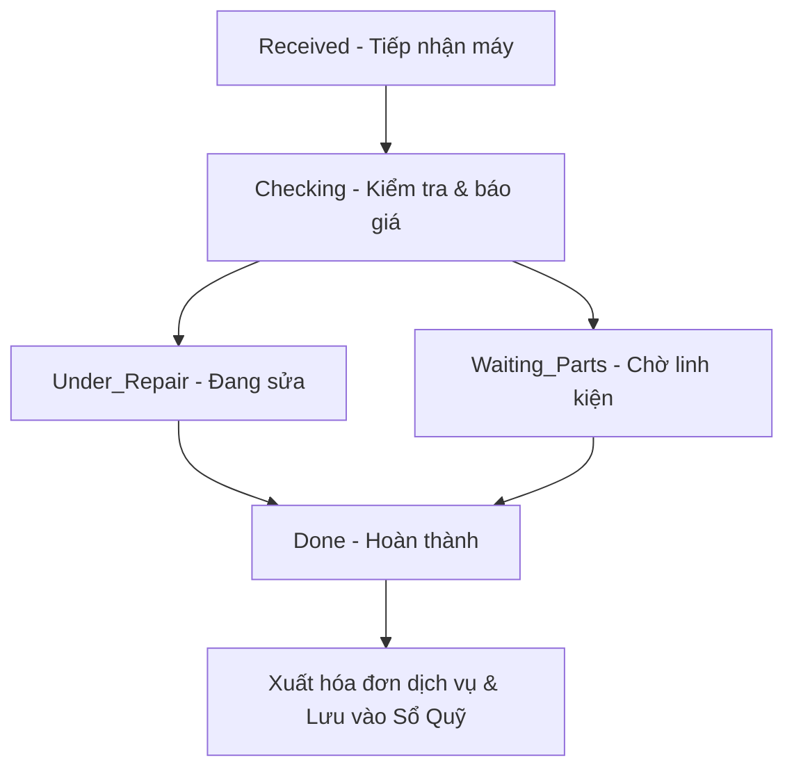

# Hướng Dẫn Phát Triển Hệ Thống (Developer Guide)
Hệ thống Thương Mại Điện Tử & Quản lý Dịch vụ bảo hành Điện Máy Pro

Tài liệu này tổng hợp cấu trúc code, giải thích chi tiết cách thức nhận biết hành động **lấy dữ liệu (Data Retrieval)** và phân tích từng khối logic nghiệp vụ từ **Cơ sở dữ liệu (Database)** qua **Bộ điều khiển (Backend Controller)** lên **Giao diện người dùng (Frontend UI)**.

---

## 1. Dấu Hiệu Nhận Biết Hành Động Lấy Dữ Liệu (Data Retrieval)

Khi xem mã nguồn của dự án (cả file Backend `.php` và file Frontend `.tsx` / `.js`), bạn có thể dựa vào các từ khóa, cấu trúc hàm và bảng tra cứu dưới đây để nhận biết lập tức hành động truy vấn và lấy dữ liệu.

---

### 1.1 Bảng Tra Cứu Nhanh Các Cụm Từ Nhận Biết (Quick Reference Table)

| Tầng Xử Lý | Từ Khóa / Cú Pháp | Ý Nghĩa Thực Tế | Ví Dụ Minh Họa Trong Code |
| :--- | :--- | :--- | :--- |
| **Backend (PHP)** | `Model::where(...)` | Lọc dữ liệu theo điều kiện cụ thể trước khi lấy. | `Order::where('status', 'Delivered')` |
| **Backend (PHP)** | `Model::find($id)` / `findOrFail($id)` | Lấy duy nhất 1 bản ghi dựa vào ID khóa chính (Lỗi trả về 404). | `User::findOrFail($userId)` |
| **Backend (PHP)** | `->get()` | Thực thi câu lệnh SQL và lấy về danh sách kết quả. | `Setting::all()->get()` |
| **Backend (PHP)** | `->first()` | Lấy duy nhất 1 dòng đầu tiên tìm thấy. | `User::where('email', $email)->first()` |
| **Backend (PHP)** | `->paginate($num)` | Lấy dữ liệu kèm phân trang tự động (cho trang quản trị). | `RepairTicket::paginate(10)` |
| **Backend (PHP)** | `->with([...])` | Nạp trước dữ liệu liên kết bảng khác (Eager Loading). | `ChatRoom::with(['users'])` |
| **Backend (PHP)** | `->withCount(...)` / `withSum(...)` | Tính tổng số lượng hoặc doanh thu bản ghi liên kết bằng subquery. | `User::withSum(['salesOrders'], 'final_amount')` |
| **Backend (PHP)** | `->sum('col')` / `->count()` | Tính tổng số tiền hoặc đếm số dòng trực tiếp trong Database. | `Order::where('status', 'Delivered')->sum('final_amount')` |
| **Frontend (JS/TS)** | `axios.get('url')` | Gửi yêu cầu HTTP GET xin tải dữ liệu từ server về. | `axios.get('/admin/chat/init')` |
| **Frontend (JS/TS)** | `axios.post('url', payload)` | Gửi dữ liệu đi hoặc lọc dữ liệu theo tham số gửi kèm. | `axios.post('/admin/chat/messages', formData)` |
| **Frontend (JS/TS)** | `fetch('url')` | Cú pháp gốc của trình duyệt để gửi yêu cầu xin dữ liệu. | `fetch('/api/check-status')` |
| **Frontend (JS/TS)** | `setData(response.data)` | Nhận dữ liệu trả về từ API và lưu vào bộ nhớ React (State). | `setRooms(response.data.rooms)` |

---

### 1.2 Chi Tiết Các Cụm Từ Nhận Biết & Cách Hoạt Động Của Hàm

#### A. Cụm từ nhận biết ở Backend (Laravel PHP)
Ở Backend, ta tương tác với cơ sở dữ liệu thông qua các Model kế thừa từ Eloquent ORM.

1.  **Hàm lọc điều kiện (`where`, `whereIn`, `whereHas`):**
    *   *Mục đích:* Dùng để chỉ định bộ lọc SQL `WHERE`. Nó không trực tiếp lấy dữ liệu về mà chỉ thiết lập điều kiện lọc.
    *   *Dấu hiệu:* Luôn đi trước các hàm lấy dữ liệu như `->get()`, `->first()`, hoặc `->paginate()`.
    *   *Ví dụ:* `User::where('role_id', 4)->get()` có nghĩa là *"Chọn tất cả các cột trong bảng users với điều kiện cột role_id bằng 4"*.
2.  **Hàm thực thi lấy dữ liệu (`get`, `first`, `pluck`):**
    *   *Mục đích:* Ra lệnh cho Laravel biên dịch toàn bộ điều kiện trước đó thành câu lệnh SQL, gửi đến MySQL Database và lấy kết quả trả về dưới dạng Collection (danh sách) hoặc Object (đối tượng đơn lẻ).
    *   *Dấu hiệu:* Nằm ở cuối cùng của chuỗi gọi hàm.
    *   *Ví dụ:* `Setting::pluck('setting_value', 'setting_key')->toArray()` có nghĩa là *"Lấy cột setting_value làm giá trị và setting_key làm khóa, chuyển thành mảng PHP"* (Thường dùng trong cấu hình themes).
3.  **Hàm liên kết bảng (`with`, `withCount`, `withSum`):**
    *   *Mục đích:* Lấy dữ liệu ở các bảng khác có liên kết khóa ngoại.
    *   *Dấu hiệu:* Giúp tối ưu hóa hiệu năng, giảm số lượng truy vấn SQL gửi tới DB (tránh lỗi N+1).
    *   *Ví dụ:* `ChatRoom::with(['users'])` có nghĩa là *"Lấy thông tin phòng chat, đồng thời lấy luôn danh sách các thành viên thuộc phòng đó"*.

#### B. Cụm từ nhận biết ở Frontend (React TSX)
Ở Frontend, các hàm lấy dữ liệu thường nằm trong hook `useEffect` (tự động chạy khi mở màn hình) hoặc trong các hàm xử lý sự kiện (như click nút đổi ngày, click chọn nhân viên).

1.  **Cú pháp gọi AJAX (`axios.get` / `axios.post`):**
    *   *Mục đích:* Khởi tạo kết nối mạng không đồng bộ (Asynchronous HTTP Request) gửi đến URL của server.
    *   *Dấu hiệu:* Có từ khóa `await` phía trước và đi kèm hàm `.then()` hoặc khối `try...catch`.
    *   *Ví dụ:* `const response = await axios.get('/admin/kpi')` có nghĩa là *"Gửi yêu cầu lên server xin tải dữ liệu KPI về và gán kết quả vào biến response"*.
2.  **Cấu trúc xử lý kết quả (`response.data`):**
    *   *Mục đích:* Nơi lưu trữ nội dung thực tế do server trả về (thông thường định dạng JSON).
    *   *Dấu hiệu:* Đi sau biến chứa phản hồi của Axios.
    *   *Ví dụ:* `setData(response.data)` có nghĩa là *"Lưu dữ liệu KPI nhận được vào bộ nhớ State của React để giao diện tự động vẽ lại"*.
3.  **Bộ lắng nghe và tham chiếu DOM (`useRef`):**
    *   *Mục đích:* Lấy địa chỉ của thẻ Canvas để vẽ đồ thị hoặc thẻ Input để điền thông tin.
    *   *Dấu hiệu:* Cú pháp `useRef<...>(null)` và `.current`.
    *   *Ví dụ:* `revenueChartRef.current` là trỏ trực tiếp đến thẻ đồ thị hiển thị doanh thu trên màn hình.

#### C. Cụm từ nhận biết khi gọi API (Gọi và nhận yêu cầu qua mạng)
Đây là cách nhận diện luồng truyền tin (gửi và phản hồi API) giữa Client và Server.

1.  **Hàm gọi API ở Frontend (`axios.get`, `axios.post`, `axios.put`, `axios.delete`):**
    *   *Mục đích:* Tạo ra một yêu cầu HTTP theo phương thức tương ứng (GET: xin dữ liệu, POST: gửi/tạo mới, PUT/PATCH: sửa, DELETE: xóa).
    *   *Dấu hiệu:* Có từ khóa `await` hoặc theo sau bởi `.then()` / `.catch()`.
    *   *Ví dụ:* `axios.post('/admin/chat/messages', formData)` nghĩa là gửi gói tin nhắn mới lên server để lưu trữ.
2.  **Cú pháp đón nhận dữ liệu ở Backend (`$request`):**
    *   *Mục đích:* Đọc dữ liệu do client gửi lên từ gói tin request.
    *   *Dấu hiệu:* Gọi các hàm như `$request->input('key')` hoặc `$request->query('param')`.
    *   *Ví dụ:* `$phone = $request->query('phone')` là lấy số điện thoại đính kèm trên thanh URL của API.
3.  **Hàm phản hồi dữ liệu ở Backend (`response()->json()`):**
    *   *Mục đích:* Chuyển đổi dữ liệu từ PHP sang chuỗi JSON và gửi trả về cho Client.
    *   *Dấu hiệu:* Từ khóa `return response()->json([...]);`.
    *   *Ví dụ:* `return response()->json(null)` trả về giá trị null dạng JSON để Client biết không tìm thấy khách hàng.

---

## 2. Chi Tiết Tính Năng Tự Động Điền Khách Hàng (Autofill by Phone)

### 2.1 Luồng xử lý nghiệp vụ
Khi nhân viên tiếp nhận thiết bị bảo hành tại quầy, họ nhập số điện thoại của khách hàng. Hệ thống sẽ tự động thực hiện truy vấn ngầm để lấy thông tin Tên, Địa chỉ, Email và điền vào form mà không cần hỏi lại khách.

```
[UI Input phone] --(JS Event: keyup/change)--> [Axios GET API] 
                                                    |
[Form Autofill] <--(JSON Response)-- [Controller: searchByPhone] <--(SQL Query)-- [Database]
```

### 2.2 Mã nguồn chi tiết & Chú thích thực tế

#### Backend Controller
File: [RepairTicketInvoiceController.php](file:///g:/ThuongMaiDienTu/ThuongMaiDienTu/app/Http/Controllers/Admin/RepairTicketInvoiceController.php)
Hàm xử lý: `searchByPhone` (dòng 488 - 520)

```php
public function searchByPhone(Request $request): JsonResponse
{
    // 1. Nhận số điện thoại từ tham số GET truyền lên từ Client
    $phone = $request->query('phone');
    if (! $phone) {
        return response()->json(null); // Trả về null nếu không có tham số
    }

    // 2. [LẤY DỮ LIỆU LẦN 1] Tìm kiếm trong lịch sử phiếu sửa chữa cũ
    // Ưu tiên cách này vì khách vãng lai (không có tài khoản) vẫn lưu lại thông tin trên phiếu cũ
    $ticket = RepairTicket::where('customer_phone', $phone)
        ->whereNotNull('customer_name')
        ->latest('ticket_id') // Lọc lấy phiếu mới tiếp nhận gần nhất
        ->first(); // Chỉ lấy 1 bản ghi duy nhất

    if ($ticket) {
        // Trả về cấu trúc dữ liệu JSON để client tự động điền (autofill)
        return response()->json([
            'customer_name' => $ticket->customer_name,
            'customer_address' => $ticket->customer_address,
            'customer_email' => $ticket->customer_email,
            'customer_source' => $ticket->customer_source,
        ]);
    }

    // 3. [LẤY DỮ LIỆU LẦN 2] Nếu khách chưa từng sửa máy, tìm kiếm trong bảng người dùng thành viên (users)
    $user = User::where('phone_number', $phone)->first();
    if ($user) {
        return response()->json([
            'customer_name' => $user->full_name,
            'customer_address' => $user->address,
            'customer_email' => $user->email,
            'customer_source' => null, // Không có thông tin nguồn khách tại quầy
        ]);
    }

    // Trả về null nếu hoàn toàn là số điện thoại mới
    return response()->json(null);
}
```

#### Frontend Javascript (AJAX Handler)
Được nhúng trong trang tạo mới phiếu sửa chữa (`admin/repair-tickets/create.blade.php`).

```javascript
// Lắng nghe sự kiện người dùng nhập xong số điện thoại (sự kiện 'input' hoặc 'change')
$('#customer_phone').on('input', function() {
    let phone = $(this).val();
    
    // Chỉ kích hoạt tìm kiếm khi nhập đủ định dạng 10 chữ số
    if (phone.length === 10) {
        // Gửi yêu cầu HTTP GET xin dữ liệu khách hàng
        axios.get(`/admin/api/customers/search-by-phone?phone=${phone}`)
            .then(function(response) {
                if (response.data) {
                    // Tự động điền dữ liệu trả về vào các trường tương ứng trên form
                    $('#customer_name').val(response.data.customer_name);
                    $('#customer_address').val(response.data.customer_address);
                    $('#customer_email').val(response.data.customer_email);
                    $('#customer_source').val(response.data.customer_source).trigger('change');
                }
            })
            .catch(function(error) {
                console.error("Lỗi truy vấn thông tin khách hàng:", error);
            });
    }
});
```

---

## 3. Phân Hệ Thống Kê Hiệu Suất & KPI (KPI Dashboard)

### 3.1 Cấu trúc truy vấn Backend (PHP)
File: [KPIController.php](file:///g:/ThuongMaiDienTu/ThuongMaiDienTu/app/Http/Controllers/Admin/KPIController.php)
Hàm xử lý: `index` (dòng 17 - 196)

```php
public function index(Request $request)
{
    // 1. Phân tích tham số bộ lọc ngày từ Client gửi lên
    $filter = $request->input('filter', 'month');
    $startDate = now()->startOfMonth(); // Mặc định từ đầu tháng
    $endDate = now()->endOfDay();       // Đến cuối ngày hôm nay

    // Xử lý bộ lọc tùy chỉnh theo khoảng ngày được chọn
    if ($filter === 'custom') {
        $requestStart = $request->input('start');
        $requestEnd = $request->input('end');
        
        if ($requestStart && $requestEnd) {
            $startDate = \Carbon\Carbon::parse($requestStart)->startOfDay();
            $endDate = \Carbon\Carbon::parse($requestEnd)->endOfDay();
            if ($endDate > now()) {
                $endDate = now()->endOfDay(); // Ngăn việc chọn ngày tương lai
            }
        }
    }

    // 2. [LẤY DỮ LIỆU] Tổng hợp hiệu suất kinh doanh của đội Sales (role_id = 4)
    // withCount và withSum giúp tính toán trực tiếp trong DB bằng truy vấn SQL tối ưu
    $salesKPI = User::where('role_id', 4)
        ->withCount(['salesOrders as total_orders' => function($query) use ($startDate, $endDate) {
            $query->where('status', 'Delivered') // Chỉ đếm đơn giao thành công
                  ->whereBetween('created_at', [$startDate, $endDate]); // Trong khoảng lọc ngày
        }])
        ->withSum(['salesOrders as total_revenue' => function($query) use ($startDate, $endDate) {
            $query->where('status', 'Delivered')
                  ->whereBetween('created_at', [$startDate, $endDate]);
        }], 'final_amount') // Cộng dồn cột final_amount (Doanh thu thực nhận)
        ->get();

    // 3. [LẤY DỮ LIỆU] Lấy doanh thu thô theo từng ngày để vẽ biểu đồ
    $rawRevenue = Order::where('status', 'Delivered')
        ->whereBetween('created_at', [$startDate, $endDate])
        ->selectRaw('DATE(created_at) as date, SUM(final_amount) as total')
        ->groupBy('date')
        ->get()
        ->pluck('total', 'date'); // Ánh xạ mảng thành: ['YYYY-MM-DD' => số_tiền]

    // 4. Lấp đầy khoảng trống dữ liệu để biểu đồ không bị đứt gãy
    $revenueChart = collect();
    $period = \Carbon\CarbonPeriod::create($startDate, $endDate); // Lặp qua từng ngày liên tục
    foreach ($period as $date) {
        $dateStr = $date->format('Y-m-d');
        $revenueChart->push([
            'date' => $dateStr,
            'total' => (float)$rawRevenue->get($dateStr, 0) // Ngày nào không có đơn hàng thì gán bằng 0
        ]);
    }

    // 5. Tổ chức dữ liệu và trả về JSON cho AJAX hoặc Render View Blade
    $props = [
        'stats' => [
            'total_sales_revenue' => $salesKPI->sum('total_revenue'),
            'filter' => $filter,
            'start_date' => $startDate->format('Y-m-d'),
            'end_date' => $endDate->format('Y-m-d'),
            // ...
        ],
        'salesKPI' => $salesKPI->sortByDesc('total_revenue')->values()->toArray(),
        'revenueChart' => $revenueChart->values()->toArray(),
        // ...
    ];

    if (request()->wantsJson()) {
        return response()->json($props);
    }
    return view('admin.kpi.index', compact('props'));
}
```

### 3.2 Giao diện kết xuất Frontend (React & Chart.js)
File: [KPIDashboard.tsx](file:///g:/ThuongMaiDienTu/ThuongMaiDienTu/resources/js/components/KPIDashboard.tsx)

```typescript
// 1. Hook useEffect lắng nghe sự thay đổi dữ liệu để vẽ biểu đồ doanh thu
useEffect(() => {
    // Nếu biểu đồ cũ đang tồn tại -> Tiến hành hủy để giải phóng bộ nhớ (tránh Memory Leak)
    if (revChartInstance.current) {
        revChartInstance.current.destroy();
        revChartInstance.current = null;
    }

    const chartData = data.revenueChart;

    if (revenueChartRef.current && chartData.length > 0) {
        const ctx = revenueChartRef.current.getContext('2d');
        if (ctx) {
            // Tạo hiệu ứng chuyển màu Gradient từ Indigo sang trắng mờ bên dưới đường line biểu đồ
            const gradient = ctx.createLinearGradient(0, 0, 0, 400);
            gradient.addColorStop(0, 'rgba(79, 70, 229, 0.15)');
            gradient.addColorStop(1, 'rgba(79, 70, 229, 0)');

            // Khởi tạo instance biểu đồ mới bằng Chart.js
            revChartInstance.current = new Chart(ctx, {
                type: 'line',
                data: {
                    labels: chartData.map(d => {
                        const date = new Date(d.date);
                        return `${date.getDate()}/${date.getMonth() + 1}`; // Định dạng: ngày/tháng
                    }),
                    datasets: [{
                        label: 'Doanh thu',
                        data: chartData.map(d => d.total),
                        borderColor: '#4f46e5', // Màu xanh Indigo của thương hiệu
                        fill: true,
                        backgroundColor: gradient,
                        tension: 0.4, // Tạo đường cong mềm mại cho line đồ thị
                    }]
                },
                options: {
                    responsive: true,
                    maintainAspectRatio: false,
                    // ...
                }
            });
        }
    }
}, [data.revenueChart]);
```

---

## 4. Phân Hệ Kênh Chat Nội Bộ (Communication Hub)

### 4.1 Khởi tạo dữ liệu & Tự động Seed dữ liệu mặc định
File: [ChatController.php](file:///g:/ThuongMaiDienTu/ThuongMaiDienTu/app/Http/Controllers/Admin/ChatController.php)
Hàm xử lý: `init` (dòng 20 - 212)

```php
public function init()
{
    $currentUser = Auth::user();
    
    // Bảo vệ bảo mật: Chỉ cho phép quản lý và admin vào kênh chat
    if (!$currentUser || !in_array($currentUser->role_id, [1, 2])) {
        return response()->json(['error' => 'Unauthorized'], 403);
    }

    // 1. Tự động kiểm tra và chạy Migration nếu các bảng Chat chưa được tạo trong DB
    if (!\Illuminate\Support\Facades\Schema::hasTable('chat_rooms')) {
        try {
            \Illuminate\Support\Facades\Artisan::call('migrate', ['--force' => true]);
        } catch (\Exception $e) {
            \Illuminate\Support\Facades\Log::error("Lỗi migrate tự động: " . $e->getMessage());
        }
    }

    // 2. Đảm bảo các phòng chat hệ thống ('staff', 'announcement', 'executive') luôn tồn tại
    $defaultRooms = [
        ['room_id' => 'staff', 'name' => '💬 Kênh Nhân viên', 'type' => 'group'],
        // ...
    ];
    foreach ($defaultRooms as $r) {
        ChatRoom::firstOrCreate(['room_id' => $r['room_id']], $r);
    }

    // 3. [LẤY DỮ LIỆU] Lấy danh sách phòng kèm theo thông tin chi tiết thành viên
    $roomsData = ChatRoom::with(['users' => function($q) {
        $q->with('role');
    }])->get()->map(function ($room) {
        return [
            'id' => $room->room_id,
            'name' => $room->name,
            'members' => $room->users->map(fn($u) => [
                'id' => $u->user_id,
                'name' => $u->full_name,
                'roomRole' => $u->pivot->room_role // Lấy vai trò trong phòng chat từ bảng trung gian
            ])
        ];
    });

    // 4. [LẤY DỮ LIỆU] Lấy tin nhắn của từng phòng để hiển thị
    $messagesData = [];
    foreach (ChatRoom::all() as $room) {
        $messagesData[$room->room_id] = $room->messages->map(fn($msg) => [
            'id' => $msg->message_id,
            'sender' => $msg->sender_name,
            'content' => $msg->content,
            'attachment' => $msg->attachment_url ? [
                'name' => $msg->attachment_name,
                'url' => $msg->attachment_url,
                'type' => $msg->attachment_type
            ] : null,
        ]);
    }

    return response()->json([
        'rooms' => $roomsData,
        'messages' => $messagesData
    ]);
}
```

### 4.2 Thả biểu cảm Emoji (React Frontend)
File: [CommunicationHub.tsx](file:///g:/ThuongMaiDienTu/ThuongMaiDienTu/resources/js/components/CommunicationHub.tsx)
Hàm xử lý: `handleAddReaction` (dòng 579 - 603)

```typescript
const handleAddReaction = async (msgId: string, emoji: string) => {
    try {
        // Gửi yêu cầu POST lên server để thả hoặc hủy emoji của tin nhắn cụ thể
        const response = await axios.post(`/admin/chat/messages/${msgId}/react`, {
            emoji
        });

        // Server trả về mảng danh sách thả emoji mới nhất
        const updatedReactions = response.data.reactions;

        // Cập nhật State trong React để giao diện hiển thị số lượng và danh sách người thả ngay lập tức
        setMessages(prev => {
            const roomMsgs = prev[activeRoomId] || [];
            const updated = roomMsgs.map(m => {
                if (m.id === msgId) {
                    return {
                        ...m,
                        reactions: updatedReactions // Cập nhật mảng reactions mới
                    };
                }
                return m;
            });
            return { ...prev, [activeRoomId]: updated };
        });
    } catch (error) {
        console.error("Lỗi thả emoji:", error);
    }
};
```

---

## 5. Quy Trình Quản Lý Phiếu Sửa Chữa & Xuất Hóa Đơn Dịch Vụ

Quy trình quản lý vòng đời thiết bị bảo hành trải qua 5 trạng thái chính:
`Received` (Tiếp nhận) -> `Checking` (Kiểm tra) -> `Under_Repair` (Sửa chữa) / `Waiting_Parts` (Chờ linh kiện) -> `Done` (Hoàn thành) -> [Xuất hóa đơn dịch vụ].



### 5.1 Tạo phiếu sửa chữa & Ràng buộc logic
File: [RepairTicketInvoiceController.php](file:///g:/ThuongMaiDienTu/ThuongMaiDienTu/app/Http/Controllers/Admin/RepairTicketInvoiceController.php)
Hàm xử lý: `storeTicket` (dòng 43 - 172)

```php
public function storeTicket(Request $request): RedirectResponse
{
    $validator = Validator::make($request->all(), [
        'customer_name' => ['required', 'string', 'max:255'],
        'customer_phone' => ['required', 'string', 'regex:/^[0-9]{10}$/'],
        'estimated_cost' => ['required', 'integer', 'min:0'],
        'status' => ['required', 'in:Received,Checking,Under_Repair,Waiting_Parts,Done'],
        // ...
    ]);

    // Ràng buộc nghiệp vụ sau khi xác thực dữ liệu thô thành công
    $validator->after(function ($validator) use ($request) {
        $status = $request->input('status');
        $serviceName = $request->input('service_name');
        $estimatedCost = (int) $request->input('estimated_cost', 0);

        // Bắt lỗi: Khi chuyển trạng thái xử lý thì bắt buộc kỹ thuật viên phải điền tên Dịch vụ sửa chữa
        if (in_array($status, ['Checking', 'Under_Repair', 'Waiting_Parts', 'Done']) && empty($serviceName)) {
            $validator->errors()->add('service_name', 'Vui lòng nhập tên dịch vụ khi chuyển sang trạng thái này.');
        }

        // Bắt lỗi: Khi đã có chi phí dự kiến > 0 thì trạng thái không được để ở Đã tiếp nhận (Received)
        if ($estimatedCost > 0 && $status === 'Received') {
            $validator->errors()->add('status', 'Khi có chi phí dự kiến, vui lòng chuyển trạng thái sang "Kiểm tra & Báo giá" trở lên.');
        }
    });

    $data = $validator->validate();

    // Tự động tìm tài khoản liên kết qua số điện thoại để lưu lịch sử cho người dùng thành viên
    $matchedUser = User::where('phone_number', $data['customer_phone'])->first();
    $data['user_id'] = $matchedUser ? $matchedUser->user_id : null;

    $ticket = RepairTicket::create($data);

    // Gửi thông báo cho khách hàng thành viên hoặc gửi mail SMTP cho khách vãng lai...
    
    return redirect()->route('admin.repair-tickets.index')->with('success', 'Tạo phiếu thành công.');
}
```

### 5.2 Lưu hóa đơn dịch vụ & Liên kết ngược lại phiếu sửa chữa
File: [RepairTicketInvoiceController.php](file:///g:/ThuongMaiDienTu/ThuongMaiDienTu/app/Http/Controllers/Admin/RepairTicketInvoiceController.php)
Hàm xử lý: `store` (dòng 359 - 486)

```php
public function store(Request $request): RedirectResponse
{
    $validator = Validator::make($request->all(), [
        'invoice_no' => ['required', 'string', 'max:50', 'unique:service_invoices,invoice_no'],
        'subtotal' => ['required', 'integer', 'min:0'],
        'vat_rate' => ['nullable', 'integer', 'min:0', 'max:100'],
        'discount_amount' => ['nullable', 'integer', 'min:0'],
        // ...
    ]);

    $data = $validator->validate();

    // Tính toán số tiền thực nhận sau thuế và giảm giá
    $subtotal = (int) $data['subtotal'];
    $vatRate = (int) ($data['vat_rate'] ?? 0);
    $taxAmount = (int) round(($subtotal * $vatRate) / 100);
    $discountAmount = (int) ($data['discount_amount'] ?? 0);
    $totalAmount = (int) max(0, $subtotal + $taxAmount - $discountAmount);

    // 1. [LƯU DỮ LIỆU] Tạo hóa đơn dịch vụ mới vào Database
    $invoice = ServiceInvoice::create([
        'invoice_no' => $data['invoice_no'],
        'subtotal' => $subtotal,
        'tax_amount' => $taxAmount,
        'discount_amount' => $discountAmount,
        'total_amount' => $totalAmount,
        'status' => $data['status'],
        // ...
    ]);

    // 2. [LƯU DỮ LIỆU] Cập nhật ngược lại số hóa đơn vào phiếu sửa chữa tương ứng để hoàn tất vòng đời
    if ($request->filled('repair_ticket_id')) {
        $repairTicket = RepairTicket::find($request->integer('repair_ticket_id'));
        if ($repairTicket && !$repairTicket->invoice_no) {
            $repairTicket->update([
                'invoice_no' => $invoice->invoice_no,
                'invoiced_at' => now(),
            ]);
        }
    }

    return redirect()->route('admin.service-invoices.show', $invoice);
}
```

---

## 6. Phân Hệ Đăng Nhập, Đăng Ký & Lấy Lại Mật Khẩu (Authentication)

### 6.1 Ràng buộc Đăng ký (Gmail Validation)
Hệ thống giới hạn việc đăng ký tài khoản chỉ cho phép sử dụng địa chỉ hòm thư Gmail cá nhân thông qua biểu thức chính quy (Regex).
File: [AuthController.php](file:///g:/ThuongMaiDienTu/ThuongMaiDienTu/app/Http/Controllers/Auth/AuthController.php)
Hàm xử lý: `register` (dòng 83 - 120)

```php
public function register(Request $request)
{
    $validator = Validator::make($request->all(), [
        'full_name' => 'required|string|max:255',
        // Regex kiểm tra email kết thúc bằng @gmail.com (không phân biệt chữ hoa/thường)
        'email' => ['required', 'string', 'email', 'max:255', 'unique:users,email', 'regex:/^[a-zA-Z0-9._%+-]+@gmail\.com$/i'],
        'password' => 'required|string|min:8|confirmed',
    ], [
        'email.regex' => __('ui.error_email_gmail_only'), // Tận dụng khóa ngôn ngữ để hiển thị thông báo
        // ...
    ]);

    if ($validator->fails()) {
        return back()->withErrors($validator)->withInput()->with('active_tab', 'register');
    }

    // Đăng ký tài khoản mới mặc định là Khách hàng (role_id = 3)
    $user = User::create([
        'full_name' => $request->full_name,
        'email' => $request->email,
        'password_hash' => Hash::make($request->password),
        'is_2fa_enabled' => 0,
        'role_id' => 3,
        'status' => 'Active',
        'member_tier' => 'Dong'
    ]);

    Auth::login($user);
    // ...
}
```

### 6.2 Khôi phục mật khẩu qua Email OTP SMTP
Quy trình cấp lại mật khẩu sử dụng mã OTP gồm 6 chữ số ngẫu nhiên gửi trực tiếp thông qua máy chủ mail SMTP đã cấu hình.
File: [ForgotPasswordController.php](file:///g:/ThuongMaiDienTu/ThuongMaiDienTu/app/Http/Controllers/Auth/ForgotPasswordController.php)

#### Bước 1: Sinh mã OTP và gửi Mail SMTP
```php
public function sendOtp(Request $request)
{
    $request->validate(['email' => 'required|email|exists:users,email']);

    $otp = rand(100000, 999999);
    $email = $request->email;

    // 1. [LƯU DỮ LIỆU] Lưu mã băm OTP vào bảng password_reset_tokens
    DB::table('password_reset_tokens')->updateOrInsert(
        ['email' => $email],
        ['token' => Hash::make($otp), 'created_at' => Carbon::now()] // Băm OTP để bảo mật tránh bị lộ trong DB
    );

    // 2. Gửi Email thông qua Mail Client
    try {
        Mail::send('emails.forgot_password', ['otp' => $otp, 'email' => $email], function($message) use($email) {
            $message->to($email)->subject('Mã OTP khôi phục mật khẩu');
        });
    } catch (\Exception $e) {
        \Illuminate\Support\Facades\Log::error('Gửi email OTP thất bại: ' . $e->getMessage());
        return back()->withErrors(['email' => 'Không thể gửi email xác thực. Vui lòng kiểm tra cấu hình SMTP trong file .env.']);
    }
    // ...
}
```

#### Bước 2: Xác minh OTP (Verify OTP)
```php
public function verifyOtp(Request $request)
{
    $request->validate(['email' => 'required|email', 'otp' => 'required|numeric']);

    // 1. [LẤY DỮ LIỆU] Lấy mã token băm của email này trong DB
    $record = DB::table('password_reset_tokens')->where('email', $request->email)->first();

    // 2. Kiểm tra tính hợp lệ và so sánh mã băm OTP
    if (!$record || !Hash::check($request->otp, $record->token)) {
        return back()->withErrors(['otp' => 'Mã OTP không hợp lệ hoặc đã hết hạn.']);
    }

    // 3. Bảo mật: Giới hạn thời gian hiệu lực của mã OTP là 5 phút
    if (Carbon::parse($record->created_at)->addMinutes(5)->isPast()) {
        return back()->withErrors(['otp' => 'Mã OTP đã hết hạn.']);
    }

    // Ghi nhận trạng thái xác thực thành công vào Session
    session(['reset_email' => $request->email, 'otp_verified' => true]);
    return redirect()->route('password.reset.form');
}
```

---

## 7. Bảo Mật Hai Lớp (2FA) & Quản Lý Phiên Đăng Nhập

Hệ thống cung cấp cơ chế bảo vệ đăng nhập thông qua mã xác nhận 2FA gửi qua email và tính năng giám sát/hủy phiên đăng nhập từ xa.

### 7.1 Tính toán điểm bảo mật (Security Score)
Hệ thống tự động chấm điểm bảo mật cho tài khoản dựa trên các yếu tố thiết lập an toàn.
File: [TwoFactorController.php](file:///g:/ThuongMaiDienTu/ThuongMaiDienTu/app/Http/Controllers/Auth/TwoFactorController.php)
Hàm xử lý: `securityPage` (dòng 23 - 88)

```php
// Hệ thống tính điểm lũy tiến tối đa 100 điểm:
$score = 0;
// 1. Có bật 2FA: Cộng 45 điểm
if ($user->is_2fa_enabled) { $score += 45; }
// 2. Đã liên kết Số điện thoại: Cộng 25 điểm
if (!empty($user->phone_number)) { $score += 25; }
// 3. Đã liên kết Email: Cộng 20 điểm
if (!empty($user->email)) { $score += 20; }
// 4. Mật khẩu thay đổi dưới 90 ngày: Cộng 10 điểm
if ($user->password_changed_at && Carbon::parse($user->password_changed_at)->diffInDays() < 90) { $score += 10; }
```

### 7.2 Quản lý & Hủy phiên đăng nhập từ xa
Quản trị viên hoặc người dùng có thể xem danh sách thiết bị đang đăng nhập tài khoản của mình và trục xuất (Logout) thiết bị lạ ra khỏi hệ thống.
Hàm xử lý: `logoutSession` (dòng 121 - 155)

```php
public function logoutSession(Request $request, $id)
{
    // Kiểm tra xem ID có trùng khớp với ID phiên đăng nhập hiện tại của thiết bị đang dùng hay không
    if ($request->boolean('is_current_device') || $id === $request->session()->getId()) {
        Auth::logout(); // Đăng xuất thiết bị hiện tại
        $request->session()->invalidate();
        $request->session()->regenerateToken();
    } else {
        // [LƯU DỮ LIỆU] Xóa dòng session của thiết bị khác khỏi bảng sessions trong DB
        DB::table('sessions')
            ->where('id', $id)
            ->where('user_id', Auth::id())
            ->delete();
        
        // Hủy token ghi nhớ đăng nhập (remember_token) để thiết bị bị trục xuất không tự động đăng nhập lại
        if (Auth::check()) {
            $user = Auth::user();
            $user->remember_token = null;
            $user->save();
        }
    }
    // ...
}
```

### 7.3 Bảo vệ chống Spam & Dò mã (Brute Force Protection)
File: [TwoFactorController.php](file:///g:/ThuongMaiDienTu/ThuongMaiDienTu/app/Http/Controllers/Auth/TwoFactorController.php)

#### Chống spam gửi mã liên tục (Resend Cooldown):
```php
$throttleKey = 'resend-otp:' . $user->user_id;
if (RateLimiter::tooManyAttempts($throttleKey, 1)) {
    $seconds = RateLimiter::availableIn($throttleKey);
    return back()->with('error', "Vui lòng đợi {$seconds} giây để yêu cầu mã mới.");
}
// Nếu hợp lệ, ghi nhận lượt gửi và khóa trong 60 giây
RateLimiter::hit($throttleKey, 60);
```

#### Chống dò mã (Brute Force Block):
```php
$throttleKey = 'verify-otp:' . $user->user_id;
// Giới hạn tối đa 5 lần nhập sai mã 2FA trong vòng 10 phút
if (RateLimiter::tooManyAttempts($throttleKey, 5)) {
    $seconds = RateLimiter::availableIn($throttleKey);
    return back()->withErrors(['otp' => "Bạn đã nhập sai quá nhiều lần. Vui lòng thử lại sau {$seconds} giây."]);
}

if (!$user->two_factor_code || $user->two_factor_code !== $request->otp) {
    RateLimiter::hit($throttleKey, 600); // Tăng số lần thử sai (lưu giữ trong 600 giây = 10 phút)
    return back()->withErrors(['otp' => 'Mã xác thực không chính xác.']);
}
```

---

## 8. Phân Quyền Vai Trò (Roles & Middleware Permissions)

Hệ thống sử dụng cơ chế kiểm tra quyền hạn đa tầng (tầng Route Middleware và tầng Model Policies) để kiểm soát việc truy cập tài nguyên.

### 8.1 Bảo vệ ở tầng định tuyến (Route Middleware)
Đăng ký middleware `role` kiểm tra quyền hạn của tài khoản trước khi chuyển tiếp yêu cầu vào Controller.
File: [admin.php](file:///g:/ThuongMaiDienTu/ThuongMaiDienTu/routes/admin.php)

```php
// Chỉ cho phép người dùng có vai trò là Quản trị viên (role_id = 1) truy cập vào nhóm route này
Route::middleware('role:1')->group(function () {
    Route::resource('permissions', UserController::class);
    Route::resource('roles', RoleController::class);
});

// Cho phép cả Admin (1) và Quản lý (2) truy cập
Route::middleware('role:1,2')->group(function () {
    Route::resource('employees', EmployeeController::class);
    Route::resource('flash-sales', FlashSaleController::class);
});
```

### 8.2 Kiểm soát phân quyền tinh tế (Model Policies)
Sử dụng Laravel Gate để kiểm tra quyền hạn thao tác trên các bản ghi cụ thể trước khi thực hiện hành động.
File: [EmployeeController.php](file:///g:/ThuongMaiDienTu/ThuongMaiDienTu/app/Http/Controllers/Admin/EmployeeController.php)

```php
public function index(Request $request)
{
    // Kiểm tra xem tài khoản hiện tại có quyền xem danh sách nhân sự hay không (Policy viewAny)
    Gate::authorize('viewAny', User::class);

    // ...
}

public function destroy(Request $request, $id)
{
    $employee = User::where('role_id', '!=', 3)->findOrFail($id);

    try {
        // Kiểm tra xem tài khoản hiện tại có quyền xóa nhân viên cụ thể này hay không (Policy delete)
        Gate::authorize('delete', $employee);
    } catch (AuthorizationException $e) {
        // Trả về JSON lỗi 403 đẹp mắt cho ứng dụng SPA nếu không đủ quyền hạn
        if ($request->ajax() || $request->wantsJson()) {
            return response()->json(['success' => false, 'message' => $e->getMessage()], 403);
        }
        throw $e;
    }
    
    // ...
}
```

---

## 9. Nhật Ký Hoạt Động Bảo Mật (Security Audit Logs)

Hệ thống Audit Logs theo dõi toàn bộ các hoạt động nhạy cảm trong hệ thống (thêm, sửa, xóa, xuất dữ liệu) và bảo vệ dữ liệu nhật ký bằng chuỗi mã băm bảo mật (Hash Chain Ledger).

### 9.1 Trait ghi nhật ký tự động (`HasAuditLog`)
Mỗi khi một Model có sử dụng trait `HasAuditLog` thực hiện thay đổi dữ liệu (tạo mới, sửa đổi, xóa), hệ thống tự động ghi lại log:

```php
// Hệ thống tự động bắt các sự kiện Eloquent (created, updated, deleted)
public static function bootHasAuditLog()
{
    static::created(function ($model) {
        self::logEvent('created', $model);
    });

    static::updated(function ($model) {
        // So sánh các giá trị thay đổi để ghi lại bản diff (old_values và new_values)
        $old = array_intersect_key($model->getOriginal(), $model->getChanges());
        $new = $model->getChanges();
        self::logEvent('updated', $model, json_encode($old), json_encode($new));
    });
}
```

### 9.2 Xác minh tính toàn vẹn của Nhật ký (Integrity Verification)
Để ngăn chặn lập trình viên hoặc kẻ tấn công xâm nhập vào cơ sở dữ liệu và sửa đổi lịch sử nhật ký hoạt động nhằm xóa dấu vết, hệ thống sử dụng thuật toán Hash Chain liên kết các bản ghi nhật ký với nhau qua mã băm bảo mật `hash_chain`.
File: [ActivityLogController.php](file:///g:/ThuongMaiDienTu/ThuongMaiDienTu/app/Http/Controllers/Admin/ActivityLogController.php)
Hàm xử lý: `verify` (dòng 56 - 105)

```php
public function verify(Request $request)
{
    // 1. [LẤY DỮ LIỆU] Tải toàn bộ danh sách log sắp xếp tăng dần theo thời gian tạo
    $logs = DB::table('activity_logs')->orderBy('log_id', 'asc')->get();
    
    $computedHash = null; // Mã băm của bản ghi trước đó (dòng đầu tiên là null)
    $failedLogId = null;

    // 2. Chạy lặp kiểm tra lũy tiến chuỗi băm của toàn bộ các dòng nhật ký
    foreach ($logs as $log) {
        $payload = [
            'event' => $log->event,
            'causer_id' => $log->causer_id,
            'subject_id' => $log->subject_id,
            'old_values' => $log->old_values,
            'new_values' => $log->new_values,
            'ip_address' => $log->ip_address,
            'created_at' => $log->created_at,
        ];

        // Tính toán mã băm đúng cho dòng này dựa trên dữ liệu payload và mã băm dòng trước
        $expectedHash = AuditHasher::generateHashChain($payload, $computedHash);

        // So sánh mã băm tính toán được với mã băm thực tế lưu trong cột database
        if ($expectedHash !== $log->hash_chain) {
            $failedLogId = $log->log_id; // Phát hiện sai lệch (bản ghi đã bị sửa đổi hoặc bị xóa)
            break;
        }

        // Gán mã băm hiện tại làm mã băm liên kết dòng tiếp theo
        $computedHash = $log->hash_chain;
    }

    if ($failedLogId !== null) {
        return response()->json([
            'success' => false,
            'message' => 'Phát hiện sự cố giả mạo hoặc thay đổi dữ liệu nhật ký hoạt động!',
            'log_id' => $failedLogId
        ], 422); // Trả về mã lỗi 422 Unprocessable Entity
    }

    return response()->json([
        'success' => true,
        'message' => 'Toàn bộ chuỗi nhật ký hoạt động được xác minh toàn vẹn an toàn tuyệt đối!'
    ]);
}
```

---

## 10. Tùy Chỉnh Giao Diện & Cấu Hình Themes

Cung cấp khả năng thay đổi màu sắc chủ đạo, logo cửa hàng, banner quảng cáo hiển thị trên trang chủ của hệ thống.

### 10.1 Cập nhật cấu hình & Xóa Cache
File: [ThemeSettingController.php](file:///g:/ThuongMaiDienTu/ThuongMaiDienTu/app/Http/Controllers/Admin/ThemeSettingController.php)
Hàm xử lý: `update` (dòng 33 - 83)

```php
public function update(Request $request)
{
    $data = $request->except('_token');

    // 1. Xử lý upload tệp tin hình ảnh mới (Logo, Banner trang chủ)
    foreach ($data as $key => $value) {
        if ($request->hasFile($key)) {
            $file = $request->file($key);
            $filename = $key . '_' . time() . '.' . $file->getClientOriginalExtension();
            // Lưu tệp hình ảnh vào thư mục public/uploads/theme công khai
            $file->move(public_path('uploads/theme'), $filename);
            $value = 'uploads/theme/' . $filename;
        }

        // 2. [LƯU DỮ LIỆU] Lưu hoặc cập nhật cặp setting_key và setting_value tương ứng
        Setting::updateOrCreate(
            ['setting_key' => $key],
            ['setting_value' => $value]
        );
    }

    // 3. Xóa cache cấu hình giao diện cũ để thiết lập màu sắc/logo mới có hiệu lực tức thì
    \Illuminate\Support\Facades\Cache::forget('settings');

    return redirect()->back()->with('success', 'Đã cập nhật cấu hình giao diện thành công!');
}
```

---

> [!NOTE]
> Tài liệu này được lưu trữ tại thư mục gốc của dự án. Mọi thay đổi cấu trúc database hoặc API endpoints cần được cập nhật vào đây để hỗ trợ việc pair-programming đạt hiệu quả cao nhất.
